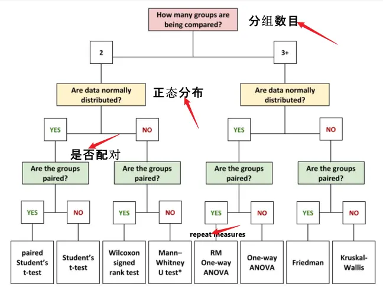
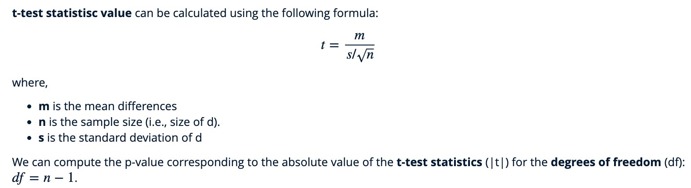

```{r, include = FALSE}
knitr::opts_chunk$set(out.width = "100%", message = FALSE, warning = FALSE)
```


# Hypothesis Testing Methods {#HypothesisTestingMethods}


显著性检验方法也即是假设检验方法。一般假设检验方法使用需要根据三个条件判断：

1. 数据分组数目也即是处理组数目，以2为阈值；

2. 数据的分布是否符合正态分布，符合则选择参数检验方法，否则选择非参数检验方法；

3. 数据是否是配对数据。


```{r, echo=FALSE, out.width="100%", out.height="100%", dpi=600, fig.align="center", fig.cap="Hypothesis Testing Methods"}



```


## 输入数据

对数据[OmicsDataSet-Zeybel et al. - 2022.xlsx](https://github.com/HuaZou/DraftNotes/blob/main/InputData/Zeybel-2022/OmicsDataSet-Zeybel et al. - 2022.xlsx)处理后生成的输入文件，详细情况可参考**Data Set**具体章节。

> ```R
> saveRDS(long_se_protein, "./InputData/result/Zeybel_2022_plasma_protein_se_Paired.RDS", compress = TRUE)
> ```

本次使用配对的血清蛋白质组学数据作为案例数据。


```{r, message = FALSE, warning = FALSE}
knitr::opts_chunk$set(message = FALSE, warning = FALSE)

library(tidyverse)
library(SummarizedExperiment)
library(ggpubr)


long_se_protein <- readRDS("./InputData/result/Zeybel_2022_plasma_protein_se_Paired.RDS")

long_se_protein
```


+ 每组样本的数目 (配对分组：Mild， Moderate， Severe)

```{r}
with(colData(long_se_protein) %>% data.frame(), table(Stage, LiverFatClass))
```

+ 准备数据

```{r}
profile <- assay(long_se_protein) %>%
  as.data.frame()
metadata <- colData(long_se_protein) %>%
  as.data.frame()

# 两组不配对数据
metadata_2_unpaired <- metadata %>%
  dplyr::filter(Stage == "Before") %>%
  dplyr::filter(LiverFatClass %in% c("Mild", "Moderate"))
profile_2_unpaired <- profile[, pmatch(rownames(metadata_2_unpaired), colnames(profile)), F]
merge_2_unpaired <- metadata_2_unpaired %>%
  dplyr::select(SampleID, LiverFatClass) %>%
  dplyr::inner_join(profile_2_unpaired %>% 
                      t() %>%
                      as.data.frame() %>%
                      tibble::rownames_to_column("SampleID"),
                    by = "SampleID")


# 两组配对数据
metadata_2_paired <- metadata %>%
  dplyr::filter(LiverFatClass == "Moderate")
profile_2_paired <- profile[, pmatch(rownames(metadata_2_paired), colnames(profile)), F]
merge_2_paired <- metadata_2_paired %>%
  dplyr::select(SampleID, PatientID, Stage) %>%
  dplyr::inner_join(profile_2_paired %>% 
                      t() %>%
                      as.data.frame() %>%
                      tibble::rownames_to_column("SampleID"),
                    by = "SampleID") %>%
  dplyr::filter(!SampleID %in% c("P101052_After", "P101052_Before"))

# 三组数据
metadata_3_unpaired <- metadata %>%
  dplyr::filter(Stage == "Before") %>%
  dplyr::filter(LiverFatClass %in% c("Mild", "Moderate", "Severe"))
profile_3_unpaired <- profile[, pmatch(rownames(metadata_3_unpaired), colnames(profile)), F]
merge_3_unpaired <- metadata_3_unpaired %>%
  dplyr::select(SampleID, LiverFatClass) %>%
  dplyr::inner_join(profile_3_unpaired %>% 
                      t() %>%
                      as.data.frame() %>%
                      tibble::rownames_to_column("SampleID"),
                    by = "SampleID")
```


## 正态性评估

+ 可视化探索: density plot 密度图提供了一个关于分布是否呈钟形(正态分布)的直观判断
```{r}
ggdensity(merge_2_unpaired$IL8, 
          main = "Density plot of IL8",
          xlab = "IL8")
```


+ 可视化探索: histogram 如果直方图大致呈“钟形”，则假定数据为正态分布
```{r}
gghistogram(merge_2_unpaired$IL8, 
          main = "Density plot of IL8",
          xlab = "IL8")
```


+ 可视化探索: Q-Q plot Q-Q图描绘了给定样本与正态分布之间的相关性
```{r}
ggqqplot(merge_2_unpaired$IL8, 
          main = "Density plot of IL8",
          xlab = "IL8")
```


+ 正态检验: `shapiro.test`提供单变量的正态分性检验方法（Shapiro-Wilk test）

> If the p-value of the test is greater than α = 0.05, then the data is assumed to be normally distributed.

```{r}
shapiro.test(merge_2_unpaired$IL8)
```


+ 正态检验: `ks.test`提供单变量的正态分性检验方法（Kolmogorov-Smirnov test）

> If the p-value of the test is greater than α = 0.05, then the data is assumed to be normally distributed.

```{r}
ks.test(merge_2_unpaired$IL8,
        "pnorm")
```

结果：

+ 第二次检验的p值小于0.05，说明*IL8*数据不是正态分布。


## 非正态数据转换方法

如果给定的数据集不是正态分布，通常可以执行以下转换之一，使其更符合正态分布:

1. **Log Transformation**: 将$x$做$log(x)$转换

2. **Square Root Transformation**: 将$x$做$\sqrt{x}$开平方根转换

3. **Cube Root Transformation**: 将$x$做$x^{1/3}$开立方根转换


## Paired student's t-test

配对T检验适合两组数据且它们是正态分布和配对，计算t统计量。





+ R基础函数`t.test`
```{r}
t.test(IL8 ~ Stage, data = merge_2_paired, paired = TRUE, alternative = "two.sided")
```

+ `rstatix`提供的`t_test()`
```{r, message = FALSE, warning = FALSE}
library(rstatix)

stat.test <- merge_2_paired  %>% 
  t_test(IL8 ~ Stage, paired = TRUE, detailed = TRUE) %>%
  add_significance()

stat.test
```


p-value = 0.899比alpha = 0.05要大，接受零假设。IL8在前后没有显著差异。另外也可以计算Effect size效应值 (平均值和方差的比值)。

$d = \frac{mean_{D}}{SD_{D}}$

```{r}
merge_2_paired %>% cohens_d(IL8 ~ Stage, paired = TRUE)
```


+ 可视化
```{r, fig.width=5, fig.height=4}
stat_label <- stat.test %>% add_xy_position(x = "Stage")

ggpaired(merge_2_paired, 
         x = "Stage", 
         y = "IL8", 
         order = c("Before", "After"),
         ylab = "IL8", 
         xlab = "Stage",
         fill = "Stage") + 
  stat_pvalue_manual(stat_label, tip.length = 0) +
  labs(subtitle = get_test_label(stat_label, detailed = TRUE))
```


## Student's t-test

T检验适合两组数据且它们是正态分布，计算t统计量。

```{r}
t.test(IL8 ~ LiverFatClass, data = merge_2_unpaired, paired = FALSE, alternative = "two.sided")

stat.test <- merge_2_unpaired  %>% 
  t_test(IL8 ~ LiverFatClass, paired = FALSE, detailed = TRUE) %>%
  add_significance()
# stat.test

merge_2_unpaired %>% cohens_d(IL8 ~ LiverFatClass, paired = FALSE)
```

+ 可视化
```{r, fig.width=5, fig.height=4}
stat_label <- stat.test %>% add_xy_position(x = "LiverFatClass")

ggboxplot(merge_2_unpaired, 
         x = "LiverFatClass", 
         y = "IL8", 
         order = c("Mild", "Moderate"),
         ylab = "IL8", 
         xlab = "LiverFatClass",
         fill = "LiverFatClass") + 
  stat_pvalue_manual(stat_label, tip.length = 0) +
  labs(subtitle = get_test_label(stat_label, detailed = TRUE))
```


## Wilcoxon signed rank t-test

配对Wilcoxon检验适合两组数据且它们是配对，对数据分布没有正态分布要求。

+ R基础函数`wilcox.test`
```{r}
wilcox.test(IL8 ~ Stage, data = merge_2_paired, paired = TRUE, alternative = "two.sided")
```

+ `rstatix`提供的`wilcox_test()`
```{r, message = FALSE, warning = FALSE}
library(rstatix)

stat.test <- merge_2_paired  %>% 
  wilcox_test(IL8 ~ Stage, paired = TRUE, detailed = TRUE) %>%
  add_significance()

stat.test
```


## Mann-Whitney U test

> A Mann-Whitney U test (sometimes called the Wilcoxon rank-sum test) is used to compare the differences between two independent samples when the sample distributions are not normally distributed and the sample sizes are small (n <30).

```{r}
wilcox.test(IL8 ~ LiverFatClass, data = merge_2_unpaired, paired = FALSE, alternative = "two.sided")
```

+ 可视化

```{r, fig.width=5, fig.height=4}
ggplot(merge_2_unpaired, aes(x = LiverFatClass, y = IL8)) + 
  geom_boxplot(width=0.3) +
  stat_summary(fun = mean, geom = "point", col = "black") +  
  stat_summary(fun = mean, geom = "text", col = "black", size = 3, 
               vjust = 3, aes(label = paste("Mean:", round(after_stat(y), digits = 2)))) +
  xlab("LiverFatClass") +
  ylab("IL8") +
  theme_bw()
```


## Repeated measures One-way ANOVA

重复测量单因素方差分析需要满足以下假设：

1.在设计的任何block中都没有显著的异常值 (`rstatix::identify_outliers()`可查看离群点)

2.数据服从正态分布 (`rstatix::shapiro_test()`可查看检验结果)

3.方差齐性: 组间差异的方差应该相等 (`rstatix::anova_test()`可查看检验结果)

4.处理水平大于2


+ 输入数据

```{r, message = FALSE, warning = FALSE}
data("selfesteem", package = "datarium")

selfesteem <- selfesteem %>%
  gather(key = "time", value = "score", t1, t2, t3) %>%
  convert_as_factor(id, time)

head(selfesteem, 3)
```

+ 基本统计特征
```{r}
selfesteem %>%
  group_by(time) %>%
  get_summary_stats(score, type = "mean_sd")
```

+ 可视化
```{r, fig.width=5, fig.height=4}
ggboxplot(selfesteem, x = "time", y = "score", add = "point")
```

+ 假设评估：离群点
```{r}
selfesteem %>%
  group_by(time) %>%
  identify_outliers(score)
```

+ 假设评估：正态分布
```{r}
selfesteem %>%
  group_by(time) %>%
  shapiro_test(score)

# ggqqplot(selfesteem, "score", facet.by = "time")
```

+ 统计检验：ANOVA整体评估变量在所有处理水平的显著性

```{r}
res.aov <- anova_test(data = selfesteem, dv = score, wid = id, within = time)
get_anova_table(res.aov)
```

结果：

1. p-value=2.01e-08，表明个人的score在不同时间点是统计学显著差异的。

2. ges: 广义效应大小(由受试者内部因素引起的可变性量)。


+ 统计检验：后置检验评估具体组间两两差异结果并做了检验结果校正

```{r}
pwc <- selfesteem %>%
  pairwise_t_test(
    score ~ time, paired = TRUE,
    p.adjust.method = "bonferroni"
    )
pwc
```

结果：

1. 任意两组间的pvalue均小于显著性水平alpha = 0.05。


+ 可视化：加上显著性标记
```{r, fig.width=5, fig.height=4}
pwc_label <- pwc %>% add_xy_position(x = "time")

ggboxplot(selfesteem, x = "time", y = "score", add = "point") + 
  stat_pvalue_manual(pwc_label) +
  labs(
    subtitle = get_test_label(res.aov, detailed = TRUE),
    caption = get_pwc_label(pwc_label))
```


## One-way ANOVA

单因素方差分析需要满足以下假设：

1.数据服从正态分布 (`rstatix::shapiro_test()`可查看检验结果)

2.方差齐性: 组间差异的方差应该相等 (`rstatix::anova_test()`可查看检验结果)

3.处理水平大于2

+ 数据探索
```{r, fig.width=5, fig.height=4}
ggboxplot(PlantGrowth, x = "group", y = "weight",
          color = "group", palette = c("#00AFBB", "#E7B800", "#FC4E07"),
          order = c("ctrl", "trt1", "trt2"),
          ylab = "Weight", xlab = "Treatment")
```


+ 检验：评估植物的平均weight是否在三组处理间是显著差异的

```{r}
res.aov <- aov(weight ~ group, data = PlantGrowth)

summary(res.aov)
```

结果：由于p值小于0.05的显著性水平，可以得出模型中标注“*”的组之间存在显著性差异。


+ 后置检验：组均值之间的多重两两比较 by Tukey HSD (Tukey Honest Significant Differences)

```{r}
TukeyHSD(res.aov)
```


+ 后置检验2: 采用`multcomp::glht`方法

> The function glht() [in the multcomp package] can be used to do multiple comparison processes for an ANOVA. General linear hypothesis tests are abbreviated as glht.


```{r, message = FALSE, warning = FALSE}
library(multcomp)

summary(glht(res.aov, linfct = mcp(group = "Tukey")))
```


+ 后置检验3: T-test with pairs

```{r}
pairwise.t.test(PlantGrowth$weight, 
                PlantGrowth$group,
                p.adjust.method = "BH")
```


+ 可视化：加上假设检验的结果

```{r, fig.width=5, fig.height=4}
pwc_label2 <- PlantGrowth %>%
  pairwise_t_test(
    weight ~ group,
    p.adjust.method = "BH"
    ) %>% add_xy_position(x = "group")

ggboxplot(PlantGrowth, x = "group", y = "weight", add = "point") + 
  stat_pvalue_manual(pwc_label2) +
  labs(
    #subtitle = get_test_label(res.aov, detailed = TRUE),
    caption = get_pwc_label(pwc_label2))
```


## Friedman test

Friedman test，是一种非参数检验的方法，用于评估三个或更多成对组的分布之间是否存在统计学上的显著差异。当不满足单向重复测量ANOVA检验的正态性假设或因变量在有序量表上测量时，建议使用该方法。


+ 输入数据

```{r, message = FALSE, warning = FALSE}
data("selfesteem", package = "datarium")

selfesteem <- selfesteem %>%
  gather(key = "time", value = "score", t1, t2, t3) %>%
  convert_as_factor(id, time)

head(selfesteem, 3)
```

+ 统计检验：friedman test整体评估变量在所有处理水平的显著性

```{r}
res.fried <- selfesteem %>% friedman_test(score ~ time | id)

res.fried

# selfesteem %>% friedman_effsize(score ~ time | id)
```

+ 统计检验：后置检验评估具体组间两两差异结果并做了检验结果校正

```{r}
pwc <- selfesteem %>%
  wilcox_test(
    score ~ time, paired = TRUE,
    p.adjust.method = "bonferroni"
    )
pwc
```

+ 可视化：加上假设检验的结果

```{r, fig.width=5, fig.height=4}
pwc_label <- pwc %>% add_xy_position(x = "time")

ggboxplot(selfesteem, x = "time", y = "score", add = "point") + 
  stat_pvalue_manual(pwc_label, hide.ns = TRUE) +
  labs(
    subtitle = get_test_label(res.fried, detailed = TRUE),
    caption = get_pwc_label(pwc_label))
```

## Kruskal-Wallis test

Kruskal-Wallis检验是单向方差分析检验的非参数替代检验。在有两个以上的组进行比较的情况下，它扩展了两样本Wilcoxon检验。当不满足单因素方差分析的假设时，建议使用。

+ 数据探索
```{r, fig.width=5, fig.height=4}
PlantGrowth %>% 
  group_by(group) %>%
  get_summary_stats(weight, type = "common")
```

+ 检验：评估植物的平均weight是否在三组处理间是显著差异的

```{r}
res.kruskal <- PlantGrowth %>% kruskal_test(weight ~ group)

res.kruskal

# Effect size
# PlantGrowth %>% kruskal_effsize(weight ~ group)
```

结果：由于p值小于0.05的显著性水平，可以得出模型中标注“*”的组之间存在显著性差异。


+ 后置检验：组均值之间的多重两两比较 by Dunn’s test

```{r}
pwc <- PlantGrowth %>% 
  dunn_test(weight ~ group, p.adjust.method = "bonferroni") 
pwc
```


+ 后置检验2: 采用`wilcox_test`方法


```{r, message = FALSE, warning = FALSE}
pwc2 <- PlantGrowth %>% 
  wilcox_test(weight ~ group, p.adjust.method = "bonferroni")
pwc2
```

+ 可视化：加上假设检验的结果

```{r, fig.width=5, fig.height=4}
pwc_label2 <- pwc %>% add_xy_position(x = "group")

ggboxplot(PlantGrowth, x = "group", y = "weight", add = "point") + 
  stat_pvalue_manual(pwc_label2, hide.ns = TRUE) +
  labs(
    subtitle = get_test_label(res.kruskal, detailed = TRUE),
    caption = get_pwc_label(pwc_label2))
```


## Blocked Wilcoxon rank-sum test

**Two-sided Wilcoxon tests blocked for ‘study’**是Wilcoxon检验是在考虑不同研究来源（study）的影响下进行的差异检验。这不同于单纯地在每个研究内部分别进行Wilcoxon检验，因为它试图控制或调整来自不同研究的潜在影响，从而提供更准确和可靠的整体分析结果。


+ **formula**: a formula of the form y ~ x | block where y is a numeric variable, x is a factor and block is an optional factor for stratification.

```{r}
# 安装并加载coin包
library(coin)

# 示例数据，确保group和study列均为因子类型
data <- data.frame(
  variable = rnorm(100),
  group = factor(rep(c("A", "B"), 50)),
  study = factor(rep(c("Study1", "Study2"), each = 50))
)

# 使用wilcox_test进行分组Wilcoxon检验
result <- coin::wilcox_test(variable ~ group | study, data = data)
print(result)
```


## 总结

1.两组使用t-test或wilcox-test，前者适合正态分布数据后者为非参数检验方法。

2.三组及以上使用ANOVA, friedman或KW检验，前者适合正态分布数据后者为非参数检验方法。

3.三组数据的初步检验结果需要做后置检验才能解析出具体组间差异。

4.在假设检验前，可以对数据进行探索，如正态性评估以及箱线图组间分布评估。


## Systemic information
```{r}
devtools::session_info()
```


## Reference

+ [data-science-for-beginners](https://bookdown.org/BaktiSiregar/data-science-for-beginners-part-2/)

