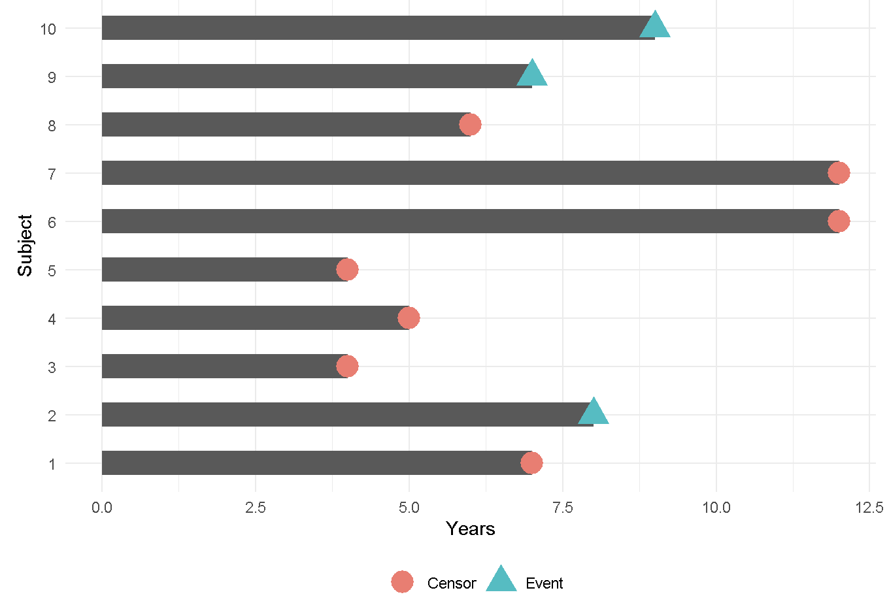
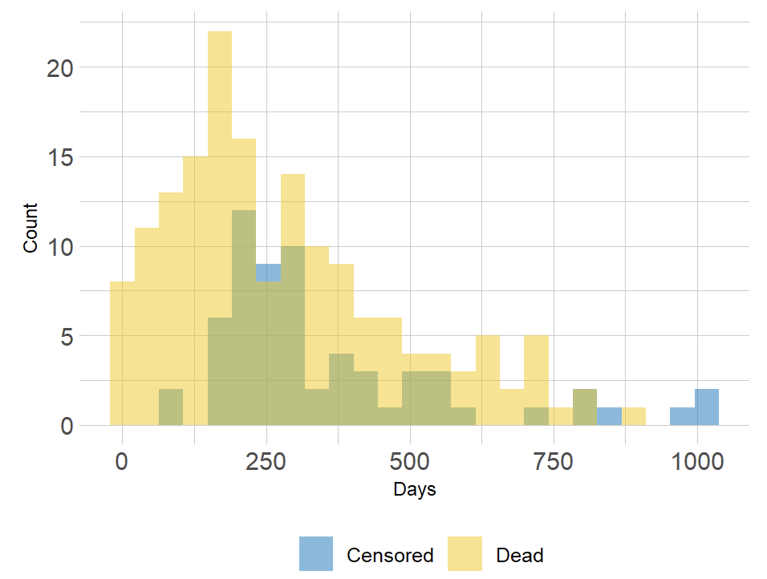

```{r, include = FALSE}
knitr::opts_chunk$set(out.width = "100%", message = FALSE, warning = FALSE)
```


# Survival Analysis {#SurvivalAnalysis}


## 介绍

生存分析的目的是分析某个时间点的“生存概率”是多少。基于这样的研究目的，需要提供生存数据，它是一种由不同的开始时间和结束时间组成的事件-时间的数据，比如在癌症研究领域，研究手术到死亡的过程、治疗到疾病进展等等。

在开展生存分析前，需要了解什么是删失（censored）。对于确定的事件，由于其他原因导致其出现无法记录、无法观察等等，这些都可以称为删失。“删失（censored）数据指在观察或试验中,由于人力或其他原因未能观察到所感兴趣的事件发生，因而得到的数据。”

```{r, echo=FALSE, out.width="90%", out.height="90%", dpi=600, fig.align="center", fig.cap="Censored survival data"}

```

图表示10个参与者，在事件为发生前有7位患者出现了删失情况。忽略删失样本会导致生存概率结果出现偏差。生存分析是一种可以适当考虑被删失患者的方法。


## 组成

生存数据是有事件状态和对应时间组成，事件状态可以分成发生和删失。

+ 事件时间：$T_i$

+ 删失时间：$C_i$

+ 事件状态：如果观察到事件则是1；否则是删失0。事件时间要小于删失时间。


通过密度分布图可以观察到事件发生和删失状态在时间上的区别，如果不考虑删失则会导致评估结果偏高。

```{r, echo=FALSE, out.width="90%", out.height="90%", dpi=600, fig.align="center", fig.cap="distribution of follow-up times"}

```

某个对象在某个时间点的生存概率公式为：$S(t) = Pr(T > t) = 1- F(t)$

+ $S(t)$是生存函数

+ $F(t) = 1- Pr(T > t)$是累积分布函数


## 案例

### 加载R包

```{r, message = FALSE, warning = FALSE}
knitr::opts_chunk$set(message = FALSE, warning = FALSE)
library(tidyverse)
library(survival)
library(survminer)
library(gtsummary)

# rm(list = ls())
options(stringsAsFactors = F)
options(future.globals.maxSize = 1000 * 1024^2)

# group & color
sex_grp <- c("Male", "Female")
sex_col <- c("#F28880", "#60C4D3")
```


### 导入数据

肺癌数据: 本次研究目的----不同性别以及患者的生存状态是否存在差异

+ 生存时间（time）: 观察到的生存时间 (days)

+ 生存状态（status）: 死亡(2->1)和删失(1->0)

+ 性别（sex）: 1=Male, 2=Female

+ 肿瘤活动状态（ph.ecog）：0=ECOG0，1=ECOG1，2=ECOG2

```{r}
dat <- 
  lung %>% 
  mutate(status = recode(status, `1` = 0, `2` = 1),
         sex = recode(sex, `1` = "Male", `2` = "Female")) %>%
  filter(!ph.ecog %in% c(NA, 3)) %>%
  mutate(ph.ecog = recode(ph.ecog, `0` = "ECOG0", `1` = "ECOG1", `2` = "ECOG2"),
         sex = factor(sex, levels = sex_grp))

head(dat[, c("time", "status", "sex", "ph.ecog")])
```


### 生存对象

通过`Surv()`生成生存对象，在使用`survfit()`生成生存曲线Kaplan-Meier plot的准备数据。

```{r}
sur_fit <- survival::survfit(survival::Surv(time, status) ~ sex, data = dat)

sur_fit
```


### 组间生存时间差异比较

问题：在肺癌患者不同的性别分组中，生存概率是否存在差异性呢？

通常采用Log-rank检验推断两生存曲线整体间（整个观察期间）是否有差异，若生存曲线出现交叉情况，由于不满足成比例假设，则Log-rank检验不适用。


```{r, fig.width=8, fig.height=6}
survminer::ggsurvplot(
    fit = sur_fit,
    pval = TRUE,
    xlab = "Days",
    ylab = "Overall survival probability",
    legend.title = "Sex",
    legend.labs = sex_grp,
    palette = sex_col,
    break.x.by = 100, 
    surv.median.line = "hv",
    risk.table = TRUE,
    risk.table.y.text = FALSE)
```

从图上的*logRank p = 0.0018*来看，女性在肺癌中生存周期更长。结合男性可能抽烟的额外因素考虑，该结果也符合预期。


### 中位生存期

中位生存期(Median Survival Time)，又称为半数生存期， 即当累积生存率为0.5时所对应的生存时间，表示有且只有50%的个体可以活过这个时间。

```{r}
sur_fit %>%
  tbl_survfit(
    probs = 0.5,
    label_header = "**Median survival (95% CI)**"
  ) 
```

女性的中位生存期（426天）要远远高于男性的（283天）


### N年生存概率

选择1到3年生存概率，评估男女性间的差异

```{r}
sur_fit %>%
  tbl_survfit(
    times = c(365, 730),
    label_header = "**{time} Days survival (95% CI)**"
  )
```


### Cox回归模型

logRank test是定性变量是否和生存相关，定量变量之间的风险比例值需要用到Cox回归模型。单变量Cox回归仅评估该变量和生存的关系，多变量Cox回归可以校正其他因素影响后再评估单个变量的风险比例值。

```{r}
broom::tidy(survival::coxph(Surv(time, status) ~ sex, data = dat)) %>% # conf.int = TRUE, exponentiate = TRUE
            dplyr::select(-statistic) %>%
            dplyr::mutate(`Hazard ratios` = exp(estimate),
                          HR_conf.low = exp(estimate) - 1.95*std.error,
                          HR_conf.high = exp(estimate) + 1.95*std.error,
                          HR = round(`Hazard ratios`, 2),
                          HR_conf.low = round(HR_conf.low, 2),
                          HR_conf.high = round(HR_conf.high, 2),
                          p.value = signif(p.value, 2)) %>%
            dplyr::select(term, HR, HR_conf.low, HR_conf.high, p.value) %>%
  rbind(as_tibble(data.frame(term = "RefMale", 
                  HR = NA,
                  HR_conf.low = NA, 
                  HR_conf.high = NA, 
                  p.value = NA)))
```

以Male作为Reference，Female的风险比例值HR为0.6且对应的p<0.05，HR小于1，说明在肺癌患者中，Female的死亡风险要显著低于Male。


### 其他生存分析

探究不同性别分组的ECOG是否与生存状态相关

+ 函数：1.获取生存分析结果；2.可视化生存曲线

```{r}
get_cox_res <- function(
    input, groups, 
    group_names, RefGroup) {
  
  input_dat <- input %>%
    dplyr::select(all_of(groups)) %>%
    stats::setNames(c("TIME", "STATUS", "GROUP")) %>%
    dplyr::filter(GROUP %in% group_names) %>%
    dplyr::mutate(GROUP = factor(as.character(GROUP), levels = group_names))
      
  ## Group: log rank-test
  fit <- survfit(Surv(TIME, STATUS) ~ GROUP, data = input_dat)
  logrank <- surv_pvalue(fit = fit, data = input_dat)      
      
  ## Group: Hazard ratios: Low as reference
  HR <- broom::tidy(survival::coxph(survival::Surv(TIME, STATUS) ~ GROUP, data = input_dat)) %>%
        dplyr::select(-statistic) %>%
        dplyr::mutate(`Hazard ratios` = exp(estimate),
                      HR_conf.low = exp(estimate) - 1.95*std.error,
                      HR_conf.high = exp(estimate) + 1.95*std.error,
                      HR = signif(`Hazard ratios`, 2),
                      HR_conf.low = signif(HR_conf.low, 2),
                      HR_conf.high = signif(HR_conf.high, 2),
                      cox_pval = signif(p.value, 2),
                      HR_95 = paste0(HR, " (", HR_conf.low, " - ", HR_conf.high, ")")) %>%
        dplyr::select(term, HR_95, cox_pval) %>%
        rbind(data.frame(term = paste0("Ref", RefGroup),
                         HR_95 = NA,
                         cox_pval = NA)) 
      
  ## Group: Combination
  res <- logrank %>%
        dplyr::select(pval) %>%
        dplyr::rename(logRank_pval = pval) %>%
        rbind(data.frame(logRank_pval = rep(NA, (length(group_names) - 1) ))) %>%
        cbind(HR) %>%
        dplyr::select(term, logRank_pval, HR_95, cox_pval) %>%
        dplyr::rename(logRank_pval = logRank_pval,
                      HR_95 = HR_95,
                      cox_pval = cox_pval)           
      
  return(res)
}

# survival plot
get_plot <- function(
    input, groups, group_names,
    feaID, TypeTime, NegGroup, PosGroup) {
      
  input_dat <- input %>%
        dplyr::select(all_of(groups)) %>%
        stats::setNames(c("TIME", "STATUS", "GROUP")) %>%
        dplyr::filter(GROUP %in% group_names) %>%
        dplyr::mutate(GROUP = factor(as.character(GROUP), levels = group_names))
      
  # survival model
  fit <- survminer::surv_fit(Surv(TIME, STATUS) ~ GROUP, data = input_dat)
  logrank <- surv_pvalue(fit = fit, data = input_dat)
  pval_label <- paste(logrank$method, signif(logrank$pval, 3), sep = ": p=")
      
  # median survival time
  med_time <- fit %>% 
    gtsummary::tbl_survfit(
    probs = 0.5,
      label_header = "**Median survival (95% CI)**"
    ) %>%
    as.tibble() %>%
    dplyr::slice(-1) %>%
    stats::setNames(c("Group", "Time")) %>%
    dplyr::group_by(Group) %>%
    dplyr::mutate(Median_temp = unlist(strsplit(Time, "\\s+\\("))[1]) %>%
    dplyr::mutate(Median = ifelse(Median_temp == "-", "undef.", Median_temp),
                  Median_label = paste0(Group, " (", Median, " Days)")) %>%
    dplyr::ungroup() 
      
    # cox model HR
    cox_type <- rbind(NegGroup, PosGroup) %>%
        dplyr::filter(!is.na(HR_95)) %>%
        dplyr::mutate(term = gsub("GROUP", "", term)) %>%
        dplyr::rename(Group = term) %>%
        dplyr::mutate(HR_95 = gsub("\\s+-\\s+", ";", HR_95),
                      HR_95 = gsub("\\s+", "", HR_95),
                      cox_label = paste0("cox p=", cox_pval, ", HR=", HR_95),
                      logRank_pval = signif(logRank_pval, 3))
      
    # merge labels 
    sur_labels <- med_time %>%
       dplyr::left_join(cox_type %>% 
                          dplyr::select(Group, cox_label), 
                        by = "Group")
    sur_labels$cox_label[is.na(sur_labels$cox_label)] <- "Reference"
    sur_labels$final_label <- paste(sur_labels$Median_label, sur_labels$cox_label,
                                     sep = "   ")
     
    # finale pvalue label
    pval_label_final <- paste0(pval_label, "\n", 
                                "(Male: p=", cox_type$logRank_pval[1],
                                "; ",
                                "Female: p=", cox_type$logRank_pval[2],
                                ")")
     
    ggsurv <- ggsurvplot(
        fit,
        pval = pval_label_final,
        pval.size = 4, 
        pval.coord = c(0, 0.05),
        xlab = "Overall Survival Time (Days)", 
        surv.scale = "percent",
        break.time.by = 100, 
        risk.table.y.text.col = T, 
        risk.table = T,
        risk.table.title = "",
        risk.table.fontsize = 4,
        risk.table.height = 0.3,
        risk.table.y.text = FALSE, 
        ncensor.plot = FALSE,
        surv.median.line = "hv",
        palette = c("#803C08", "#F1A340", 
                    "#2C0a4B", "#998EC3"),
        legend = c(0.7, 0.89),
        legend.labs = sur_labels$final_label,
        legend.title = "",
        font.legend = c(10, "plain"),
        tables.theme = theme_cleantable(),
        ggtheme = theme_classic() + theme(
             axis.title = element_text(size = 10, face = "bold"),
             axis.text = element_text(size = 9),
             legend.background = element_rect(fill = "transparent", color = NA),
             legend.box.background = element_rect(fill = "transparent", color = NA)
           )        
      )      
      
  return(ggsurv)
}
```


+ 准备数据和获取生存结果
```{r}
dat_new <- dat %>%
  dplyr::select(time, status, sex, ph.ecog) %>%
  dplyr::mutate(MixedGroup = paste(sex, ph.ecog, sep = "_")) %>%
  dplyr::mutate(MixedGroup = factor(MixedGroup, 
            levels = c("Male_ECOG0", "Male_ECOG1", "Male_ECOG2", 
                       "Female_ECOG0", "Female_ECOG1", "Female_ECOG2")),
            sex = factor(sex, levels = sex_grp))

MaleGroup <- get_cox_res(
      input = dat_new, 
      groups = c("time", "status", "MixedGroup"), 
      group_names = c("Male_ECOG0", "Male_ECOG1"), 
      RefGroup = "Male_ECOG0") 
FemaleGroup <- get_cox_res(
      input = dat_new, 
      groups = c("time", "status", "MixedGroup"), 
      group_names = c("Female_ECOG0", "Female_ECOG1"), 
      RefGroup = "Female_ECOG0") 
```

+ 画图
```{r, fig.width=8, fig.height=6}
ggsurpl <- get_plot(
        input = dat_new, 
        groups = c("time", "status", "MixedGroup"), 
        group_names = c("Male_ECOG0", "Male_ECOG1",
                        "Female_ECOG0", "Female_ECOG1"), 
        feaID = "ECOG",
        NegGroup = MaleGroup,
        PosGroup = FemaleGroup)
ggsurpl
```


结果：不同性别分组内的ECOG组（ECOG0和ECOG1）与生存状态没有显著差异。


## 总结

+ 生存数据很常见，是时间到事件的数据；

+ 需要生存分析技术来解释删失的数据；

+ **survival** R包提供了生存分析工具，包括`Surv`和`surfit`函数 

+ **survminer** R包提供了`ggsurvplot`函数允许基于ggplot2定制Kaplan-Meier图 

+ 组间比较可采用log-rank检验，采用`survival::survdiff` 

+ 单或多变量Cox回归分析可以使用`survival::Cox`进行


## Systemic information
```{r}
devtools::session_info()
```


## Reference

+ [Survival Analysis in R](https://www.emilyzabor.com/tutorials/survival_analysis_in_r_tutorial.html#Kaplan-Meier_plots)
