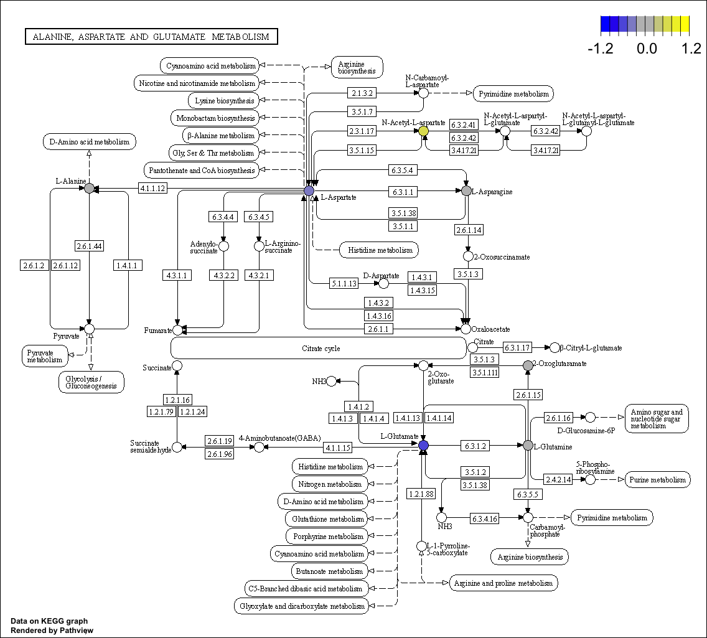

```{r, include = FALSE}
knitr::opts_chunk$set(out.width = "100%", message = FALSE, warning = FALSE)
```


# Other Analysis {#OtherAnalysis}


除了常见的功能分析，还有其他的功能分析方法或R包。本章节主要介绍其他功能分析的方法以及结果解析。

## FELLA: an R package to enrich metabolomics data

FELLA（[@picart2018fella]）发表于2018年，现谷歌引用67次，它是一个专门用于代谢组通路分析的R包。

> 基于前期分析得到的差异代谢物来构建基于网络的富集分析。结果包括代谢通路、模块、酶、反应及代谢物。那么除了能够提供通路列表，FELLA还能够生成输入代谢物相关的中间物质（如模块、酶、反应）。可以反映特定研究条件下代谢通路之间的交集以及靶向潜在的酶和代谢物。

它包含了以下三步：

1. **Block I**: local database从数据库抓取数据后，将其处理转存在本地；

2. **Block II**: enrichment analysis将关心的代谢物作为输入，做富集分析；

3. **Block III**: exporting results导出数据。


### 加载R包

```{r, message = FALSE, warning = FALSE}
knitr::opts_chunk$set(message = FALSE, warning = FALSE)
library(tidyverse)
library(FELLA)

# rm(list = ls())
options(stringsAsFactors = F)
options(future.globals.maxSize = 1000 * 1024^2)

grp_names <- c("None", "Mild", "Moderate", "Severe")
grp_colors <- c("#7DD06F", "#844081", "#688EC1", "#C17E73")
```


### 背景数据库生成

代谢组测试数据是来自病人血清，但也提供构建小鼠的通路背景数据库（每次下载数据库可能会发生变化，因为官网可能更新过）

+ 人的KEGG背景数据库

1. 从KEGG官网下载数据；
2. 构建背景数据库；
3. 导入内存环境.

```{r, message = FALSE, warning = FALSE}
library(KEGGREST)
library(igraph)

tmpdir <- "./InputData/FELLA/hsa"

if (!file.exists("./InputData/FELLA/hsa/keggdata.graph.RData")) {
  set.seed(123)
  # 下载KEGG
  graph <- buildGraphFromKEGGREST(
    organism = "hsa", 
    filter.path = "hsa01100")
  
  tmpdir <- "./InputData/FELLA/hsa"
  unlink(tmpdir, recursive = TRUE)
  
  # 构建数据库
  buildDataFromGraph(
    keggdata.graph = graph,
    databaseDir = tmpdir,
    internalDir = FALSE,
    matrices = "none",
    normality = "diffusion",
    niter = 100)  
}

# 导入数据库进内存
fella.data <- loadKEGGdata(
  databaseDir = tmpdir,
  internalDir = FALSE,
  loadMatrix = "none")

fella.data
```


+ 小鼠的KEGG背景数据库

1. 从KEGG官网下载数据；
2. 构建背景数据库；
3. 基因名字转换成entrez ID，酶转换成entrez ID；
4. 导入内存环境.

```R
library(KEGGREST)
library(igraph)
library(org.Mm.eg.db)

tmpdir <- "./InputData/FELLA/mmu"

if (!file.exists("./InputData/FELLA/mmu/keggdata.graph.RData")) {
  set.seed(123)
  # 下载KEGG
graph <- buildGraphFromKEGGREST(
  organism = "mmu",
  filter.path = c("01100", "01200", "01210", "01212", "01230"))
  
  tmpdir <- "./InputData/FELLA/mmu"
  unlink(tmpdir, recursive = TRUE)
  
  # 构建数据库
  buildDataFromGraph(
    keggdata.graph = graph,
    databaseDir = tmpdir,
    internalDir = FALSE,
    matrices = "none",
    normality = "diffusion",
    niter = 100)  
  
  alias2entrez <- as.list(org.Mm.eg.db::org.Mm.egSYMBOL2EG)
  entrez2ec <- KEGGREST::keggLink("enzyme", "mmu")
  entrez2path <- KEGGREST::keggLink("pathway", "mmu")

}

# 导入数据库进内存
fella.data <- loadKEGGdata(
  databaseDir = tmpdir,
  internalDir = FALSE,
  loadMatrix = "none")

fella.data
```


### 导入数据

对数据[OmicsDataSet-Zeybel et al. - 2022.xlsx](https://github.com/HuaZou/DraftNotes/blob/main/InputData/Zeybel-2022/OmicsDataSet-Zeybel et al. - 2022.xlsx)处理后生成的，可参考数据预处理等章节。


> ```R
> write.table(final_res, "./InputData/result/DA/Metabolites_FC_VIP_ttest.tsv", 
            row.names = F, quote = F, sep = "\t", fileEncoding = "UTF-8")
> ```

```{r}
datSignif <- data.table::fread("./InputData/result/DA/Metabolites_FC_VIP_ttest.tsv")

# DT::datatable(datSignif)

head(datSignif)
```


### 准备输入代谢物

代谢物的ID要是KEGG ID，需要注意⚠️。随机挑选5个代谢物用于分析。

```{r}
set.seed(123)

datSignif$KEGG <- gsub(",\\S+", "", datSignif$KEGG)

datSignif_KEGG <- datSignif %>%
  dplyr::filter(!is.na(KEGG)) %>%
  dplyr::filter(SUPER.PATHWAY == "Amino Acid") %>%
  dplyr::select(BIOCHEMICAL, KEGG) 

target_metabolites <- datSignif_KEGG[sample(1:nrow(datSignif_KEGG), 5), ,]

head(target_metabolites)
```


### 富集分析

富集分析的方法有三种

  - 超几何检验
  
  - Diffusion（有意义子网络）
  
  - PageRank（和Diffusion类似，对网络进行排序）
  
统计分析：对Diffusion和PageRank提供了两种统计方法

  - Normal approximation(approx = "normality")，基于无效假设的分析的期望值和协方差矩阵的z-score计算得到得分值
  
  - Monte Carlo trials(approx = "simulation")，随机变量的蒙特卡罗实验计算得分值


+ 可通过method选择不同富集方法，本次运行选择*diffusion*

```{r, message = FALSE, warning = FALSE}
myAnalysis <- enrich(
    compounds = target_metabolites$KEGG, 
    method = "diffusion", # listMethods()
    approx = "normality", 
    data = fella.data)

show(myAnalysis)
```

结果：展示了diffusion方法下富集的结果, 有104个节点。


+ 可视化结果

```{r, message = FALSE, warning = FALSE, fig.width=10, fig.height=8}
plot(
    x = myAnalysis, 
    method = "diffusion", 
    main = "diffusion analysis in FELLA", 
    threshold = 0.1, 
    data = fella.data,
    nlimit = 100)
```


+ 输出富集分析结果表格

```{r, message = FALSE, warning = FALSE}
myTable <- generateResultsTable(
    object = myAnalysis, 
    method = "diffusion", 
    threshold = 0.1, 
    data = fella.data)

knitr::kable(head(myTable, 10), format = "html")
```


### 结果解析

+ 筛选的5个代谢物富集在(**diffusion**)"hsa00250"和"hsa00270"等通路，并且这些通路大部分和氨基酸代谢相关；

+ 除了代谢通路外，还有代谢模块等其他更为具体的通路组成，比如酶和反应等；

+ 相比传统的富集分析，FELLA能将代谢通路各个层级混合在一起做成网络分析是其特点，比如**p53 signaling pathway - Homo sapiens (human)**相关的酶是**ribonucleoside-diphosphate reductase**，该酶又和反应**5-fluorodeoxyuridine-diphosphate**相关。


## Pathview: 代谢物数据可视化KEGG通路图

> Pathview（Pathway based data integration and visualization，https://pathview.uncc.edu/）是一个用于KEGG通路可视化的工具集，能够将多种生物的基因或代谢物映射到该物种的KEGG通路图上，例如在转录组、蛋白组或代谢组中展示差异表达的基因、蛋白或代谢物等。

本教程是基于代谢组数据，使用代谢组KEGGID (如`C00064`）等。

### 安装pathview包

```R
if (!requireNamespace("pathview", quietly=TRUE)) {
  BiocManager::install('pathview')
}
```

### 准备输入数据

筛选包含Log2FoldChange和KEGG的代谢物输入数据（pathview要求输入数据包含差异倍数以及代谢物的KEGGID）。

```{r, warning=FALSE, message=FALSE}
set.seed(123)

datSignif <- data.table::fread("./InputData/result/DA/Metabolites_FC_VIP_ttest.tsv")

datSignif$KEGG <- gsub(",\\S+", "", datSignif$KEGG)

datSignif_KEGG <- datSignif %>%
  dplyr::filter(!is.na(KEGG)) %>%
  dplyr::filter(SUPER.PATHWAY == "Amino Acid") %>%
  dplyr::select(BIOCHEMICAL, KEGG, Log2FoldChange) 

# head(datSignif_KEGG)

compound_data <- datSignif_KEGG$Log2FoldChange
names(compound_data) <- datSignif_KEGG$KEGG

compound_data[1:6]
```


### 运行pathview

根据*myTable*可以看到富集在00250和00310等通路，最后选择00250通路展示。

```{r, warning=FALSE, message=FALSE}
library(pathview)

pl <- pathview(
  cpd.data = compound_data,
  cpd.idtype   = "kegg",
  species      = "hsa", 
  kegg.native  = TRUE,
  pathway.id   = "hsa00250",
  out.suffix   = "compound",
  limit        = list(gene=1, cpd=max(abs(datSignif_KEGG$Log2FoldChange))))
```

```{r, echo=FALSE, out.width="100%", out.height="100%", dpi=600, fig.align="center", fig.cap="KEGG of 00250 pathway", warning=FALSE, message=FALSE}
if (file.exists("./hsa00250.compound.png")) {
  file.remove("./InputData/figures/hsa00250.compound.png")
  file.remove("./hsa00250.pathview.pdf")
  file.remove("./hsa00250.png")
  file.remove("./hsa00250.xml")
  file.rename(from="./hsa00250.compound.png",
              to="./InputData/figures/hsa00250.compound.png")  
}


```

结果：

+ 蓝色和黄色表示富集方向，能看到3个颜色明显的代谢物在该通路中发挥的作用。


## aPEAR: an R package for autonomous visualisation of pathway enrichment networks

> The interpretation of pathway enrichment analysis results is frequently complicated by an overwhelming and redundant list of significantly affected pathways. Here, we present an R package aPEAR (Advanced Pathway Enrichment Analysis Representation) which leverages similarities between the pathway gene sets and represents them as a network of interconnected clusters. Each cluster is assigned a meaningful name that highlights the main biological themes in the experiment. Our approach enables an automated and objective overview of the data without manual and time-consuming parameter tweaking.

aPEAR利用通路间的相似性将通路进行聚类，方便解释通路富集分析的结果。aPEAR提供一个enrichmentNetwork函数，将结果可视化成网络。其原理：


> + The pairwise similarity between all pathway gene sets is evaluated using the Jaccard index (default), cosine similarity, or correlation similarity metrics.
> 
> + The similarity matrix is then used to detect clusters of redundant pathways using Markov (default) (Van Dongen 2008), hierarchical, or spectral (John et al. 2020) clustering algorithms.


+ 所有通路的基因计算成对相似性 (默认使用Jaccard距离)。

+ 将冗余的通路聚类在一起。

### 安装aPEAR包

```R
if (!requireNamespace("aPEAR", quietly=TRUE)) {
  BiocManager::install('aPEAR')
}
```

### 准备输入数据

筛选包含Log2FoldChange和KEGG的代谢物输入数据。

```{r, warning=FALSE, message=FALSE}
set.seed(123)

datSignif <- data.table::fread("./InputData/result/DA/Metabolites_FC_VIP_ttest.tsv")
datSignif$KEGG <- gsub(",\\S+", "", datSignif$KEGG)
datSignif_KEGG <- datSignif %>%
  dplyr::filter(!is.na(KEGG)) %>%
  dplyr::filter(SUPER.PATHWAY == "Amino Acid") %>%
  dplyr::select(BIOCHEMICAL, KEGG, Log2FoldChange) 


hsa_kegg_compound <- read.csv("./InputData/result/KEGG/KEGG_COMPOUND_PATHWAY_hsa.csv") 
ref_cln <- hsa_kegg_compound %>%
    dplyr::select(PATHWAY_MAP, COMPOUND) %>%
    dplyr::rename(Pathway = PATHWAY_MAP)
```


### 富集分析

采用ORA富集分析方法

```{r, warning=FALSE, message=FALSE}
ORA_fit <- clusterProfiler::enricher(
  gene = datSignif_KEGG$KEGG,
  pvalueCutoff = 0.05,
  pAdjustMethod = "BH",
  minGSSize = 10,
  maxGSSize = 500,
  qvalueCutoff = 0.2,
  TERM2GENE = ref_cln)
```


### aPEAR网络图

aPEAR画网络图

```{r, warning=FALSE, message=FALSE, fig.width=10, fig.height=7}
library(aPEAR)

enrichmentNetwork(
  ORA_fit@result,
  fontSize = 3,
  outerCutoff = 0.5,
  drawEllipses = TRUE,
  repelLabels = TRUE)
```


结果: 

+ 节点表示显著通路，边表示相关性，颜色表示标准化后的富集得分；

+ 每个簇分类了一个具有生物学意义的名称；

+ NES值表示聚类簇通路的重要性，NES越高通路越重要。


## Session info
```{r}
devtools::session_info()
```


## Reference

+ [FELLA github](https://github.com/b2slab/FELLA)

+ [The MetaRbolomics book](https://rformassspectrometry.github.io/metaRbolomics-book/)
