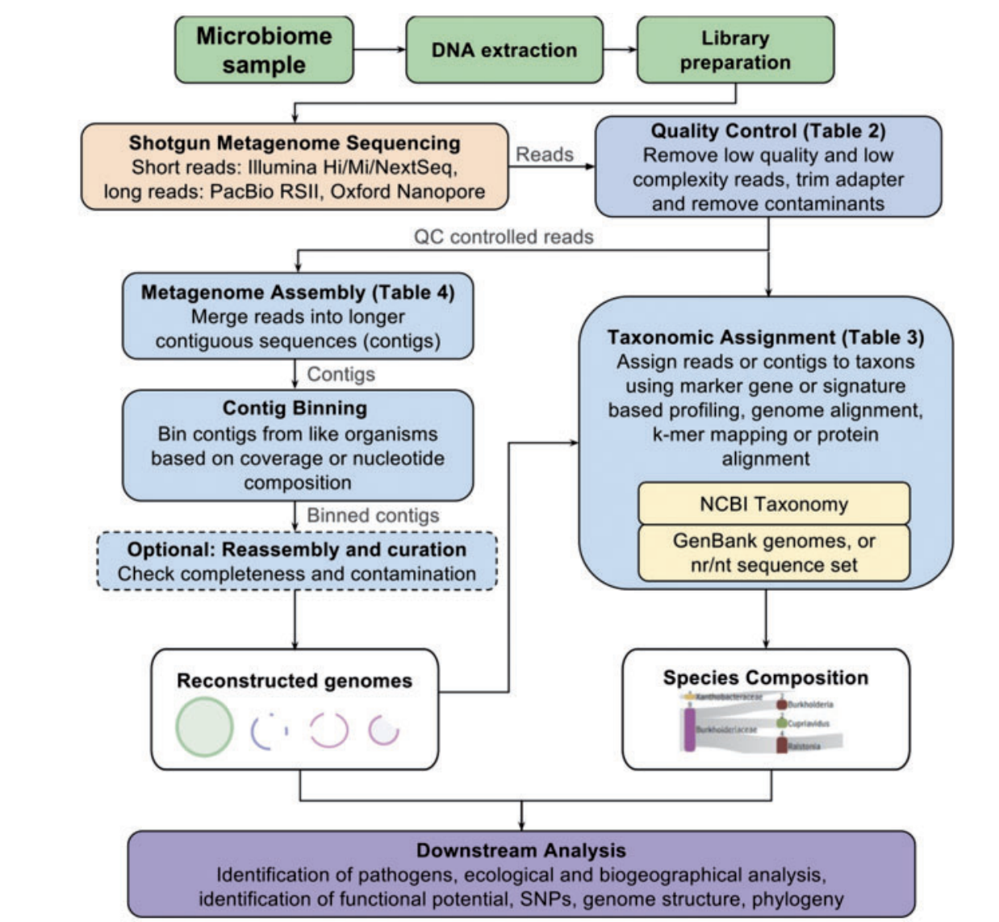

```{r, include = FALSE}
knitr::opts_chunk$set(out.width = "100%", message = FALSE, warning = FALSE)
```

# (PART) Knowledge {.unnumbered}

# Metageomics {#Metageomics}

本文聚焦用生物信息学的方法挖掘宏基因组数据背后的生物学意义。

从环境中提取包含所有微生物的DNA，然后建库测序获取fastq等二代测序数据，生信是指对这些数据进行处理和提取它们背后的生物学意义，解析出对环境影响产生相应的微生物。

-   宏基因组数据分析的优劣点

-   相关数据分析工具

## 宏基因组介绍

metagenomics通常有多种含义，它包含

-   基于marker genes测序，如我们常说的16s rRNA基因测序或者真菌的ITS测序（扩增子测序范畴）

-   shotgun metagenome测序，也就是所有DNA都采用鸟枪法打断测序（通过DNA insert size筛选测序片段）

-   另一种是meta-transcriptome测序（宏转录组）

不同测序方法的目的是不同的，

-   比如仅仅想知道环境中有什么物种存在，采用标记基因16s rRNA DNA测序即可 （**16s metagenomics**）

-   比如想知道环境中有什么物种存在且它们发挥什么功能，采用shotgun metagenome测所有DNA即可 (**Metagenomics**)

-   但是如果想知道当前环境中微生物正在发挥什么功能，则采用检测mRNA，蛋白质或代谢组即可 (**Metatranscriptomics, Metaproteomics and Metametabolomics**)

+-----------------------------+------------------------------------------------------------------------+----------------------------------------+
| 技术                        | 优点和缺点                                                             | 应用                                   |
+=============================+========================================================================+========================================+
| 扩增子测序（16s, ITS）      | +快速低成本识别大多数细菌和真核生物                                    | 表征环境中微生物的存在                 |
|                             |                                                                        |                                        |
|                             | -不能捕获其它非靶点基因                                                | 微生态学                               |
|                             |                                                                        |                                        |
|                             | -扩增子偏好性（PCR过程中存在，三代测序全长16s rRNA基因可以避免该问题） | 基于rRNA标记基因的进化树研究           |
|                             |                                                                        |                                        |
|                             | -不能捕获病毒                                                          |                                        |
+-----------------------------+------------------------------------------------------------------------+----------------------------------------+
| MGS（shotgun）of DNA or RNA | +没有偏好性                                                            | 可知晓环境的当前多个类型微生物存在情况 |
|                             |                                                                        |                                        |
|                             | +可检测细菌、古菌、病毒和真核生物                                      | 功能基因组学研究                       |
|                             |                                                                        |                                        |
|                             | +可从头组装微生物组                                                    | 病原微生物检测                         |
|                             |                                                                        |                                        |
|                             | -需大量reads                                                           | 系统进化树                             |
|                             |                                                                        |                                        |
|                             | -reads可能来自于宿主                                                   |                                        |
|                             |                                                                        |                                        |
|                             | -物种分类需参考数据库                                                  |                                        |
+-----------------------------+------------------------------------------------------------------------+----------------------------------------+
| Meta-transcriptomics (mRNA) | +识别活跃状态下的基因和通路                                            | 当前环境活跃状态的转录组               |
|                             |                                                                        |                                        |
|                             | -mRNA是不稳定的易降解                                                  |                                        |
|                             |                                                                        |                                        |
|                             | -多个纯化和扩增mRNA的步骤容易引入较多的噪音                            |                                        |
+-----------------------------+------------------------------------------------------------------------+----------------------------------------+


挑战：

+ 生态系统的复杂性（微生物数目和种类繁多，相互关系复杂）

+ 数据库的完整性（较多微生物缺乏参考数据库）

+ 测序深度（稀少微量的微生物无法检测出来）

+ 计算资源（微生物从头组装等需要消耗巨量的计算资源）


### 宏基因组常用分析流程

参考 A review of methods and databases for metagenomic classification and assembly (Ref: [@breitwieser2019review])

```{r, echo=FALSE, out.width="50%", out.height="50%", dpi=600, fig.align="center", fig.cap="Common analysis procedures for metagenomics data"}



```


**Figure1**. Common analysis procedures for metagenomics data. Note that the order of some of the analysis steps can be shuffled. For example, reads might be binned before assembly or before taxonomic assignment, so that the downstream algorithms can work only with a subset of the data.


上述步骤分为：

+ fastq质量控制：去除低质量的reads（FastQC, fastp, Fastq_screen, BBtools, Trimmomatic, Cutadapt, khmer/diginorm, MultiQC）

+ metagenome组装：从头组装reads成基因组 (微生物比对分类等软件：Kraken, CLARK, Kallisto, Kaiju, GOTTCHA, Centrifuge, Metaphlan2/3, mOTU, Mash, sourmash; 微生物组装：Megahit, SPAdes, MetaSPAdes, IDBA-UD, MOCAT2)

+ binning分箱：组装后的分箱，获得精度更高的微生物组 (COCACOLA, CONCOCT, MetaBAT, VizBin)

+ 物种注释：将得到的基因组草图注释到参考数据库获得物种分类信息 (质量控制：BUSCO, CheckM)

+ 下游分析

这些步骤涉及软件众多。


## Reference

+ Breitwieser, Florian P., Jennifer Lu, and Steven L. Salzberg. "A review of methods and databases for metagenomic classification and assembly." Briefings in bioinformatics 20.4 (2019): 1125-1136.

+ https://trainings.migale.inrae.fr/posts/2022-06-20-module24/content/slides.html#15