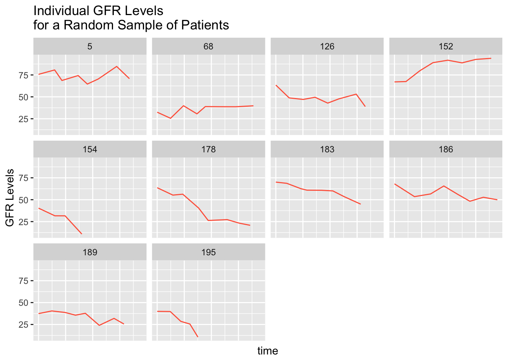

# (PART) Statistical Methods {.unnumbered}

# GEE and MLM {#GEEandMLM}


+ Tutorial of Generalized Estimating Equations and Mixed Linear Models


针对某个科学问题，通常会在一段时间内对多个同一研究对象进行多次或重复测量，这类数据一般称为纵向数据。纵向数据具有两个特点，一是研究对象重复；二是观察值可能存在缺失值。上述两个因素导致在探索结果和观测指标相关性分析时，一般线性（linear regression model）或广义线性模型（generalized regression model）以及重复测量方差分析（repeated ANOVA）均不适用。因此，**广义估计方程(generalized estimating equations，GEE)** 和**混合线性模型(mixed linear model，MLM) **被广泛应用于纵向数据的统计分析。

+  **广义估计方程(generalized estimating equations，GEE)**： 假定每个研究对象的重复观察值间存在某种类型的作业相关矩阵（应变量的各次重复测量值两两之间相关性的大小），应用准似然函数原理，可以得到回归系数及其方差的一致性估计

+ **混合线性模型(mixed linear model，MLM)**：它是一类对误差进行精细分解成对固定效应和随机效应等误差的广义线性模型的方法，相比广义线性模型而言，它能处理纵向数据（如时间序列数据，时间一般作为随机因素）。


上述两种方法适合解析因变量和自变量的相关性


## 原理


基本概念

+ **自变量**（independent variable）：又称独立变量、解释变量（explanatory variable）、外生变量，是可由研究者选择、控制、研究，且能独立变化而影响或引起其他变量变化的条件或因素（变数、变量、变项），因此自变量被看作是因变量的原因。

+ **因变量**（dependent variable）：又称应变量、被解释变量、内生变量、反应变量、响应变量（response variable）、依变量、果变量，亦即要研究的目标变量，其取值可被观测且随自变量的变化而变化。

+ **控制变量**（controlled variable）：又称额外变量（extraneous variable）、无关变量，是除了实验因素（自变量）以外，所有可能影响实验变化和结果并需要进行控制的潜在条件或因素（变数、变量、变项）

+ **协变量**（covariate）：在实验的设计中，协变量是一个独立变量(解释变量)，不为实验者所操纵，但仍影响响应。同时，它指与因变量有线性相关并在探讨自变量与因变量关系时通过统计技术加以控制 的变量。常用的协变量包括因变量的前测分数、人口统计学指标以及与因变量明显不同的个人特征等。_协变量应该属于控制变量的一种_。有些控制变量可以通过实验操作加以控制(如照明、室温等)，也称为*无关变量*；而另一些控制变量由于受实验设计等因素的限制，只能借助统计技术来加以控制，即成了统计分析中的协变量，因而属于统计概念。


假定因变量**y**，自变量**X**，作为固定变量，而**Z**则是随机变量（协变量）。

+  **广义估计方程(generalized estimating equations，GEE)**

    - 建立结果变量**y**与协变量**Z**之间（每个协变量内含有对应的自变量X）的函数关系
    
    - 建立**y**的方差与平均值之间的函数关系
    
    - 对**y**构建一个P*P维作业相关矩阵（自变量**X**），用以表示因变量的各次重复测量值（自变量）之间的相关性大小
    
    - 求参数$\beta$的估计值及其协方差矩阵


+ **混合线性模型(mixed linear model，MLM)**：构建包含固定因子和随机因子的线性混合模型

$$y = X\beta + Z\mu + \epsilon $$

    
  - $\beta$ 是固定效应值；
    
  - $\mu$ 是随机效应值；
    
  - $\epsilon$ 是随机误差向量（拟合值和真实值的误差）；


回归系数的95% 置信区间计算：$$CI_{0.95}^{\beta_{i}} = [\beta_{i} - 1.96 * SE(\beta_{i}),\space \beta_{i} + 1.96 * SE(\beta_{i})]$$


**为各个变量之间存在不同的单位也即是量纲可能不同，所以对数据做归一化和标准化处理是必须的。**


## 加载R包

```r
knitr::opts_chunk$set(message = FALSE, warning = FALSE)
library(tidyverse)
library(data.table)

# rm(list = ls())
options(stringsAsFactors = F)
options(future.globals.maxSize = 1000 * 1024^2)
```


## 导入数据

可以点击此处下载数据[data_dropout.csv](https://github.com/HuaZou/DraftNotes/blob/main/InputData/TherapyData/data_dropout.csv)

> 本案例数据来源于一个肾脏病的研究。研究对200个肾病患者进行随访，每年化验一次肾小球滤过率（GFR，评价肾脏功能的指标，会逐年下降）。主要分析目的是探索基线的尿蛋白定量对GFR年下降率（斜率）的影响（尿蛋白量越大，对肾功能危害越大），混杂因素包括基线年龄和性别。


```r
dataset <- data.table::fread("./InputData/TherapyData/data_dropout.csv")

dataset <- dataset |>
  dplyr::select(-all_of(c("line", "normo")))

head(dataset)
#>    patient visit     time      GFR      age gender micro
#> 1:       1     1 0.000000 34.82791 78.55559      1     1
#> 2:       1     2 1.119435 16.82267 78.55559      1     1
#> 3:       1     3 2.243480 31.60634 78.55559      1     1
#> 4:       1     4 3.028584 42.46687 78.55559      1     1
#> 5:       1     5 3.821319 39.07992 78.55559      1     1
#> 6:       1     6 4.740926 30.38522 78.55559      1     1
#>    macro
#> 1:     0
#> 2:     0
#> 3:     0
#> 4:     0
#> 5:     0
#> 6:     0
```

+ **patient**: 患者ID编号；

+ **visit**：化验次序编号

+ **time**：化验时间（单位年），第一次化验定为0，后面依次推延；

+ **GFR**：肾小球滤过率，单位是ml/min/1.73^2，作为响应变量；

+ **age**：基线年龄，单位岁；

+ **gender**：性别，0=男，1=女；

+ **micro**：基线是否有微量蛋白尿，0=正常蛋白组，1=有；

+ **macro**：基线是否有大量蛋白尿，0=正常蛋白组，1=有；


## 研究问题

患者**GFR**是否受到基线年龄、性别、尿蛋白情况以及化验时间影响。另外根据专业医学知识，假设尿蛋白不仅影响GFR的下降率，也影响基线GFR，也即是time和尿蛋白micro和macro存在交互影响（此地排除age，gender对GFR下降率的影响）。

> 预测变量还需要加上一个时间x尿蛋白的交互项（交互项是指不同的尿蛋白等级会有不同的GFR下降斜率和下降曲线）


## 数据特点

```r
summary(dataset) 
#>     patient           visit            time      
#>  Min.   :  1.00   Min.   :1.000   Min.   :0.000  
#>  1st Qu.: 52.00   1st Qu.:2.000   1st Qu.:1.164  
#>  Median : 99.50   Median :4.000   Median :2.986  
#>  Mean   : 99.98   Mean   :4.183   Mean   :3.161  
#>  3rd Qu.:149.00   3rd Qu.:6.000   3rd Qu.:5.013  
#>  Max.   :200.00   Max.   :8.000   Max.   :8.185  
#>       GFR               age            gender     
#>  Min.   : -5.966   Min.   :20.00   Min.   :0.000  
#>  1st Qu.: 30.793   1st Qu.:48.89   1st Qu.:0.000  
#>  Median : 46.164   Median :60.63   Median :0.000  
#>  Mean   : 46.518   Mean   :59.36   Mean   :0.307  
#>  3rd Qu.: 60.888   3rd Qu.:69.65   3rd Qu.:1.000  
#>  Max.   :109.874   Max.   :90.00   Max.   :1.000  
#>      micro            macro       
#>  Min.   :0.0000   Min.   :0.0000  
#>  1st Qu.:0.0000   1st Qu.:0.0000  
#>  Median :0.0000   Median :0.0000  
#>  Mean   :0.3019   Mean   :0.2431  
#>  3rd Qu.:1.0000   3rd Qu.:0.0000  
#>  Max.   :1.0000   Max.   :1.0000
```


```r
dataset %>%
  group_by(patient) %>%
    summarise(
      count = n(),
      mean = mean(GFR, na.rm=TRUE),
      sd = sd(GFR, na.rm=TRUE)
    )
#> # A tibble: 200 × 4
#>    patient count  mean    sd
#>      <int> <int> <dbl> <dbl>
#>  1       1     8  30.9  8.11
#>  2       2     8  76.2 12.9 
#>  3       3     8  39.8 14.2 
#>  4       4     4  17.2 17.8 
#>  5       5     8  73.7  6.58
#>  6       6     6  25.2 10.5 
#>  7       7     8  37.3  5.37
#>  8       8     8  35.2  6.44
#>  9       9     4  27.0 14.3 
#> 10      10     8  45.3  7.22
#> # ℹ 190 more rows
```


```r
ggplot(data = dataset, aes(x = time, y = GFR, group = patient, color = patient)) +
  geom_line(alpha = .3) + 
  labs(title = "GFR Levels of Patient across the therapeutic times") +
  theme(legend.position = "none")
```


```r
rando <- sample(unique(dataset$patient), 10)
indplot <- subset(dataset, patient %in% rando)
ggplot(indplot, aes(x = time, y = GFR)) + 
  geom_line(color = "tomato") + 
  facet_wrap( ~ patient) + 
  labs(x = "time", y="GFR Levels", title="Individual GFR Levels\nfor a Random Sample of Patients") + 
  theme(axis.text.x=element_blank(), axis.ticks.x=element_blank())
```




## 广义估计方程(generalized estimating equations，GEE)


+ **自变量**（independent variable）：age，gender，micro，macro，time

+ **因变量**（dependent variable）：GFR

+ **协变量**（covariate）：patient

GEE通过协变量patient考虑到他们内部观测值的相关性后再对总体效应进行推断，如何确定分组需要考虑到组群变量。除此之外，确定组内相关关系，还需要考虑到组内观测之间的相关性是相互独立还是相互依赖等各种情况。


```r
library(geepack)

gee_fit <- geeglm(GFR ~ age + gender + micro + macro + time + micro:time + macro:time, 
              id = patient, 
              data = dataset, 
              std.err = "san.se",
              corstr = "exchangeable",
              family = "gaussian")

gee_fit
#> 
#> Call:
#> geeglm(formula = GFR ~ age + gender + micro + macro + time + 
#>     micro:time + macro:time, family = "gaussian", data = dataset, 
#>     id = patient, corstr = "exchangeable", std.err = "san.se")
#> 
#> Coefficients:
#> (Intercept)         age      gender       micro       macro 
#>  81.3842922  -0.2561117  -2.9853967 -20.2334224 -28.7164247 
#>        time  micro:time  macro:time 
#>  -1.6304554  -1.5581604  -1.0560061 
#> 
#> Degrees of Freedom: 1378 Total (i.e. Null);  1370 Residual
#> 
#> Scale Link:                   identity
#> Estimated Scale Parameters:  [1] 249.9992
#> 
#> Correlation:  Structure = exchangeable    Link = identity 
#> Estimated Correlation Parameters:
#>     alpha 
#> 0.6922801 
#> 
#> Number of clusters:   200   Maximum cluster size: 8
```

+ `GFR ~ age + gender + micro + macro + time + micro:time + macro:time`是因变量和自变量的线性关系方程式，其中`micro:time`是交互式影响自变量

+ `id = patient`表示每个patients是一个内在cluster的标识，用于剔除内在相关关系

+ `std.err = "san.se"`计算评估系数的标准误差，*san.se*适合cluster数目小于等于30的数据集

+ `corstr = "exchangeable"`是构造自变量作业相关矩阵参数

    - exchangeable correlation：假设一个cluster里的不同观察是等相关的，并且是时间不依赖的
    
    - autoregressive correlation：假设一个cluster里的不同观察是等相关的，假设一个cluster内的观察是时间依赖的
    
    - unstructured correlation：is the most general of the correlation structures that we discuss. It imposes no structure to the correlation matrix. 
    
    - userdefined correlation：根据自变量自身特点构造作业相关矩阵

+ `family = "gaussian"`是连接函数，链接因变量和自变量（很多中文教程说是协变量）线性关系的函数


提取结果

```r
gee_cc <- coef(summary(gee_fit)) |>
  as.data.frame() |>
  dplyr::mutate(lower_95CI = round(Estimate - 1.96 * Std.err, 2),
                upper_95CI = round(Estimate + 1.96 * Std.err, 2)) |>
  dplyr::mutate(Estimate_95CI = paste0(round(Estimate, 2), " (", lower_95CI, ", ", upper_95CI, ")")) |>
  dplyr::select(-all_of(c("lower_95CI", "upper_95CI"))) |>
  dplyr::mutate(OddRatio = round(exp(Estimate), 2)) |>
  dplyr::arrange(`Pr(>|W|)`)

DT::datatable(gee_cc)
```


```{=html}
<div class="datatables html-widget html-fill-item-overflow-hidden html-fill-item" id="htmlwidget-880d3b4467fb8083ab13" style="width:100%;height:auto;"></div>
<script type="application/json" data-for="htmlwidget-880d3b4467fb8083ab13">{"x":{"filter":"none","vertical":false,"data":[["(Intercept)","micro","macro","age","time","micro:time","gender","macro:time"],[81.38429217652833,-20.23342244731935,-28.7164247071349,-0.256111656191009,-1.630455424592818,-1.558160417586715,-2.985396653143875,-1.056006126981865],[3.80862739516465,1.792665644682256,2.10887332478298,0.05828494636203599,0.3727030053548214,0.5209701594154882,1.954885620307319,0.6986072461618382],[456.6087266621688,127.3913990188601,185.4213542569168,19.3083822012732,19.13780259246356,8.945376805723933,2.332176307769848,2.284897403147905],[0,0,0,1.11217032087163e-05,1.216121750136079e-05,0.002781727080120699,0.126724596434603,0.1306387803020597],["81.38 (73.92, 88.85)","-20.23 (-23.75, -16.72)","-28.72 (-32.85, -24.58)","-0.26 (-0.37, -0.14)","-1.63 (-2.36, -0.9)","-1.56 (-2.58, -0.54)","-2.99 (-6.82, 0.85)","-1.06 (-2.43, 0.31)"],[2.211816053474321e+35,0,0,0.77,0.2,0.21,0.05,0.35]],"container":"<table class=\"display\">\n  <thead>\n    <tr>\n      <th> <\/th>\n      <th>Estimate<\/th>\n      <th>Std.err<\/th>\n      <th>Wald<\/th>\n      <th>Pr(&gt;|W|)<\/th>\n      <th>Estimate_95CI<\/th>\n      <th>OddRatio<\/th>\n    <\/tr>\n  <\/thead>\n<\/table>","options":{"columnDefs":[{"className":"dt-right","targets":[1,2,3,4,6]},{"orderable":false,"targets":0}],"order":[],"autoWidth":false,"orderClasses":false}},"evals":[],"jsHooks":[]}</script>
```


+ *Estimate*：$\beta$相关系数，其中_Intercept_是截距估计值。提供了截距和预测变量的估计系数。

+ *Std.err*：$\beta$相关系的标准误差。给出了与系数估计相关的标准误差。这些是参数估计的不确定性的度量。

+ *Wald*：$\beta$相关系的wald检验统计量（检验约束条件是否成立的方法之一：F检验、似然比检验（LR）、沃尔德检验（Wald）和拉格朗日乘子检验（LM））

+ *Pr(>|W|)*：$\beta$相关系的wald检验统计量对应pvalue。提供了与Wald检验相关的p值。它指示系数是否具有统计显著性。

+ *Estimate_95CI*：$\beta$置信区间提供可以合理确信真实总体参数位于其中的范围。Estimate 和 Std.err 值用于计算置信区间。例如，micro 变量的比值几率的95%置信区间可能是 [-23.75, -16.72]。该区间表示可以有95%的信心，真实的GFR比值几率位于-23.75和-16.72之间。

+ *OddRatio*：风险值，一般用于逻辑回归，可以通过对系数估计进行指数化来计算比值几率。比值几率表示单位预测变量变化时响应变量的几率的乘性变化。在本例中，不适合。


在校正年龄和性别下，

+ 基线的GFR在micro - 正常蛋白组（micro->1; 正常蛋白组->0）估计值：**-20.23 (-23.75, -16.72)**；

+ 平均GFR年下降率（斜率）
  
  - time（正常蛋白组）：**-1.63 (-2.36, -0.9)**
  
  - micro - 正常蛋白组：**-1.56 (-2.58, -0.54)**
  
  - macro - 正常蛋白组：**-1.06 (-2.43, 0.31)**  


### python实现方式


```r
library(reticulate)

# myenvs <- conda_list()
# 
# envname <- myenvs$name[2]
# use_condaenv(envname, required = TRUE)
# # or
use_condaenv("base", required = TRUE)
```

+ python调用statsmodels包的gee函数

```python
import pandas as pd
import statsmodels.api as sm
import statsmodels.formula.api as smf
```

+ 读取数据

```python
dataset = pd.read_csv("./InputData/TherapyData/data_dropout.csv")

dataset = dataset.drop(columns = ['line', 'normo'])

dataset.head()
#>    patient  visit      time        GFR        age  gender  micro  macro
#> 0        1      1  0.000000  34.827908  78.555588       1      1      0
#> 1        1      2  1.119435  16.822665  78.555588       1      1      0
#> 2        1      3  2.243480  31.606338  78.555588       1      1      0
#> 3        1      4  3.028584  42.466875  78.555588       1      1      0
#> 4        1      5  3.821319  39.079925  78.555588       1      1      0
```

+ GEE实现

```python
fam = sm.families.Gaussian()
ind = sm.cov_struct.Exchangeable()
mod = smf.gee(formula = "GFR ~ age + gender + micro + macro + time + micro:time + macro:time", 
              groups = "patient", 
              data = dataset, 
              cov_struct = ind,
              family = fam) 

res = mod.fit()

print(res.summary())
#>                                GEE Regression Results                              
#> ===================================================================================
#> Dep. Variable:                         GFR   No. Observations:                 1378
#> Model:                                 GEE   No. clusters:                      200
#> Method:                        Generalized   Min. cluster size:                   1
#>                       Estimating Equations   Max. cluster size:                   8
#> Family:                           Gaussian   Mean cluster size:                 6.9
#> Dependence structure:         Exchangeable   Num. iterations:                     9
#> Date:                     Tue, 05 Dec 2023   Scale:                         251.425
#> Covariance type:                    robust   Time:                         18:17:21
#> ==============================================================================
#>                  coef    std err          z      P>|z|      [0.025      0.975]
#> ------------------------------------------------------------------------------
#> Intercept     81.3824      3.808     21.370      0.000      73.918      88.847
#> age           -0.2561      0.058     -4.394      0.000      -0.370      -0.142
#> gender        -2.9871      1.955     -1.528      0.126      -6.818       0.844
#> micro        -20.2349      1.793    -11.287      0.000     -23.749     -16.721
#> macro        -28.7160      2.109    -13.618      0.000     -32.849     -24.583
#> time          -1.6304      0.373     -4.375      0.000      -2.361      -0.900
#> micro:time    -1.5570      0.521     -2.989      0.003      -2.578      -0.536
#> macro:time    -1.0533      0.699     -1.508      0.132      -2.423       0.316
#> ==============================================================================
#> Skew:                          0.2756   Kurtosis:                       0.4008
#> Centered skew:                -0.1196   Centered kurtosis:              0.7311
#> ==============================================================================
```


## 混合线性模型(mixed linear model，MLM)

+ **自变量**（independent variable）：age，gender，micro，macro，time

+ **因变量**（dependent variable）：GFR

+ **协变量**（covariate）：patient

线性混合效应(LME)模型可以被认为是具有附加成分的回归模型，这些成分可以解释个体(重复测量环境)或群体(多层次/分层环境)之间截距和/或斜率参数的变化。区分混合线性模型中的随机效应和固定效应是一个重要的概念。固定效应是具有特定水平的变量，而随机效应捕捉了由于分组或聚类引起的变异性。

比如下方正在探究尿蛋白对来自不同患者的GFR的影响。拥有的变量（例如年龄、性别、尿蛋白等）和患者的变量（patient）。想要了解尿蛋白如何影响患者的G FR。

+ 固定效应：具有特定的水平或值需要进行研究的主要变量，如尿蛋白等

+ 随机效应：患者

+ 分层结构：尿蛋白嵌套在患者内

+ 模型方程：GFR = 尿蛋白 + 患者 + 误差

+ 解释：解释固定效应，以了解尿蛋白的变化如何与GFR的变化相关联。患者的随机效应捕捉了在患者之间的GFR变异性，这不能由固定效应解释


```r
# 第一种方法
# library(lmerTest)
# mlm_fit <- lmerTest::lmer(GFR ~ age + gender + time + micro + macro +
#                   micro:time + macro:time +
#                   (1|patient),
#                 data = dataset)

# 第二种方法
library(nlme)
mlm_fit <- nlme::lme(GFR ~ age + gender + micro + macro + time + micro:time + macro:time,
               random = ~ 1 | patient,
               method = "ML",
               data = dataset,
               control = lmeControl(opt = "optim"))

mlm_fit
#> Linear mixed-effects model fit by maximum likelihood
#>   Data: dataset 
#>   Log-likelihood: -5241.861
#>   Fixed: GFR ~ age + gender + micro + macro + time + micro:time + macro:time 
#> (Intercept)         age      gender       micro       macro 
#>   81.376306   -0.255944   -2.992563  -20.239506  -28.714687 
#>        time  micro:time  macro:time 
#>   -1.630229   -1.553320   -1.044673 
#> 
#> Random effects:
#>  Formula: ~1 | patient
#>         (Intercept) Residual
#> StdDev:    13.01882 8.923263
#> 
#> Number of Observations: 1378
#> Number of Groups: 200
```

构建模型: 通过`(1|patient)`确定随机因子

+ `GFR` is the dependent variable you want to model.

+ `age`, `gender`, `time`, `micro`, `macro`, `micro:time`, and `macro:time` are the independent variables (fixed effects).

+ `(1|patient)` specifies a `random intercept` term for the grouping variable patient. This accounts for the fact that measurements are nested within patients, allowing for correlations among measurements within the same patient.


+ 提取结果

```r
summary(mlm_fit)
#> Linear mixed-effects model fit by maximum likelihood
#>   Data: dataset 
#>        AIC      BIC    logLik
#>   10503.72 10556.01 -5241.861
#> 
#> Random effects:
#>  Formula: ~1 | patient
#>         (Intercept) Residual
#> StdDev:    13.01882 8.923263
#> 
#> Fixed effects:  GFR ~ age + gender + micro + macro + time + micro:time + macro:time 
#>                 Value Std.Error   DF    t-value p-value
#> (Intercept)  81.37631  4.055920 1175  20.063588  0.0000
#> age          -0.25594  0.064048  195  -3.996128  0.0001
#> gender       -2.99256  2.089156  195  -1.432427  0.1536
#> micro       -20.23951  2.447454  195  -8.269617  0.0000
#> macro       -28.71469  2.477851  195 -11.588543  0.0000
#> time         -1.63023  0.157739 1175 -10.334948  0.0000
#> micro:time   -1.55332  0.261773 1175  -5.933838  0.0000
#> macro:time   -1.04467  0.294051 1175  -3.552688  0.0004
#>  Correlation: 
#>            (Intr) age    gender micro  macro  time  
#> age        -0.907                                   
#> gender     -0.017 -0.137                            
#> micro      -0.184 -0.081 -0.003                     
#> macro      -0.255  0.015 -0.105  0.425              
#> time       -0.133  0.000  0.000  0.221  0.218       
#> micro:time  0.079  0.000  0.005 -0.331 -0.132 -0.603
#> macro:time  0.062  0.011 -0.003 -0.119 -0.318 -0.536
#>            micr:tm
#> age               
#> gender            
#> micro             
#> macro             
#> time              
#> micro:time        
#> macro:time  0.323 
#> 
#> Standardized Within-Group Residuals:
#>         Min          Q1         Med          Q3         Max 
#> -3.53422430 -0.56401638  0.02003666  0.56703881  3.80980366 
#> 
#> Number of Observations: 1378
#> Number of Groups: 200

# mlm_cc <- coef(summary(mlm_fit)) |>
#   as.data.frame() |>
#   dplyr::mutate(lower_95CI = round(Estimate - 1.96 * `Std. Error`, 2),
#                 upper_95CI = round(Estimate + 1.96 * `Std. Error`, 2)) |>
#   dplyr::mutate(Estimate_95CI = paste0(round(Estimate, 2), " (", lower_95CI, ", ", upper_95CI, ")")) |>
#   dplyr::select(-all_of(c("lower_95CI", "upper_95CI"))) |>
#   dplyr::mutate(OddRatio = round(exp(Estimate), 2)) |>
#   dplyr::arrange(`Pr(>|t|)`)

mlm_cc <- coef(summary(mlm_fit)) |>
  as.data.frame() |>
  dplyr::mutate(lower_95CI = round(Value - 1.96 * Std.Error, 2),
                upper_95CI = round(Value + 1.96 * Std.Error, 2)) |>
  dplyr::mutate(Estimate_95CI = paste0(round(Value, 2), " (", lower_95CI, ", ", upper_95CI, ")")) |>
  dplyr::select(-all_of(c("lower_95CI", "upper_95CI"))) |>
  dplyr::mutate(OddRatio = round(exp(Value), 2)) |>
  dplyr::arrange(`p-value`)

DT::datatable(mlm_cc)
```


```{=html}
<div class="datatables html-widget html-fill-item-overflow-hidden html-fill-item" id="htmlwidget-6eb6f25d83c10d4699e4" style="width:100%;height:auto;"></div>
<script type="application/json" data-for="htmlwidget-6eb6f25d83c10d4699e4">{"x":{"filter":"none","vertical":false,"data":[["(Intercept)","time","macro","micro","micro:time","age","macro:time","gender"],[81.37630590707489,-1.630229255264624,-28.71468702803945,-20.23950572775084,-1.553319718414145,-0.2559440159194223,-1.04467322510874,-2.992563368714388],[4.055919807528009,0.1577394720042213,2.477851428705093,2.447453795648101,0.2617731914322335,0.06404800327077127,0.2940514680723924,2.089155674110269],[1175,1175,195,195,1175,195,1175,195],[20.06358847530368,-10.33494809226316,-11.58854267668726,-8.269617086843224,-5.933838029461698,-3.996127948554237,-3.552688350637828,-1.432427178979308],[3.125272620866286e-77,5.047585556854928e-24,5.779570515029318e-24,2.058724488473e-14,3.889121369838315e-09,9.12439085807107e-05,0.0003964288820463114,0.1536226918207506],["81.38 (73.43, 89.33)","-1.63 (-1.94, -1.32)","-28.71 (-33.57, -23.86)","-20.24 (-25.04, -15.44)","-1.55 (-2.07, -1.04)","-0.26 (-0.38, -0.13)","-1.04 (-1.62, -0.47)","-2.99 (-7.09, 1.1)"],[2.19422224245931e+35,0.2,0,0,0.21,0.77,0.35,0.05]],"container":"<table class=\"display\">\n  <thead>\n    <tr>\n      <th> <\/th>\n      <th>Value<\/th>\n      <th>Std.Error<\/th>\n      <th>DF<\/th>\n      <th>t-value<\/th>\n      <th>p-value<\/th>\n      <th>Estimate_95CI<\/th>\n      <th>OddRatio<\/th>\n    <\/tr>\n  <\/thead>\n<\/table>","options":{"columnDefs":[{"className":"dt-right","targets":[1,2,3,4,5,7]},{"orderable":false,"targets":0}],"order":[],"autoWidth":false,"orderClasses":false}},"evals":[],"jsHooks":[]}</script>
```


+ *Value*：$\beta$相关系数，其中_Intercept_是截距估计值。提供了截距和预测变量的估计系数。

+ *Std.Error*：$\beta$相关系的标准误差。给出了与系数估计相关的标准误差。这些是参数估计的不确定性的度量。

+ *t-value*：$\beta$相关系的t检验统计量

+ *p-value*：$\beta$相关系的wald检验统计量对应pvalue。提供了与Wald检验相关的p值。它指示系数是否具有统计显著性。

+ *Estimate_95CI*：$\beta$置信区间提供可以合理确信真实总体参数位于其中的范围。Estimate 和 Std.err 值用于计算置信区间。例如，micro 变量的比值几率的95%置信区间可能是 [-25.04, -15.44]。该区间表示可以有95%的信心，真实的GFR比值几率位于-25.04和-15.44之间。

+ *OddRatio*：风险值，一般用于逻辑回归，可以通过对系数估计进行指数化来计算比值几率。比值几率表示单位预测变量变化时响应变量的几率的乘性变化。在本例中，不适合。


**综上：GEE和MLM的结果较为接近**

### python实现方式

+ python调用statsmodels包的gee函数

```python
import pandas as pd
import statsmodels.api as sm
import statsmodels.formula.api as smf
```

+ 读取数据

```python
dataset = pd.read_csv("./InputData/TherapyData/data_dropout.csv")

dataset = dataset.drop(columns = ['line', 'normo'])

dataset.head()
#>    patient  visit      time        GFR        age  gender  micro  macro
#> 0        1      1  0.000000  34.827908  78.555588       1      1      0
#> 1        1      2  1.119435  16.822665  78.555588       1      1      0
#> 2        1      3  2.243480  31.606338  78.555588       1      1      0
#> 3        1      4  3.028584  42.466875  78.555588       1      1      0
#> 4        1      5  3.821319  39.079925  78.555588       1      1      0
```

+ MLM实现

```python
mod_lme = smf.mixedlm(formula = "GFR ~ age + gender + micro + macro + time + micro:time + macro:time", 
              groups = dataset["patient"], 
              data = dataset) 

modf_lme = mod_lme.fit()
print(modf_lme.summary())
#>           Mixed Linear Model Regression Results
#> =========================================================
#> Model:             MixedLM Dependent Variable: GFR       
#> No. Observations:  1378    Method:             REML      
#> No. Groups:        200     Scale:              79.8207   
#> Min. group size:   1       Log-Likelihood:     -5239.7899
#> Max. group size:   8       Converged:          Yes       
#> Mean group size:   6.9                                   
#> ---------------------------------------------------------
#>             Coef.  Std.Err.    z    P>|z|  [0.025  0.975]
#> ---------------------------------------------------------
#> Intercept   81.380    4.096  19.868 0.000  73.352  89.408
#> age         -0.256    0.065  -3.957 0.000  -0.383  -0.129
#> gender      -2.989    2.110  -1.417 0.157  -7.125   1.147
#> micro      -20.237    2.469  -8.196 0.000 -25.076 -15.397
#> macro      -28.715    2.500 -11.488 0.000 -33.615 -23.816
#> time        -1.630    0.157 -10.353 0.000  -1.939  -1.322
#> micro:time  -1.556    0.262  -5.947 0.000  -2.068  -1.043
#> macro:time  -1.050    0.295  -3.564 0.000  -1.627  -0.472
#> Group Var  174.243    2.318                              
#> =========================================================
```


## Systemic information

```r
devtools::session_info()
#> ─ Session info ───────────────────────────────────────────
#>  setting  value
#>  version  R version 4.1.3 (2022-03-10)
#>  os       macOS Big Sur/Monterey 10.16
#>  system   x86_64, darwin17.0
#>  ui       X11
#>  language (EN)
#>  collate  en_US.UTF-8
#>  ctype    en_US.UTF-8
#>  tz       Asia/Shanghai
#>  date     2023-12-05
#>  pandoc   3.1.1 @ /Applications/RStudio.app/Contents/Resources/app/quarto/bin/tools/ (via rmarkdown)
#> 
#> ─ Packages ───────────────────────────────────────────────
#>  package     * version date (UTC) lib source
#>  backports     1.4.1   2021-12-13 [2] CRAN (R 4.1.0)
#>  bookdown      0.34    2023-05-09 [2] CRAN (R 4.1.2)
#>  broom         1.0.5   2023-06-09 [2] CRAN (R 4.1.3)
#>  bslib         0.6.0   2023-11-21 [1] CRAN (R 4.1.3)
#>  cachem        1.0.8   2023-05-01 [2] CRAN (R 4.1.2)
#>  callr         3.7.3   2022-11-02 [2] CRAN (R 4.1.2)
#>  cli           3.6.1   2023-03-23 [2] CRAN (R 4.1.2)
#>  colorspace    2.1-0   2023-01-23 [2] CRAN (R 4.1.2)
#>  crayon        1.5.2   2022-09-29 [2] CRAN (R 4.1.2)
#>  crosstalk     1.2.0   2021-11-04 [2] CRAN (R 4.1.0)
#>  data.table  * 1.14.8  2023-02-17 [2] CRAN (R 4.1.2)
#>  devtools      2.4.5   2022-10-11 [2] CRAN (R 4.1.2)
#>  digest        0.6.33  2023-07-07 [1] CRAN (R 4.1.3)
#>  downlit       0.4.3   2023-06-29 [2] CRAN (R 4.1.3)
#>  dplyr       * 1.1.2   2023-04-20 [2] CRAN (R 4.1.2)
#>  DT            0.28    2023-05-18 [2] CRAN (R 4.1.3)
#>  ellipsis      0.3.2   2021-04-29 [2] CRAN (R 4.1.0)
#>  evaluate      0.21    2023-05-05 [2] CRAN (R 4.1.2)
#>  fansi         1.0.4   2023-01-22 [2] CRAN (R 4.1.2)
#>  farver        2.1.1   2022-07-06 [2] CRAN (R 4.1.2)
#>  fastmap       1.1.1   2023-02-24 [2] CRAN (R 4.1.2)
#>  forcats     * 1.0.0   2023-01-29 [2] CRAN (R 4.1.2)
#>  fs            1.6.2   2023-04-25 [2] CRAN (R 4.1.2)
#>  geepack     * 1.3.9   2022-08-16 [1] CRAN (R 4.1.2)
#>  generics      0.1.3   2022-07-05 [2] CRAN (R 4.1.2)
#>  ggplot2     * 3.4.2   2023-04-03 [2] CRAN (R 4.1.2)
#>  glue          1.6.2   2022-02-24 [2] CRAN (R 4.1.2)
#>  gtable        0.3.3   2023-03-21 [2] CRAN (R 4.1.2)
#>  here          1.0.1   2020-12-13 [2] CRAN (R 4.1.0)
#>  highr         0.10    2022-12-22 [2] CRAN (R 4.1.2)
#>  hms           1.1.3   2023-03-21 [2] CRAN (R 4.1.2)
#>  htmltools     0.5.7   2023-11-03 [1] CRAN (R 4.1.3)
#>  htmlwidgets   1.6.2   2023-03-17 [2] CRAN (R 4.1.2)
#>  httpuv        1.6.11  2023-05-11 [2] CRAN (R 4.1.3)
#>  jquerylib     0.1.4   2021-04-26 [2] CRAN (R 4.1.0)
#>  jsonlite      1.8.7   2023-06-29 [2] CRAN (R 4.1.3)
#>  knitr         1.43    2023-05-25 [2] CRAN (R 4.1.3)
#>  labeling      0.4.2   2020-10-20 [2] CRAN (R 4.1.0)
#>  later         1.3.1   2023-05-02 [2] CRAN (R 4.1.2)
#>  lattice       0.21-8  2023-04-05 [2] CRAN (R 4.1.2)
#>  lifecycle     1.0.3   2022-10-07 [2] CRAN (R 4.1.2)
#>  lubridate   * 1.9.2   2023-02-10 [2] CRAN (R 4.1.2)
#>  magrittr      2.0.3   2022-03-30 [2] CRAN (R 4.1.2)
#>  MASS          7.3-60  2023-05-04 [2] CRAN (R 4.1.2)
#>  Matrix        1.6-0   2023-07-08 [2] CRAN (R 4.1.3)
#>  memoise       2.0.1   2021-11-26 [2] CRAN (R 4.1.0)
#>  mime          0.12    2021-09-28 [2] CRAN (R 4.1.0)
#>  miniUI        0.1.1.1 2018-05-18 [2] CRAN (R 4.1.0)
#>  munsell       0.5.0   2018-06-12 [2] CRAN (R 4.1.0)
#>  nlme        * 3.1-162 2023-01-31 [2] CRAN (R 4.1.2)
#>  pillar        1.9.0   2023-03-22 [2] CRAN (R 4.1.2)
#>  pkgbuild      1.4.2   2023-06-26 [2] CRAN (R 4.1.3)
#>  pkgconfig     2.0.3   2019-09-22 [2] CRAN (R 4.1.0)
#>  pkgload       1.3.2.1 2023-07-08 [2] CRAN (R 4.1.3)
#>  png           0.1-8   2022-11-29 [2] CRAN (R 4.1.2)
#>  prettyunits   1.1.1   2020-01-24 [2] CRAN (R 4.1.0)
#>  processx      3.8.2   2023-06-30 [2] CRAN (R 4.1.3)
#>  profvis       0.3.8   2023-05-02 [2] CRAN (R 4.1.2)
#>  promises      1.2.0.1 2021-02-11 [2] CRAN (R 4.1.0)
#>  ps            1.7.5   2023-04-18 [2] CRAN (R 4.1.2)
#>  purrr       * 1.0.1   2023-01-10 [2] CRAN (R 4.1.2)
#>  R6            2.5.1   2021-08-19 [2] CRAN (R 4.1.0)
#>  Rcpp          1.0.11  2023-07-06 [1] CRAN (R 4.1.3)
#>  readr       * 2.1.4   2023-02-10 [2] CRAN (R 4.1.2)
#>  remotes       2.4.2   2021-11-30 [2] CRAN (R 4.1.0)
#>  reticulate  * 1.30    2023-06-09 [2] CRAN (R 4.1.3)
#>  rlang         1.1.1   2023-04-28 [1] CRAN (R 4.1.2)
#>  rmarkdown     2.23    2023-07-01 [2] CRAN (R 4.1.3)
#>  rprojroot     2.0.3   2022-04-02 [2] CRAN (R 4.1.2)
#>  rstudioapi    0.15.0  2023-07-07 [2] CRAN (R 4.1.3)
#>  sass          0.4.6   2023-05-03 [2] CRAN (R 4.1.2)
#>  scales        1.2.1   2022-08-20 [2] CRAN (R 4.1.2)
#>  sessioninfo   1.2.2   2021-12-06 [2] CRAN (R 4.1.0)
#>  shiny         1.7.4.1 2023-07-06 [2] CRAN (R 4.1.3)
#>  stringi       1.7.12  2023-01-11 [2] CRAN (R 4.1.2)
#>  stringr     * 1.5.0   2022-12-02 [2] CRAN (R 4.1.2)
#>  tibble      * 3.2.1   2023-03-20 [2] CRAN (R 4.1.2)
#>  tidyr       * 1.3.0   2023-01-24 [2] CRAN (R 4.1.2)
#>  tidyselect    1.2.0   2022-10-10 [2] CRAN (R 4.1.2)
#>  tidyverse   * 2.0.0   2023-02-22 [1] CRAN (R 4.1.2)
#>  timechange    0.2.0   2023-01-11 [2] CRAN (R 4.1.2)
#>  tzdb          0.4.0   2023-05-12 [2] CRAN (R 4.1.3)
#>  urlchecker    1.0.1   2021-11-30 [2] CRAN (R 4.1.0)
#>  usethis       2.2.2   2023-07-06 [2] CRAN (R 4.1.3)
#>  utf8          1.2.3   2023-01-31 [2] CRAN (R 4.1.2)
#>  vctrs         0.6.3   2023-06-14 [1] CRAN (R 4.1.3)
#>  withr         2.5.0   2022-03-03 [2] CRAN (R 4.1.2)
#>  xfun          0.40    2023-08-09 [1] CRAN (R 4.1.3)
#>  xml2          1.3.5   2023-07-06 [2] CRAN (R 4.1.3)
#>  xtable        1.8-4   2019-04-21 [2] CRAN (R 4.1.0)
#>  yaml          2.3.7   2023-01-23 [2] CRAN (R 4.1.2)
#> 
#>  [1] /Users/zouhua/Library/R/x86_64/4.1/library
#>  [2] /Library/Frameworks/R.framework/Versions/4.1/Resources/library
#> 
#> ─ Python configuration ───────────────────────────────────
#>  python:         /Users/zouhua/opt/anaconda3/bin/python
#>  libpython:      /Users/zouhua/opt/anaconda3/lib/libpython3.9.dylib
#>  pythonhome:     /Users/zouhua/opt/anaconda3:/Users/zouhua/opt/anaconda3
#>  version:        3.9.16 | packaged by conda-forge | (main, Feb  1 2023, 21:42:20)  [Clang 14.0.6 ]
#>  numpy:          /Users/zouhua/opt/anaconda3/lib/python3.9/site-packages/numpy
#>  numpy_version:  1.23.3
#>  
#>  NOTE: Python version was forced by use_python function
#> 
#> ──────────────────────────────────────────────────────────
```


## Reference

+ [线性混合效应模型入门之二 - 实例操作及结果解读（R、Python、SPSS实现）](https://zhuanlan.zhihu.com/p/483173133)

+ [混合线性模型介绍--Wiki](https://cloud.tencent.com/developer/article/1445645)

+ [广义估计方程中工作相关矩阵的选择及R语言代码](https://zhuanlan.zhihu.com/p/350086374)

+ [在Rstudio 中使用python](https://zhuanlan.zhihu.com/p/422629237)

+ [An Introduction to Linear Mixed Effects Models for the Social Sciences](https://rpubs.com/mlmcternan/BC-lme)
