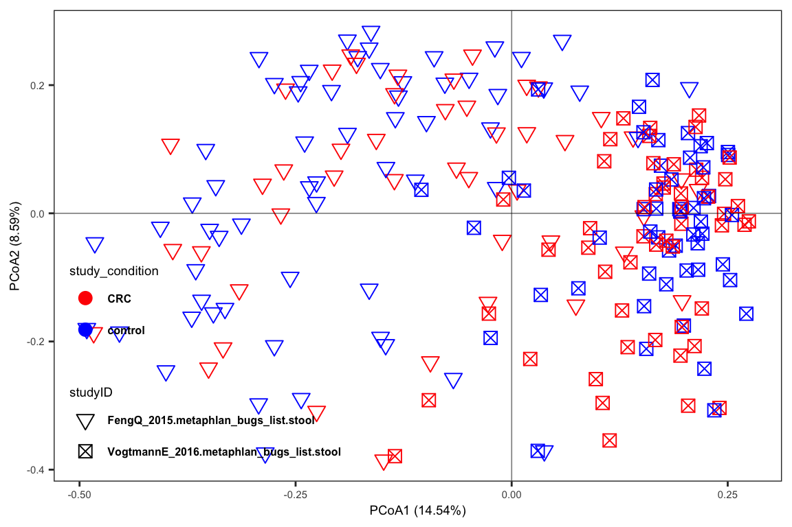
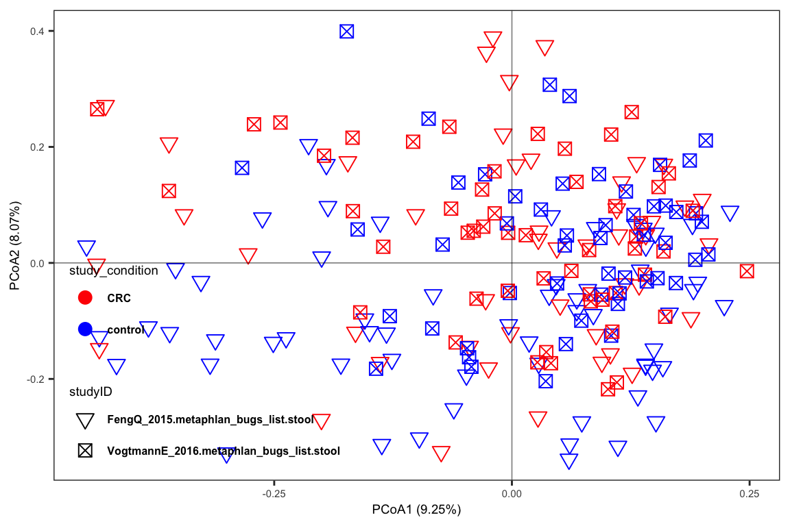

# Batch Effect Correction {#BatchEffectCorrection}

批次效应是除处理其他因素带来的影响实验结果的效应，比如在研究对照组和实验组时候，提取样本DNA时间不同、送测仪器不同等均可能引入批次效应。批次效应不能够消除，只可以降低，使得它对所研究的生物学问题有较小的影响。
评估批次效应可以通过PCA或PCoA等降纬可视化技术观察样本的聚集情况是否与非研究问题存在视觉上的相关性，也可以通过一些统计方法如PERMANOVA等计算表达谱整体水平和因素之间的关系。


## MMUPHin

通常在做多个研究或多个平台的数据整合需要考虑到消除不同研究或平台数据差异，在微生物领域又因为微生物相对丰度数据是稀疏的，所以常在转录组领域使用的校正方法如`sva::ComBat`和`limma::removeBatchEffect`等均不适用。

"MMUPHin"（Meta-analysis via Mixed Models Utilizing Public Health Information）是一个哈佛大学Huttenhover实验室开发的用于微生物组数据的统计分析包，特别是在研究与公共健康相关的多个研究的数据时使用。它在处理批次效应（batch effects）时的原理是基于混合模型（mixed models）。

在微生物组学研究中，批次效应是一个常见的问题。它指的是由于样本处理和测序过程中的技术变异而导致的非生物学差异，这些差异可能会干扰真实的生物学信号。例如，不同的实验室使用不同的样本处理方法或测序平台，可能导致数据之间的系统性差异。


MMUPHin处理批次效应的原理：

+ 混合模型：MMUPHin使用混合模型来纳入批次效应。在这种模型中，批次效应被视为随机效应，它们与研究中的固定效应（例如治疗组与对照组）分开处理。

+ 元分析方法：MMUPHin利用元分析的技术，允许来自不同研究的数据共同分析。元分析是一种统计方法，它综合并分析多个研究的结果，以获得更广泛、更全面的结论。

+ 数据整合：通过混合模型和元分析方法，MMUPHin能够在考虑批次效应的同时，整合多个研究的数据，提高分析的统计能力和结论的泛化性。

+ 校正批次效应：通过在模型中包括批次效应作为一个变量，MMUPHin可以校正这些非生物学差异，从而使研究结果更加可靠和准确。


### 加载依赖包和数据


+ 数据来源是 `curatedMetagenomicData` R包


```r
knitr::opts_chunk$set(message = FALSE, warning = FALSE)

library(tidyverse)

# if (!requireNamespace("BiocManager", quietly = TRUE))
#     install.packages("BiocManager")
# BiocManager::install("MMUPHin")

library(MMUPHin)
library(ggplot2)
library(phyloseq)

data("CRC_abd", "CRC_meta")
CRC_abd[1:5, 1, drop = FALSE]
#>                                 FengQ_2015.metaphlan_bugs_list.stool:SID31004
#> s__Faecalibacterium_prausnitzii                                    0.11110668
#> s__Streptococcus_salivarius                                        0.09660736
#> s__Ruminococcus_sp_5_1_39BFAA                                      0.09115385
#> s__Subdoligranulum_unclassified                                    0.05806767
#> s__Bacteroides_stercoris                                           0.05685503
# CRC_meta[1, 1:5]
```


### 数据探索

使用`MicrobiomeAnalysis::run_ord`和`MicrobiomeAnalysis::plot_ord`可视化数据，选择PCoA的方法。

+ 安装MicrobiomeAnalysis包
```R
if (!requireNamespace(c("remotes", "devtools"), quietly=TRUE)) {
  install.packages(c("devtools", "remotes"))
}
remotes::install_github("HuaZou/MicrobiomeAnalysis")
```


```r
# run_ord需要phyloseq object
rownames(CRC_meta) <- make.names(rownames(CRC_meta))
colnames(CRC_abd) <- make.names(colnames(CRC_abd))
rownames(CRC_abd) <- make.names(rownames(CRC_abd))
tax_tab <- data.frame(Species = rownames(CRC_abd))
rownames(tax_tab) <- tax_tab$Species

CRC_phy <- phyloseq::phyloseq(
  sample_data(CRC_meta),
  otu_table(CRC_abd, taxa_are_rows = TRUE),
  tax_table(as.matrix(tax_tab))
)

# 选择两个研究
CRC_phy_new <- CRC_phy
phyloseq::sample_data(CRC_phy_new) <- phyloseq::sample_data(
  CRC_phy@sam_data %>%
    data.frame() %>%
    dplyr::filter(studyID %in% c("FengQ_2015.metaphlan_bugs_list.stool",
                                 "VogtmannE_2016.metaphlan_bugs_list.stool"))) 
# 运行
ord_result <- MicrobiomeAnalysis::run_ord(
  object = CRC_phy_new,
  variable = "study_condition",
  method = "PCoA")
MicrobiomeAnalysis::plot_ord(
  reslist = ord_result,
  variable = "study_condition",
  variable_color = c("red", "blue"),
  var_shape = "studyID",
  ellipse_type = "none")
```



结果：能明显看到样本以`studyID`分散开来，研究之间的批次效应要远远大于control和CRC的生物学效应，接下来我们通过PERMANOVA做统计分析进一步评估显著性。


```r
MicrobiomeAnalysis::run_PERMANOVA(
  CRC_phy_new,
  variables = c("study_condition", "studyID"),
  mode = "one",
  method = "bray")
#>                 SumsOfSample Df SumsOfSqs   MeanSqs
#> study_condition          211  1 0.6756486 0.6756486
#> studyID                  211  1 5.6815343 5.6815343
#>                   F.Model         R2 Pr(>F) AdjustedPvalue
#> study_condition  2.295539 0.01086411  0.004          0.004
#> studyID         21.013183 0.09135643  0.001          0.002
```
结果：PERMANOVA的`Pr(>F)` < 0.05表明study_condition和studyID均与整体肠道微生物结构有显著差异，也说明studyID的批次效应(_对肠道结构解释9.1%的变异_)对后续study_condition的差异研究等具有非常大的影响，因此需要做批次校正。


### 批次效应校正

需要明确的一点是批次效应只能降低，不能完全消除，并且在做批次效应过程中可能会降低或提高所研究的生物学意义，这是因为使用线性模型校正所带来的结果。MMUPHin处理批次效应的原理：

+ 混合模型：MMUPHin使用混合模型来纳入批次效应。在这种模型中，批次效应被视为随机效应，它们与研究中的固定效应（例如治疗组与对照组）分开处理。

混合模型可以参考[GEE and MLM](https://zouhua.top/DraftNotes/GEEandMLM.html)，它提供了常用的两种混合模型GEE和MLM。MMUPHin采用的是**Zero-inflated empirical Bayes adjustment of batch effect in compositional feature abundance data**。


```r
fit_adjust_batch <- adjust_batch(
  feature_abd = CRC_abd,
  batch = "studyID",
  covariates = "study_condition",
  data = CRC_meta,
  control = list(verbose = FALSE))

CRC_abd_adj <- fit_adjust_batch$feature_abd_adj

CRC_abd_adj[1:5, 1, drop = FALSE]
#>                                 FengQ_2015.metaphlan_bugs_list.stool.SID31004
#> s__Faecalibacterium_prausnitzii                                    0.10120482
#> s__Streptococcus_salivarius                                        0.06044265
#> s__Ruminococcus_sp_5_1_39BFAA                                      0.02374596
#> s__Subdoligranulum_unclassified                                    0.03265566
#> s__Bacteroides_stercoris                                           0.31510103
```

查看校正后的结果


```r
# run_ord需要phyloseq object
rownames(CRC_meta) <- make.names(rownames(CRC_meta))
colnames(CRC_abd_adj) <- make.names(colnames(CRC_abd_adj))
rownames(CRC_abd_adj) <- make.names(rownames(CRC_abd_adj))
tax_tab_adj <- data.frame(Species = rownames(CRC_abd_adj))
rownames(tax_tab_adj) <- tax_tab_adj$Species

CRC_phy_adj <- phyloseq::phyloseq(
  sample_data(CRC_meta),
  otu_table(CRC_abd_adj, taxa_are_rows = TRUE),
  tax_table(as.matrix(tax_tab_adj))
)

# 选择两个研究
CRC_phy_adj_new <- CRC_phy_adj
phyloseq::sample_data(CRC_phy_adj_new) <- phyloseq::sample_data(
  CRC_phy_adj@sam_data %>%
    data.frame() %>%
    dplyr::filter(studyID %in% c("FengQ_2015.metaphlan_bugs_list.stool",
                                 "VogtmannE_2016.metaphlan_bugs_list.stool"))) 
# 运行
ord_result <- MicrobiomeAnalysis::run_ord(
  object = CRC_phy_adj_new,
  variable = "study_condition",
  method = "PCoA")
MicrobiomeAnalysis::plot_ord(
  reslist = ord_result,
  variable = "study_condition",
  variable_color = c("red", "blue"),
  var_shape = "studyID",
  ellipse_type = "none")
```



结果：相比校正前，studyID带来的效应明显降低。进一步通过PERMANOVA结果分析。


```r
MicrobiomeAnalysis::run_PERMANOVA(
  CRC_phy_adj_new,
  variables = c("study_condition", "studyID"),
  mode = "one",
  method = "bray")
#>                 SumsOfSample Df SumsOfSqs   MeanSqs
#> study_condition          211  1 0.7256598 0.7256598
#> studyID                  211  1 1.0133205 1.0133205
#>                  F.Model         R2 Pr(>F) AdjustedPvalue
#> study_condition 2.511293 0.01187309  0.002          0.002
#> studyID         3.523584 0.01657973  0.001          0.002
```

结果：相比校正前，studyID的解释肠道结构总体变异度从9.1%降低到了1.7%。与此同时，study_condition的总体变异则几乎没有太大变化。


### 荟萃分析

荟萃分析的目的是汇总各个研究的共同结果进而获得一个共有的效果，先前也有很多工具提供类似的研究，例如meta包。MMUPHin也提供了`lm_meta`函数用于分析。

+ 先用Maaslin2计算不同研究在control和CRC之间的差异物种；

+ 再使用混合模型汇总所有的结果。

因为采用了线性回归方式，所以可以加入一些协变量如年龄、性别和BMI等人口统计变量作为校正因素。coef表示EffectSize也即是在Control和CRC组间的区别。


```r
if(!dir.exists("./InputData/MMUPHin_lm_meta")) {
  dir.create("./InputData/MMUPHin_lm_meta", recursive = TRUE)
}

fit_lm_meta <- lm_meta(
  feature_abd = CRC_abd_adj,
  batch = "studyID",
  exposure = "study_condition",
  covariates = c("gender", "age", "BMI"),
  data = CRC_meta,
  control = list(verbose = FALSE, 
                 output = "./InputData/MMUPHin_lm_meta"))

fit_lm_meta$meta_fits %>% 
  filter(qval.fdr < 0.05) %>% 
  arrange(coef) %>% 
  mutate(feature = factor(feature, levels = feature)) %>% 
  ggplot(aes(y = coef, x = feature)) +
  geom_bar(stat = "identity") +
  coord_flip() +
  theme_bw()
```


### 总结

+ MMUPHin提供了可以校正多个数据来源的批次效应函数

+ MMUPHin在做荟萃分析的时提供了工具


## Systemic information

```r
devtools::session_info()
#> ─ Session info ───────────────────────────────────────────
#>  setting  value
#>  version  R version 4.3.1 (2023-06-16)
#>  os       macOS Monterey 12.2.1
#>  system   x86_64, darwin20
#>  ui       X11
#>  language (EN)
#>  collate  en_US.UTF-8
#>  ctype    en_US.UTF-8
#>  tz       Asia/Shanghai
#>  date     2024-02-06
#>  pandoc   3.1.3 @ /Users/zouhua/opt/anaconda3/bin/ (via rmarkdown)
#> 
#> ─ Packages ───────────────────────────────────────────────
#>  package                  * version    date (UTC) lib source
#>  abind                      1.4-5      2016-07-21 [1] CRAN (R 4.3.0)
#>  ade4                       1.7-22     2023-02-06 [1] CRAN (R 4.3.0)
#>  ANCOMBC                    2.4.0      2023-10-24 [1] Bioconductor
#>  ape                        5.7-1      2023-03-13 [1] CRAN (R 4.3.0)
#>  backports                  1.4.1      2021-12-13 [1] CRAN (R 4.3.0)
#>  base64enc                  0.1-3      2015-07-28 [1] CRAN (R 4.3.0)
#>  beachmat                   2.18.0     2023-10-24 [1] Bioconductor
#>  beeswarm                   0.4.0      2021-06-01 [1] CRAN (R 4.3.0)
#>  biglm                      0.9-2.1    2020-11-27 [1] CRAN (R 4.3.0)
#>  Biobase                    2.62.0     2023-10-24 [1] Bioconductor
#>  BiocGenerics               0.48.1     2023-11-01 [1] Bioconductor
#>  BiocNeighbors              1.20.2     2024-01-07 [1] Bioconductor 3.18 (R 4.3.2)
#>  BiocParallel               1.36.0     2023-10-24 [1] Bioconductor
#>  BiocSingular               1.18.0     2023-10-24 [1] Bioconductor
#>  biomformat                 1.30.0     2023-10-24 [1] Bioconductor
#>  Biostrings                 2.70.2     2024-01-28 [1] Bioconductor 3.18 (R 4.3.2)
#>  bit                        4.0.5      2022-11-15 [1] CRAN (R 4.3.0)
#>  bit64                      4.0.5      2020-08-30 [1] CRAN (R 4.3.0)
#>  bitops                     1.0-7      2021-04-24 [1] CRAN (R 4.3.0)
#>  blob                       1.2.4      2023-03-17 [1] CRAN (R 4.3.0)
#>  bluster                    1.12.0     2023-10-24 [1] Bioconductor
#>  bookdown                   0.37       2023-12-01 [1] CRAN (R 4.3.0)
#>  boot                       1.3-28.1   2022-11-22 [1] CRAN (R 4.3.1)
#>  bslib                      0.6.1      2023-11-28 [1] CRAN (R 4.3.0)
#>  cachem                     1.0.8      2023-05-01 [1] CRAN (R 4.3.0)
#>  caTools                    1.18.2     2021-03-28 [1] CRAN (R 4.3.0)
#>  cellranger                 1.1.0      2016-07-27 [1] CRAN (R 4.3.0)
#>  checkmate                  2.3.1      2023-12-04 [1] CRAN (R 4.3.0)
#>  class                      7.3-22     2023-05-03 [1] CRAN (R 4.3.1)
#>  cli                        3.6.2      2023-12-11 [1] CRAN (R 4.3.0)
#>  cluster                    2.1.4      2022-08-22 [1] CRAN (R 4.3.1)
#>  codetools                  0.2-19     2023-02-01 [1] CRAN (R 4.3.1)
#>  colorspace                 2.1-0      2023-01-23 [1] CRAN (R 4.3.0)
#>  cowplot                    1.1.3      2024-01-22 [1] CRAN (R 4.3.2)
#>  crayon                     1.5.2      2022-09-29 [1] CRAN (R 4.3.0)
#>  CVXR                       1.0-12     2024-02-02 [1] CRAN (R 4.3.2)
#>  data.table                 1.15.0     2024-01-30 [1] CRAN (R 4.3.2)
#>  DBI                        1.2.1      2024-01-12 [1] CRAN (R 4.3.0)
#>  DECIPHER                   2.30.0     2023-10-24 [1] Bioconductor
#>  decontam                   1.22.0     2023-10-24 [1] Bioconductor
#>  DelayedArray               0.28.0     2023-10-24 [1] Bioconductor
#>  DelayedMatrixStats         1.24.0     2023-10-24 [1] Bioconductor
#>  DEoptimR                   1.1-3      2023-10-07 [1] CRAN (R 4.3.0)
#>  DescTools                  0.99.54    2024-02-03 [1] CRAN (R 4.3.2)
#>  DESeq2                     1.42.0     2023-10-24 [1] Bioconductor
#>  devtools                   2.4.5      2022-10-11 [1] CRAN (R 4.3.0)
#>  digest                     0.6.34     2024-01-11 [1] CRAN (R 4.3.0)
#>  DirichletMultinomial       1.44.0     2023-10-24 [1] Bioconductor
#>  doParallel                 1.0.17     2022-02-07 [1] CRAN (R 4.3.0)
#>  doRNG                      1.8.6      2023-01-16 [1] CRAN (R 4.3.0)
#>  downlit                    0.4.3      2023-06-29 [1] CRAN (R 4.3.0)
#>  dplyr                    * 1.1.4      2023-11-17 [1] CRAN (R 4.3.0)
#>  e1071                      1.7-14     2023-12-06 [1] CRAN (R 4.3.0)
#>  ellipsis                   0.3.2      2021-04-29 [1] CRAN (R 4.3.0)
#>  energy                     1.7-11     2022-12-22 [1] CRAN (R 4.3.0)
#>  evaluate                   0.23       2023-11-01 [1] CRAN (R 4.3.0)
#>  Exact                      3.2        2022-09-25 [1] CRAN (R 4.3.0)
#>  expm                       0.999-9    2024-01-11 [1] CRAN (R 4.3.0)
#>  fansi                      1.0.6      2023-12-08 [1] CRAN (R 4.3.0)
#>  farver                     2.1.1      2022-07-06 [1] CRAN (R 4.3.0)
#>  fastmap                    1.1.1      2023-02-24 [1] CRAN (R 4.3.0)
#>  forcats                  * 1.0.0      2023-01-29 [1] CRAN (R 4.3.0)
#>  foreach                    1.5.2      2022-02-02 [1] CRAN (R 4.3.0)
#>  foreign                    0.8-84     2022-12-06 [1] CRAN (R 4.3.1)
#>  Formula                    1.2-5      2023-02-24 [1] CRAN (R 4.3.0)
#>  fs                         1.6.3      2023-07-20 [1] CRAN (R 4.3.0)
#>  generics                   0.1.3      2022-07-05 [1] CRAN (R 4.3.0)
#>  GenomeInfoDb               1.38.5     2023-12-28 [1] Bioconductor 3.18 (R 4.3.2)
#>  GenomeInfoDbData           1.2.11     2024-01-24 [1] Bioconductor
#>  GenomicRanges              1.54.1     2023-10-29 [1] Bioconductor
#>  getopt                     1.20.4     2023-10-01 [1] CRAN (R 4.3.0)
#>  ggbeeswarm                 0.7.2      2023-04-29 [1] CRAN (R 4.3.0)
#>  ggplot2                  * 3.4.4      2023-10-12 [1] CRAN (R 4.3.0)
#>  ggrepel                    0.9.5      2024-01-10 [1] CRAN (R 4.3.0)
#>  gld                        2.6.6      2022-10-23 [1] CRAN (R 4.3.0)
#>  glmnet                     4.1-8      2023-08-22 [1] CRAN (R 4.3.0)
#>  glue                       1.7.0      2024-01-09 [1] CRAN (R 4.3.0)
#>  gmp                        0.7-4      2024-01-15 [1] CRAN (R 4.3.0)
#>  gplots                     3.1.3.1    2024-02-02 [1] CRAN (R 4.3.2)
#>  gridExtra                  2.3        2017-09-09 [1] CRAN (R 4.3.0)
#>  gsl                        2.1-8      2023-01-24 [1] CRAN (R 4.3.0)
#>  gtable                     0.3.4      2023-08-21 [1] CRAN (R 4.3.0)
#>  gtools                     3.9.5      2023-11-20 [1] CRAN (R 4.3.0)
#>  hash                       2.2.6.3    2023-08-19 [1] CRAN (R 4.3.0)
#>  highr                      0.10       2022-12-22 [1] CRAN (R 4.3.0)
#>  Hmisc                      5.1-1      2023-09-12 [1] CRAN (R 4.3.0)
#>  hms                        1.1.3      2023-03-21 [1] CRAN (R 4.3.0)
#>  htmlTable                  2.4.2      2023-10-29 [1] CRAN (R 4.3.0)
#>  htmltools                  0.5.7      2023-11-03 [1] CRAN (R 4.3.0)
#>  htmlwidgets                1.6.4      2023-12-06 [1] CRAN (R 4.3.0)
#>  httpuv                     1.6.14     2024-01-26 [1] CRAN (R 4.3.2)
#>  httr                       1.4.7      2023-08-15 [1] CRAN (R 4.3.0)
#>  igraph                     2.0.1.1    2024-01-30 [1] CRAN (R 4.3.2)
#>  IRanges                    2.36.0     2023-10-24 [1] Bioconductor
#>  irlba                      2.3.5.1    2022-10-03 [1] CRAN (R 4.3.0)
#>  iterators                  1.0.14     2022-02-05 [1] CRAN (R 4.3.0)
#>  jquerylib                  0.1.4      2021-04-26 [1] CRAN (R 4.3.0)
#>  jsonlite                   1.8.8      2023-12-04 [1] CRAN (R 4.3.0)
#>  KernSmooth                 2.23-21    2023-05-03 [1] CRAN (R 4.3.1)
#>  knitr                      1.45       2023-10-30 [1] CRAN (R 4.3.0)
#>  labeling                   0.4.3      2023-08-29 [1] CRAN (R 4.3.0)
#>  later                      1.3.2      2023-12-06 [1] CRAN (R 4.3.0)
#>  lattice                    0.21-8     2023-04-05 [1] CRAN (R 4.3.1)
#>  lazyeval                   0.2.2      2019-03-15 [1] CRAN (R 4.3.0)
#>  lifecycle                  1.0.4      2023-11-07 [1] CRAN (R 4.3.0)
#>  limma                      3.58.1     2023-10-31 [1] Bioconductor
#>  lme4                       1.1-35.1   2023-11-05 [1] CRAN (R 4.3.0)
#>  lmerTest                   3.1-3      2020-10-23 [1] CRAN (R 4.3.0)
#>  lmom                       3.0        2023-08-29 [1] CRAN (R 4.3.0)
#>  locfit                     1.5-9.8    2023-06-11 [1] CRAN (R 4.3.0)
#>  logging                    0.10-108   2019-07-14 [1] CRAN (R 4.3.0)
#>  lpsymphony                 1.30.0     2023-10-24 [1] Bioconductor (R 4.3.1)
#>  lubridate                * 1.9.3      2023-09-27 [1] CRAN (R 4.3.0)
#>  Maaslin2                   1.7.3      2024-01-24 [1] Bioconductor
#>  magrittr                   2.0.3      2022-03-30 [1] CRAN (R 4.3.0)
#>  MASS                       7.3-60     2023-05-04 [1] CRAN (R 4.3.1)
#>  mathjaxr                   1.6-0      2022-02-28 [1] CRAN (R 4.3.0)
#>  Matrix                     1.6-5      2024-01-11 [1] CRAN (R 4.3.0)
#>  MatrixGenerics             1.14.0     2023-10-24 [1] Bioconductor
#>  matrixStats                1.2.0      2023-12-11 [1] CRAN (R 4.3.0)
#>  memoise                    2.0.1      2021-11-26 [1] CRAN (R 4.3.0)
#>  metadat                    1.2-0      2022-04-06 [1] CRAN (R 4.3.0)
#>  metafor                    4.4-0      2023-09-27 [1] CRAN (R 4.3.0)
#>  metagenomeSeq              1.43.0     2023-04-25 [1] Bioconductor
#>  mgcv                       1.8-42     2023-03-02 [1] CRAN (R 4.3.1)
#>  mia                        1.10.0     2023-10-24 [1] Bioconductor
#>  MicrobiomeAnalysis         1.0.3      2024-02-06 [1] Github (HuaZou/MicrobiomeAnalysis@fd2a6a2)
#>  mime                       0.12       2021-09-28 [1] CRAN (R 4.3.0)
#>  miniUI                     0.1.1.1    2018-05-18 [1] CRAN (R 4.3.0)
#>  minqa                      1.2.6      2023-09-11 [1] CRAN (R 4.3.0)
#>  MMUPHin                  * 1.16.0     2023-10-24 [1] Bioconductor
#>  multcomp                   1.4-25     2023-06-20 [1] CRAN (R 4.3.0)
#>  MultiAssayExperiment       1.28.0     2023-10-24 [1] Bioconductor
#>  multtest                   2.58.0     2023-10-24 [1] Bioconductor
#>  munsell                    0.5.0      2018-06-12 [1] CRAN (R 4.3.0)
#>  mvtnorm                    1.2-4      2023-11-27 [1] CRAN (R 4.3.0)
#>  nlme                       3.1-162    2023-01-31 [1] CRAN (R 4.3.1)
#>  nloptr                     2.0.3      2022-05-26 [1] CRAN (R 4.3.0)
#>  nnet                       7.3-19     2023-05-03 [1] CRAN (R 4.3.1)
#>  numDeriv                   2016.8-1.1 2019-06-06 [1] CRAN (R 4.3.0)
#>  optparse                   1.7.4      2024-01-16 [1] CRAN (R 4.3.0)
#>  pbapply                    1.7-2      2023-06-27 [1] CRAN (R 4.3.0)
#>  pcaPP                      2.0-4      2023-12-07 [1] CRAN (R 4.3.0)
#>  permute                    0.9-7      2022-01-27 [1] CRAN (R 4.3.0)
#>  phyloseq                 * 1.46.0     2023-10-24 [1] Bioconductor
#>  pillar                     1.9.0      2023-03-22 [1] CRAN (R 4.3.0)
#>  pkgbuild                   1.4.3      2023-12-10 [1] CRAN (R 4.3.0)
#>  pkgconfig                  2.0.3      2019-09-22 [1] CRAN (R 4.3.0)
#>  pkgload                    1.3.4      2024-01-16 [1] CRAN (R 4.3.0)
#>  plyr                       1.8.9      2023-10-02 [1] CRAN (R 4.3.0)
#>  profvis                    0.3.8      2023-05-02 [1] CRAN (R 4.3.0)
#>  promises                   1.2.1      2023-08-10 [1] CRAN (R 4.3.0)
#>  proxy                      0.4-27     2022-06-09 [1] CRAN (R 4.3.0)
#>  purrr                    * 1.0.2      2023-08-10 [1] CRAN (R 4.3.0)
#>  R6                         2.5.1      2021-08-19 [1] CRAN (R 4.3.0)
#>  ragg                       1.2.7      2023-12-11 [1] CRAN (R 4.3.0)
#>  rbibutils                  2.2.16     2023-10-25 [1] CRAN (R 4.3.0)
#>  RColorBrewer               1.1-3      2022-04-03 [1] CRAN (R 4.3.0)
#>  Rcpp                       1.0.12     2024-01-09 [1] CRAN (R 4.3.0)
#>  RCurl                      1.98-1.14  2024-01-09 [1] CRAN (R 4.3.0)
#>  Rdpack                     2.6        2023-11-08 [1] CRAN (R 4.3.0)
#>  readr                    * 2.1.5      2024-01-10 [1] CRAN (R 4.3.0)
#>  readxl                     1.4.3      2023-07-06 [1] CRAN (R 4.3.0)
#>  remotes                    2.4.2.1    2023-07-18 [1] CRAN (R 4.3.0)
#>  reshape2                   1.4.4      2020-04-09 [1] CRAN (R 4.3.0)
#>  rhdf5                      2.46.1     2023-11-29 [1] Bioconductor
#>  rhdf5filters               1.14.1     2023-11-06 [1] Bioconductor
#>  Rhdf5lib                   1.24.1     2023-12-12 [1] Bioconductor 3.18 (R 4.3.2)
#>  rlang                      1.1.3      2024-01-10 [1] CRAN (R 4.3.0)
#>  rmarkdown                  2.25       2023-09-18 [1] CRAN (R 4.3.0)
#>  Rmpfr                      0.9-5      2024-01-21 [1] CRAN (R 4.3.0)
#>  rngtools                   1.5.2      2021-09-20 [1] CRAN (R 4.3.0)
#>  robustbase                 0.99-1     2023-11-29 [1] CRAN (R 4.3.0)
#>  rootSolve                  1.8.2.4    2023-09-21 [1] CRAN (R 4.3.0)
#>  rpart                      4.1.19     2022-10-21 [1] CRAN (R 4.3.1)
#>  RSQLite                    2.3.5      2024-01-21 [1] CRAN (R 4.3.0)
#>  rstudioapi                 0.15.0     2023-07-07 [1] CRAN (R 4.3.0)
#>  rsvd                       1.0.5      2021-04-16 [1] CRAN (R 4.3.0)
#>  S4Arrays                   1.2.0      2023-10-24 [1] Bioconductor
#>  S4Vectors                  0.40.2     2023-11-23 [1] Bioconductor
#>  sandwich                   3.1-0      2023-12-11 [1] CRAN (R 4.3.0)
#>  sass                       0.4.8      2023-12-06 [1] CRAN (R 4.3.0)
#>  ScaledMatrix               1.10.0     2023-10-24 [1] Bioconductor
#>  scales                     1.3.0      2023-11-28 [1] CRAN (R 4.3.0)
#>  scater                     1.30.1     2023-12-06 [1] Bioconductor
#>  scuttle                    1.12.0     2023-10-24 [1] Bioconductor
#>  sessioninfo                1.2.2      2021-12-06 [1] CRAN (R 4.3.0)
#>  shape                      1.4.6      2021-05-19 [1] CRAN (R 4.3.0)
#>  shiny                      1.8.0      2023-11-17 [1] CRAN (R 4.3.0)
#>  SingleCellExperiment       1.24.0     2023-10-24 [1] Bioconductor
#>  SparseArray                1.2.3      2023-12-25 [1] Bioconductor 3.18 (R 4.3.2)
#>  sparseMatrixStats          1.14.0     2023-10-24 [1] Bioconductor
#>  statmod                    1.5.0      2023-01-06 [1] CRAN (R 4.3.0)
#>  stringi                    1.8.3      2023-12-11 [1] CRAN (R 4.3.0)
#>  stringr                  * 1.5.1      2023-11-14 [1] CRAN (R 4.3.0)
#>  SummarizedExperiment       1.32.0     2023-10-24 [1] Bioconductor
#>  survival                   3.5-5      2023-03-12 [1] CRAN (R 4.3.1)
#>  systemfonts                1.0.5      2023-10-09 [1] CRAN (R 4.3.0)
#>  textshaping                0.3.7      2023-10-09 [1] CRAN (R 4.3.0)
#>  TH.data                    1.1-2      2023-04-17 [1] CRAN (R 4.3.0)
#>  tibble                   * 3.2.1      2023-03-20 [1] CRAN (R 4.3.0)
#>  tidyr                    * 1.3.1      2024-01-24 [1] CRAN (R 4.3.2)
#>  tidyselect                 1.2.0      2022-10-10 [1] CRAN (R 4.3.0)
#>  tidytree                   0.4.6      2023-12-12 [1] CRAN (R 4.3.0)
#>  tidyverse                * 2.0.0      2023-02-22 [1] CRAN (R 4.3.0)
#>  timechange                 0.3.0      2024-01-18 [1] CRAN (R 4.3.0)
#>  treeio                     1.26.0     2023-10-24 [1] Bioconductor
#>  TreeSummarizedExperiment   2.10.0     2023-10-24 [1] Bioconductor
#>  tzdb                       0.4.0      2023-05-12 [1] CRAN (R 4.3.0)
#>  urlchecker                 1.0.1      2021-11-30 [1] CRAN (R 4.3.0)
#>  usethis                    2.2.2      2023-07-06 [1] CRAN (R 4.3.0)
#>  utf8                       1.2.4      2023-10-22 [1] CRAN (R 4.3.0)
#>  vctrs                      0.6.5      2023-12-01 [1] CRAN (R 4.3.0)
#>  vegan                      2.6-4      2022-10-11 [1] CRAN (R 4.3.0)
#>  vipor                      0.4.7      2023-12-18 [1] CRAN (R 4.3.0)
#>  viridis                    0.6.5      2024-01-29 [1] CRAN (R 4.3.2)
#>  viridisLite                0.4.2      2023-05-02 [1] CRAN (R 4.3.0)
#>  withr                      3.0.0      2024-01-16 [1] CRAN (R 4.3.0)
#>  Wrench                     1.20.0     2023-10-24 [1] Bioconductor
#>  xfun                       0.41       2023-11-01 [1] CRAN (R 4.3.0)
#>  xml2                       1.3.6      2023-12-04 [1] CRAN (R 4.3.0)
#>  xtable                     1.8-4      2019-04-21 [1] CRAN (R 4.3.0)
#>  XVector                    0.42.0     2023-10-24 [1] Bioconductor
#>  yaml                       2.3.8      2023-12-11 [1] CRAN (R 4.3.0)
#>  yulab.utils                0.1.4      2024-01-28 [1] CRAN (R 4.3.2)
#>  zlibbioc                   1.48.0     2023-10-24 [1] Bioconductor
#>  zoo                        1.8-12     2023-04-13 [1] CRAN (R 4.3.0)
#> 
#>  [1] /Library/Frameworks/R.framework/Versions/4.3-x86_64/Resources/library
#> 
#> ──────────────────────────────────────────────────────────
```


## Reference

+ [MMUPHin](https://huttenhower.sph.harvard.edu/mmuphin)

+ [Doing Meta-Analysis with R: A Hands-On Guide](https://bookdown.org/MathiasHarrer/Doing_Meta_Analysis_in_R/)
