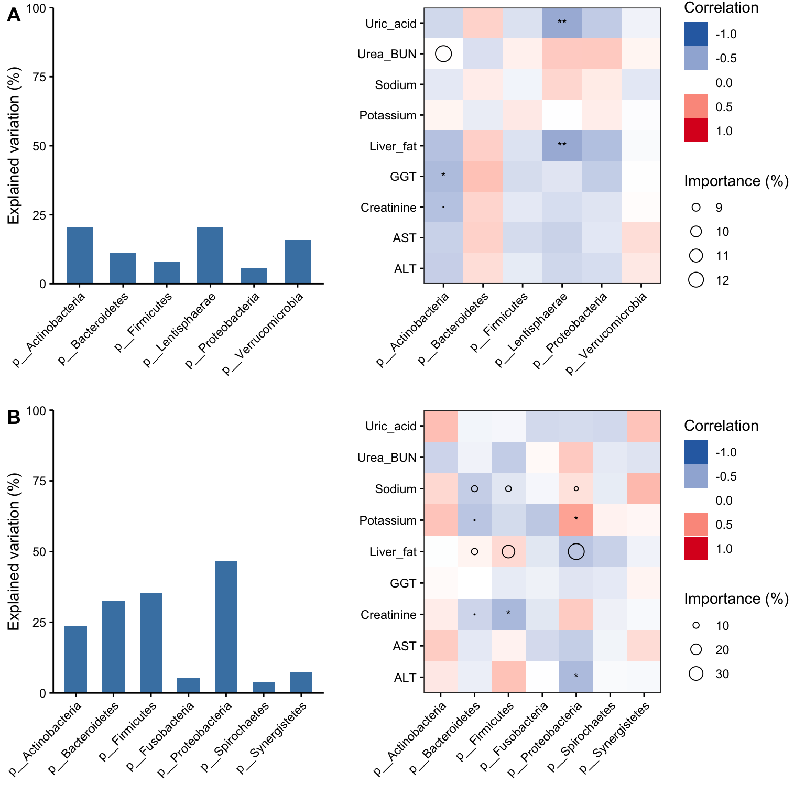

# Linear Model on Microbial Community {#LinearModelonMicrobialCommunity}


在微生物研究中，通常会使用基于距离矩阵的置换检验（如PERMANOVA）判断环境因素和微生物群落结构的相关性关系。本文使用另一套分析方法计算环境因素对微生物群落差异和微生物相对丰度差异的贡献，它使用到的是：

+ 相关性分析：计算环境因素和各个物种相对丰度的相关性大小；

+ 多元线性回归分析：计算主要的环境因素对各个物种相对丰度的贡献（$R^2$）；

+ 拆分线性回归的总体贡献：计算每一个环境因素对各个物种相对丰度的重要程度（类似方差解分析）。


本文为了确定影响微生物（肠道和口腔）群落差异和微生物相对丰度差异的人体特征变量。


**声明**：本文参考了小白鱼的《仿一篇文献的相关性分析和线性模型评估影响群落组成的重要环境变量》。


## 加载R包


```r
knitr::opts_chunk$set(message = FALSE, warning = FALSE)
library(tidyverse)
library(phyloseq)

library(caret)
library(leaps)
library(relaimpo)

# rm(list = ls())
options(stringsAsFactors = F)
options(future.globals.maxSize = 1000 * 1024^2)
```


## 导入数据

对数据[OmicsDataSet-Zeybel et al. - 2022.xlsx](https://github.com/HuaZou/DraftNotes/blob/main/InputData/Zeybel-2022/OmicsDataSet-Zeybel et al. - 2022.xlsx)处理后生成的，可参考数据生成和预处理章节。


+ ps_gut：来自宿主肠道微生物组 (见[Zeybel Dataset](https://zouhua.top/DraftNotes/ZeybelDataset.html)章节)

+ ps_oral：来自宿主肠道微生物组 (见[Zeybel Dataset](https://zouhua.top/DraftNotes/ZeybelDataset.html)章节)

> ```R
> saveRDS(ps_gut, "./InputData/result/Zeybel_2022_gut_MGS_ps.RDS", compress = TRUE)
> saveRDS(ps_ora, "./InputData/result/Zeybel_2022_oral_MGS_ps.RDS", compress = TRUE)
> ```


```r
ps_gut <- readRDS("./InputData/result/Zeybel_2022_gut_MGS_ps.RDS")
ps_oral <- readRDS("./InputData/result/Zeybel_2022_oral_MGS_ps.RDS")
```


## 数据准备

+ 人体特征指标：如Liver_fat, Creatinine, Body_mass_index等

+ 门水平微生物表达谱：phylum levels


```r
meta_gut <- ps_gut@sam_data %>%
  data.frame() %>%
  na.omit() %>%
  dplyr::select(6:14)

meta_oral <- ps_oral@sam_data %>%
  data.frame() %>%
  na.omit() %>%
  dplyr::select(6:14)

sid <- intersect(rownames(meta_gut), rownames(meta_oral))

# remotes::install_github("HuaZou/MicrobiomeAnalysis")
prof_gut <- MicrobiomeAnalysis::aggregate_taxa(
  x = ps_gut,
  level = "Phylum")
prof_gut <- MicrobiomeAnalysis::trim_prevalence(
  object = prof_gut,
  cutoff = 0.1,
  trim = "feature")
prof_gut <- prof_gut@otu_table %>%
  data.frame()
prof_gut_final <- prof_gut[, pmatch(sid, colnames(prof_gut))]

prof_oral <- MicrobiomeAnalysis::aggregate_taxa(
  x = ps_oral,
  level = "Phylum")
prof_oral <- MicrobiomeAnalysis::trim_prevalence(
  object = prof_oral,
  cutoff = 0.1,
  trim = "feature")
prof_oral <- prof_oral@otu_table %>%
  data.frame()
prof_oral_final <- prof_oral[, pmatch(sid, colnames(prof_oral))]

meta_final <- meta_oral[pmatch(sid, rownames(meta_oral)), ,]

rm(ps_gut, ps_oral, meta_gut, meta_oral, sid, prof_gut, prof_oral)
```


## 相关性分析

人体特征和物种相关性分析，分别计算每个人体特征和各个物种丰度的相关系数（采用spearman相关系数）。


```r
run_cor <- function(
    data_sam,
    data_otu,
    columns  = NULL,
    method = c("spearman", "pearson", "kendall"),
    p_adjust = c("none", "fdr", "bonferroni", "holm",
                 "hochberg", "hommel", "BH", "BY")) {

  # data_sam = meta_final
  # data_otu = prof_gut_final
  # columns = NULL
  # method = "spearman"
  # p_adjust = "BH"

  if (is.null(method)) {
    method <- "spearman"
  } else {
    method <- match.arg(
      method,
      c("spearman", "pearson", "kendall")
    )
  }
  # p_adjust
  p_adjust <- match.arg(p_adjust,
                        c("none", "fdr", "bonferroni", "holm",
                          "hochberg", "hommel", "BH", "BY")
  )

  interset_sampleid <- dplyr::intersect(
      colnames(data_otu), rownames(data_sam))

  data_otu_interset <- data_otu %>% 
    as.data.frame() %>%
    dplyr::select(dplyr::all_of(interset_sampleid))
  data_sam_interset <- data_sam %>% 
    as.data.frame()

  data_sam_interset_final <- data_sam_interset[pmatch(interset_sampleid, 
                                                      rownames(data_sam_interset)), , F]

  if (!all(colnames(data_otu_interset) == rownames(data_sam_interset_final))) {
    stop("The order of SampleID is wrong, please check your inputdata")
  }

  sam_tab <- data_sam_interset_final %>%
      as.data.frame() %>%
      tibble::rownames_to_column("TempRowNames")
  otu_tab_t <- data_otu_interset %>%
      as.data.frame() %>%
      base::t() %>%
      as.data.frame()

  # columns for test
  if (!is.null(columns)) {
    sam_tab <- sam_tab %>%
      tibble::column_to_rownames("TempRowNames") %>%
      dplyr::select(dplyr::all_of(columns))
  } else {
    sam_tab <- sam_tab %>%
      tibble::column_to_rownames("TempRowNames")    
  }

  if (!all(rownames(otu_tab_t) == rownames(sam_tab))) {
    stop("The order of SampleID is wrong, please check your input")
  }

  # calculate the association between individual taxa and factors
  res <- data.frame()
  for (i in 1:ncol(sam_tab)) {
    # whether all the elements are numeric
    if (!is.numeric(sam_tab[, i])) {
      stop("Please check your input, values in ", colnames(sam_tab)[i]," are not numeric")
    }
    for (j in 1:ncol(otu_tab_t)) {
      mdat <- data.frame(x=sam_tab[, i],
                         y=otu_tab_t[, j]) %>%
        na.omit()
      fit <- stats::cor.test(mdat$x, mdat$y, method = method)
      temp <- data.frame(Phenotype=colnames(sam_tab)[i],
                         FeatureID=colnames(otu_tab_t)[j],
                         Statistic=fit$statistic,
                         Rho=fit$estimate,
                         Pvalue=fit$p.value)
      res <- rbind(res, temp)
    }
  }

  res$AdjustedPvalue <- p.adjust(as.numeric(res$Pvalue), method = p_adjust)
  rownames(res) <- NULL

  return(res)
}

gut_corres <- run_cor(
  data_sam = meta_final,
  data_otu = prof_gut_final,
  p_adjust = "BH")

oral_corres <- run_cor(
  data_sam = meta_final,
  data_otu = prof_oral_final,
  p_adjust = "BH")

head(gut_corres[, 1:3], 2)
#>   Phenotype         FeatureID Statistic
#> 1 Liver_fat p__Actinobacteria      7914
#> 2 Liver_fat  p__Bacteroidetes      4858
```


## 线性回归分析

人体特征指标对各个物种的贡献度可通过多元线性回归分析，即物种作为Y响应变量，人体特征作为X变量，通过回归的$R^2$解析总解释度。

人体指标可能存在共线性的情况，可以在线性回归计算时候选择前向或后向回归方式筛选重要的变量。两种方法对结果影响较大，可能会得到大相径庭的结果。


### 选择变量分析思路


+ 通过前向选择变量的分析思路

> 1. 通过前向逐步回归，在所有人体特征变量筛选重要的变量，尽可能减少人体特征共线性以获取简约模型，又同时尽可能保证模型的总解释率不要损失很多；
>
> 2. 使用选择的人体特征变量，分别拟合与每个物种丰度的多元线性回归，以期通过人体特征变量来解释物种丰度组成的差异；
>
> 3. 对于在第（2）步中获得的最优模型，提取它们的总解释率（即线性模型的R2或校正后的R2）等信息；
>
> 4. 对于在第（2）步中获得的最优模型，通过类似方差分解分析的方法，评估主要的人体特征对于物种丰度总方差的贡献，实现定量分析主要的人体特征相对重要性的目的。


+ 通过后向选择变量的分析思路

> 1. 使用所有人体特征变量，分别拟合与每个物种丰度的多元线性回归，以期通过人体特征变量来解释物种丰度组成的差异；
>
> 2. 通过后向逐步回归，在构建好的每个线性模型中筛选重要的变量，尽可能减少人体特征变量共线性以获取简约模型，又同时尽可能保证模型的总解释率不要损失很多；
>
> 3. 对于在第（2）步中获得的最优模型，提取它们的总解释率（即线性模型的R2或校正后的R2）等信息；
>
> 4. 对于在第（2）步中获得的最优模型，通过类似方差分解分析的方法，评估主要的人体特征对于物种丰度总方差的贡献，实现定量分析主要的人体特征相对重要性的目的。


### 函数

method参数控制筛选变量的方向：

+ "leapForward": 前向逐步回归 (forward selection)

+ "leapBackward": 后向逐步回归 (backward selection)

+ "leapSeq": 逐步回归 (stepwise selection)


```r
run_lm <- function(
    data_sam,
    data_otu,
    columns  = NULL,
    method = c("leapForward", "leapBackward", "leapSeq")) {

  # data_sam = meta_final
  # data_otu = prof_gut_final
  # columns = NULL
  # method = "leapForward"

  if (is.null(method)) {
    method <- "leapForward"
  } else {
    method <- match.arg(
      method,
      c("leapForward", "leapBackward", "leapSeq")
    )
  }

  interset_sampleid <- dplyr::intersect(
      colnames(data_otu), rownames(data_sam))

  data_otu_interset <- data_otu %>% 
    as.data.frame() %>%
    dplyr::select(dplyr::all_of(interset_sampleid))
  data_sam_interset <- data_sam %>% 
    as.data.frame()

  data_sam_interset_final <- data_sam_interset[pmatch(interset_sampleid, 
                                                      rownames(data_sam_interset)), , F]

  if (!all(colnames(data_otu_interset) == rownames(data_sam_interset_final))) {
    stop("The order of SampleID is wrong, please check your inputdata")
  }

  sam_tab <- data_sam_interset_final %>%
      as.data.frame() %>%
      tibble::rownames_to_column("TempRowNames")
  otu_tab_t <- data_otu_interset %>%
      as.data.frame() %>%
      base::t() %>%
      as.data.frame()

  # columns for test
  if (!is.null(columns)) {
    sam_tab <- sam_tab %>%
      tibble::column_to_rownames("TempRowNames") %>%
      dplyr::select(dplyr::all_of(columns))
  } else {
    sam_tab <- sam_tab %>%
      tibble::column_to_rownames("TempRowNames")    
  }

  if (!all(rownames(otu_tab_t) == rownames(sam_tab))) {
    stop("The order of SampleID is wrong, please check your input")
  }
  
  LM_func <- function(dat, feature_name) {
    
    feature <- feature_name
    colnames(dat)[1] <- "Taxa"
    
    set.seed(123)
    
    # 变量选择
    train.control <- trainControl(method = "cv", number = 3)
    step.model <- train(Taxa ~., data = dat,
                        method = method, 
                        tuneGrid = data.frame(nvmax = 1:5),
                        trControl = train.control)
    
    model.coef <- coef(step.model$finalModel, as.numeric(step.model$bestTune)) %>%
      as.data.frame()
    final_index <- rownames(model.coef)[-1]
    
    # 基于上述选择的变量，使用 lm()拟合变量与各物种丰度的多元线性回归，获取最优模型
    if (length(final_index) < 1) {
      result_model <- data.frame(FeatureID = feature,
                                 R2 = NA,
                                 AdjustedR2 = NA,
                                 Pvalue = NA)
      result_import <- data.frame(TempID = colnames(dat)[-1],
                                 Value = NA) %>%
        tibble::column_to_rownames("TempID") %>%
        setNames(feature)
    } else {
      dat_new <- dat %>%
        dplyr::select(dplyr::all_of(c("Taxa", final_index)))
      lm_fit <- lm(Taxa ~., data = dat_new)
      lm_stat <- summary(lm_fit)
      R2 <- lm_stat$r.squared 
      adjR2 <- lm_stat$adj.r.squared 
      fvalue <- lm_stat$fstatistic 
      Pvalue <- pf(fvalue[1], fvalue[2], fvalue[3])
      
      result_model <- data.frame(FeatureID = feature,
                                 R2 = R2,
                                 AdjustedR2 = adjR2,
                                 Pvalue = Pvalue)
      
      # 多元线性回归（已通过变量选择后的最优模型）中各环境变量的相对重要性
      error <- tryCatch(
        expr = {
          crf <- relaimpo::calc.relimp(lm_fit, rela = FALSE)
        },
        error = function(e){
          message('calc.relimp Caught an error!')
          print(e)
        }
      )
      
      if (length(error) > 1) {
        result_import <- data.frame(TempID = colnames(dat)[-1],
                                     Value = NA) %>%
            tibble::column_to_rownames("TempID") %>%
            setNames(feature)  
      } else {
        temp_import <- crf@lmg %>%
          as.data.frame() %>%
          setNames(feature)
        temp_import_NA <- data.frame(TempID = c(setdiff(colnames(dat)[-1], final_index)),
                                     Value = NA) %>%
          tibble::column_to_rownames("TempID") %>%
          setNames(feature)
        
        result_import <- rbind(temp_import, temp_import_NA)        
      }
    }
    
    res <- list(model = result_model,
                import = result_import)
    
    return(res)
  }  
  

  res_model <- data.frame()
  res_import <- data.frame(matrix(NA, nrow = ncol(sam_tab), ncol = 0))
  
  for (i in 1:ncol(otu_tab_t)) {
    
    mdat <- cbind(otu_tab_t[, i, ], sam_tab)
    featureID <- colnames(otu_tab_t)[i]
    
    temp_list <- LM_func(dat = mdat, feature_name = featureID)
    
    res_model <- rbind(res_model, temp_list$model)
    res_import <- cbind(res_import, temp_list$import)
  }
  
  res <- list(model = res_model,
              import = res_import)
  
  return(res)
}

gut_LM <- run_lm(
  data_sam = meta_final,
  data_otu = prof_gut_final,
  method = "leapBackward")
#> <simpleError in solve.default(covg[diese, diese], matrix(covg[diese, andere],     length(diese), p + 1 - length(diese))): 'a' is 0-diml>
#> <simpleError in solve.default(covg[diese, diese], matrix(covg[diese, andere],     length(diese), p + 1 - length(diese))): 'a' is 0-diml>
#> <simpleError in solve.default(covg[diese, diese], matrix(covg[diese, andere],     length(diese), p + 1 - length(diese))): 'a' is 0-diml>
#> <simpleError in solve.default(covg[diese, diese], matrix(covg[diese, andere],     length(diese), p + 1 - length(diese))): 'a' is 0-diml>
#> <simpleError in solve.default(covg[diese, diese], matrix(covg[diese, andere],     length(diese), p + 1 - length(diese))): 'a' is 0-diml>

oral_LM <- run_lm(
  data_sam = meta_final,
  data_otu = prof_oral_final,
  method = "leapBackward")
#> <simpleError in solve.default(covg[diese, diese], matrix(covg[diese, andere],     length(diese), p + 1 - length(diese))): 'a' is 0-diml>
#> <simpleError in solve.default(covg[diese, diese], matrix(covg[diese, andere],     length(diese), p + 1 - length(diese))): 'a' is 0-diml>
#> <simpleError in solve.default(covg[diese, diese], matrix(covg[diese, andere],     length(diese), p + 1 - length(diese))): 'a' is 0-diml>
#> <simpleError in solve.default(covg[diese, diese], matrix(covg[diese, andere],     length(diese), p + 1 - length(diese))): 'a' is 0-diml>

head(oral_LM$model[, 1:3], 2)
#>                FeatureID        R2 AdjustedR2
#> value  p__Actinobacteria 0.2355881  0.2109297
#> value1  p__Bacteroidetes 0.3249810  0.2285498
```


## 可视化

+ 热图的颜色表示相关系数大小；

+ 柱状图表示人体特征变量对物种丰度差异的变异度解释；

+ 热图的圆圈大小表示人体特征变量对物种的贡献程度大小。


```r
get_LM_plot <- function(datCor, datLM)  {
  
  dat_cor <- datCor
  dat_cor[which(dat_cor$Pvalue < 0.001), "siglabel"] <- "***"
  dat_cor[which(dat_cor$Pvalue < 0.01 & dat_cor$Pvalue > 0.001), "siglabel"] <- "**"
  dat_cor[which(dat_cor$Pvalue < 0.05 & dat_cor$Pvalue > 0.01), "siglabel"] <- "*"
  
  dat_LM <- datLM
  dat_LM_R2 <- dat_LM$model
  dat_LM_import <- dat_LM$import
  
  dat_LM_R2[which(dat_LM_R2$Pvalue < 0.001), "siglabel"] <- "***"
  dat_LM_R2[which(dat_LM_R2$Pvalue < 0.01 & dat_LM_R2$Pvalue > 0.001), "siglabel"] <- "**"
  dat_LM_R2[which(dat_LM_R2$Pvalue < 0.05 & dat_LM_R2$Pvalue > 0.01), "siglabel"] <- "*"
  
  dat_LM_import_final <- dat_LM_import %>%
    tibble::rownames_to_column("Phenotype") %>%
    tidyr::gather(key = "FeatureID", value = "importance", -Phenotype)
  
  p1 <- ggplot() +
    geom_tile(data = dat_cor, aes(x = FeatureID, y = Phenotype, fill = Rho)) +
    scale_fill_gradientn(colors = c("#2D6DB1", "white", "#DC1623"), limit = c(-1, 1)) +
    scale_x_discrete(expand = c(0, 0)) +
    scale_y_discrete(expand = c(0, 0)) +
    geom_text(data = dat_cor, aes(x = FeatureID, y = Phenotype, label = siglabel), size = 3) +
    geom_point(data = dat_LM_import_final, aes(x = FeatureID, y = Phenotype, size = importance * 100), shape = 1) +
    scale_size_continuous(range = c(0, 5)) +
    labs(y = "", x = "", fill = "Correlation", size = "Importance (%)") +  
    guides(fill = guide_legend(order = 1), 
           size = guide_legend(order = 2)) +
    theme_bw() +
    theme(panel.grid = element_blank(), 
          panel.background = element_rect(color = "black"), 
          legend.key = element_blank(), 
          axis.text.x = element_text(color = "black", angle = 45, hjust = 1, vjust = 1), 
          axis.text.y = element_text(color = "black"), 
          axis.ticks = element_line(color = "black"))
  
  
  p2 <- ggplot() +
    geom_col(data = dat_LM_R2, aes(x = FeatureID, y = R2 * 100), fill = "#4882B2", width = 0.6) +
    scale_y_continuous(expand = c(0, 0), limits = c(0, 100)) +
    labs(y = "Explained variation (%)", x = "") +
    theme(panel.grid = element_blank(),
          panel.background = element_blank(),
          axis.text.x = element_text(color = "black", angle = 45, hjust = 1, vjust = 1),
          axis.text.y = element_text(color = "black"),
          axis.line = element_line(color = "black"),
          axis.ticks = element_line(color = "black"))
  
  
  pl <- cowplot::plot_grid(p2, p1, ncol = 2, align = "h", rel_widths = c(0.7, 1))
  
  return(pl)  
}

cowplot::plot_grid(
  get_LM_plot(datCor = gut_corres, datLM = gut_LM),
  get_LM_plot(datCor = oral_corres, datLM = oral_LM),
  ncol = 1, align = "hv", labels = LETTERS[1:2])
```




结果：*基于相关性和最优多元回归模型的人体特征指标差异对微生物群落差异和微生物门相对丰度差异的贡献。热图表示了人体特征指标和微生物的Spearman相关系数，柱形图表示了人体指标对解释微生物变异的总贡献（通过多元线性回归获得），圆圈大小表示人体指标的重要性（通过多元线性回归和方差分解分析获得）*。

+ A图是肠道微生物和人体特征变量的结果；B图是口腔微生物和人体特征变量的结果；

+ 肠道微生物和口腔微生物与人体特征变量相关性差异较大，人体特征变量对口腔微生物相对丰度差异共享度较大，Liver fat和Sodium对口腔的Bacterodies, Firmicutes和Proteobacteria物种差异和相对丰度差异有较大贡献，而肠道仅Urea_BUN对Actinobacteria物种差异和相对丰度有较大贡献；

+ 人体特征变量对微生物群落解释度差异在肠道和口腔也存在较大差异。在口腔解释度最高的是Proteobacteria，而在肠道则是Actinobacteria；

+ 相比PERMANOVA分析（各个微生物对整体人体特征变量的总变异度，也即单个微生物对人体变量总体的扰动程度），该组合方法不仅计算了各个微生物对核心人体特征变量（前后向逐步回归筛选）的解释度，而且也计算了这些核心变量对该微生物的重要程度（$R^2$分解成重要性打分）。


## Systemic information

```r
devtools::session_info()
#> ─ Session info ───────────────────────────────────────────
#>  setting  value
#>  version  R version 4.1.3 (2022-03-10)
#>  os       macOS Big Sur/Monterey 10.16
#>  system   x86_64, darwin17.0
#>  ui       X11
#>  language (EN)
#>  collate  en_US.UTF-8
#>  ctype    en_US.UTF-8
#>  tz       Asia/Shanghai
#>  date     2023-12-08
#>  pandoc   3.1.3 @ /Users/zouhua/opt/anaconda3/bin/ (via rmarkdown)
#> 
#> ─ Packages ───────────────────────────────────────────────
#>  package              * version    date (UTC) lib source
#>  ade4                   1.7-22     2023-02-06 [2] CRAN (R 4.1.2)
#>  ANCOMBC                1.4.0      2021-10-26 [2] Bioconductor
#>  annotate               1.72.0     2021-10-26 [2] Bioconductor
#>  AnnotationDbi          1.60.2     2023-03-10 [2] Bioconductor
#>  ape                    5.7-1      2023-03-13 [2] CRAN (R 4.1.2)
#>  Biobase                2.54.0     2021-10-26 [2] Bioconductor
#>  BiocGenerics           0.40.0     2021-10-26 [2] Bioconductor
#>  BiocParallel           1.28.3     2021-12-09 [2] Bioconductor
#>  biomformat             1.22.0     2021-10-26 [2] Bioconductor
#>  Biostrings             2.62.0     2021-10-26 [2] Bioconductor
#>  bit                    4.0.5      2022-11-15 [2] CRAN (R 4.1.2)
#>  bit64                  4.0.5      2020-08-30 [2] CRAN (R 4.1.0)
#>  bitops                 1.0-7      2021-04-24 [2] CRAN (R 4.1.0)
#>  blob                   1.2.4      2023-03-17 [2] CRAN (R 4.1.2)
#>  bookdown               0.34       2023-05-09 [2] CRAN (R 4.1.2)
#>  boot                 * 1.3-28.1   2022-11-22 [2] CRAN (R 4.1.2)
#>  bslib                  0.6.0      2023-11-21 [1] CRAN (R 4.1.3)
#>  cachem                 1.0.8      2023-05-01 [2] CRAN (R 4.1.2)
#>  callr                  3.7.3      2022-11-02 [2] CRAN (R 4.1.2)
#>  caret                * 6.0-94     2023-03-21 [2] CRAN (R 4.1.2)
#>  caTools                1.18.2     2021-03-28 [2] CRAN (R 4.1.0)
#>  class                  7.3-22     2023-05-03 [2] CRAN (R 4.1.2)
#>  cli                    3.6.1      2023-03-23 [2] CRAN (R 4.1.2)
#>  cluster                2.1.4      2022-08-22 [2] CRAN (R 4.1.2)
#>  codetools              0.2-19     2023-02-01 [2] CRAN (R 4.1.2)
#>  colorspace             2.1-0      2023-01-23 [2] CRAN (R 4.1.2)
#>  corpcor                1.6.10     2021-09-16 [2] CRAN (R 4.1.0)
#>  cowplot                1.1.1      2020-12-30 [2] CRAN (R 4.1.0)
#>  crayon                 1.5.2      2022-09-29 [2] CRAN (R 4.1.2)
#>  data.table             1.14.8     2023-02-17 [2] CRAN (R 4.1.2)
#>  DBI                    1.1.3      2022-06-18 [2] CRAN (R 4.1.2)
#>  DelayedArray           0.20.0     2021-10-26 [2] Bioconductor
#>  DESeq2                 1.34.0     2021-10-26 [2] Bioconductor
#>  devtools               2.4.5      2022-10-11 [2] CRAN (R 4.1.2)
#>  digest                 0.6.33     2023-07-07 [1] CRAN (R 4.1.3)
#>  downlit                0.4.3      2023-06-29 [2] CRAN (R 4.1.3)
#>  dplyr                * 1.1.2      2023-04-20 [2] CRAN (R 4.1.2)
#>  ellipsis               0.3.2      2021-04-29 [2] CRAN (R 4.1.0)
#>  evaluate               0.21       2023-05-05 [2] CRAN (R 4.1.2)
#>  fansi                  1.0.4      2023-01-22 [2] CRAN (R 4.1.2)
#>  farver                 2.1.1      2022-07-06 [2] CRAN (R 4.1.2)
#>  fastmap                1.1.1      2023-02-24 [2] CRAN (R 4.1.2)
#>  forcats              * 1.0.0      2023-01-29 [2] CRAN (R 4.1.2)
#>  foreach                1.5.2      2022-02-02 [2] CRAN (R 4.1.2)
#>  fs                     1.6.2      2023-04-25 [2] CRAN (R 4.1.2)
#>  future                 1.33.0     2023-07-01 [2] CRAN (R 4.1.3)
#>  future.apply           1.11.0     2023-05-21 [2] CRAN (R 4.1.3)
#>  genefilter             1.76.0     2021-10-26 [2] Bioconductor
#>  geneplotter            1.72.0     2021-10-26 [2] Bioconductor
#>  generics               0.1.3      2022-07-05 [2] CRAN (R 4.1.2)
#>  GenomeInfoDb           1.30.1     2022-01-30 [2] Bioconductor
#>  GenomeInfoDbData       1.2.7      2022-03-09 [2] Bioconductor
#>  GenomicRanges          1.46.1     2021-11-18 [2] Bioconductor
#>  ggplot2              * 3.4.2      2023-04-03 [2] CRAN (R 4.1.2)
#>  glmnet                 4.1-7      2023-03-23 [2] CRAN (R 4.1.2)
#>  globals                0.16.2     2022-11-21 [2] CRAN (R 4.1.2)
#>  glue                   1.6.2      2022-02-24 [2] CRAN (R 4.1.2)
#>  gower                  1.0.1      2022-12-22 [2] CRAN (R 4.1.2)
#>  gplots                 3.1.3      2022-04-25 [2] CRAN (R 4.1.2)
#>  gtable                 0.3.3      2023-03-21 [2] CRAN (R 4.1.2)
#>  gtools                 3.9.4      2022-11-27 [2] CRAN (R 4.1.2)
#>  hardhat                1.3.0      2023-03-30 [2] CRAN (R 4.1.2)
#>  highr                  0.10       2022-12-22 [2] CRAN (R 4.1.2)
#>  hms                    1.1.3      2023-03-21 [2] CRAN (R 4.1.2)
#>  htmltools              0.5.7      2023-11-03 [1] CRAN (R 4.1.3)
#>  htmlwidgets            1.6.2      2023-03-17 [2] CRAN (R 4.1.2)
#>  httpuv                 1.6.11     2023-05-11 [2] CRAN (R 4.1.3)
#>  httr                   1.4.6      2023-05-08 [2] CRAN (R 4.1.2)
#>  igraph                 1.5.0      2023-06-16 [1] CRAN (R 4.1.3)
#>  ipred                  0.9-14     2023-03-09 [2] CRAN (R 4.1.2)
#>  IRanges                2.28.0     2021-10-26 [2] Bioconductor
#>  iterators              1.0.14     2022-02-05 [2] CRAN (R 4.1.2)
#>  jquerylib              0.1.4      2021-04-26 [2] CRAN (R 4.1.0)
#>  jsonlite               1.8.7      2023-06-29 [2] CRAN (R 4.1.3)
#>  KEGGREST               1.34.0     2021-10-26 [2] Bioconductor
#>  KernSmooth             2.23-22    2023-07-10 [2] CRAN (R 4.1.3)
#>  knitr                  1.43       2023-05-25 [2] CRAN (R 4.1.3)
#>  labeling               0.4.2      2020-10-20 [2] CRAN (R 4.1.0)
#>  later                  1.3.1      2023-05-02 [2] CRAN (R 4.1.2)
#>  lattice              * 0.21-8     2023-04-05 [2] CRAN (R 4.1.2)
#>  lava                   1.7.2.1    2023-02-27 [2] CRAN (R 4.1.2)
#>  leaps                * 3.1        2020-01-16 [2] CRAN (R 4.1.0)
#>  lifecycle              1.0.3      2022-10-07 [2] CRAN (R 4.1.2)
#>  limma                  3.50.3     2022-04-07 [2] Bioconductor
#>  listenv                0.9.0      2022-12-16 [2] CRAN (R 4.1.2)
#>  locfit                 1.5-9.8    2023-06-11 [2] CRAN (R 4.1.3)
#>  lubridate            * 1.9.2      2023-02-10 [2] CRAN (R 4.1.2)
#>  magrittr               2.0.3      2022-03-30 [2] CRAN (R 4.1.2)
#>  MASS                 * 7.3-60     2023-05-04 [2] CRAN (R 4.1.2)
#>  Matrix               * 1.6-0      2023-07-08 [2] CRAN (R 4.1.3)
#>  MatrixGenerics         1.6.0      2021-10-26 [2] Bioconductor
#>  matrixStats            1.0.0      2023-06-02 [2] CRAN (R 4.1.3)
#>  memoise                2.0.1      2021-11-26 [2] CRAN (R 4.1.0)
#>  metagenomeSeq          1.36.0     2021-10-26 [2] Bioconductor
#>  mgcv                   1.8-42     2023-03-02 [2] CRAN (R 4.1.2)
#>  microbiome             1.16.0     2021-10-26 [2] Bioconductor
#>  MicrobiomeAnalysis     1.0.3      2023-12-02 [1] Bioconductor
#>  mime                   0.12       2021-09-28 [2] CRAN (R 4.1.0)
#>  miniUI                 0.1.1.1    2018-05-18 [2] CRAN (R 4.1.0)
#>  mitools              * 2.4        2019-04-26 [2] CRAN (R 4.1.0)
#>  ModelMetrics           1.2.2.2    2020-03-17 [2] CRAN (R 4.1.0)
#>  multtest               2.50.0     2021-10-26 [2] Bioconductor
#>  munsell                0.5.0      2018-06-12 [2] CRAN (R 4.1.0)
#>  nlme                   3.1-162    2023-01-31 [2] CRAN (R 4.1.2)
#>  nloptr                 2.0.3      2022-05-26 [2] CRAN (R 4.1.2)
#>  nnet                   7.3-19     2023-05-03 [2] CRAN (R 4.1.2)
#>  parallelly             1.36.0     2023-05-26 [2] CRAN (R 4.1.3)
#>  permute                0.9-7      2022-01-27 [2] CRAN (R 4.1.2)
#>  phyloseq             * 1.38.0     2021-10-26 [2] Bioconductor
#>  pillar                 1.9.0      2023-03-22 [2] CRAN (R 4.1.2)
#>  pkgbuild               1.4.2      2023-06-26 [2] CRAN (R 4.1.3)
#>  pkgconfig              2.0.3      2019-09-22 [2] CRAN (R 4.1.0)
#>  pkgload                1.3.2.1    2023-07-08 [2] CRAN (R 4.1.3)
#>  plyr                   1.8.8      2022-11-11 [2] CRAN (R 4.1.2)
#>  png                    0.1-8      2022-11-29 [2] CRAN (R 4.1.2)
#>  prettyunits            1.1.1      2020-01-24 [2] CRAN (R 4.1.0)
#>  pROC                   1.18.4     2023-07-06 [2] CRAN (R 4.1.3)
#>  processx               3.8.2      2023-06-30 [2] CRAN (R 4.1.3)
#>  prodlim                2023.03.31 2023-04-02 [2] CRAN (R 4.1.2)
#>  profvis                0.3.8      2023-05-02 [2] CRAN (R 4.1.2)
#>  promises               1.2.0.1    2021-02-11 [2] CRAN (R 4.1.0)
#>  ps                     1.7.5      2023-04-18 [2] CRAN (R 4.1.2)
#>  purrr                * 1.0.1      2023-01-10 [2] CRAN (R 4.1.2)
#>  R6                     2.5.1      2021-08-19 [2] CRAN (R 4.1.0)
#>  rbibutils              2.2.13     2023-01-13 [2] CRAN (R 4.1.2)
#>  RColorBrewer           1.1-3      2022-04-03 [2] CRAN (R 4.1.2)
#>  Rcpp                   1.0.11     2023-07-06 [1] CRAN (R 4.1.3)
#>  RCurl                  1.98-1.12  2023-03-27 [2] CRAN (R 4.1.2)
#>  Rdpack                 2.4        2022-07-20 [2] CRAN (R 4.1.2)
#>  readr                * 2.1.4      2023-02-10 [2] CRAN (R 4.1.2)
#>  recipes                1.0.6      2023-04-25 [2] CRAN (R 4.1.2)
#>  relaimpo             * 2.2-7      2023-10-04 [1] CRAN (R 4.1.3)
#>  remotes                2.4.2      2021-11-30 [2] CRAN (R 4.1.0)
#>  reshape2               1.4.4      2020-04-09 [2] CRAN (R 4.1.0)
#>  rhdf5                  2.38.1     2022-03-10 [2] Bioconductor
#>  rhdf5filters           1.6.0      2021-10-26 [2] Bioconductor
#>  Rhdf5lib               1.16.0     2021-10-26 [2] Bioconductor
#>  rlang                  1.1.1      2023-04-28 [1] CRAN (R 4.1.2)
#>  rmarkdown              2.23       2023-07-01 [2] CRAN (R 4.1.3)
#>  rpart                  4.1.19     2022-10-21 [2] CRAN (R 4.1.2)
#>  RSQLite                2.3.1      2023-04-03 [2] CRAN (R 4.1.2)
#>  rstudioapi             0.15.0     2023-07-07 [2] CRAN (R 4.1.3)
#>  Rtsne                  0.16       2022-04-17 [2] CRAN (R 4.1.2)
#>  S4Vectors              0.32.4     2022-03-29 [2] Bioconductor
#>  sass                   0.4.6      2023-05-03 [2] CRAN (R 4.1.2)
#>  scales                 1.2.1      2022-08-20 [2] CRAN (R 4.1.2)
#>  sessioninfo            1.2.2      2021-12-06 [2] CRAN (R 4.1.0)
#>  shape                  1.4.6      2021-05-19 [2] CRAN (R 4.1.0)
#>  shiny                  1.7.4.1    2023-07-06 [2] CRAN (R 4.1.3)
#>  stringi                1.7.12     2023-01-11 [2] CRAN (R 4.1.2)
#>  stringr              * 1.5.0      2022-12-02 [2] CRAN (R 4.1.2)
#>  SummarizedExperiment   1.24.0     2021-10-26 [2] Bioconductor
#>  survey               * 4.2-1      2023-05-03 [2] CRAN (R 4.1.2)
#>  survival             * 3.5-5      2023-03-12 [2] CRAN (R 4.1.2)
#>  tibble               * 3.2.1      2023-03-20 [2] CRAN (R 4.1.2)
#>  tidyr                * 1.3.0      2023-01-24 [2] CRAN (R 4.1.2)
#>  tidyselect             1.2.0      2022-10-10 [2] CRAN (R 4.1.2)
#>  tidyverse            * 2.0.0      2023-02-22 [1] CRAN (R 4.1.2)
#>  timechange             0.2.0      2023-01-11 [2] CRAN (R 4.1.2)
#>  timeDate               4022.108   2023-01-07 [2] CRAN (R 4.1.2)
#>  tzdb                   0.4.0      2023-05-12 [2] CRAN (R 4.1.3)
#>  urlchecker             1.0.1      2021-11-30 [2] CRAN (R 4.1.0)
#>  usethis                2.2.2      2023-07-06 [2] CRAN (R 4.1.3)
#>  utf8                   1.2.3      2023-01-31 [2] CRAN (R 4.1.2)
#>  vctrs                  0.6.3      2023-06-14 [1] CRAN (R 4.1.3)
#>  vegan                  2.6-4      2022-10-11 [2] CRAN (R 4.1.2)
#>  withr                  2.5.0      2022-03-03 [2] CRAN (R 4.1.2)
#>  Wrench                 1.12.0     2021-10-26 [2] Bioconductor
#>  xfun                   0.40       2023-08-09 [1] CRAN (R 4.1.3)
#>  XML                    3.99-0.14  2023-03-19 [2] CRAN (R 4.1.2)
#>  xml2                   1.3.5      2023-07-06 [2] CRAN (R 4.1.3)
#>  xtable                 1.8-4      2019-04-21 [2] CRAN (R 4.1.0)
#>  XVector                0.34.0     2021-10-26 [2] Bioconductor
#>  yaml                   2.3.7      2023-01-23 [2] CRAN (R 4.1.2)
#>  zlibbioc               1.40.0     2021-10-26 [2] Bioconductor
#> 
#>  [1] /Users/zouhua/Library/R/x86_64/4.1/library
#>  [2] /Library/Frameworks/R.framework/Versions/4.1/Resources/library
#> 
#> ──────────────────────────────────────────────────────────
```


## Reference

+ Balance between community assembly processes mediates species coexistence in agricultural soil microbiomes across eastern China

+ [仿一篇文献的相关性分析和线性模型评估影响群落组成的重要环境变量](https://mp.weixin.qq.com/s/EP63-mi9GJSTRS35dQSgMw)

+ [Stepwise Regression Essentials in R](http://www.sthda.com/english/articles/37-model-selection-essentials-in-r/154-stepwise-regression-essentials-in-r/)
