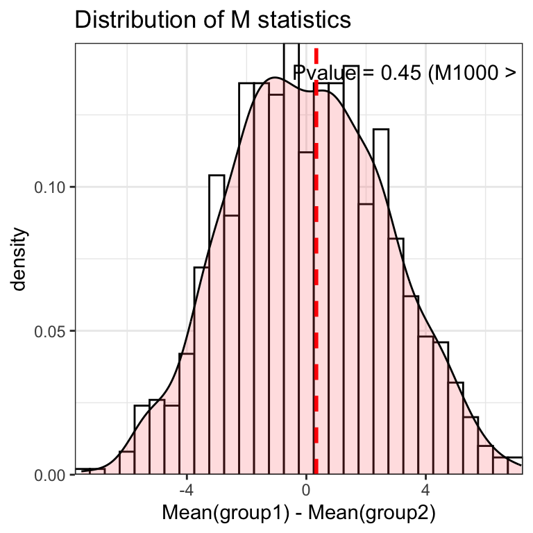

# Permutation Test {#PermutationTest}

置换检验属于一种非参数检验，最初真正认识置换检验是从PERMANOVA分析开始的，PERMANOVA的原理是：

+ 第一步，获取原始统计量。先计算*组间距离的平方和*和*组内距离的平方和*的差值（类似F分布统计量）；

+ 第二步，随机抽取样本组成分组再计算上述类似F分布统计量，重复该过程1000次；

+ 第三步。上述1000次得到的数值组成统计量分布，观察原始统计量落在分布的两端（显著性水平=0.05），是则显著差异，否则接受原假设。

从上述步骤能看出第二步是利用了置换检验的思想，通过随机事件得到的结果判断原始结果是否是随机发生的。


置换检验方法通常会用在小样本组间比较，一般对样本总体分布情况无要求，特别适用于总体分布未知的小样本数据，即使样本数据小到无法使用比如说t检验，但如通过比较简单假设检验的统计量则要考虑数据分布（比如评估两组数据的差异，先通过T检验获得原始T统计量，随后再通过置换检验抽取样本再获取T统计量，最后再评估原始T统计量在T统计量分布的区域）。


## 加载R包


```r
knitr::opts_chunk$set(message = FALSE, warning = FALSE)
library(tidyverse)
library(multcomp)
library(lmPerm)

# rm(list = ls())
options(stringsAsFactors = F)
options(future.globals.maxSize = 1000 * 1024^2)
```


## 小样本数据案例

现有两组数据，一组是对照组，一组是实验组，它们的样本量分别是3和5，通过以下数据是否能够证实实验处理可以改善结果？

+ 对照组：73，75，78

+ 实验组：68，69，80，76，82

解题思路：T检验或Wilcox检验一般要求任意一组样本量均大于等于5较为合适，且两组样本量相差较小（非平衡数据）。该问题样本量较小，普通的假设检验不适合，可以采用置换检验（两组平均值的差值作为统计量）。具体步骤：

1. 第一步，零假设是实验组和对照组没有任何差别；

2. 第二步，获取原始统计量。先计算两组平均值的差值作为统计量，$M_{0} = 0.333$；

3. 第三步，对照组和实验组混合后随机抽取样本组成A和B再计算两组平均值的差值，重复该过程1000次，上述1000次得到的数值组成统计量分布$M_{1000}$；

4. 第四步，计算$M_{1000}$大于$M_{0} = 0.333$的个数$n$，概率$P=n/1000$。若$P < 0.05$则说明实验处理有助于提升结果，否则接受零假设。


```r
control <- c(73, 75, 78)
treatment <- c(68, 69, 80, 76, 82)

permute_fun <- function(x1, x2, times = 1000) {
  
  # x1 = control
  # x2 = treatment
  # times = 1000
  
  M0 <- mean(x1) - mean(x2)
  x <- c(x1, x2)
  
  M_distri <- c()
  for (i in 1:times ) {
    x1_new <- sample(x, length(x1))
    x2_new <- sample(x, length(x2))
    
    M_temp <- mean(x1_new) - mean(x2_new)
    M_distri <- c(M_distri, M_temp)
  }
  
  dat <- data.frame(Time = 1:times,
                    Value = M_distri)
  p_value <- length(M_distri[M_distri > M0]) / length(M_distri)
  p_label <- paste0("Pvalue = ", p_value, " (M1000 > M0)")
  
  pl <- ggplot(dat, aes(x = Value)) + 
    geom_histogram(aes(y=..density..), binwidth=.5, 
                   color = "black", fill = "white") +
    geom_density(alpha=.2, fill="#FF6666") +
    scale_x_continuous(expand = c(0, 0)) +
    scale_y_continuous(expand = c(0, 0)) +
    labs(title = "Distribution of M statistics",
         x = "Mean(group1) - Mean(group2)") +
    geom_vline(xintercept = M0, color = "red", linetype = "dashed", linewidth = 1) +  
    annotate("text", label = p_label, x = 4, y = 0.14, size = 4) +
    theme_bw()
  
  return(pl)
}

permute_fun(x1 = control, x2 = treatment)
```



结果：Pvalue > 0.05，说明实验处理对结果没有显著提升。


除了自己撰写脚本外，还可以通过R包内置的函数实现两组置换检验。


```r
EnvStats::twoSamplePermutationTestLocation(
  x = control,
  y = treatment,
  fcn = 'mean',
  alternative = 'greater',
  mu1.minus.mu2 = 0,
  paired = FALSE,
  exact = FALSE,
  n.permutations = 1000,
  seed = 123)
#> 
#> Results of Hypothesis Test
#> --------------------------
#> 
#> Null Hypothesis:                 mu.x-mu.y = 0
#> 
#> Alternative Hypothesis:          True mu.x-mu.y is greater than 0
#> 
#> Test Name:                       Two-Sample Permutation Test
#>                                  Based on Differences in Means
#>                                  (Based on Sampling
#>                                  Permutation Distribution
#>                                  1000 Times)
#> 
#> Estimated Parameter(s):          mean of x = 75.33333
#>                                  mean of y = 75.00000
#> 
#> Data:                            x = control  
#>                                  y = treatment
#> 
#> Sample Sizes:                    nx = 3
#>                                  ny = 5
#> 
#> Test Statistic:                  mean.x - mean.y = 0.3333333
#> 
#> P-value:                         0.497
```


## 线性回归案例

线性回归要求残差项服从正态分布，但在实际中残差项会存在离群点或偏差，无法达到完美的正态分布情况。因此使用基于置换检验的线性回归方法会有助于找到显著差异的贡献项。

+ 普通线性回归结果揭示*dose*对*weight*没有显著性贡献 (公式中变量的顺序非常重要，公式中后面变量的效果会根据公式前面变量的效果进行调整)


```r
data(litter)
mod1 <- aov(weight ~ number + gesttime + dose, data = litter)
summary(mod1)
#>             Df Sum Sq Mean Sq F value  Pr(>F)   
#> number       1   69.8   69.77   4.367 0.04038 * 
#> gesttime     1  143.7  143.70   8.994 0.00378 **
#> dose         3  122.8   40.93   2.562 0.06196 . 
#> Residuals   68 1086.4   15.98                   
#> ---
#> Signif. codes:  
#> 0 '***' 0.001 '**' 0.01 '*' 0.05 '.' 0.1 ' ' 1
```

+ 残差情况


```r
qqnorm(resid(mod1), main = "Normal Q-Q Plot")
qqline(resid(mod1), col = "red")
```


+ 置换检验代替传统线性回归方法


```r
set.seed(123)
mod2 <- lmPerm::aovp(weight ~ number + gesttime + dose, data = litter)
#> [1] "Settings:  unique SS : numeric variables centered"
summary(mod2)
#> Component 1 :
#>             Df R Sum Sq R Mean Sq Iter Pr(Prob)   
#> number       1    64.85    64.849 1957  0.04905 * 
#> gesttime     1   153.99   153.986 5000  0.00220 **
#> dose         3   122.80    40.934 2171  0.04422 * 
#> Residuals   68  1086.42    15.977                 
#> ---
#> Signif. codes:  
#> 0 '***' 0.001 '**' 0.01 '*' 0.05 '.' 0.1 ' ' 1
```


结果：dose对weight变量有显著贡献


## 总结

+ 置换检验思想不仅仅可以用于参数未知和分布未知的小样本数据，也可以用于大样本数据（计算代价较高）；

+ 置换检验也适合组间样本量不平衡的数据。


## Systemic information

```r
devtools::session_info()
#> ─ Session info ───────────────────────────────────────────
#>  setting  value
#>  version  R version 4.3.1 (2023-06-16)
#>  os       macOS Monterey 12.2.1
#>  system   x86_64, darwin20
#>  ui       X11
#>  language (EN)
#>  collate  en_US.UTF-8
#>  ctype    en_US.UTF-8
#>  tz       Asia/Shanghai
#>  date     2024-02-06
#>  pandoc   3.1.3 @ /Users/zouhua/opt/anaconda3/bin/ (via rmarkdown)
#> 
#> ─ Packages ───────────────────────────────────────────────
#>  package     * version date (UTC) lib source
#>  bookdown      0.37    2023-12-01 [1] CRAN (R 4.3.0)
#>  bslib         0.6.1   2023-11-28 [1] CRAN (R 4.3.0)
#>  cachem        1.0.8   2023-05-01 [1] CRAN (R 4.3.0)
#>  cli           3.6.2   2023-12-11 [1] CRAN (R 4.3.0)
#>  codetools     0.2-19  2023-02-01 [1] CRAN (R 4.3.1)
#>  colorspace    2.1-0   2023-01-23 [1] CRAN (R 4.3.0)
#>  devtools      2.4.5   2022-10-11 [1] CRAN (R 4.3.0)
#>  digest        0.6.34  2024-01-11 [1] CRAN (R 4.3.0)
#>  downlit       0.4.3   2023-06-29 [1] CRAN (R 4.3.0)
#>  dplyr       * 1.1.4   2023-11-17 [1] CRAN (R 4.3.0)
#>  ellipsis      0.3.2   2021-04-29 [1] CRAN (R 4.3.0)
#>  EnvStats      2.8.1   2023-08-22 [1] CRAN (R 4.3.0)
#>  evaluate      0.23    2023-11-01 [1] CRAN (R 4.3.0)
#>  fansi         1.0.6   2023-12-08 [1] CRAN (R 4.3.0)
#>  farver        2.1.1   2022-07-06 [1] CRAN (R 4.3.0)
#>  fastmap       1.1.1   2023-02-24 [1] CRAN (R 4.3.0)
#>  forcats     * 1.0.0   2023-01-29 [1] CRAN (R 4.3.0)
#>  fs            1.6.3   2023-07-20 [1] CRAN (R 4.3.0)
#>  generics      0.1.3   2022-07-05 [1] CRAN (R 4.3.0)
#>  ggplot2     * 3.4.4   2023-10-12 [1] CRAN (R 4.3.0)
#>  glue          1.7.0   2024-01-09 [1] CRAN (R 4.3.0)
#>  gtable        0.3.4   2023-08-21 [1] CRAN (R 4.3.0)
#>  highr         0.10    2022-12-22 [1] CRAN (R 4.3.0)
#>  hms           1.1.3   2023-03-21 [1] CRAN (R 4.3.0)
#>  htmltools     0.5.7   2023-11-03 [1] CRAN (R 4.3.0)
#>  htmlwidgets   1.6.4   2023-12-06 [1] CRAN (R 4.3.0)
#>  httpuv        1.6.14  2024-01-26 [1] CRAN (R 4.3.2)
#>  jquerylib     0.1.4   2021-04-26 [1] CRAN (R 4.3.0)
#>  jsonlite      1.8.8   2023-12-04 [1] CRAN (R 4.3.0)
#>  knitr         1.45    2023-10-30 [1] CRAN (R 4.3.0)
#>  labeling      0.4.3   2023-08-29 [1] CRAN (R 4.3.0)
#>  later         1.3.2   2023-12-06 [1] CRAN (R 4.3.0)
#>  lattice       0.21-8  2023-04-05 [1] CRAN (R 4.3.1)
#>  lifecycle     1.0.4   2023-11-07 [1] CRAN (R 4.3.0)
#>  lmPerm      * 2.1.0   2016-08-02 [1] CRAN (R 4.3.0)
#>  lubridate   * 1.9.3   2023-09-27 [1] CRAN (R 4.3.0)
#>  magrittr      2.0.3   2022-03-30 [1] CRAN (R 4.3.0)
#>  MASS        * 7.3-60  2023-05-04 [1] CRAN (R 4.3.1)
#>  Matrix        1.6-5   2024-01-11 [1] CRAN (R 4.3.0)
#>  memoise       2.0.1   2021-11-26 [1] CRAN (R 4.3.0)
#>  mime          0.12    2021-09-28 [1] CRAN (R 4.3.0)
#>  miniUI        0.1.1.1 2018-05-18 [1] CRAN (R 4.3.0)
#>  multcomp    * 1.4-25  2023-06-20 [1] CRAN (R 4.3.0)
#>  munsell       0.5.0   2018-06-12 [1] CRAN (R 4.3.0)
#>  mvtnorm     * 1.2-4   2023-11-27 [1] CRAN (R 4.3.0)
#>  pillar        1.9.0   2023-03-22 [1] CRAN (R 4.3.0)
#>  pkgbuild      1.4.3   2023-12-10 [1] CRAN (R 4.3.0)
#>  pkgconfig     2.0.3   2019-09-22 [1] CRAN (R 4.3.0)
#>  pkgload       1.3.4   2024-01-16 [1] CRAN (R 4.3.0)
#>  profvis       0.3.8   2023-05-02 [1] CRAN (R 4.3.0)
#>  promises      1.2.1   2023-08-10 [1] CRAN (R 4.3.0)
#>  purrr       * 1.0.2   2023-08-10 [1] CRAN (R 4.3.0)
#>  R6            2.5.1   2021-08-19 [1] CRAN (R 4.3.0)
#>  Rcpp          1.0.12  2024-01-09 [1] CRAN (R 4.3.0)
#>  readr       * 2.1.5   2024-01-10 [1] CRAN (R 4.3.0)
#>  remotes       2.4.2.1 2023-07-18 [1] CRAN (R 4.3.0)
#>  rlang         1.1.3   2024-01-10 [1] CRAN (R 4.3.0)
#>  rmarkdown     2.25    2023-09-18 [1] CRAN (R 4.3.0)
#>  rstudioapi    0.15.0  2023-07-07 [1] CRAN (R 4.3.0)
#>  sandwich      3.1-0   2023-12-11 [1] CRAN (R 4.3.0)
#>  sass          0.4.8   2023-12-06 [1] CRAN (R 4.3.0)
#>  scales        1.3.0   2023-11-28 [1] CRAN (R 4.3.0)
#>  sessioninfo   1.2.2   2021-12-06 [1] CRAN (R 4.3.0)
#>  shiny         1.8.0   2023-11-17 [1] CRAN (R 4.3.0)
#>  stringi       1.8.3   2023-12-11 [1] CRAN (R 4.3.0)
#>  stringr     * 1.5.1   2023-11-14 [1] CRAN (R 4.3.0)
#>  survival    * 3.5-5   2023-03-12 [1] CRAN (R 4.3.1)
#>  TH.data     * 1.1-2   2023-04-17 [1] CRAN (R 4.3.0)
#>  tibble      * 3.2.1   2023-03-20 [1] CRAN (R 4.3.0)
#>  tidyr       * 1.3.1   2024-01-24 [1] CRAN (R 4.3.2)
#>  tidyselect    1.2.0   2022-10-10 [1] CRAN (R 4.3.0)
#>  tidyverse   * 2.0.0   2023-02-22 [1] CRAN (R 4.3.0)
#>  timechange    0.3.0   2024-01-18 [1] CRAN (R 4.3.0)
#>  tzdb          0.4.0   2023-05-12 [1] CRAN (R 4.3.0)
#>  urlchecker    1.0.1   2021-11-30 [1] CRAN (R 4.3.0)
#>  usethis       2.2.2   2023-07-06 [1] CRAN (R 4.3.0)
#>  utf8          1.2.4   2023-10-22 [1] CRAN (R 4.3.0)
#>  vctrs         0.6.5   2023-12-01 [1] CRAN (R 4.3.0)
#>  withr         3.0.0   2024-01-16 [1] CRAN (R 4.3.0)
#>  xfun          0.41    2023-11-01 [1] CRAN (R 4.3.0)
#>  xml2          1.3.6   2023-12-04 [1] CRAN (R 4.3.0)
#>  xtable        1.8-4   2019-04-21 [1] CRAN (R 4.3.0)
#>  yaml          2.3.8   2023-12-11 [1] CRAN (R 4.3.0)
#>  zoo           1.8-12  2023-04-13 [1] CRAN (R 4.3.0)
#> 
#>  [1] /Library/Frameworks/R.framework/Versions/4.3-x86_64/Resources/library
#> 
#> ──────────────────────────────────────────────────────────
```


## Reference

+ Fisher, R. A., 1935. The Design of Experiments. Oliver & Boyd, Edinburgh.

+ [Two-Sample Permutation Test of Difference in Means](https://www.cfholbert.com/blog/two_sample_permutation_test/#:~:text=The%20two%2Dsample%20permutation%20test,median%2C%20or%20some%20other%20measure.)
