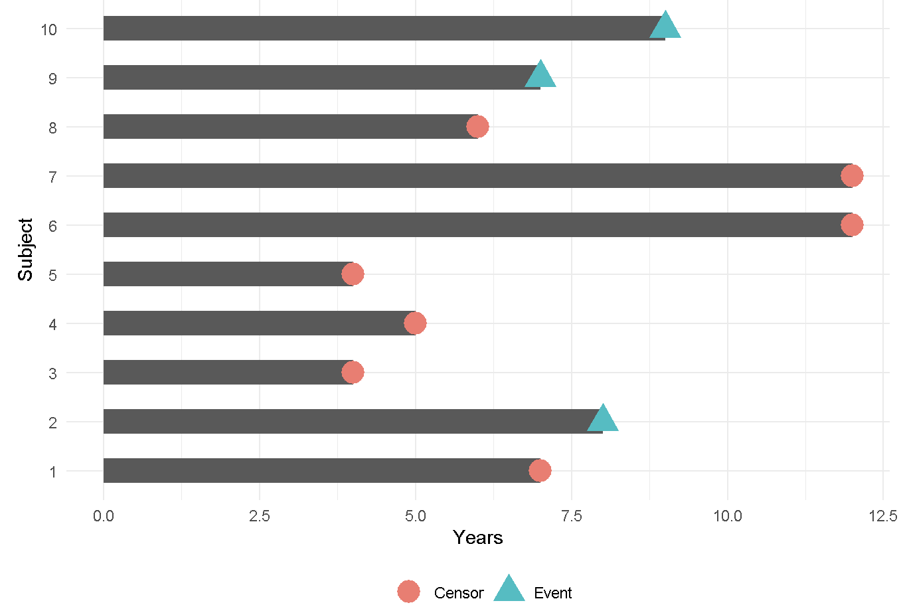
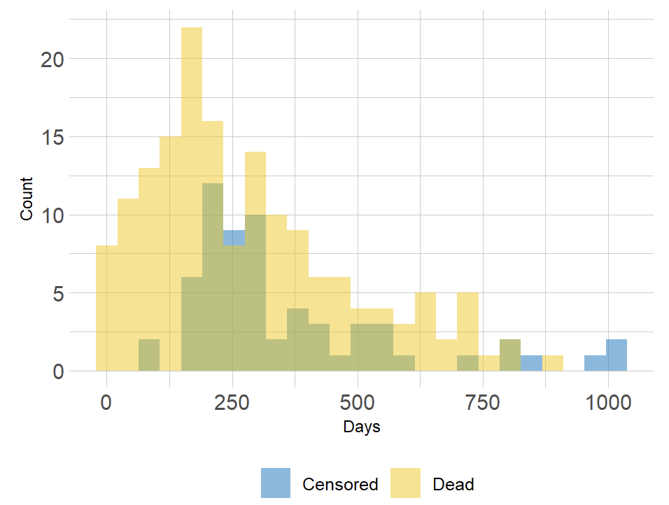
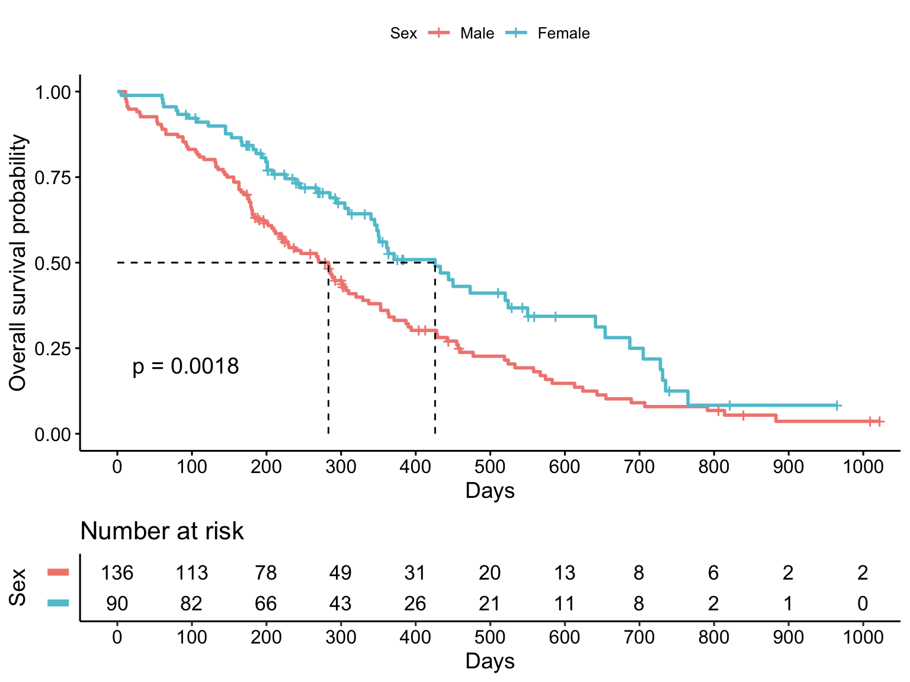
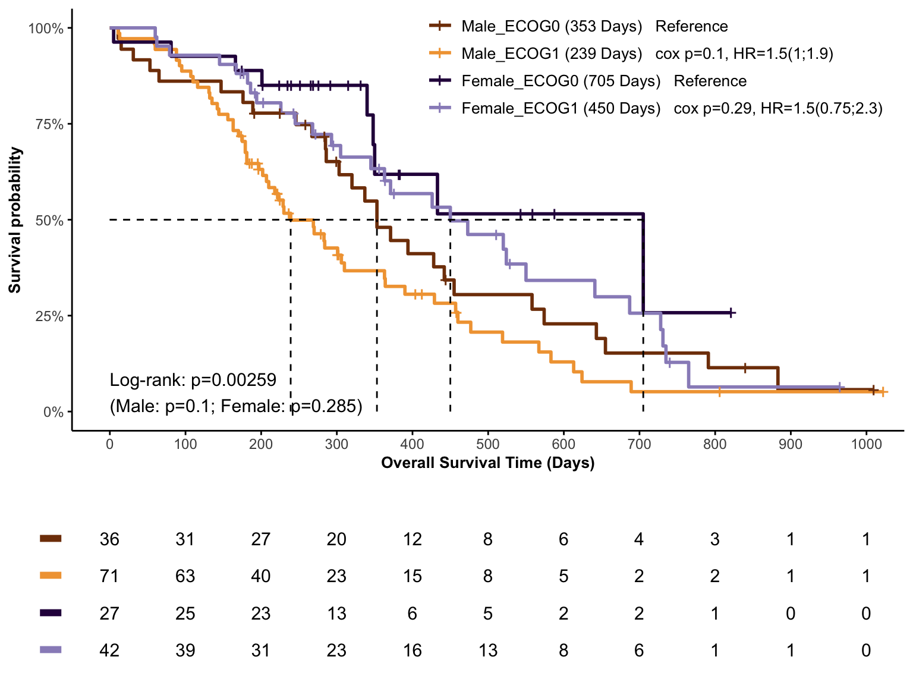

# Survival Analysis {#SurvivalAnalysis}


## 介绍

生存分析的目的是分析某个时间点的“生存概率”是多少。基于这样的研究目的，需要提供生存数据，它是一种由不同的开始时间和结束时间组成的事件-时间的数据，比如在癌症研究领域，研究手术到死亡的过程、治疗到疾病进展等等。

在开展生存分析前，需要了解什么是删失（censored）。对于确定的事件，由于其他原因导致其出现无法记录、无法观察等等，这些都可以称为删失。“删失（censored）数据指在观察或试验中,由于人力或其他原因未能观察到所感兴趣的事件发生，因而得到的数据。”

<div class="figure" style="text-align: center">

<p class="caption">(\#fig:unnamed-chunk-2)Censored survival data</p>
</div>

图表示10个参与者，在事件为发生前有7位患者出现了删失情况。忽略删失样本会导致生存概率结果出现偏差。生存分析是一种可以适当考虑被删失患者的方法。


## 组成

生存数据是有事件状态和对应时间组成，事件状态可以分成发生和删失。

+ 事件时间：$T_i$

+ 删失时间：$C_i$

+ 事件状态：如果观察到事件则是1；否则是删失0。事件时间要小于删失时间。


通过密度分布图可以观察到事件发生和删失状态在时间上的区别，如果不考虑删失则会导致评估结果偏高。

<div class="figure" style="text-align: center">

<p class="caption">(\#fig:unnamed-chunk-3)distribution of follow-up times</p>
</div>

某个对象在某个时间点的生存概率公式为：$S(t) = Pr(T > t) = 1- F(t)$

+ $S(t)$是生存函数

+ $F(t) = 1- Pr(T > t)$是累积分布函数


## 案例

### 加载R包


```r
knitr::opts_chunk$set(message = FALSE, warning = FALSE)
library(tidyverse)
library(survival)
library(survminer)
library(gtsummary)

# rm(list = ls())
options(stringsAsFactors = F)
options(future.globals.maxSize = 1000 * 1024^2)

# group & color
sex_grp <- c("Male", "Female")
sex_col <- c("#F28880", "#60C4D3")
```


### 导入数据

肺癌数据: 本次研究目的----不同性别以及患者的生存状态是否存在差异

+ 生存时间（time）: 观察到的生存时间 (days)

+ 生存状态（status）: 死亡(2->1)和删失(1->0)

+ 性别（sex）: 1=Male, 2=Female

+ 肿瘤活动状态（ph.ecog）：0=ECOG0，1=ECOG1，2=ECOG2


```r
dat <- 
  lung %>% 
  mutate(status = recode(status, `1` = 0, `2` = 1),
         sex = recode(sex, `1` = "Male", `2` = "Female")) %>%
  filter(!ph.ecog %in% c(NA, 3)) %>%
  mutate(ph.ecog = recode(ph.ecog, `0` = "ECOG0", `1` = "ECOG1", `2` = "ECOG2"),
         sex = factor(sex, levels = sex_grp))

head(dat[, c("time", "status", "sex", "ph.ecog")])
#>   time status  sex ph.ecog
#> 1  306      1 Male   ECOG1
#> 2  455      1 Male   ECOG0
#> 3 1010      0 Male   ECOG0
#> 4  210      1 Male   ECOG1
#> 5  883      1 Male   ECOG0
#> 6 1022      0 Male   ECOG1
```


### 生存对象

通过`Surv()`生成生存对象，在使用`survfit()`生成生存曲线Kaplan-Meier plot的准备数据。


```r
sur_fit <- survival::survfit(survival::Surv(time, status) ~ sex, data = dat)

sur_fit
#> Call: survfit(formula = survival::Surv(time, status) ~ sex, data = dat)
#> 
#>              n events median 0.95LCL 0.95UCL
#> sex=Male   136    110    283     218     320
#> sex=Female  90     53    426     348     550
```


### 组间生存时间差异比较

问题：在肺癌患者不同的性别分组中，生存概率是否存在差异性呢？

通常采用Log-rank检验推断两生存曲线整体间（整个观察期间）是否有差异，若生存曲线出现交叉情况，由于不满足成比例假设，则Log-rank检验不适用。


```r
survminer::ggsurvplot(
    fit = sur_fit,
    pval = TRUE,
    xlab = "Days",
    ylab = "Overall survival probability",
    legend.title = "Sex",
    legend.labs = sex_grp,
    palette = sex_col,
    break.x.by = 100, 
    surv.median.line = "hv",
    risk.table = TRUE,
    risk.table.y.text = FALSE)
```



从图上的*logRank p = 0.0018*来看，女性在肺癌中生存周期更长。结合男性可能抽烟的额外因素考虑，该结果也符合预期。


### 中位生存期

中位生存期(Median Survival Time)，又称为半数生存期， 即当累积生存率为0.5时所对应的生存时间，表示有且只有50%的个体可以活过这个时间。


```r
sur_fit %>%
  tbl_survfit(
    probs = 0.5,
    label_header = "**Median survival (95% CI)**"
  ) 
```


```{=html}
<div id="cimzcxqcyb" style="padding-left:0px;padding-right:0px;padding-top:10px;padding-bottom:10px;overflow-x:auto;overflow-y:auto;width:auto;height:auto;">
<style>#cimzcxqcyb table {
  font-family: system-ui, 'Segoe UI', Roboto, Helvetica, Arial, sans-serif, 'Apple Color Emoji', 'Segoe UI Emoji', 'Segoe UI Symbol', 'Noto Color Emoji';
  -webkit-font-smoothing: antialiased;
  -moz-osx-font-smoothing: grayscale;
}

#cimzcxqcyb thead, #cimzcxqcyb tbody, #cimzcxqcyb tfoot, #cimzcxqcyb tr, #cimzcxqcyb td, #cimzcxqcyb th {
  border-style: none;
}

#cimzcxqcyb p {
  margin: 0;
  padding: 0;
}

#cimzcxqcyb .gt_table {
  display: table;
  border-collapse: collapse;
  line-height: normal;
  margin-left: auto;
  margin-right: auto;
  color: #333333;
  font-size: 16px;
  font-weight: normal;
  font-style: normal;
  background-color: #FFFFFF;
  width: auto;
  border-top-style: solid;
  border-top-width: 2px;
  border-top-color: #A8A8A8;
  border-right-style: none;
  border-right-width: 2px;
  border-right-color: #D3D3D3;
  border-bottom-style: solid;
  border-bottom-width: 2px;
  border-bottom-color: #A8A8A8;
  border-left-style: none;
  border-left-width: 2px;
  border-left-color: #D3D3D3;
}

#cimzcxqcyb .gt_caption {
  padding-top: 4px;
  padding-bottom: 4px;
}

#cimzcxqcyb .gt_title {
  color: #333333;
  font-size: 125%;
  font-weight: initial;
  padding-top: 4px;
  padding-bottom: 4px;
  padding-left: 5px;
  padding-right: 5px;
  border-bottom-color: #FFFFFF;
  border-bottom-width: 0;
}

#cimzcxqcyb .gt_subtitle {
  color: #333333;
  font-size: 85%;
  font-weight: initial;
  padding-top: 3px;
  padding-bottom: 5px;
  padding-left: 5px;
  padding-right: 5px;
  border-top-color: #FFFFFF;
  border-top-width: 0;
}

#cimzcxqcyb .gt_heading {
  background-color: #FFFFFF;
  text-align: center;
  border-bottom-color: #FFFFFF;
  border-left-style: none;
  border-left-width: 1px;
  border-left-color: #D3D3D3;
  border-right-style: none;
  border-right-width: 1px;
  border-right-color: #D3D3D3;
}

#cimzcxqcyb .gt_bottom_border {
  border-bottom-style: solid;
  border-bottom-width: 2px;
  border-bottom-color: #D3D3D3;
}

#cimzcxqcyb .gt_col_headings {
  border-top-style: solid;
  border-top-width: 2px;
  border-top-color: #D3D3D3;
  border-bottom-style: solid;
  border-bottom-width: 2px;
  border-bottom-color: #D3D3D3;
  border-left-style: none;
  border-left-width: 1px;
  border-left-color: #D3D3D3;
  border-right-style: none;
  border-right-width: 1px;
  border-right-color: #D3D3D3;
}

#cimzcxqcyb .gt_col_heading {
  color: #333333;
  background-color: #FFFFFF;
  font-size: 100%;
  font-weight: normal;
  text-transform: inherit;
  border-left-style: none;
  border-left-width: 1px;
  border-left-color: #D3D3D3;
  border-right-style: none;
  border-right-width: 1px;
  border-right-color: #D3D3D3;
  vertical-align: bottom;
  padding-top: 5px;
  padding-bottom: 6px;
  padding-left: 5px;
  padding-right: 5px;
  overflow-x: hidden;
}

#cimzcxqcyb .gt_column_spanner_outer {
  color: #333333;
  background-color: #FFFFFF;
  font-size: 100%;
  font-weight: normal;
  text-transform: inherit;
  padding-top: 0;
  padding-bottom: 0;
  padding-left: 4px;
  padding-right: 4px;
}

#cimzcxqcyb .gt_column_spanner_outer:first-child {
  padding-left: 0;
}

#cimzcxqcyb .gt_column_spanner_outer:last-child {
  padding-right: 0;
}

#cimzcxqcyb .gt_column_spanner {
  border-bottom-style: solid;
  border-bottom-width: 2px;
  border-bottom-color: #D3D3D3;
  vertical-align: bottom;
  padding-top: 5px;
  padding-bottom: 5px;
  overflow-x: hidden;
  display: inline-block;
  width: 100%;
}

#cimzcxqcyb .gt_spanner_row {
  border-bottom-style: hidden;
}

#cimzcxqcyb .gt_group_heading {
  padding-top: 8px;
  padding-bottom: 8px;
  padding-left: 5px;
  padding-right: 5px;
  color: #333333;
  background-color: #FFFFFF;
  font-size: 100%;
  font-weight: initial;
  text-transform: inherit;
  border-top-style: solid;
  border-top-width: 2px;
  border-top-color: #D3D3D3;
  border-bottom-style: solid;
  border-bottom-width: 2px;
  border-bottom-color: #D3D3D3;
  border-left-style: none;
  border-left-width: 1px;
  border-left-color: #D3D3D3;
  border-right-style: none;
  border-right-width: 1px;
  border-right-color: #D3D3D3;
  vertical-align: middle;
  text-align: left;
}

#cimzcxqcyb .gt_empty_group_heading {
  padding: 0.5px;
  color: #333333;
  background-color: #FFFFFF;
  font-size: 100%;
  font-weight: initial;
  border-top-style: solid;
  border-top-width: 2px;
  border-top-color: #D3D3D3;
  border-bottom-style: solid;
  border-bottom-width: 2px;
  border-bottom-color: #D3D3D3;
  vertical-align: middle;
}

#cimzcxqcyb .gt_from_md > :first-child {
  margin-top: 0;
}

#cimzcxqcyb .gt_from_md > :last-child {
  margin-bottom: 0;
}

#cimzcxqcyb .gt_row {
  padding-top: 8px;
  padding-bottom: 8px;
  padding-left: 5px;
  padding-right: 5px;
  margin: 10px;
  border-top-style: solid;
  border-top-width: 1px;
  border-top-color: #D3D3D3;
  border-left-style: none;
  border-left-width: 1px;
  border-left-color: #D3D3D3;
  border-right-style: none;
  border-right-width: 1px;
  border-right-color: #D3D3D3;
  vertical-align: middle;
  overflow-x: hidden;
}

#cimzcxqcyb .gt_stub {
  color: #333333;
  background-color: #FFFFFF;
  font-size: 100%;
  font-weight: initial;
  text-transform: inherit;
  border-right-style: solid;
  border-right-width: 2px;
  border-right-color: #D3D3D3;
  padding-left: 5px;
  padding-right: 5px;
}

#cimzcxqcyb .gt_stub_row_group {
  color: #333333;
  background-color: #FFFFFF;
  font-size: 100%;
  font-weight: initial;
  text-transform: inherit;
  border-right-style: solid;
  border-right-width: 2px;
  border-right-color: #D3D3D3;
  padding-left: 5px;
  padding-right: 5px;
  vertical-align: top;
}

#cimzcxqcyb .gt_row_group_first td {
  border-top-width: 2px;
}

#cimzcxqcyb .gt_row_group_first th {
  border-top-width: 2px;
}

#cimzcxqcyb .gt_summary_row {
  color: #333333;
  background-color: #FFFFFF;
  text-transform: inherit;
  padding-top: 8px;
  padding-bottom: 8px;
  padding-left: 5px;
  padding-right: 5px;
}

#cimzcxqcyb .gt_first_summary_row {
  border-top-style: solid;
  border-top-color: #D3D3D3;
}

#cimzcxqcyb .gt_first_summary_row.thick {
  border-top-width: 2px;
}

#cimzcxqcyb .gt_last_summary_row {
  padding-top: 8px;
  padding-bottom: 8px;
  padding-left: 5px;
  padding-right: 5px;
  border-bottom-style: solid;
  border-bottom-width: 2px;
  border-bottom-color: #D3D3D3;
}

#cimzcxqcyb .gt_grand_summary_row {
  color: #333333;
  background-color: #FFFFFF;
  text-transform: inherit;
  padding-top: 8px;
  padding-bottom: 8px;
  padding-left: 5px;
  padding-right: 5px;
}

#cimzcxqcyb .gt_first_grand_summary_row {
  padding-top: 8px;
  padding-bottom: 8px;
  padding-left: 5px;
  padding-right: 5px;
  border-top-style: double;
  border-top-width: 6px;
  border-top-color: #D3D3D3;
}

#cimzcxqcyb .gt_last_grand_summary_row_top {
  padding-top: 8px;
  padding-bottom: 8px;
  padding-left: 5px;
  padding-right: 5px;
  border-bottom-style: double;
  border-bottom-width: 6px;
  border-bottom-color: #D3D3D3;
}

#cimzcxqcyb .gt_striped {
  background-color: rgba(128, 128, 128, 0.05);
}

#cimzcxqcyb .gt_table_body {
  border-top-style: solid;
  border-top-width: 2px;
  border-top-color: #D3D3D3;
  border-bottom-style: solid;
  border-bottom-width: 2px;
  border-bottom-color: #D3D3D3;
}

#cimzcxqcyb .gt_footnotes {
  color: #333333;
  background-color: #FFFFFF;
  border-bottom-style: none;
  border-bottom-width: 2px;
  border-bottom-color: #D3D3D3;
  border-left-style: none;
  border-left-width: 2px;
  border-left-color: #D3D3D3;
  border-right-style: none;
  border-right-width: 2px;
  border-right-color: #D3D3D3;
}

#cimzcxqcyb .gt_footnote {
  margin: 0px;
  font-size: 90%;
  padding-top: 4px;
  padding-bottom: 4px;
  padding-left: 5px;
  padding-right: 5px;
}

#cimzcxqcyb .gt_sourcenotes {
  color: #333333;
  background-color: #FFFFFF;
  border-bottom-style: none;
  border-bottom-width: 2px;
  border-bottom-color: #D3D3D3;
  border-left-style: none;
  border-left-width: 2px;
  border-left-color: #D3D3D3;
  border-right-style: none;
  border-right-width: 2px;
  border-right-color: #D3D3D3;
}

#cimzcxqcyb .gt_sourcenote {
  font-size: 90%;
  padding-top: 4px;
  padding-bottom: 4px;
  padding-left: 5px;
  padding-right: 5px;
}

#cimzcxqcyb .gt_left {
  text-align: left;
}

#cimzcxqcyb .gt_center {
  text-align: center;
}

#cimzcxqcyb .gt_right {
  text-align: right;
  font-variant-numeric: tabular-nums;
}

#cimzcxqcyb .gt_font_normal {
  font-weight: normal;
}

#cimzcxqcyb .gt_font_bold {
  font-weight: bold;
}

#cimzcxqcyb .gt_font_italic {
  font-style: italic;
}

#cimzcxqcyb .gt_super {
  font-size: 65%;
}

#cimzcxqcyb .gt_footnote_marks {
  font-size: 75%;
  vertical-align: 0.4em;
  position: initial;
}

#cimzcxqcyb .gt_asterisk {
  font-size: 100%;
  vertical-align: 0;
}

#cimzcxqcyb .gt_indent_1 {
  text-indent: 5px;
}

#cimzcxqcyb .gt_indent_2 {
  text-indent: 10px;
}

#cimzcxqcyb .gt_indent_3 {
  text-indent: 15px;
}

#cimzcxqcyb .gt_indent_4 {
  text-indent: 20px;
}

#cimzcxqcyb .gt_indent_5 {
  text-indent: 25px;
}
</style>
<table class="gt_table" data-quarto-disable-processing="false" data-quarto-bootstrap="false">
  <thead>
    <tr class="gt_col_headings">
      <th class="gt_col_heading gt_columns_bottom_border gt_left" rowspan="1" colspan="1" scope="col" id="&lt;strong&gt;Characteristic&lt;/strong&gt;"><strong>Characteristic</strong></th>
      <th class="gt_col_heading gt_columns_bottom_border gt_center" rowspan="1" colspan="1" scope="col" id="&lt;strong&gt;Median survival (95% CI)&lt;/strong&gt;"><strong>Median survival (95% CI)</strong></th>
    </tr>
  </thead>
  <tbody class="gt_table_body">
    <tr><td headers="label" class="gt_row gt_left">sex</td>
<td headers="stat_1" class="gt_row gt_center"><br /></td></tr>
    <tr><td headers="label" class="gt_row gt_left">    Male</td>
<td headers="stat_1" class="gt_row gt_center">283 (218, 320)</td></tr>
    <tr><td headers="label" class="gt_row gt_left">    Female</td>
<td headers="stat_1" class="gt_row gt_center">426 (348, 550)</td></tr>
  </tbody>
  
  
</table>
</div>
```


女性的中位生存期（426天）要远远高于男性的（283天）


### N年生存概率

选择1到3年生存概率，评估男女性间的差异


```r
sur_fit %>%
  tbl_survfit(
    times = c(365, 730),
    label_header = "**{time} Days survival (95% CI)**"
  )
```


```{=html}
<div id="xrjzzxhcat" style="padding-left:0px;padding-right:0px;padding-top:10px;padding-bottom:10px;overflow-x:auto;overflow-y:auto;width:auto;height:auto;">
<style>#xrjzzxhcat table {
  font-family: system-ui, 'Segoe UI', Roboto, Helvetica, Arial, sans-serif, 'Apple Color Emoji', 'Segoe UI Emoji', 'Segoe UI Symbol', 'Noto Color Emoji';
  -webkit-font-smoothing: antialiased;
  -moz-osx-font-smoothing: grayscale;
}

#xrjzzxhcat thead, #xrjzzxhcat tbody, #xrjzzxhcat tfoot, #xrjzzxhcat tr, #xrjzzxhcat td, #xrjzzxhcat th {
  border-style: none;
}

#xrjzzxhcat p {
  margin: 0;
  padding: 0;
}

#xrjzzxhcat .gt_table {
  display: table;
  border-collapse: collapse;
  line-height: normal;
  margin-left: auto;
  margin-right: auto;
  color: #333333;
  font-size: 16px;
  font-weight: normal;
  font-style: normal;
  background-color: #FFFFFF;
  width: auto;
  border-top-style: solid;
  border-top-width: 2px;
  border-top-color: #A8A8A8;
  border-right-style: none;
  border-right-width: 2px;
  border-right-color: #D3D3D3;
  border-bottom-style: solid;
  border-bottom-width: 2px;
  border-bottom-color: #A8A8A8;
  border-left-style: none;
  border-left-width: 2px;
  border-left-color: #D3D3D3;
}

#xrjzzxhcat .gt_caption {
  padding-top: 4px;
  padding-bottom: 4px;
}

#xrjzzxhcat .gt_title {
  color: #333333;
  font-size: 125%;
  font-weight: initial;
  padding-top: 4px;
  padding-bottom: 4px;
  padding-left: 5px;
  padding-right: 5px;
  border-bottom-color: #FFFFFF;
  border-bottom-width: 0;
}

#xrjzzxhcat .gt_subtitle {
  color: #333333;
  font-size: 85%;
  font-weight: initial;
  padding-top: 3px;
  padding-bottom: 5px;
  padding-left: 5px;
  padding-right: 5px;
  border-top-color: #FFFFFF;
  border-top-width: 0;
}

#xrjzzxhcat .gt_heading {
  background-color: #FFFFFF;
  text-align: center;
  border-bottom-color: #FFFFFF;
  border-left-style: none;
  border-left-width: 1px;
  border-left-color: #D3D3D3;
  border-right-style: none;
  border-right-width: 1px;
  border-right-color: #D3D3D3;
}

#xrjzzxhcat .gt_bottom_border {
  border-bottom-style: solid;
  border-bottom-width: 2px;
  border-bottom-color: #D3D3D3;
}

#xrjzzxhcat .gt_col_headings {
  border-top-style: solid;
  border-top-width: 2px;
  border-top-color: #D3D3D3;
  border-bottom-style: solid;
  border-bottom-width: 2px;
  border-bottom-color: #D3D3D3;
  border-left-style: none;
  border-left-width: 1px;
  border-left-color: #D3D3D3;
  border-right-style: none;
  border-right-width: 1px;
  border-right-color: #D3D3D3;
}

#xrjzzxhcat .gt_col_heading {
  color: #333333;
  background-color: #FFFFFF;
  font-size: 100%;
  font-weight: normal;
  text-transform: inherit;
  border-left-style: none;
  border-left-width: 1px;
  border-left-color: #D3D3D3;
  border-right-style: none;
  border-right-width: 1px;
  border-right-color: #D3D3D3;
  vertical-align: bottom;
  padding-top: 5px;
  padding-bottom: 6px;
  padding-left: 5px;
  padding-right: 5px;
  overflow-x: hidden;
}

#xrjzzxhcat .gt_column_spanner_outer {
  color: #333333;
  background-color: #FFFFFF;
  font-size: 100%;
  font-weight: normal;
  text-transform: inherit;
  padding-top: 0;
  padding-bottom: 0;
  padding-left: 4px;
  padding-right: 4px;
}

#xrjzzxhcat .gt_column_spanner_outer:first-child {
  padding-left: 0;
}

#xrjzzxhcat .gt_column_spanner_outer:last-child {
  padding-right: 0;
}

#xrjzzxhcat .gt_column_spanner {
  border-bottom-style: solid;
  border-bottom-width: 2px;
  border-bottom-color: #D3D3D3;
  vertical-align: bottom;
  padding-top: 5px;
  padding-bottom: 5px;
  overflow-x: hidden;
  display: inline-block;
  width: 100%;
}

#xrjzzxhcat .gt_spanner_row {
  border-bottom-style: hidden;
}

#xrjzzxhcat .gt_group_heading {
  padding-top: 8px;
  padding-bottom: 8px;
  padding-left: 5px;
  padding-right: 5px;
  color: #333333;
  background-color: #FFFFFF;
  font-size: 100%;
  font-weight: initial;
  text-transform: inherit;
  border-top-style: solid;
  border-top-width: 2px;
  border-top-color: #D3D3D3;
  border-bottom-style: solid;
  border-bottom-width: 2px;
  border-bottom-color: #D3D3D3;
  border-left-style: none;
  border-left-width: 1px;
  border-left-color: #D3D3D3;
  border-right-style: none;
  border-right-width: 1px;
  border-right-color: #D3D3D3;
  vertical-align: middle;
  text-align: left;
}

#xrjzzxhcat .gt_empty_group_heading {
  padding: 0.5px;
  color: #333333;
  background-color: #FFFFFF;
  font-size: 100%;
  font-weight: initial;
  border-top-style: solid;
  border-top-width: 2px;
  border-top-color: #D3D3D3;
  border-bottom-style: solid;
  border-bottom-width: 2px;
  border-bottom-color: #D3D3D3;
  vertical-align: middle;
}

#xrjzzxhcat .gt_from_md > :first-child {
  margin-top: 0;
}

#xrjzzxhcat .gt_from_md > :last-child {
  margin-bottom: 0;
}

#xrjzzxhcat .gt_row {
  padding-top: 8px;
  padding-bottom: 8px;
  padding-left: 5px;
  padding-right: 5px;
  margin: 10px;
  border-top-style: solid;
  border-top-width: 1px;
  border-top-color: #D3D3D3;
  border-left-style: none;
  border-left-width: 1px;
  border-left-color: #D3D3D3;
  border-right-style: none;
  border-right-width: 1px;
  border-right-color: #D3D3D3;
  vertical-align: middle;
  overflow-x: hidden;
}

#xrjzzxhcat .gt_stub {
  color: #333333;
  background-color: #FFFFFF;
  font-size: 100%;
  font-weight: initial;
  text-transform: inherit;
  border-right-style: solid;
  border-right-width: 2px;
  border-right-color: #D3D3D3;
  padding-left: 5px;
  padding-right: 5px;
}

#xrjzzxhcat .gt_stub_row_group {
  color: #333333;
  background-color: #FFFFFF;
  font-size: 100%;
  font-weight: initial;
  text-transform: inherit;
  border-right-style: solid;
  border-right-width: 2px;
  border-right-color: #D3D3D3;
  padding-left: 5px;
  padding-right: 5px;
  vertical-align: top;
}

#xrjzzxhcat .gt_row_group_first td {
  border-top-width: 2px;
}

#xrjzzxhcat .gt_row_group_first th {
  border-top-width: 2px;
}

#xrjzzxhcat .gt_summary_row {
  color: #333333;
  background-color: #FFFFFF;
  text-transform: inherit;
  padding-top: 8px;
  padding-bottom: 8px;
  padding-left: 5px;
  padding-right: 5px;
}

#xrjzzxhcat .gt_first_summary_row {
  border-top-style: solid;
  border-top-color: #D3D3D3;
}

#xrjzzxhcat .gt_first_summary_row.thick {
  border-top-width: 2px;
}

#xrjzzxhcat .gt_last_summary_row {
  padding-top: 8px;
  padding-bottom: 8px;
  padding-left: 5px;
  padding-right: 5px;
  border-bottom-style: solid;
  border-bottom-width: 2px;
  border-bottom-color: #D3D3D3;
}

#xrjzzxhcat .gt_grand_summary_row {
  color: #333333;
  background-color: #FFFFFF;
  text-transform: inherit;
  padding-top: 8px;
  padding-bottom: 8px;
  padding-left: 5px;
  padding-right: 5px;
}

#xrjzzxhcat .gt_first_grand_summary_row {
  padding-top: 8px;
  padding-bottom: 8px;
  padding-left: 5px;
  padding-right: 5px;
  border-top-style: double;
  border-top-width: 6px;
  border-top-color: #D3D3D3;
}

#xrjzzxhcat .gt_last_grand_summary_row_top {
  padding-top: 8px;
  padding-bottom: 8px;
  padding-left: 5px;
  padding-right: 5px;
  border-bottom-style: double;
  border-bottom-width: 6px;
  border-bottom-color: #D3D3D3;
}

#xrjzzxhcat .gt_striped {
  background-color: rgba(128, 128, 128, 0.05);
}

#xrjzzxhcat .gt_table_body {
  border-top-style: solid;
  border-top-width: 2px;
  border-top-color: #D3D3D3;
  border-bottom-style: solid;
  border-bottom-width: 2px;
  border-bottom-color: #D3D3D3;
}

#xrjzzxhcat .gt_footnotes {
  color: #333333;
  background-color: #FFFFFF;
  border-bottom-style: none;
  border-bottom-width: 2px;
  border-bottom-color: #D3D3D3;
  border-left-style: none;
  border-left-width: 2px;
  border-left-color: #D3D3D3;
  border-right-style: none;
  border-right-width: 2px;
  border-right-color: #D3D3D3;
}

#xrjzzxhcat .gt_footnote {
  margin: 0px;
  font-size: 90%;
  padding-top: 4px;
  padding-bottom: 4px;
  padding-left: 5px;
  padding-right: 5px;
}

#xrjzzxhcat .gt_sourcenotes {
  color: #333333;
  background-color: #FFFFFF;
  border-bottom-style: none;
  border-bottom-width: 2px;
  border-bottom-color: #D3D3D3;
  border-left-style: none;
  border-left-width: 2px;
  border-left-color: #D3D3D3;
  border-right-style: none;
  border-right-width: 2px;
  border-right-color: #D3D3D3;
}

#xrjzzxhcat .gt_sourcenote {
  font-size: 90%;
  padding-top: 4px;
  padding-bottom: 4px;
  padding-left: 5px;
  padding-right: 5px;
}

#xrjzzxhcat .gt_left {
  text-align: left;
}

#xrjzzxhcat .gt_center {
  text-align: center;
}

#xrjzzxhcat .gt_right {
  text-align: right;
  font-variant-numeric: tabular-nums;
}

#xrjzzxhcat .gt_font_normal {
  font-weight: normal;
}

#xrjzzxhcat .gt_font_bold {
  font-weight: bold;
}

#xrjzzxhcat .gt_font_italic {
  font-style: italic;
}

#xrjzzxhcat .gt_super {
  font-size: 65%;
}

#xrjzzxhcat .gt_footnote_marks {
  font-size: 75%;
  vertical-align: 0.4em;
  position: initial;
}

#xrjzzxhcat .gt_asterisk {
  font-size: 100%;
  vertical-align: 0;
}

#xrjzzxhcat .gt_indent_1 {
  text-indent: 5px;
}

#xrjzzxhcat .gt_indent_2 {
  text-indent: 10px;
}

#xrjzzxhcat .gt_indent_3 {
  text-indent: 15px;
}

#xrjzzxhcat .gt_indent_4 {
  text-indent: 20px;
}

#xrjzzxhcat .gt_indent_5 {
  text-indent: 25px;
}
</style>
<table class="gt_table" data-quarto-disable-processing="false" data-quarto-bootstrap="false">
  <thead>
    <tr class="gt_col_headings">
      <th class="gt_col_heading gt_columns_bottom_border gt_left" rowspan="1" colspan="1" scope="col" id="&lt;strong&gt;Characteristic&lt;/strong&gt;"><strong>Characteristic</strong></th>
      <th class="gt_col_heading gt_columns_bottom_border gt_center" rowspan="1" colspan="1" scope="col" id="&lt;strong&gt;365 Days survival (95% CI)&lt;/strong&gt;"><strong>365 Days survival (95% CI)</strong></th>
      <th class="gt_col_heading gt_columns_bottom_border gt_center" rowspan="1" colspan="1" scope="col" id="&lt;strong&gt;730 Days survival (95% CI)&lt;/strong&gt;"><strong>730 Days survival (95% CI)</strong></th>
    </tr>
  </thead>
  <tbody class="gt_table_body">
    <tr><td headers="label" class="gt_row gt_left">sex</td>
<td headers="stat_1" class="gt_row gt_center"><br /></td>
<td headers="stat_2" class="gt_row gt_center"><br /></td></tr>
    <tr><td headers="label" class="gt_row gt_left">    Male</td>
<td headers="stat_1" class="gt_row gt_center">34% (26%, 44%)</td>
<td headers="stat_2" class="gt_row gt_center">7.9% (4.0%, 16%)</td></tr>
    <tr><td headers="label" class="gt_row gt_left">    Female</td>
<td headers="stat_1" class="gt_row gt_center">53% (42%, 66%)</td>
<td headers="stat_2" class="gt_row gt_center">19% (9.8%, 36%)</td></tr>
  </tbody>
  
  
</table>
</div>
```


### Cox回归模型

logRank test是定性变量是否和生存相关，定量变量之间的风险比例值需要用到Cox回归模型。单变量Cox回归仅评估该变量和生存的关系，多变量Cox回归可以校正其他因素影响后再评估单个变量的风险比例值。


```r
broom::tidy(survival::coxph(Surv(time, status) ~ sex, data = dat)) %>% # conf.int = TRUE, exponentiate = TRUE
            dplyr::select(-statistic) %>%
            dplyr::mutate(`Hazard ratios` = exp(estimate),
                          HR_conf.low = exp(estimate) - 1.95*std.error,
                          HR_conf.high = exp(estimate) + 1.95*std.error,
                          HR = round(`Hazard ratios`, 2),
                          HR_conf.low = round(HR_conf.low, 2),
                          HR_conf.high = round(HR_conf.high, 2),
                          p.value = signif(p.value, 2)) %>%
            dplyr::select(term, HR, HR_conf.low, HR_conf.high, p.value) %>%
  rbind(as_tibble(data.frame(term = "RefMale", 
                  HR = NA,
                  HR_conf.low = NA, 
                  HR_conf.high = NA, 
                  p.value = NA)))
#> # A tibble: 2 × 5
#>   term         HR HR_conf.low HR_conf.high p.value
#>   <chr>     <dbl>       <dbl>        <dbl>   <dbl>
#> 1 sexFemale   0.6        0.27         0.92   0.002
#> 2 RefMale    NA         NA           NA     NA
```

以Male作为Reference，Female的风险比例值HR为0.6且对应的p<0.05，HR小于1，说明在肺癌患者中，Female的死亡风险要显著低于Male。


### 其他生存分析

探究不同性别分组的ECOG是否与生存状态相关

+ 函数：1.获取生存分析结果；2.可视化生存曲线


```r
get_cox_res <- function(
    input, groups, 
    group_names, RefGroup) {
  
  input_dat <- input %>%
    dplyr::select(all_of(groups)) %>%
    stats::setNames(c("TIME", "STATUS", "GROUP")) %>%
    dplyr::filter(GROUP %in% group_names) %>%
    dplyr::mutate(GROUP = factor(as.character(GROUP), levels = group_names))
      
  ## Group: log rank-test
  fit <- survfit(Surv(TIME, STATUS) ~ GROUP, data = input_dat)
  logrank <- surv_pvalue(fit = fit, data = input_dat)      
      
  ## Group: Hazard ratios: Low as reference
  HR <- broom::tidy(survival::coxph(survival::Surv(TIME, STATUS) ~ GROUP, data = input_dat)) %>%
        dplyr::select(-statistic) %>%
        dplyr::mutate(`Hazard ratios` = exp(estimate),
                      HR_conf.low = exp(estimate) - 1.95*std.error,
                      HR_conf.high = exp(estimate) + 1.95*std.error,
                      HR = signif(`Hazard ratios`, 2),
                      HR_conf.low = signif(HR_conf.low, 2),
                      HR_conf.high = signif(HR_conf.high, 2),
                      cox_pval = signif(p.value, 2),
                      HR_95 = paste0(HR, " (", HR_conf.low, " - ", HR_conf.high, ")")) %>%
        dplyr::select(term, HR_95, cox_pval) %>%
        rbind(data.frame(term = paste0("Ref", RefGroup),
                         HR_95 = NA,
                         cox_pval = NA)) 
      
  ## Group: Combination
  res <- logrank %>%
        dplyr::select(pval) %>%
        dplyr::rename(logRank_pval = pval) %>%
        rbind(data.frame(logRank_pval = rep(NA, (length(group_names) - 1) ))) %>%
        cbind(HR) %>%
        dplyr::select(term, logRank_pval, HR_95, cox_pval) %>%
        dplyr::rename(logRank_pval = logRank_pval,
                      HR_95 = HR_95,
                      cox_pval = cox_pval)           
      
  return(res)
}

# survival plot
get_plot <- function(
    input, groups, group_names,
    feaID, TypeTime, NegGroup, PosGroup) {
      
  input_dat <- input %>%
        dplyr::select(all_of(groups)) %>%
        stats::setNames(c("TIME", "STATUS", "GROUP")) %>%
        dplyr::filter(GROUP %in% group_names) %>%
        dplyr::mutate(GROUP = factor(as.character(GROUP), levels = group_names))
      
  # survival model
  fit <- survminer::surv_fit(Surv(TIME, STATUS) ~ GROUP, data = input_dat)
  logrank <- surv_pvalue(fit = fit, data = input_dat)
  pval_label <- paste(logrank$method, signif(logrank$pval, 3), sep = ": p=")
      
  # median survival time
  med_time <- fit %>% 
    gtsummary::tbl_survfit(
    probs = 0.5,
      label_header = "**Median survival (95% CI)**"
    ) %>%
    as.tibble() %>%
    dplyr::slice(-1) %>%
    stats::setNames(c("Group", "Time")) %>%
    dplyr::group_by(Group) %>%
    dplyr::mutate(Median_temp = unlist(strsplit(Time, "\\s+\\("))[1]) %>%
    dplyr::mutate(Median = ifelse(Median_temp == "-", "undef.", Median_temp),
                  Median_label = paste0(Group, " (", Median, " Days)")) %>%
    dplyr::ungroup() 
      
    # cox model HR
    cox_type <- rbind(NegGroup, PosGroup) %>%
        dplyr::filter(!is.na(HR_95)) %>%
        dplyr::mutate(term = gsub("GROUP", "", term)) %>%
        dplyr::rename(Group = term) %>%
        dplyr::mutate(HR_95 = gsub("\\s+-\\s+", ";", HR_95),
                      HR_95 = gsub("\\s+", "", HR_95),
                      cox_label = paste0("cox p=", cox_pval, ", HR=", HR_95),
                      logRank_pval = signif(logRank_pval, 3))
      
    # merge labels 
    sur_labels <- med_time %>%
       dplyr::left_join(cox_type %>% 
                          dplyr::select(Group, cox_label), 
                        by = "Group")
    sur_labels$cox_label[is.na(sur_labels$cox_label)] <- "Reference"
    sur_labels$final_label <- paste(sur_labels$Median_label, sur_labels$cox_label,
                                     sep = "   ")
     
    # finale pvalue label
    pval_label_final <- paste0(pval_label, "\n", 
                                "(Male: p=", cox_type$logRank_pval[1],
                                "; ",
                                "Female: p=", cox_type$logRank_pval[2],
                                ")")
     
    ggsurv <- ggsurvplot(
        fit,
        pval = pval_label_final,
        pval.size = 4, 
        pval.coord = c(0, 0.05),
        xlab = "Overall Survival Time (Days)", 
        surv.scale = "percent",
        break.time.by = 100, 
        risk.table.y.text.col = T, 
        risk.table = T,
        risk.table.title = "",
        risk.table.fontsize = 4,
        risk.table.height = 0.3,
        risk.table.y.text = FALSE, 
        ncensor.plot = FALSE,
        surv.median.line = "hv",
        palette = c("#803C08", "#F1A340", 
                    "#2C0a4B", "#998EC3"),
        legend = c(0.7, 0.89),
        legend.labs = sur_labels$final_label,
        legend.title = "",
        font.legend = c(10, "plain"),
        tables.theme = theme_cleantable(),
        ggtheme = theme_classic() + theme(
             axis.title = element_text(size = 10, face = "bold"),
             axis.text = element_text(size = 9),
             legend.background = element_rect(fill = "transparent", color = NA),
             legend.box.background = element_rect(fill = "transparent", color = NA)
           )        
      )      
      
  return(ggsurv)
}
```


+ 准备数据和获取生存结果

```r
dat_new <- dat %>%
  dplyr::select(time, status, sex, ph.ecog) %>%
  dplyr::mutate(MixedGroup = paste(sex, ph.ecog, sep = "_")) %>%
  dplyr::mutate(MixedGroup = factor(MixedGroup, 
            levels = c("Male_ECOG0", "Male_ECOG1", "Male_ECOG2", 
                       "Female_ECOG0", "Female_ECOG1", "Female_ECOG2")),
            sex = factor(sex, levels = sex_grp))

MaleGroup <- get_cox_res(
      input = dat_new, 
      groups = c("time", "status", "MixedGroup"), 
      group_names = c("Male_ECOG0", "Male_ECOG1"), 
      RefGroup = "Male_ECOG0") 
FemaleGroup <- get_cox_res(
      input = dat_new, 
      groups = c("time", "status", "MixedGroup"), 
      group_names = c("Female_ECOG0", "Female_ECOG1"), 
      RefGroup = "Female_ECOG0") 
```

+ 画图

```r
ggsurpl <- get_plot(
        input = dat_new, 
        groups = c("time", "status", "MixedGroup"), 
        group_names = c("Male_ECOG0", "Male_ECOG1",
                        "Female_ECOG0", "Female_ECOG1"), 
        feaID = "ECOG",
        NegGroup = MaleGroup,
        PosGroup = FemaleGroup)
ggsurpl
```




结果：不同性别分组内的ECOG组（ECOG0和ECOG1）与生存状态没有显著差异。


## 总结

+ 生存数据很常见，是时间到事件的数据；

+ 需要生存分析技术来解释删失的数据；

+ **survival** R包提供了生存分析工具，包括`Surv`和`surfit`函数 

+ **survminer** R包提供了`ggsurvplot`函数允许基于ggplot2定制Kaplan-Meier图 

+ 组间比较可采用log-rank检验，采用`survival::survdiff` 

+ 单或多变量Cox回归分析可以使用`survival::Cox`进行


## Systemic information

```r
devtools::session_info()
#> ─ Session info ───────────────────────────────────────────
#>  setting  value
#>  version  R version 4.3.1 (2023-06-16)
#>  os       macOS Monterey 12.2.1
#>  system   x86_64, darwin20
#>  ui       X11
#>  language (EN)
#>  collate  en_US.UTF-8
#>  ctype    en_US.UTF-8
#>  tz       Asia/Shanghai
#>  date     2024-02-06
#>  pandoc   3.1.3 @ /Users/zouhua/opt/anaconda3/bin/ (via rmarkdown)
#> 
#> ─ Packages ───────────────────────────────────────────────
#>  package       * version date (UTC) lib source
#>  abind           1.4-5   2016-07-21 [1] CRAN (R 4.3.0)
#>  backports       1.4.1   2021-12-13 [1] CRAN (R 4.3.0)
#>  bookdown        0.37    2023-12-01 [1] CRAN (R 4.3.0)
#>  broom           1.0.5   2023-06-09 [1] CRAN (R 4.3.0)
#>  broom.helpers   1.14.0  2023-08-07 [1] CRAN (R 4.3.0)
#>  bslib           0.6.1   2023-11-28 [1] CRAN (R 4.3.0)
#>  cachem          1.0.8   2023-05-01 [1] CRAN (R 4.3.0)
#>  car             3.1-2   2023-03-30 [1] CRAN (R 4.3.0)
#>  carData         3.0-5   2022-01-06 [1] CRAN (R 4.3.0)
#>  cli             3.6.2   2023-12-11 [1] CRAN (R 4.3.0)
#>  colorspace      2.1-0   2023-01-23 [1] CRAN (R 4.3.0)
#>  commonmark      1.9.1   2024-01-30 [1] CRAN (R 4.3.2)
#>  data.table      1.15.0  2024-01-30 [1] CRAN (R 4.3.2)
#>  devtools        2.4.5   2022-10-11 [1] CRAN (R 4.3.0)
#>  digest          0.6.34  2024-01-11 [1] CRAN (R 4.3.0)
#>  downlit         0.4.3   2023-06-29 [1] CRAN (R 4.3.0)
#>  dplyr         * 1.1.4   2023-11-17 [1] CRAN (R 4.3.0)
#>  ellipsis        0.3.2   2021-04-29 [1] CRAN (R 4.3.0)
#>  evaluate        0.23    2023-11-01 [1] CRAN (R 4.3.0)
#>  fansi           1.0.6   2023-12-08 [1] CRAN (R 4.3.0)
#>  farver          2.1.1   2022-07-06 [1] CRAN (R 4.3.0)
#>  fastmap         1.1.1   2023-02-24 [1] CRAN (R 4.3.0)
#>  forcats       * 1.0.0   2023-01-29 [1] CRAN (R 4.3.0)
#>  fs              1.6.3   2023-07-20 [1] CRAN (R 4.3.0)
#>  generics        0.1.3   2022-07-05 [1] CRAN (R 4.3.0)
#>  ggplot2       * 3.4.4   2023-10-12 [1] CRAN (R 4.3.0)
#>  ggpubr        * 0.6.0   2023-02-10 [1] CRAN (R 4.3.0)
#>  ggsignif        0.6.4   2022-10-13 [1] CRAN (R 4.3.0)
#>  ggtext          0.1.2   2022-09-16 [1] CRAN (R 4.3.0)
#>  glue            1.7.0   2024-01-09 [1] CRAN (R 4.3.0)
#>  gridExtra       2.3     2017-09-09 [1] CRAN (R 4.3.0)
#>  gridtext        0.1.5   2022-09-16 [1] CRAN (R 4.3.0)
#>  gt              0.10.1  2024-01-17 [1] CRAN (R 4.3.0)
#>  gtable          0.3.4   2023-08-21 [1] CRAN (R 4.3.0)
#>  gtsummary     * 1.7.2   2023-07-15 [1] CRAN (R 4.3.0)
#>  highr           0.10    2022-12-22 [1] CRAN (R 4.3.0)
#>  hms             1.1.3   2023-03-21 [1] CRAN (R 4.3.0)
#>  htmltools       0.5.7   2023-11-03 [1] CRAN (R 4.3.0)
#>  htmlwidgets     1.6.4   2023-12-06 [1] CRAN (R 4.3.0)
#>  httpuv          1.6.14  2024-01-26 [1] CRAN (R 4.3.2)
#>  jquerylib       0.1.4   2021-04-26 [1] CRAN (R 4.3.0)
#>  jsonlite        1.8.8   2023-12-04 [1] CRAN (R 4.3.0)
#>  km.ci           0.5-6   2022-04-06 [1] CRAN (R 4.3.0)
#>  KMsurv          0.1-5   2012-12-03 [1] CRAN (R 4.3.0)
#>  knitr           1.45    2023-10-30 [1] CRAN (R 4.3.0)
#>  labeling        0.4.3   2023-08-29 [1] CRAN (R 4.3.0)
#>  later           1.3.2   2023-12-06 [1] CRAN (R 4.3.0)
#>  lattice         0.21-8  2023-04-05 [1] CRAN (R 4.3.1)
#>  lifecycle       1.0.4   2023-11-07 [1] CRAN (R 4.3.0)
#>  lubridate     * 1.9.3   2023-09-27 [1] CRAN (R 4.3.0)
#>  magrittr        2.0.3   2022-03-30 [1] CRAN (R 4.3.0)
#>  markdown        1.12    2023-12-06 [1] CRAN (R 4.3.0)
#>  Matrix          1.6-5   2024-01-11 [1] CRAN (R 4.3.0)
#>  memoise         2.0.1   2021-11-26 [1] CRAN (R 4.3.0)
#>  mime            0.12    2021-09-28 [1] CRAN (R 4.3.0)
#>  miniUI          0.1.1.1 2018-05-18 [1] CRAN (R 4.3.0)
#>  munsell         0.5.0   2018-06-12 [1] CRAN (R 4.3.0)
#>  pillar          1.9.0   2023-03-22 [1] CRAN (R 4.3.0)
#>  pkgbuild        1.4.3   2023-12-10 [1] CRAN (R 4.3.0)
#>  pkgconfig       2.0.3   2019-09-22 [1] CRAN (R 4.3.0)
#>  pkgload         1.3.4   2024-01-16 [1] CRAN (R 4.3.0)
#>  profvis         0.3.8   2023-05-02 [1] CRAN (R 4.3.0)
#>  promises        1.2.1   2023-08-10 [1] CRAN (R 4.3.0)
#>  purrr         * 1.0.2   2023-08-10 [1] CRAN (R 4.3.0)
#>  R6              2.5.1   2021-08-19 [1] CRAN (R 4.3.0)
#>  Rcpp            1.0.12  2024-01-09 [1] CRAN (R 4.3.0)
#>  readr         * 2.1.5   2024-01-10 [1] CRAN (R 4.3.0)
#>  remotes         2.4.2.1 2023-07-18 [1] CRAN (R 4.3.0)
#>  rlang           1.1.3   2024-01-10 [1] CRAN (R 4.3.0)
#>  rmarkdown       2.25    2023-09-18 [1] CRAN (R 4.3.0)
#>  rstatix         0.7.2   2023-02-01 [1] CRAN (R 4.3.0)
#>  rstudioapi      0.15.0  2023-07-07 [1] CRAN (R 4.3.0)
#>  sass            0.4.8   2023-12-06 [1] CRAN (R 4.3.0)
#>  scales          1.3.0   2023-11-28 [1] CRAN (R 4.3.0)
#>  sessioninfo     1.2.2   2021-12-06 [1] CRAN (R 4.3.0)
#>  shiny           1.8.0   2023-11-17 [1] CRAN (R 4.3.0)
#>  stringi         1.8.3   2023-12-11 [1] CRAN (R 4.3.0)
#>  stringr       * 1.5.1   2023-11-14 [1] CRAN (R 4.3.0)
#>  survival      * 3.5-5   2023-03-12 [1] CRAN (R 4.3.1)
#>  survminer     * 0.4.9   2021-03-09 [1] CRAN (R 4.3.0)
#>  survMisc        0.5.6   2022-04-07 [1] CRAN (R 4.3.0)
#>  tibble        * 3.2.1   2023-03-20 [1] CRAN (R 4.3.0)
#>  tidyr         * 1.3.1   2024-01-24 [1] CRAN (R 4.3.2)
#>  tidyselect      1.2.0   2022-10-10 [1] CRAN (R 4.3.0)
#>  tidyverse     * 2.0.0   2023-02-22 [1] CRAN (R 4.3.0)
#>  timechange      0.3.0   2024-01-18 [1] CRAN (R 4.3.0)
#>  tzdb            0.4.0   2023-05-12 [1] CRAN (R 4.3.0)
#>  urlchecker      1.0.1   2021-11-30 [1] CRAN (R 4.3.0)
#>  usethis         2.2.2   2023-07-06 [1] CRAN (R 4.3.0)
#>  utf8            1.2.4   2023-10-22 [1] CRAN (R 4.3.0)
#>  vctrs           0.6.5   2023-12-01 [1] CRAN (R 4.3.0)
#>  withr           3.0.0   2024-01-16 [1] CRAN (R 4.3.0)
#>  xfun            0.41    2023-11-01 [1] CRAN (R 4.3.0)
#>  xml2            1.3.6   2023-12-04 [1] CRAN (R 4.3.0)
#>  xtable          1.8-4   2019-04-21 [1] CRAN (R 4.3.0)
#>  yaml            2.3.8   2023-12-11 [1] CRAN (R 4.3.0)
#>  zoo             1.8-12  2023-04-13 [1] CRAN (R 4.3.0)
#> 
#>  [1] /Library/Frameworks/R.framework/Versions/4.3-x86_64/Resources/library
#> 
#> ──────────────────────────────────────────────────────────
```


## Reference

+ [Survival Analysis in R](https://www.emilyzabor.com/tutorials/survival_analysis_in_r_tutorial.html#Kaplan-Meier_plots)
