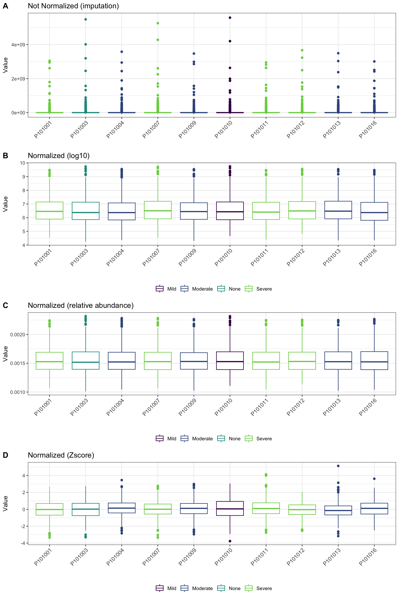
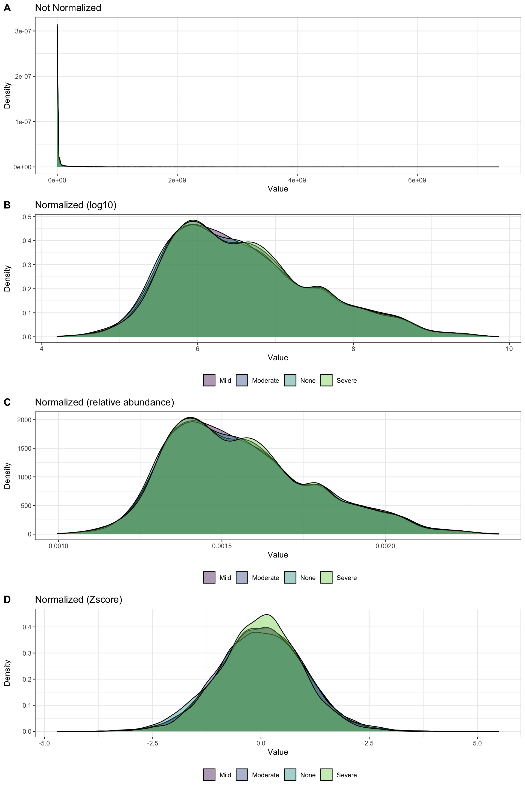

# (PART) Metabolomics Data Analysis {.unnumbered}


# Data Processing {#dataprocessing}


代谢组数据一般是搜库后的质谱峰度谱数据，用峰强intensity表示。Raw intensity通常不直接用于假设检验或线性回归等统计方法，需要对其做数据预处理。

本次应用到的数据是Zeybel 2022年发布的文章_Multiomics Analysis Reveals the Impact of Microbiota on Host Metabolism in Hepatic Steatosis_的粪便代谢组学质谱数据。

> 55份粪便代谢组，1032个代谢物

## 处理流程

+ 数据检查：1.核查所有代谢物intensity value是数值型；2.缺失值的比例

+ 补充缺失值

+ 数据过滤（针对代谢物或样本）

+ 数据标准化（针对代谢物或样本）


## 加载R包

```r
knitr::opts_chunk$set(message = FALSE, warning = FALSE)
library(tidyverse)
library(SummarizedExperiment)

# rm(list = ls())
options(stringsAsFactors = F)
options(future.globals.maxSize = 1000 * 1024^2)
```


## 导入数据

对数据[OmicsDataSet-Zeybel et al. - 2022.xlsx](https://github.com/HuaZou/DraftNotes/blob/main/InputData/Zeybel-2022/OmicsDataSet-Zeybel et al. - 2022.xlsx)处理后生成的输入文件，详细情况可参考**Data Set**具体章节。

> ```R
> saveRDS(se_metabolite, "./InputData/result/Zeybel_2022_fecal_metabolite_se.RDS", compress = TRUE)
> ```


```r
data_meta <- readRDS("./InputData/result/Zeybel_2022_fecal_metabolite_se.RDS")

data_meta
#> class: SummarizedExperiment 
#> dim: 1032 55 
#> metadata(0):
#> assays(1): ''
#> rownames(1032): Chem_100002945 Chem_100002356 ...
#>   Chem_100015836 Chem_826
#> rowData names(13): metabolitesID BIOCHEMICAL ... KEGG
#>   SampleIDHMDBID
#> colnames(55): P101001 P101003 ... P101095 P101096
#> colData names(47): PatientID Gender ...
#>   Right_leg_fat_free_mass Right_leg_total_body_water
```


```r
# colData(data_meta)
# assay(data_meta)
# rowData(data_meta)
```


## 构建QC样本

该数据集不存在QC样本，这导致不能做QC的变化范围的数据过滤，因此构建新的QC样本。以上述随机抽取6个样本作为QC样本。

QC样本一般是送测样本混合后再分成N份样本（迈维非靶或广靶均是这样做）再测，它可以评估每次质谱的效果或做代谢物过滤。


```r
meta_tab <- colData(data_meta) |>
  as.data.frame()
feature_tab <- rowData(data_meta) 
assay_tab <- assay(data_meta) |>
  as.data.frame()

rand_sample <- sample(colnames(assay_tab), 6)
QC_assay <- assay_tab[, rand_sample]
colnames(QC_assay) <- paste0("QC", 1:6)
assay_tab_new <- cbind(assay_tab, QC_assay)

QC_meta <- data.frame(matrix(NA, nrow = 6, ncol = ncol(meta_tab))) 
colnames(QC_meta) <- colnames(meta_tab)
rownames(QC_meta) <- colnames(QC_assay)
QC_meta$LiverFatClass <- "QC"
QC_meta$PatientID <- rownames(QC_meta)
meta_tab_new <- rbind(meta_tab, QC_meta)

data_meta_new <- SummarizedExperiment(
  assays = assay_tab_new,
  rowData = feature_tab,
  colData = meta_tab_new,
  checkDimnames = TRUE)

data_meta_new
#> class: SummarizedExperiment 
#> dim: 1032 61 
#> metadata(0):
#> assays(1): ''
#> rownames(1032): Chem_100002945 Chem_100002356 ...
#>   Chem_100015836 Chem_826
#> rowData names(13): metabolitesID BIOCHEMICAL ... KEGG
#>   SampleIDHMDBID
#> colnames(61): P101001 P101003 ... QC5 QC6
#> colData names(47): PatientID Gender ...
#>   Right_leg_fat_free_mass Right_leg_total_body_water
```


## 数据过滤


```r
CheckData <- function(object) {
  
  # object = data_meta_new
  
  # features are in rows and Samples in columns
  DataAssay <- SummarizedExperiment::assay(object)
  
  # numeric & missing values
  int_mat <- DataAssay
  rowNms <- rownames(int_mat)
  colNms <- colnames(int_mat)
  naNms <- sum(is.na(int_mat))
  for (i in 1:ncol(int_mat)) {
    if (class(int_mat[, i]) == "integer64") {
      int_mat[, i] <- as.double(int_mat[, i])
    }
  }
  
  num_mat <- apply(int_mat, 2, as.numeric)
  if (sum(is.na(num_mat)) > naNms) {
    num_mat <- apply(int_mat, 2, function(x) as.numeric(gsub(",",  "", x)))
    if (sum(is.na(num_mat)) > naNms) {
      message("<font color=\"red\">Non-numeric values were found and replaced by NA.</font>")
    } else {
      message("All data values are numeric.")
    }
  } else {
    message("All data values are numeric.")
  }
  
  int_mat <- num_mat
  rownames(int_mat) <- rowNms
  colnames(int_mat) <- colNms
  varCol <- apply(int_mat, 2, var, na.rm = T)
  constCol <- (varCol == 0 | is.na(varCol))
  constNum <- sum(constCol, na.rm = T)
  if (constNum > 0) {
    print(paste("<font color=\"red\">", constNum, 
      "features with a constant or single value across samples were found and deleted.</font>"))
    int_mat <- int_mat[, !constCol, drop = FALSE]
  }
  
  totalCount <- nrow(int_mat) * ncol(int_mat)
  naCount <- sum(is.na(int_mat))
  naPercent <- round(100 * naCount/totalCount, 1)

  print(paste("A total of ", naCount, " (", naPercent, 
    "%) missing values were detected.", sep = ""))  

  DataMeta <- colData(object) |>
    as.data.frame()
  DataFeature <- rowData(object)
  
  res <- SummarizedExperiment(
    assays = int_mat,
    rowData = DataFeature,
    colData = DataMeta,
    checkDimnames = TRUE)
  
  return(object)
}

se_check <- CheckData(object = data_meta_new)
#> [1] "A total of 7839 (12.5%) missing values were detected."
se_check
#> class: SummarizedExperiment 
#> dim: 1032 61 
#> metadata(0):
#> assays(1): ''
#> rownames(1032): Chem_100002945 Chem_100002356 ...
#>   Chem_100015836 Chem_826
#> rowData names(13): metabolitesID BIOCHEMICAL ... KEGG
#>   SampleIDHMDBID
#> colnames(61): P101001 P101003 ... QC5 QC6
#> colData names(47): PatientID Gender ...
#>   Right_leg_fat_free_mass Right_leg_total_body_water
```

结果：12.5%的缺失值存在，下面进行缺失值补充。


## 补缺失值

Missing Value 的产生原因主要有两个：1）一个代谢峰在某些生物样品中存在而在另外一些生物样品中不存在； 2）某些代谢物在生物样品中的浓度低于质谱的检测限。

Missing Value 在数据中的表现形式为 NA值。对于大规模代谢组学来说，因为其长时间的数据采集，质谱灵敏度的漂移使MV的问题更加严重。一般来说，对一个代谢组学数据来说， Missing Value 会占到所有数据点的 20%左右 。首先需要对 Missing Value 进行过滤，对于 Missing Value超过一定比例的代谢峰来说，该代谢峰很有可能是一个偶然出现的噪声信号，因此将其从数据中删除。 比如，在代谢组学数据中，一般采用的标准为代谢峰需要在 80%的质量控制（quality control， QC） 样品中出现，否则删除。对于 Missing Value 超过一定比例的生物样品来说，该样品很有可能是在样品制备或者数据采集过程中出现了误差，如该样品稀释比例异常或者进样体积异常，这些样品需要被删除掉。

删除掉异常的生物样品和代谢峰之后，剩余的 Missing Value 需要统计学方法进行补齐（MVimputation），不同的 Missing Value补齐方法对数据的结构影响非常大，最好的 Missing Value 补齐方法是那些可以最好的重构出数据原本结构的方法。 Gromski (The influence of scaling metabolomics data on model classification accuracy) 通过使用完整的代谢组学数据构建 Missing Value 数据，然后使用不同的 Missing Value补齐方法对数据进行补齐，然后对不同 Missing Value 补齐方法补齐的数据进行多元统计学分析， 最终发现 K 值临近方法（K-nearest neighbor，KNN）对代谢组学数据的补齐效果最好。

缺失值补充方法有很多种，如下

+ “none”: all missing values will be replaced by zero.

+ “LOD”: specific Limit Of Detection which provides by user.

+ “half_min”: half minimal values across samples except zero.

+ “median”: median values across samples except zero.

+ “mean”: mean values across samples except zero.

+ “min”: minimal values across samples except zero.

+ “knn”: k-nearest neighbors samples.

+ “rf”: nonparametric missing value imputation using Random Forest.

+ “QRILC”: missing values imputation based quantile regression. (default: “none”).


一般采用k近邻的方法，它的原理是离该缺失值样本最近的K个样本具有类似的属性，使用它们的平均值填补缺失值是相对可靠的方法，但是也需要注意该方法的阈值适用范围。

这里使用**[MicrobiomeAnalysis](https://zouhua.top/MicrobiomeAnalysis/)**提供的[impute_abundance](https://zouhua.top/MicrobiomeAnalysis/reference/impute_abundance.html)函数，先安装此包。
```R
if (!requireNamespace(c("remotes", "devtools"), quietly=TRUE)) {
  install.packages(c("devtools", "remotes"))
}

remotes::install_github("HuaZou/MicrobiomeAnalysis")

# library(MicrobiomeAnalysis)
```


```r
library(MicrobiomeAnalysis)

se_impute <- impute_abundance(
  object = se_check,
  group = "LiverFatClass",
  method = "knn",
  cutoff = 50,
  knum = 10)

se_impute
#> class: SummarizedExperiment 
#> dim: 956 61 
#> metadata(0):
#> assays(1): ''
#> rownames(956): Chem_100002945 Chem_100002356 ...
#>   Chem_100015836 Chem_826
#> rowData names(13): metabolitesID BIOCHEMICAL ... KEGG
#>   SampleIDHMDBID
#> colnames(61): P101001 P101003 ... QC5 QC6
#> colData names(47): PatientID Gender ...
#>   Right_leg_fat_free_mass Right_leg_total_body_water
```

结果：代谢物的缺失值在任何组大于50%会被移除，最后移除的代谢物表达矩阵用于缺失值补充。


## 数据过滤

在非靶向代谢组或蛋白质组经常会使用该方法，目的是过滤掉不太可能用于分析的代谢物或蛋白质。

过滤会基于QC样本的相对丰度标准方差relative standard deviation (RSD = SD / mean)，可以理解为特征的数据波动范围。 LC-MS或GC-MS对不同样本可能存在不同偏好行，采用QC样本可以得到波动范围，那些具有高RSD的特征可能受到质谱操作的影响较大，因此它们的可靠性相对较低不需要用于后续下游分析。一般情况下，RSD阈值在LC-MS和GC-MS分别是20%和30%（*保留波动小于该阈值的代谢物*）。

在通过QC的RSD过滤完后，还可以通过以下方法过滤噪声（过滤低丰度或高变化的特征）

+ 过滤方法

  - Interquantile range (IQR)（过滤常数特征，即波动较小的特征，它们可能是常态表达）;
  
  - Standard deviation (SD) （过滤常数特征，即波动较小的特征，它们可能是常态表达）;
  
  - Median absolute deviation (MAD) （过滤常数特征，即波动较小的特征，它们可能是常态表达）;
  
  - Relative standard deviation (RSD = SD/mean) （过滤低重复性特征，它们可能受到质谱操作影响）;
  
  - Non-parametric relative standard deviation (MAD/median) （过滤低重复性特征，它们可能受到质谱操作影响）;
  
  - Mean intensity value （过滤低丰度特征，它们可能是噪声或仪器测量极限值）;
  
  - Median intensity value （过滤低丰度特征，它们可能是噪声或仪器测量极限值）;


+ 一般过滤的阈值设置

  - 少于 250 个特征: 5%
  
  - 介于 250 到 500 个特征: 10%
  
  - 介于 500 到 1000 个特征: 25%
  
  - 超过 1000 个特征: 40%
  


```r
FilterFeature <- function(
    object,
    group,    
    qc_label,
    method = c("none", "iqr", "rsd", 
               "nrsd", "mean", "sd",
               "mad", "median"),
    rsd_cutoff = 25) {
  
  # object = se_impute
  # group = "LiverFatClass"  
  # qc_label = "QC"
  # method = "iqr"
  # rsd_cutoff = 25  
  
  # row->features; col->samples  
  features_tab <- SummarizedExperiment::assay(object) 
  metadata_tab <- SummarizedExperiment::colData(object) 
  
  # QC samples
  colnames(metadata_tab)[which(colnames(metadata_tab) == group)] <- "TempGroup"
  qc_samples <- metadata_tab %>% 
    as.data.frame() %>%
    dplyr::filter(TempGroup == qc_label)
  if (dim(qc_samples)[1] == 0) {
    stop("No qc samples have been chosen, please check your input")
  }
  
  # QC samples' feature table
  qc_feature <- features_tab[, colnames(features_tab) %in% 
                               rownames(qc_samples)] %>%
    t()
  
  # filter features by QC RSD
  rsd <- rsd_cutoff / 100
  sds <- apply(qc_feature, 2, sd, na.rm = T)
  mns <- apply(qc_feature, 2, mean, na.rm = T)
  rsd_vals <- abs(sds/mns) %>% na.omit()
  gd_inx <- rsd_vals < rsd
  int_mat <- features_tab[gd_inx, ]
  print(paste("Removed ", (dim(qc_feature)[2] - dim(int_mat)[1]), 
  " features based on QC RSD values. QC samples are excluded from downstream functional analysis."))
  
  # whether to filter features by percentage according to the number
  PerformFeatureFilter <- function(datMatrix, 
                                   qc_method = method,
                                   remain_num = NULL) {
    
    dat <- datMatrix
    feat_num <- ncol(dat)
    feat_nms <- colnames(dat)
    nm <- NULL
    if (qc_method == "none" && feat_num < 5000) { # only allow for less than 4000
      remain <- rep(TRUE, feat_num)
      nm <- "No filtering was applied"
    } else {
      if (qc_method == "rsd"){
        sds <- apply(dat, 2, sd, na.rm = T)
        mns <- apply(dat, 2, mean, na.rm = T)
        filter_val <- abs(sds/mns)
        nm <- "Relative standard deviation"
      } else if (qc_method == "nrsd" ) {
        mads <- apply(dat, 2, mad, na.rm = T)
        meds <- apply(dat, 2, median, na.rm = T)
        filter_val <- abs(mads/meds)
        nm <- "Non-paramatric relative standard deviation"
      } else if (qc_method == "mean") {
        filter_val <- apply(dat, 2, mean, na.rm = T)
        nm <- "mean"
      } else if (qc_method == "sd") {
        filter_val <- apply(dat, 2, sd, na.rm = T)
        nm <- "standard deviation"
      } else if (qc_method == "mad") {
        filter_val <- apply(dat, 2, mad, na.rm = T)
        nm <- "Median absolute deviation"
      } else if (qc_method == "median") {
        filter_val <- apply(dat, 2, median, na.rm = T)
        nm <- "median"
      } else if (qc_method == "iqr") { # iqr
        filter_val <- apply(dat, 2, IQR, na.rm = T)
        nm <- "Interquantile Range"
      }
      
      # get the rank of the filtered variables
      rk <- rank(-filter_val, ties.method = "random")
      
      if (is.null(remain_num)) { # apply empirical filtering based on data size
          if (feat_num < 250) { # reduce 5%
            remain <- rk < feat_num * 0.95
            message("Further feature filtering based on ", nm)
          } else if (feat_num < 500) { # reduce 10%
            remain <- rk < feat_num * 0.9
            message("Further feature filtering based on ", nm)
          } else if (feat_num < 1000) { # reduce 25%
            remain <- rk < feat_num * 0.75
            message("Further feature filtering based on ", nm)
          } else { # reduce 40%, if still over 5000, then only use top 5000
            remain <- rk < feat_num * 0.6
            message("Further feature filtering based on ", nm)
          }
      } else {
        remain <- rk < remain_num
      }
    }
    
    res <- datMatrix[, remain]
    
    return(res)
  }  
  
  feature_res <- PerformFeatureFilter(t(int_mat))
  
  # remove QC samples 
  feature_final <- feature_res[!rownames(feature_res) %in% rownames(qc_samples), ]
  
  # save int_mat into se object 
  datarow <- object@elementMetadata %>% 
    as.data.frame() 
  rownames(datarow) <- datarow$metabolitesID
  res <- import_SE(
    object = t(feature_final),
    rowdata = datarow,
    coldata = object@colData)
  
  return(res) 
}

se_filter <- FilterFeature(
  object = se_impute,
  group = "LiverFatClass",
  qc_label = "QC",
  method = "iqr",
  rsd_cutoff = 90)
#> [1] "Removed  94  features based on QC RSD values. QC samples are excluded from downstream functional analysis."

se_filter
#> class: SummarizedExperiment 
#> dim: 646 55 
#> metadata(0):
#> assays(1): ''
#> rownames(646): Chem_100002945 Chem_100002356 ...
#>   Chem_1004 Chem_100015836
#> rowData names(13): metabolitesID BIOCHEMICAL ... KEGG
#>   SampleIDHMDBID
#> colnames(55): P101001 P101003 ... P101095 P101096
#> colData names(47): PatientID Gender ...
#>   Right_leg_fat_free_mass Right_leg_total_body_water
```

**结果**：过滤掉不符合要求的代谢物以及也过滤掉了QC样本 (25%过滤太多了，这里选择90%)

+ 根据QC样本的代谢物RSD过滤代谢物

+ 再根据代谢物波动范围过滤不符合的代谢物


## 数据标准化

数据标准化为了三部分：

+ 基于单个数值本身的数据转换，目的是将数据进行各种形式的转换从而提高数据的正态分布性，校正奇异值，达到减少分析误差的效果。代谢组学数据大都为偏倚分布，因此数据转换是非常常见的数据处理方式之一，常用的方法为对数变换（log）。经过数据转换之后的数据仍然没有处在同一个标准量度上，对于代谢组学数据来说，不同代谢峰的强度可以相差几个甚至十几个数量级，如此大的差别导致在多元统计分析时，强度大的代谢峰有可能掩盖强度小的代谢峰的贡献。因此，在统计分析前，尤其是多元统计分析，为了将所有代谢峰统一到同一个量度，需要对数据进行中心化和标度化。

  - Log transformation (base 10)

  - Square root transformation (square root of data values)

  - Cube root transformation (cube root of data values)

使用**MicrobiomeAnalysis**提供的`transform_abundances`，选择*log10p*，改变数据的偏态分布。

```r
se_tran <- MicrobiomeAnalysis::transform_abundances(
  object = se_filter,
  transform = "log10p")

se_tran
#> class: SummarizedExperiment 
#> dim: 646 55 
#> metadata(0):
#> assays(1): ''
#> rownames(646): Chem_100002945 Chem_100002356 ...
#>   Chem_1004 Chem_100015836
#> rowData names(13): metabolitesID BIOCHEMICAL ... KEGG
#>   SampleIDHMDBID
#> colnames(55): P101001 P101003 ... P101095 P101096
#> colData names(47): PatientID Gender ...
#>   Right_leg_fat_free_mass Right_leg_total_body_water
```


+ 基于样本自身的标准化，目的是去除样本间的系统差异（比如不同测序深度），例如通过均值中心化处理， 代谢峰转变为与自己平均值之间的差值，且所有的变量都以零为中心变化，因此中心化的数据就能直接反应变量的变化情况，有利于观察组间差异和聚类分析。

  - Sample-specific normalization (i.e. weight, volume)
  
  - Normalization by sum (relative abundance)
  
  - Normalization by median
  
  - Normalization by a reference sample (PQN)
  
  - Normalization by a pooled sample from group (group PQN)
  
  - Normalization by reference feature
  
  - Quantile normalization (suggested only for > 1000 features)


```r
NormalizeData <- function(
    object,
    rowNorm = c("Quantile", "GroupPQN", "SamplePQN",
                "CompNorm", "SumNorm", "MedianNorm",
                "SpecNorm", "None"),
    ref = NULL,
    SpeWeight = 1) {
  
  # object = se_tran
  # rowNorm = "SumNorm"
  # ref = NULL
  # SpeWeight = 1
  
  # row->features; col->samples 
  features_tab <- SummarizedExperiment::assay(object) 
  metadata_tab <- SummarizedExperiment::colData(object)   
  
  # row->samples; col->features 
  feaTab <- t(features_tab)
  colNames <- colnames(feaTab)
  rowNames <- rownames(feaTab)
  
  #############################################
  # Sample normalization
  # perform quantile normalization on the raw data (can be log transformed later by user)
  QuantileNormalize <- function(data) {
    return(t(preprocessCore::normalize.quantiles(t(data), copy=FALSE)));
  }
  # normalize by a reference sample (probability quotient normalization)
  # ref should be the name of the reference sample
  ProbNorm <- function(x, ref_smpl) {
    return(x/median(as.numeric(x/ref_smpl), na.rm = T))
  }
  
  # normalize by a reference reference (i.e. creatinine)
  # ref should be the name of the cmpd
  CompNorm <- function(x, ref) {
    return(1000 * x/x[ref])
  }
  
  # normalize by sum (relative abundance)
  SumNorm <- function(x) {
    #return(1000 * x/sum(x, na.rm = T))
    return(x/sum(x, na.rm = T))
  }
  
  # normalize by median
  MedianNorm <- function(x) {
    return(x/median(x, na.rm = T))
  }  
  
  # row-wise normalization (samples)
  if (rowNorm == "Quantile") {
    datrowNorm <- QuantileNormalize(feaTab)
    # this can introduce constant variables if a variable is 
    # at the same rank across all samples (replaced by its average across all)
    varCol <- apply(datrowNorm, 2, var, na.rm = T)
    constCol <- (varCol == 0 | is.na(varCol))
    constNum <- sum(constCol, na.rm = T)
    if (constNum > 0) {
      message(paste("After quantile normalization", constNum, 
                    "features with a constant value were found and deleted."))
      datrowNorm <- datrowNorm[, !constCol, drop = FALSE]
      colNames <- colnames(datrowNorm)
      rowNames <- rownames(datrowNorm)
    }
    rownm <- "Quantile Normalization"
  } else if (rowNorm == "GroupPQN") {
    grp_inx <- metadata_tab$group == ref
    ref.smpl <- apply(feaTab[grp_inx, , drop = FALSE], 2, mean)
    datrowNorm <- t(apply(feaTab, 1, ProbNorm, ref.smpl))
    rownm <- "Probabilistic Quotient Normalization by a reference group"
  } else if (rowNorm == "SamplePQN") {
    ref.smpl <- feaTab[ref, , drop = FALSE]
    datrowNorm <- t(apply(feaTab, 1, ProbNorm, ref.smpl))
    rownm <- "Probabilistic Quotient Normalization by a reference sample"
  } else if (rowNorm == "CompNorm") {
    datrowNorm <- t(apply(t(feaTab), 1, CompNorm, ref))
    rownm <- "Normalization by a reference feature";
  } else if (rowNorm == "SumNorm") {
    datrowNorm <- t(apply(feaTab, 1, SumNorm))
    rownm <- "Normalization to constant sum"
  } else if (rowNorm == "MedianNorm") {
    datrowNorm <- t(apply(feaTab, 1, MedianNorm))
    rownm <- "Normalization to sample median"
  } else if(rowNorm == "SpecNorm") {
    norm.vec <- rep(SpeWeight, nrow(feaTab)) # default all same weight vec to prevent error
    datrowNorm <- feaTab / norm.vec
    message("No sample specific information were given, all set to 1.0")
    rownm <- "Normalization by sample-specific factor"
  } else {
    # nothing to do
    rownm <- "N/A"
    datrowNorm <- feaTab
  }
  ################################################ 
  
  # use apply will lose dimension info (i.e. row names and colnames)
  # row->samples; col->features 
  rownames(datrowNorm) <- rowNames
  colnames(datrowNorm) <- colNames
  
  # if the reference by feature, the feature column should be removed, since it is all 1
  if(rowNorm == "CompNorm" && !is.null(ref)){
    inx <- match(ref, colnames(datrowNorm))
    datrowNorm <- datrowNorm[, -inx, drop=FALSE]
    colNames <- colNames[-inx]
  }

  DataMeta <- colData(object) |>
    as.data.frame()
  DataFeature <- rowData(object)
  
  datrowNorm[is.na(datrowNorm)] <- 0
  
  se <- SummarizedExperiment(
    assays = t(datrowNorm),
    rowData = DataFeature,
    colData = DataMeta,
    checkDimnames = TRUE)  
  
  # need to do some sanity check, for log there may be Inf values introduced
  res <- CheckData(se)
  
  return(res)
}

se_norm <- NormalizeData(
  object = se_tran,
  rowNorm = "SumNorm")
#> [1] "A total of 0 (0%) missing values were detected."

se_norm
#> class: SummarizedExperiment 
#> dim: 646 55 
#> metadata(0):
#> assays(1): ''
#> rownames(646): Chem_100002945 Chem_100002356 ...
#>   Chem_1004 Chem_100015836
#> rowData names(13): metabolitesID BIOCHEMICAL ... KEGG
#>   SampleIDHMDBID
#> colnames(55): P101001 P101003 ... P101095 P101096
#> colData names(47): PatientID Gender ...
#>   Right_leg_fat_free_mass Right_leg_total_body_water
```


+ 基于特征的数据标准化，目的是增加各个变量在不同样品中的可比性

  - Mean centering (mean-centered only)

  - Auto scaling (mean-centered and divided by the standard deviation of each variable)

  - Pareto scaling (mean-centered and divided by the square root of the standard deviation of each variable)

  - Range scaling (mean-centered and divided by the range of each variable)


```r
se_scale <- scale_variables(
  object = se_norm,
  method = "zscore")

se_scale
#> class: SummarizedExperiment 
#> dim: 646 55 
#> metadata(0):
#> assays(1): ''
#> rownames(646): Chem_100002945 Chem_100002356 ...
#>   Chem_1004 Chem_100015836
#> rowData names(13): metabolitesID BIOCHEMICAL ... KEGG
#>   SampleIDHMDBID
#> colnames(55): P101001 P101003 ... P101095 P101096
#> colData names(47): PatientID Gender ...
#>   Right_leg_fat_free_mass Right_leg_total_body_water
```

查看数据状态

```r
SummarizedExperiment::assay(se_filter)  %>% data.frame() %>% head()
#>                   P101001      P101003      P101004
#> Chem_100002945 51127588.0  42040432.00  34940596.00
#> Chem_100002356  5105020.5   4006120.25   3885477.00
#> Chem_100021502   756686.2    983889.19    851026.50
#> Chem_100008903 94392176.0 117463144.00 115155104.00
#> Chem_100000657 25632184.0  26952236.00  25106562.00
#> Chem_100001397   123026.4     86646.23     22810.19
#>                   P101007     P101009    P101010    P101011
#> Chem_100002945 58518636.0  51118832.0 83783688.0 29017984.0
#> Chem_100002356  4285129.5   6665653.5  9057441.0  2802655.2
#> Chem_100021502   726593.9    232959.5   650261.1   541954.8
#> Chem_100008903 79582632.0 118408760.0 92508664.0 94076424.0
#> Chem_100000657 31371314.0  27787270.0 26685844.0 27780988.0
#> Chem_100001397   375686.5    118662.2   130040.2   258790.7
#>                   P101012    P101013     P101016
#> Chem_100002945 51222064.0 77550128.0 30949554.00
#> Chem_100002356  5996555.0 11367511.0  3874736.75
#> Chem_100021502   598491.0   438885.6  1625844.75
#> Chem_100008903 69473744.0 80567352.0 98766592.00
#> Chem_100000657 30158644.0 27591838.0 21537830.00
#> Chem_100001397   121117.4   526472.9    51847.78
#>                    P101017     P101018  P101019
#> Chem_100002945  26923596.0  56720032.0 27956064
#> Chem_100002356   2817151.0   8029728.0  3766664
#> Chem_100021502    566466.9    427850.6   519559
#> Chem_100008903 129547656.0 118271584.0 37880820
#> Chem_100000657  34510160.0  24383964.0 25435894
#> Chem_100001397    309598.5    142944.8   122802
#>                     P101021     P101022     P101024
#> Chem_100002945  48723600.00  16282054.0 77028824.00
#> Chem_100002356   5174967.00   1746182.9  5519105.50
#> Chem_100021502   1301591.25   1474247.4   970475.75
#> Chem_100008903 163868720.00 106189520.0 71475920.00
#> Chem_100000657  33230896.00  28310448.0 24481250.00
#> Chem_100001397     36066.18    143211.6    41351.85
#>                    P101025     P101027     P101030
#> Chem_100002945  32022342.0  22589448.0  38449788.0
#> Chem_100002356   2557365.0   1882902.6   2860324.2
#> Chem_100021502    628680.1    635516.6    367246.8
#> Chem_100008903 147776592.0 127571792.0 128319128.0
#> Chem_100000657  36634552.0  26803284.0  38250240.0
#> Chem_100001397    299205.7    338827.8    240744.7
#>                   P101031    P101038      P101041
#> Chem_100002945 59134052.0 32038030.0  20833830.00
#> Chem_100002356  4721201.0  4011627.5   2938779.00
#> Chem_100021502   512037.9   852000.1    634488.56
#> Chem_100008903 90447848.0 46622592.0 111919096.00
#> Chem_100000657 31415658.0 36232668.0  27869314.00
#> Chem_100001397   748813.9   497035.7     45508.17
#>                   P101042    P101047     P101050
#> Chem_100002945 33809080.0 18637508.0  21978476.0
#> Chem_100002356  3017260.5  1935144.1   2897211.0
#> Chem_100021502  1680135.8   326005.6    316650.2
#> Chem_100008903 89762056.0 97617984.0 112900000.0
#> Chem_100000657 29975144.0 30274784.0  29706444.0
#> Chem_100001397   141089.5   151984.7    167735.3
#>                    P101051    P101052     P101054
#> Chem_100002945 24265162.00 52203780.0  12836384.0
#> Chem_100002356  2476279.50  5928454.0   1685760.6
#> Chem_100021502   737202.88   459385.9    346176.6
#> Chem_100008903 71779912.00 64008512.0 111279888.0
#> Chem_100000657 28526700.00 19797506.0  22277808.0
#> Chem_100001397    83878.49   153736.2    131393.6
#>                   P101056     P101057      P101059
#> Chem_100002945 18546636.0 32301820.00  22645984.00
#> Chem_100002356  1650011.0  3419157.75   2196044.25
#> Chem_100021502   585470.2   417958.47    734586.31
#> Chem_100008903 68771592.0 77140264.00 113564872.00
#> Chem_100000657 20182492.0 22884156.00  28125854.00
#> Chem_100001397   125445.7    36627.55     67012.24
#>                   P101061    P101062      P101064
#> Chem_100002945 23683254.0 29027646.0  32629048.00
#> Chem_100002356  3217499.2  4060367.8   3031529.50
#> Chem_100021502   337035.7   982299.4   1255148.00
#> Chem_100008903 96143304.0 98940424.0 108473368.00
#> Chem_100000657 27426428.0 27010240.0  29414698.00
#> Chem_100001397   248423.8    35064.2     32855.53
#>                   P101065    P101067    P101068    P101069
#> Chem_100002945 22950806.0 33555116.0 44283972.0 52685972.0
#> Chem_100002356  2467147.2  3567913.2  6525382.0  3984333.5
#> Chem_100021502   637699.1   284516.1   664800.1   684813.6
#> Chem_100008903 86418592.0 95236288.0 71289048.0 74526792.0
#> Chem_100000657 25252692.0 33943364.0 28292364.0 31375248.0
#> Chem_100001397   137605.2   155844.5   109021.4   178198.0
#>                     P101071     P101072     P101074
#> Chem_100002945  32415040.00  34170948.0  22550616.0
#> Chem_100002356   3001414.50   4679519.0   2529255.5
#> Chem_100021502    596846.06    316855.0    646136.8
#> Chem_100008903 115519872.00 127401592.0 108255040.0
#> Chem_100000657  33193432.00  27121940.0  24320710.0
#> Chem_100001397     74016.23    404225.1    124975.2
#>                   P101075    P101076     P101077    P101079
#> Chem_100002945 22058076.0 24455466.0  25225170.0 15718590.0
#> Chem_100002356  2583265.5  3515218.2   3272875.0  2449462.5
#> Chem_100021502   198381.7   255897.7    547243.4   508791.6
#> Chem_100008903 83989120.0 77315256.0 158257952.0 78587928.0
#> Chem_100000657 25176120.0 25405452.0  25782852.0 26353500.0
#> Chem_100001397   177570.7   155756.0    410891.4   292623.9
#>                    P101080     P101081     P101082
#> Chem_100002945  29120336.0  65904836.0  22908578.0
#> Chem_100002356   2695001.5   6474709.5   2110243.8
#> Chem_100021502   1256550.2    339909.3    596292.2
#> Chem_100008903 163246832.0 124678488.0 100435064.0
#> Chem_100000657  25819136.0  34524436.0  27735140.0
#> Chem_100001397    162495.1    237136.2    154358.6
#>                   P101084     P101085      P101088
#> Chem_100002945 29140440.0  20427124.0  29199012.00
#> Chem_100002356  3648091.2   3253531.8   4154170.75
#> Chem_100021502   497300.8    309859.3    601515.12
#> Chem_100008903 86139200.0 103513520.0 101921248.00
#> Chem_100000657 30228504.0  29317998.0  28259446.00
#> Chem_100001397   181003.1    126785.3     36267.95
#>                    P101090     P101094     P101095
#> Chem_100002945  24042020.0 36910084.00 35662068.00
#> Chem_100002356   2396959.8  4759584.50  3452283.25
#> Chem_100021502    794206.0   414972.84  3606340.50
#> Chem_100008903 107571936.0 85426888.00 53107852.00
#> Chem_100000657  32471818.0 25804370.00 25684144.00
#> Chem_100001397    217137.2    75320.37    59115.54
#>                    P101096
#> Chem_100002945 66402192.00
#> Chem_100002356  6374383.00
#> Chem_100021502  1077637.50
#> Chem_100008903 80095704.00
#> Chem_100000657 28136850.00
#> Chem_100001397    81256.43
```


```r
SummarizedExperiment::assay(se_scale) %>% as.data.frame() %>% head()
#>                   P101001    P101003    P101004     P101007
#> Chem_100002945  1.0003202  0.8340093  0.4824815  1.16514410
#> Chem_100002356  0.7698677  0.4528499  0.4722902  0.20487334
#> Chem_100021502  0.3493679  1.0177030  0.8133573  0.17978061
#> Chem_100008903 -0.1750138  0.9830758  1.0729215 -0.95957735
#> Chem_100000657 -0.8755692  0.3320746  0.1405178  0.05966061
#> Chem_100001397 -0.1384950 -0.4886188 -2.2159878  1.25940891
#>                   P101009    P101010     P101011    P101012
#> Chem_100002945  1.2101541 2.51666716 -0.23603447  0.9681736
#> Chem_100002356  1.5968592 2.40769233 -0.53984618  1.1277217
#> Chem_100021502 -1.7072851 0.23001842 -0.16887486 -0.1021096
#> Chem_100008903  0.8551114 0.14676736  0.04917596 -1.2248011
#> Chem_100000657  0.2436337 0.16307095  0.14091374  0.1443482
#> Chem_100001397 -0.1126339 0.03397164  0.89961516 -0.1717796
#>                   P101013    P101016    P101017     P101018
#> Chem_100002945  2.0188766  0.2942855 -0.8313337  0.97319820
#> Chem_100002356  2.6944940  0.5645338 -0.8739209  1.61833342
#> Chem_100021502 -0.6590182  2.0858052 -0.3221498 -0.85175224
#> Chem_100008903 -0.7100038  0.7289363  0.5094011  0.17118653
#> Chem_100000657 -0.4044572 -0.6113151  0.4869781 -1.97118260
#> Chem_100001397  1.7605892 -1.0914366  0.9755675 -0.04186828
#>                   P101019    P101021    P101022    P101024
#> Chem_100002945 -0.2712992  0.9955133 -1.5896988  2.2111767
#> Chem_100002356  0.2276389  0.9004347 -1.6181559  1.1215870
#> Chem_100021502 -0.2140225  1.4138229  1.7307078  0.9167298
#> Chem_100008903 -2.8549375  1.7868883  0.5688224 -0.8265065
#> Chem_100000657 -0.3095136  1.2218079  0.5114391 -0.6834080
#> Chem_100001397 -0.0599027 -1.7098957  0.1531504 -1.5061848
#>                   P101025     P101027    P101030
#> Chem_100002945 -0.5131518 -1.12363191  0.2445829
#> Chem_100002356 -1.1975338 -1.72629859 -0.6727476
#> Chem_100021502 -0.1942294 -0.02995268 -1.0063388
#> Chem_100008903  0.7802989  0.66296793  0.7574122
#> Chem_100000657  0.5904137 -0.84889311  1.7406139
#> Chem_100001397  0.8890289  1.14875934  0.7222524
#>                     P101031    P101038    P101041
#> Chem_100002945  1.168623874 -0.2262161 -0.9809803
#> Chem_100002356  0.419680765  0.1279997 -0.3563059
#> Chem_100021502 -0.473153554  0.5272900  0.1685822
#> Chem_100008903 -0.573539379 -2.5698105  0.7331244
#> Chem_100000657  0.009496466  1.3142118  0.3866294
#> Chem_100001397  2.150497430  1.6629837 -1.3594124
#>                    P101042    P101047    P101050    P101051
#> Chem_100002945 -0.20090806 -0.8221882 -0.8428020 -0.8411860
#> Chem_100002356 -0.65053616 -1.0044608 -0.3867684 -0.9759579
#> Chem_100021502  1.70722179 -0.8169443 -1.1135464  0.3044130
#> Chem_100008903 -0.58479970  0.9161006  0.7688378 -1.0618801
#> Chem_100000657 -0.28533153  2.2064810  0.8421985 -0.1252541
#> Chem_100001397 -0.02285532  0.3938023  0.3611153 -0.6384336
#>                   P101052      P101054     P101056
#> Chem_100002945  0.9926892 -2.296699968 -1.43237721
#> Chem_100002356  1.0808513 -1.801646341 -1.89570397
#> Chem_100021502 -0.6001134 -1.014348465 -0.07517259
#> Chem_100008903 -1.5220028  0.552048340 -1.09542644
#> Chem_100000657 -2.8081437 -1.475308440 -2.29749895
#> Chem_100001397  0.1323507 -0.003866928 -0.08340496
#>                   P101057    P101059     P101061
#> Chem_100002945  0.1681043 -0.8517417 -0.80214648
#> Chem_100002356  0.0597999 -1.1313483 -0.25699974
#> Chem_100021502 -0.5719122  0.3928758 -1.07911803
#> Chem_100008903 -0.4110574  0.6676180  0.03368079
#> Chem_100000657 -0.8242837  0.2289504 -0.11809493
#> Chem_100001397 -1.6273812 -0.8768282  0.82233565
#>                     P101062     P101064     P101065
#> Chem_100002945 -0.212424092 -0.29037347 -1.01430996
#> Chem_100002356  0.380130583 -0.64068901 -1.01468081
#> Chem_100021502  0.942031935  1.17235520  0.01733636
#> Chem_100008903  0.246540820  0.02821322 -0.50583950
#> Chem_100000657  0.009576575 -0.41962877 -1.06217007
#> Chem_100001397 -1.721577407 -1.92445285 -0.00290000
#>                     P101067     P101068    P101069
#> Chem_100002945 -0.003299045  0.46934926  1.1451062
#> Chem_100002356 -0.062895019  1.21147760  0.2290397
#> Chem_100021502 -1.427023227  0.01261184  0.2054004
#> Chem_100008903 -0.090326948 -1.32808732 -0.8518409
#> Chem_100000657  1.167281224 -0.66958167  0.7051260
#> Chem_100001397  0.185767205 -0.35772768  0.3721211
#>                   P101071     P101072     P101074
#> Chem_100002945 -0.2032196 -0.08576324 -0.59386916
#> Chem_100002356 -0.5776847  0.48352488 -0.56010297
#> Chem_100021502 -0.1292284 -1.29807207  0.31345022
#> Chem_100008903  0.3790460  0.67962371  0.89703195
#> Chem_100000657  0.6959017 -0.72717873 -0.02654831
#> Chem_100001397 -0.8295869  1.38520647  0.04111287
#>                   P101075     P101076    P101077
#> Chem_100002945 -0.6159217 -0.49414392 -0.9078624
#> Chem_100002356 -0.4801326  0.15510081 -0.4410953
#> Chem_100021502 -1.8614934 -1.46259716 -0.3369384
#> Chem_100008903  0.1071849 -0.35840476  1.2817143
#> Chem_100000657  0.3067290 -0.01063717 -1.2738198
#> Chem_100001397  0.5185327  0.29413098  1.3778912
#>                    P101079    P101080    P101081    P101082
#> Chem_100002945 -1.39766849 -0.2815374  1.2411439 -0.2174673
#> Chem_100002356 -0.55203632 -0.6806099  1.0146353 -0.7200718
#> Chem_100021502 -0.07166915  1.3499028 -1.3252140  0.3605258
#> Chem_100008903 -0.01517937  1.7767796  0.2037930  1.1324356
#> Chem_100000657  0.81689897 -0.5145400  0.1341008  1.8329001
#> Chem_100001397  1.20709278  0.2676124  0.5800063  0.4461643
#>                    P101084     P101085    P101088
#> Chem_100002945 -0.46790569 -0.79956923  0.1802240
#> Chem_100002356 -0.10759663  0.09177914  0.7628154
#> Chem_100021502 -0.46472994 -1.02787918  0.2536728
#> Chem_100008903 -0.57912087  0.80980413  0.8781108
#> Chem_100000657  0.04971752  1.39120715  1.3696377
#> Chem_100001397  0.33924205  0.07559725 -1.5551143
#>                   P101090    P101094     P101095    P101096
#> Chem_100002945 -0.6907198  0.4533621 -0.04305132  1.4483158
#> Chem_100002356 -0.9084270  0.8247035 -0.30391871  1.1374565
#> Chem_100021502  0.5441123 -0.6113564  3.12218010  0.8849878
#> Chem_100008903  0.5074603 -0.1412276 -2.25574976 -0.9769806
#> Chem_100000657  1.2559215 -0.1213712 -1.27251866 -0.7621895
#> Chem_100001397  0.6738970 -0.6924755 -1.14889648 -0.7480860
```


## 数据分布变化

+ 函数来自于**POMA**包

```r
POMABoxplots <- function(
    data,
    group,
    feature_type = "samples",    
    jitter = FALSE,
    feature_name = NULL,
    show_number = NULL,
    label_size = 10,
    legend_position = "bottom") {
  
  # data = se_impute
  # group = "LiverFatClass"
  # feature_type = "samples"
  # jitter = FALSE
  # feature_name = NULL
  # show_number = 10
  # label_size = 10
  # legend_position = "bottom"
  
  if (missing(data)) {
    stop("data argument is empty!")
  }
  
  if(!is(data, "SummarizedExperiment")){
    stop("data is not a SummarizedExperiment object. \nSee SummarizedExperiment::SummarizedExperiment")
  }
  
  if (!(feature_type %in% c("samples", "features"))) {
    stop("Incorrect value for group argument!")
  }
  
  if (!is.null(feature_name)) {
    if(!any(feature_name %in% rownames(SummarizedExperiment::assay(data)))) {
      stop("None of the specified features found")
    }
    if(!all(feature_name %in% rownames(SummarizedExperiment::assay(data)))){
      warning(paste0("Feature/s ",
                     paste0(feature_name[!feature_name %in% rownames(SummarizedExperiment::assay(data))], collapse = ", "),
                     " not found"))
    }
  }
  
  
  if(!(legend_position %in% c("none", "top", "bottom", "left", "right"))) {
    stop("Incorrect value for legend_position argument!")
  }
  
  e <- t(SummarizedExperiment::assay(data))
  target <- SummarizedExperiment::colData(data) %>%
    as.data.frame() %>% 
    tibble::rownames_to_column("ID") %>%
    dplyr::select(c("ID", group))
  colnames(target)[which(colnames(target) == group)] <- "TempGroup"
  data <- cbind(target, e) %>%
    dplyr::arrange(desc(ID))

  if (feature_type == "samples") {
    if (is.null(show_number)) {
      plot_data <- data %>%
        tidyr::pivot_longer(cols = -c(ID, TempGroup)) %>%
        ggplot2::ggplot(ggplot2::aes(ID, value, color = TempGroup))      
    } else {
      selected_samples <- target$ID[1:show_number]
      plot_data <- data %>%
        tidyr::pivot_longer(cols = -c(ID, TempGroup)) %>%
        dplyr::filter(ID %in% selected_samples) %>%
        ggplot2::ggplot(ggplot2::aes(ID, value, color = TempGroup))       
    }
  } else {
    if(all(is.null(feature_name), is.null(show_number))) {
      plot_data <- data %>%
        dplyr::select(-ID) %>%
        tidyr::pivot_longer(cols = -TempGroup) %>%
        ggplot2::ggplot(ggplot2::aes(name, value, color = TempGroup))
      
    } else if (all(!is.null(feature_name), is.null(show_number))) {
      plot_data <- data %>%
        dplyr::select(-ID) %>%
        tidyr::pivot_longer(cols = -TempGroup) %>%
        dplyr::filter(name %in% feature_name) %>%
        ggplot2::ggplot(ggplot2::aes(name, value, color = TempGroup))
    } else if (all(is.null(feature_name), !is.null(show_number))) {
      selected_features <- colnames(e)[1:show_number]
      plot_data <- data %>%
        dplyr::select(-ID) %>%
        tidyr::pivot_longer(cols = -TempGroup) %>%
        dplyr::filter(name %in% selected_features) %>%
        ggplot2::ggplot(ggplot2::aes(name, value, color = TempGroup))
    } else if (all(!is.null(feature_name), !is.null(show_number))) {
      plot_data <- data %>%
        dplyr::select(-ID) %>%
        tidyr::pivot_longer(cols = -TempGroup) %>%
        dplyr::filter(name %in% feature_name) %>%
        ggplot2::ggplot(ggplot2::aes(name, value, color = TempGroup))
    }
  }
  
  plot_complete <- plot_data +
    ggplot2::geom_boxplot() +
    {if(jitter)ggplot2::geom_jitter(alpha = 0.5, position = ggplot2::position_jitterdodge())} +
    ggplot2::theme_bw() +
    ggplot2::labs(x = "", 
                  y = "Value") +
    ggplot2::theme(axis.text.x = ggplot2::element_text(angle = 45, hjust = 1, size = label_size),
                   legend.title = ggplot2::element_blank(),
                   legend.position = legend_position) +
    ggplot2::scale_colour_viridis_d(begin = 0, end = 0.8)
  
  return(plot_complete)
}


POMADensity <- function(
    data,
    group,
    feature_type = "features",    
    feature_name = NULL,
    show_number = NULL,
    legend_position = "bottom") {
  
  # data = se_impute
  # group = "LiverFatClass"
  # feature_type = "features"
  # feature_name = NULL
  # show_number = 10
  # legend_position = "bottom"

  if (missing(data)) {
    stop("data argument is empty!")
  }
  
  if(!is(data, "SummarizedExperiment")){
    stop("data is not a SummarizedExperiment object. \nSee SummarizedExperiment::SummarizedExperiment")
  }
  
  if (!(feature_type %in% c("samples", "features"))) {
    stop("Incorrect value for group argument!")
  }
  
  if (!is.null(feature_name)) {
    if(!any(feature_name %in% rownames(SummarizedExperiment::assay(data)))) {
      stop("None of the specified features found")
    }
    if(!all(feature_name %in% rownames(SummarizedExperiment::assay(data)))){
      warning(paste0("Feature/s ",
                     paste0(feature_name[!feature_name %in% rownames(SummarizedExperiment::assay(data))], collapse = ", "),
                     " not found"))
    }
  }
  
  if(!(legend_position %in% c("none", "top", "bottom", "left", "right"))) {
    stop("Incorrect value for legend_position argument!")
  }
  
  e <- t(SummarizedExperiment::assay(data))
  target <- SummarizedExperiment::colData(data) %>%
    as.data.frame() %>% 
    tibble::rownames_to_column("ID") %>%
    dplyr::select(c("ID", group))
  colnames(target)[which(colnames(target) == group)] <- "TempGroup"
  data <- cbind(target, e)
  
  if (feature_type == "samples") {
    if (is.null(show_number)) {
      plot_data <- data %>%
        tidyr::pivot_longer(cols = -c(ID, TempGroup)) %>%
        ggplot2::ggplot(ggplot2::aes(value, fill = TempGroup))      
    } else {
      selected_samples <- target$ID[1:show_number]      
      plot_data <- data %>%
        tidyr::pivot_longer(cols = -c(ID, TempGroup)) %>%
        dplyr::filter(ID %in% selected_samples) %>%
        ggplot2::ggplot(ggplot2::aes(value, fill = TempGroup))       
    }
  } else {
    if(all(is.null(feature_name), is.null(show_number))) {
      plot_data <- data %>%
        dplyr::select(-ID) %>%
        tidyr::pivot_longer(cols = -TempGroup) %>%
        ggplot2::ggplot(ggplot2::aes(value, fill = TempGroup))
      
    } else if (all(!is.null(feature_name), is.null(show_number))) {
      plot_data <- data %>%
        dplyr::select(-ID) %>%
        tidyr::pivot_longer(cols = -TempGroup) %>%
        dplyr::filter(name %in% feature_name) %>%
        ggplot2::ggplot(ggplot2::aes(value, fill = TempGroup))
    } else if (all(is.null(feature_name), !is.null(show_number))) {
      selected_features <- colnames(e)[1:show_number]      
      plot_data <- data %>%
        dplyr::select(-ID) %>%
        tidyr::pivot_longer(cols = -TempGroup) %>%
        dplyr::filter(name %in% selected_features) %>%
        ggplot2::ggplot(ggplot2::aes(value, fill = TempGroup))
    } else if (all(!is.null(feature_name), !is.null(show_number))) {
      plot_data <- data %>%
        dplyr::select(-ID) %>%
        tidyr::pivot_longer(cols = -TempGroup) %>%
        dplyr::filter(name %in% feature_name) %>%
        ggplot2::ggplot(ggplot2::aes(value, fill = TempGroup))
    }
  }  
  
  plot_complete <- plot_data +
    ggplot2::geom_density(alpha = 0.4) +
    ggplot2::theme_bw() +
    ggplot2::labs(x = "Value",
                  y = "Density") +
    ggplot2::theme(legend.title = ggplot2::element_blank(),
                   legend.position = legend_position) +
    ggplot2::scale_fill_viridis_d(begin = 0, end = 0.8)
  
  return(plot_complete)
  
}


get_distribution <- function(
    datset,
    Type = c("raw", "check", "filter", 
             "impute", "norm_relative", "norm_log10",
             "norm_scale")) {
  
  # datset = se
  # Type = "raw"
  
  dat <- SummarizedExperiment::assay(datset) %>% 
      data.frame() %>%
      rownames_to_column("name") %>%
      tidyr::gather(key = "sample", value = "value", -name)    
  
  if (Type == "raw") {
    pl <- ggplot(dat, aes(x = value)) + 
            geom_histogram(color = "black", fill = "white") +
            labs(title = "Distribution of Raw \n Metabolites Intensity", 
                 x = "Raw Intensity", y = "Frequency") +
            theme_bw()    
  } else if (Type == "check") {
    pl <- ggplot(dat, aes(x = value)) + 
            geom_histogram(color = "black", fill = "white") +
            labs(title = "Distribution of check \n Metabolites Intensity", 
                 x = "checked Intensity", y = "Frequency") +
            theme_bw()    
  } else if (Type == "filter") {
    pl <- ggplot(dat, aes(x = value)) + 
            geom_histogram(color = "black", fill = "white")+
            labs(title = "Distribution of filter\n Metabolites Intensity", 
                 x = "filtered Intensity", y = "Frequency")+
            theme_bw()    
  } else if (Type == "impute") {
    pl <- ggplot(dat, aes(x = value)) + 
            geom_histogram(color = "black", fill = "white")+
            labs(title = "Distribution of impute\n Metabolites Intensity", 
                 x = "imputed Intensity", y = "Frequency")+
            theme_bw()    
  } else if (Type == "norm_relative") {
    pl <- ggplot(dat, aes(x = value)) + 
            geom_histogram(color = "black", fill = "white")+
            labs(title = "Distribution of norm\n Metabolites Intensity", 
                 x = "norm \n relative abundance", y="Frequency")+
            theme_bw()    
  } else if (Type == "norm_log10") {
    pl <- ggplot(dat, aes(x = value)) + 
            geom_histogram(color = "black", fill = "white")+
            labs(title = "Distribution of norm\n Metabolites Intensity", 
                 x = "norm \n log10(Intensity)", y = "Frequency")+
            theme_bw()    
  } else if (Type == "norm_scale") {
    pl <- ggplot(dat, aes(x = value)) + 
            geom_histogram(color = "black", fill = "white")+
            labs(title = "Distribution of norm\n Metabolites Intensity", 
                 x = "norm \n Scale(Intensity)", y = "Frequency")+
            theme_bw()    
  }
  
  return(pl)
}
```

+ 以样本为基点的代谢物数据分布情况（组间箱线图）

```r
pl_unnor <- POMABoxplots(data = se_impute, group = "LiverFatClass", 
                         feature_type = "samples", jitter = FALSE, show_number = 10) +
  ggtitle("Not Normalized (imputation)") +
  theme(legend.position = "none") 

pl_nor_log <- POMABoxplots(data = se_tran, group = "LiverFatClass", 
                          feature_type = "samples", jitter = FALSE, show_number = 10) +
  ggtitle("Normalized (log10)")

pl_nor_rb <- POMABoxplots(data = se_norm, group = "LiverFatClass", 
                          feature_type = "samples", jitter = FALSE, show_number = 10) +
  ggtitle("Normalized (relative abundance)")

pl_nor_zscore <- POMABoxplots(data = se_scale, group = "LiverFatClass", 
                          feature_type = "samples", jitter = FALSE, show_number = 10) +
  ggtitle("Normalized (Zscore)")

cowplot::plot_grid(pl_unnor, pl_nor_log, 
                   pl_nor_rb, pl_nor_zscore, 
                   ncol = 1, align = "v",
                   labels = LETTERS[1:4])
```



+ 以代谢物为基点的代谢物数据分布情况（组间箱线图）

```r
pl_unnor <- POMADensity(data = se_impute, group = "LiverFatClass", feature_type = "features") +
  ggtitle("Not Normalized") +
  theme(legend.position = "none") # data before normalization

pl_nor_log <- POMADensity(data = se_tran, group = "LiverFatClass", feature_type = "features") +
  ggtitle("Normalized (log10)") # data after normalization

pl_nor_rb <- POMADensity(data = se_norm, group = "LiverFatClass", feature_type = "features") +
  ggtitle("Normalized (relative abundance)") # data after normalization

pl_nor_zscore <- POMADensity(data = se_scale, group = "LiverFatClass", feature_type = "features") +
  ggtitle("Normalized (Zscore)") # data after normalization

cowplot::plot_grid(pl_unnor, pl_nor_log, 
                   pl_nor_rb, pl_nor_zscore, 
                   ncol = 1, align = "v",
                   labels = LETTERS[1:4])
```



+ 所有以代谢物为基点的数据分布


```r
raw_pl <- get_distribution(datset = data_meta_new, Type = "raw")
check_pl <- get_distribution(datset = se_check, Type = "check")
filter_pl <- get_distribution(datset = se_filter, Type = "filter")
impute_pl <- get_distribution(datset = se_impute, Type = "impute")
norm_log10_pl <- get_distribution(datset = se_tran, Type = "norm_log10")
norm_relative_pl <- get_distribution(datset = se_norm, Type = "norm_relative")
norm_scale_pl <- get_distribution(datset = se_scale, Type = "norm_scale")

cowplot::plot_grid(raw_pl, check_pl, 
                   filter_pl, impute_pl, 
                   norm_log10_pl, norm_relative_pl,
                   norm_scale_pl,
                   align = "hv", nrow = 2,
                   labels = LETTERS[1:7])
```


结果：

+ 补缺失值没有改变数据分布状态，仍然是偏态分布

+ log10单个数据转换将偏态分布转成偏向正态分布，而在该基础上的相对丰度则由偏向了正态分布

+ relative abundance在样本内部归一化其所有的特征，数据分布没有发生任何变化

+ Zscore是跨样本针对特征归一化其，数据分布呈现标准正态分布


## 保存数据

```r
if (!dir.exists("./InputData/result/QC")) {
  dir.create("./InputData/result/QC", recursive = TRUE)
}

saveRDS(data_meta_new, "./InputData/result/QC/se_raw.RDS", compress = TRUE)
saveRDS(se_check, "./InputData/result/QC/se_check.RDS", compress = TRUE)
saveRDS(se_impute, "./InputData/result/QC/se_impute.RDS", compress = TRUE)
saveRDS(se_filter, "./InputData/result/QC/se_filter.RDS", compress = TRUE)

saveRDS(se_tran, "./InputData/result/QC/se_tran.RDS", compress = TRUE)
saveRDS(se_norm, "./InputData/result/QC/se_norm.RDS", compress = TRUE)
saveRDS(se_scale, "./InputData/result/QC/se_scale.RDS", compress = TRUE)
```


## 总结

数据预处理是代谢组分析较为重要的步骤，通常建议使用log+zscore的方法对数据归一化处理，用于后续的统计分析，但看到有关文章在计算Log2FoldChange的时候使用原始intensity值计算。


## Session info

```r
devtools::session_info()
#> ─ Session info ───────────────────────────────────────────
#>  setting  value
#>  version  R version 4.1.3 (2022-03-10)
#>  os       macOS Big Sur/Monterey 10.16
#>  system   x86_64, darwin17.0
#>  ui       X11
#>  language (EN)
#>  collate  en_US.UTF-8
#>  ctype    en_US.UTF-8
#>  tz       Asia/Shanghai
#>  date     2024-02-06
#>  pandoc   3.1.1 @ /Applications/RStudio.app/Contents/Resources/app/quarto/bin/tools/ (via rmarkdown)
#> 
#> ─ Packages ───────────────────────────────────────────────
#>  package                  * version    date (UTC) lib source
#>  ade4                       1.7-22     2023-02-06 [1] CRAN (R 4.1.2)
#>  ANCOMBC                    2.4.0      2023-10-26 [1] Bioconductor
#>  annotate                   1.72.0     2021-10-26 [2] Bioconductor
#>  AnnotationDbi              1.60.2     2023-03-10 [2] Bioconductor
#>  ape                        5.7-1      2023-03-13 [1] CRAN (R 4.1.2)
#>  backports                  1.4.1      2021-12-13 [2] CRAN (R 4.1.0)
#>  base64enc                  0.1-3      2015-07-28 [2] CRAN (R 4.1.0)
#>  beachmat                   2.10.0     2021-10-26 [2] Bioconductor
#>  beeswarm                   0.4.0      2021-06-01 [2] CRAN (R 4.1.0)
#>  Biobase                  * 2.54.0     2021-10-26 [2] Bioconductor
#>  BiocGenerics             * 0.40.0     2021-10-26 [2] Bioconductor
#>  BiocNeighbors              1.12.0     2021-10-26 [2] Bioconductor
#>  BiocParallel               1.28.3     2021-12-09 [2] Bioconductor
#>  BiocSingular               1.10.0     2021-10-26 [2] Bioconductor
#>  biomformat                 1.22.0     2021-10-26 [2] Bioconductor
#>  Biostrings                 2.62.0     2021-10-26 [2] Bioconductor
#>  bit                        4.0.5      2022-11-15 [2] CRAN (R 4.1.2)
#>  bit64                      4.0.5      2020-08-30 [2] CRAN (R 4.1.0)
#>  bitops                     1.0-7      2021-04-24 [2] CRAN (R 4.1.0)
#>  blob                       1.2.4      2023-03-17 [2] CRAN (R 4.1.2)
#>  bluster                    1.4.0      2021-10-26 [2] Bioconductor
#>  bookdown                   0.34       2023-05-09 [2] CRAN (R 4.1.2)
#>  boot                       1.3-28.1   2022-11-22 [2] CRAN (R 4.1.2)
#>  bslib                      0.6.0      2023-11-21 [1] CRAN (R 4.1.3)
#>  cachem                     1.0.8      2023-05-01 [2] CRAN (R 4.1.2)
#>  callr                      3.7.3      2022-11-02 [2] CRAN (R 4.1.2)
#>  caTools                    1.18.2     2021-03-28 [2] CRAN (R 4.1.0)
#>  cellranger                 1.1.0      2016-07-27 [2] CRAN (R 4.1.0)
#>  checkmate                  2.2.0      2023-04-27 [2] CRAN (R 4.1.2)
#>  class                      7.3-22     2023-05-03 [2] CRAN (R 4.1.2)
#>  cli                        3.6.1      2023-03-23 [2] CRAN (R 4.1.2)
#>  cluster                    2.1.4      2022-08-22 [2] CRAN (R 4.1.2)
#>  codetools                  0.2-19     2023-02-01 [2] CRAN (R 4.1.2)
#>  colorspace                 2.1-0      2023-01-23 [2] CRAN (R 4.1.2)
#>  cowplot                    1.1.2      2023-12-15 [1] CRAN (R 4.1.3)
#>  crayon                     1.5.2      2022-09-29 [2] CRAN (R 4.1.2)
#>  CVXR                       1.0-12     2024-02-02 [1] CRAN (R 4.1.3)
#>  data.table                 1.14.8     2023-02-17 [2] CRAN (R 4.1.2)
#>  DBI                        1.1.3      2022-06-18 [2] CRAN (R 4.1.2)
#>  DECIPHER                   2.22.0     2021-10-26 [2] Bioconductor
#>  decontam                   1.14.0     2021-10-26 [2] Bioconductor
#>  DelayedArray               0.20.0     2021-10-26 [2] Bioconductor
#>  DelayedMatrixStats         1.16.0     2021-10-26 [2] Bioconductor
#>  DescTools                  0.99.49    2023-05-17 [2] CRAN (R 4.1.3)
#>  DESeq2                     1.34.0     2021-10-26 [2] Bioconductor
#>  devtools                   2.4.5      2022-10-11 [2] CRAN (R 4.1.2)
#>  digest                     0.6.33     2023-07-07 [1] CRAN (R 4.1.3)
#>  DirichletMultinomial       1.36.0     2021-10-26 [2] Bioconductor
#>  doParallel                 1.0.17     2022-02-07 [2] CRAN (R 4.1.2)
#>  doRNG                      1.8.6      2023-01-16 [2] CRAN (R 4.1.2)
#>  downlit                    0.4.3      2023-06-29 [2] CRAN (R 4.1.3)
#>  dplyr                    * 1.1.4      2023-11-17 [1] CRAN (R 4.1.3)
#>  e1071                      1.7-13     2023-02-01 [2] CRAN (R 4.1.2)
#>  ellipsis                   0.3.2      2021-04-29 [2] CRAN (R 4.1.0)
#>  energy                     1.7-11     2022-12-22 [1] CRAN (R 4.1.2)
#>  evaluate                   0.21       2023-05-05 [2] CRAN (R 4.1.2)
#>  Exact                      3.2        2022-09-25 [2] CRAN (R 4.1.2)
#>  expm                       0.999-7    2023-01-09 [2] CRAN (R 4.1.2)
#>  fansi                      1.0.4      2023-01-22 [2] CRAN (R 4.1.2)
#>  farver                     2.1.1      2022-07-06 [2] CRAN (R 4.1.2)
#>  fastmap                    1.1.1      2023-02-24 [2] CRAN (R 4.1.2)
#>  forcats                  * 1.0.0      2023-01-29 [1] CRAN (R 4.1.2)
#>  foreach                    1.5.2      2022-02-02 [2] CRAN (R 4.1.2)
#>  foreign                    0.8-84     2022-12-06 [2] CRAN (R 4.1.2)
#>  Formula                    1.2-5      2023-02-24 [2] CRAN (R 4.1.2)
#>  fs                         1.6.2      2023-04-25 [2] CRAN (R 4.1.2)
#>  genefilter                 1.76.0     2021-10-26 [2] Bioconductor
#>  geneplotter                1.72.0     2021-10-26 [2] Bioconductor
#>  generics                   0.1.3      2022-07-05 [2] CRAN (R 4.1.2)
#>  GenomeInfoDb             * 1.30.1     2022-01-30 [2] Bioconductor
#>  GenomeInfoDbData           1.2.7      2022-03-09 [2] Bioconductor
#>  GenomicRanges            * 1.46.1     2021-11-18 [2] Bioconductor
#>  ggbeeswarm                 0.7.2      2023-04-29 [1] CRAN (R 4.1.2)
#>  ggplot2                  * 3.4.4      2023-10-12 [1] CRAN (R 4.1.3)
#>  ggrepel                    0.9.3      2023-02-03 [1] CRAN (R 4.1.2)
#>  gld                        2.6.6      2022-10-23 [2] CRAN (R 4.1.2)
#>  glmnet                     4.1-7      2023-03-23 [2] CRAN (R 4.1.2)
#>  glue                       1.6.2      2022-02-24 [2] CRAN (R 4.1.2)
#>  gmp                        0.7-1      2023-02-07 [2] CRAN (R 4.1.2)
#>  gplots                     3.1.3      2022-04-25 [2] CRAN (R 4.1.2)
#>  gridExtra                  2.3        2017-09-09 [2] CRAN (R 4.1.0)
#>  gsl                        2.1-8      2023-01-24 [2] CRAN (R 4.1.2)
#>  gtable                     0.3.3      2023-03-21 [2] CRAN (R 4.1.2)
#>  gtools                     3.9.4      2022-11-27 [2] CRAN (R 4.1.2)
#>  highr                      0.10       2022-12-22 [2] CRAN (R 4.1.2)
#>  Hmisc                      5.1-0      2023-05-08 [1] CRAN (R 4.1.2)
#>  hms                        1.1.3      2023-03-21 [2] CRAN (R 4.1.2)
#>  htmlTable                  2.4.1      2022-07-07 [2] CRAN (R 4.1.2)
#>  htmltools                  0.5.7      2023-11-03 [1] CRAN (R 4.1.3)
#>  htmlwidgets                1.6.2      2023-03-17 [2] CRAN (R 4.1.2)
#>  httpuv                     1.6.11     2023-05-11 [2] CRAN (R 4.1.3)
#>  httr                       1.4.6      2023-05-08 [2] CRAN (R 4.1.2)
#>  igraph                     1.5.0      2023-06-16 [1] CRAN (R 4.1.3)
#>  impute                     1.68.0     2021-10-26 [2] Bioconductor
#>  IRanges                  * 2.28.0     2021-10-26 [2] Bioconductor
#>  irlba                      2.3.5.1    2022-10-03 [2] CRAN (R 4.1.2)
#>  iterators                  1.0.14     2022-02-05 [2] CRAN (R 4.1.2)
#>  jquerylib                  0.1.4      2021-04-26 [2] CRAN (R 4.1.0)
#>  jsonlite                   1.8.7      2023-06-29 [2] CRAN (R 4.1.3)
#>  KEGGREST                   1.34.0     2021-10-26 [2] Bioconductor
#>  KernSmooth                 2.23-22    2023-07-10 [2] CRAN (R 4.1.3)
#>  knitr                      1.43       2023-05-25 [2] CRAN (R 4.1.3)
#>  labeling                   0.4.2      2020-10-20 [2] CRAN (R 4.1.0)
#>  later                      1.3.1      2023-05-02 [2] CRAN (R 4.1.2)
#>  lattice                    0.21-8     2023-04-05 [2] CRAN (R 4.1.2)
#>  lazyeval                   0.2.2      2019-03-15 [2] CRAN (R 4.1.0)
#>  lifecycle                  1.0.3      2022-10-07 [2] CRAN (R 4.1.2)
#>  limma                      3.50.3     2022-04-07 [2] Bioconductor
#>  lme4                       1.1-34     2023-07-04 [1] CRAN (R 4.1.3)
#>  lmerTest                   3.1-3      2020-10-23 [1] CRAN (R 4.1.0)
#>  lmom                       2.9        2022-05-29 [2] CRAN (R 4.1.2)
#>  locfit                     1.5-9.8    2023-06-11 [2] CRAN (R 4.1.3)
#>  lubridate                * 1.9.2      2023-02-10 [2] CRAN (R 4.1.2)
#>  magrittr                   2.0.3      2022-03-30 [2] CRAN (R 4.1.2)
#>  MASS                       7.3-60     2023-05-04 [1] CRAN (R 4.1.2)
#>  Matrix                     1.6-5      2024-01-11 [1] CRAN (R 4.1.3)
#>  MatrixGenerics           * 1.6.0      2021-10-26 [2] Bioconductor
#>  matrixStats              * 1.1.0      2023-11-07 [1] CRAN (R 4.1.3)
#>  memoise                    2.0.1      2021-11-26 [2] CRAN (R 4.1.0)
#>  metagenomeSeq              1.36.0     2021-10-26 [2] Bioconductor
#>  mgcv                       1.8-42     2023-03-02 [2] CRAN (R 4.1.2)
#>  mia                        1.10.0     2023-10-24 [1] Bioconductor
#>  MicrobiomeAnalysis       * 1.0.3      2023-12-02 [1] Bioconductor
#>  mime                       0.12       2021-09-28 [2] CRAN (R 4.1.0)
#>  miniUI                     0.1.1.1    2018-05-18 [2] CRAN (R 4.1.0)
#>  minqa                      1.2.5      2022-10-19 [2] CRAN (R 4.1.2)
#>  multcomp                   1.4-25     2023-06-20 [2] CRAN (R 4.1.3)
#>  MultiAssayExperiment       1.20.0     2021-10-26 [2] Bioconductor
#>  multtest                   2.50.0     2021-10-26 [2] Bioconductor
#>  munsell                    0.5.0      2018-06-12 [2] CRAN (R 4.1.0)
#>  mvtnorm                    1.2-2      2023-06-08 [2] CRAN (R 4.1.3)
#>  nlme                       3.1-162    2023-01-31 [1] CRAN (R 4.1.2)
#>  nloptr                     2.0.3      2022-05-26 [2] CRAN (R 4.1.2)
#>  nnet                       7.3-19     2023-05-03 [2] CRAN (R 4.1.2)
#>  numDeriv                   2016.8-1.1 2019-06-06 [2] CRAN (R 4.1.0)
#>  permute                    0.9-7      2022-01-27 [2] CRAN (R 4.1.2)
#>  phyloseq                   1.38.0     2021-10-26 [2] Bioconductor
#>  pillar                     1.9.0      2023-03-22 [2] CRAN (R 4.1.2)
#>  pkgbuild                   1.4.2      2023-06-26 [2] CRAN (R 4.1.3)
#>  pkgconfig                  2.0.3      2019-09-22 [2] CRAN (R 4.1.0)
#>  pkgload                    1.3.2.1    2023-07-08 [2] CRAN (R 4.1.3)
#>  plyr                       1.8.8      2022-11-11 [1] CRAN (R 4.1.2)
#>  png                        0.1-8      2022-11-29 [2] CRAN (R 4.1.2)
#>  prettyunits                1.1.1      2020-01-24 [2] CRAN (R 4.1.0)
#>  processx                   3.8.2      2023-06-30 [2] CRAN (R 4.1.3)
#>  profvis                    0.3.8      2023-05-02 [2] CRAN (R 4.1.2)
#>  promises                   1.2.0.1    2021-02-11 [2] CRAN (R 4.1.0)
#>  proxy                      0.4-27     2022-06-09 [2] CRAN (R 4.1.2)
#>  ps                         1.7.5      2023-04-18 [2] CRAN (R 4.1.2)
#>  purrr                    * 1.0.1      2023-01-10 [1] CRAN (R 4.1.2)
#>  R6                         2.5.1      2021-08-19 [2] CRAN (R 4.1.0)
#>  rbibutils                  2.2.13     2023-01-13 [2] CRAN (R 4.1.2)
#>  RColorBrewer               1.1-3      2022-04-03 [1] CRAN (R 4.1.2)
#>  Rcpp                       1.0.11     2023-07-06 [1] CRAN (R 4.1.3)
#>  RCurl                      1.98-1.12  2023-03-27 [2] CRAN (R 4.1.2)
#>  Rdpack                     2.4        2022-07-20 [2] CRAN (R 4.1.2)
#>  readr                    * 2.1.4      2023-02-10 [1] CRAN (R 4.1.2)
#>  readxl                     1.4.3      2023-07-06 [2] CRAN (R 4.1.3)
#>  remotes                    2.4.2      2021-11-30 [2] CRAN (R 4.1.0)
#>  reshape2                   1.4.4      2020-04-09 [2] CRAN (R 4.1.0)
#>  rhdf5                      2.38.1     2022-03-10 [2] Bioconductor
#>  rhdf5filters               1.6.0      2021-10-26 [2] Bioconductor
#>  Rhdf5lib                   1.16.0     2021-10-26 [2] Bioconductor
#>  rlang                      1.1.1      2023-04-28 [1] CRAN (R 4.1.2)
#>  rmarkdown                  2.23       2023-07-01 [2] CRAN (R 4.1.3)
#>  Rmpfr                      0.9-2      2023-04-22 [2] CRAN (R 4.1.2)
#>  rngtools                   1.5.2      2021-09-20 [2] CRAN (R 4.1.0)
#>  rootSolve                  1.8.2.3    2021-09-29 [2] CRAN (R 4.1.0)
#>  rpart                      4.1.19     2022-10-21 [2] CRAN (R 4.1.2)
#>  RSQLite                    2.3.1      2023-04-03 [2] CRAN (R 4.1.2)
#>  rstudioapi                 0.15.0     2023-07-07 [2] CRAN (R 4.1.3)
#>  rsvd                       1.0.5      2021-04-16 [2] CRAN (R 4.1.0)
#>  S4Vectors                * 0.32.4     2022-03-29 [2] Bioconductor
#>  sandwich                   3.0-2      2022-06-15 [2] CRAN (R 4.1.2)
#>  sass                       0.4.6      2023-05-03 [2] CRAN (R 4.1.2)
#>  ScaledMatrix               1.2.0      2021-10-26 [2] Bioconductor
#>  scales                     1.2.1      2022-08-20 [1] CRAN (R 4.1.2)
#>  scater                     1.22.0     2021-10-26 [2] Bioconductor
#>  scuttle                    1.4.0      2021-10-26 [2] Bioconductor
#>  sessioninfo                1.2.2      2021-12-06 [2] CRAN (R 4.1.0)
#>  shape                      1.4.6      2021-05-19 [2] CRAN (R 4.1.0)
#>  shiny                      1.7.4.1    2023-07-06 [2] CRAN (R 4.1.3)
#>  SingleCellExperiment       1.16.0     2021-10-26 [2] Bioconductor
#>  sparseMatrixStats          1.6.0      2021-10-26 [2] Bioconductor
#>  stringi                    1.7.12     2023-01-11 [2] CRAN (R 4.1.2)
#>  stringr                  * 1.5.1      2023-11-14 [1] CRAN (R 4.1.3)
#>  SummarizedExperiment     * 1.24.0     2021-10-26 [2] Bioconductor
#>  survival                   3.5-5      2023-03-12 [2] CRAN (R 4.1.2)
#>  TH.data                    1.1-2      2023-04-17 [2] CRAN (R 4.1.2)
#>  tibble                   * 3.2.1      2023-03-20 [1] CRAN (R 4.1.2)
#>  tidyr                    * 1.3.0      2023-01-24 [1] CRAN (R 4.1.2)
#>  tidyselect                 1.2.0      2022-10-10 [2] CRAN (R 4.1.2)
#>  tidytree                   0.4.2      2022-12-18 [2] CRAN (R 4.1.2)
#>  tidyverse                * 2.0.0      2023-02-22 [1] CRAN (R 4.1.2)
#>  timechange                 0.2.0      2023-01-11 [2] CRAN (R 4.1.2)
#>  treeio                     1.18.1     2021-11-14 [2] Bioconductor
#>  TreeSummarizedExperiment   2.2.0      2021-10-26 [2] Bioconductor
#>  tzdb                       0.4.0      2023-05-12 [2] CRAN (R 4.1.3)
#>  urlchecker                 1.0.1      2021-11-30 [2] CRAN (R 4.1.0)
#>  usethis                    2.2.2      2023-07-06 [2] CRAN (R 4.1.3)
#>  utf8                       1.2.3      2023-01-31 [2] CRAN (R 4.1.2)
#>  vctrs                      0.6.5      2023-12-01 [1] CRAN (R 4.1.3)
#>  vegan                      2.6-4      2022-10-11 [1] CRAN (R 4.1.2)
#>  vipor                      0.4.5      2017-03-22 [2] CRAN (R 4.1.0)
#>  viridis                    0.6.3      2023-05-03 [2] CRAN (R 4.1.2)
#>  viridisLite                0.4.2      2023-05-02 [2] CRAN (R 4.1.2)
#>  withr                      2.5.0      2022-03-03 [2] CRAN (R 4.1.2)
#>  Wrench                     1.12.0     2021-10-26 [2] Bioconductor
#>  xfun                       0.40       2023-08-09 [1] CRAN (R 4.1.3)
#>  XML                        3.99-0.14  2023-03-19 [2] CRAN (R 4.1.2)
#>  xml2                       1.3.5      2023-07-06 [2] CRAN (R 4.1.3)
#>  xtable                     1.8-4      2019-04-21 [2] CRAN (R 4.1.0)
#>  XVector                    0.34.0     2021-10-26 [2] Bioconductor
#>  yaml                       2.3.7      2023-01-23 [2] CRAN (R 4.1.2)
#>  yulab.utils                0.0.6      2022-12-20 [2] CRAN (R 4.1.2)
#>  zlibbioc                   1.40.0     2021-10-26 [2] Bioconductor
#>  zoo                        1.8-12     2023-04-13 [2] CRAN (R 4.1.2)
#> 
#>  [1] /Users/zouhua/Library/R/x86_64/4.1/library
#>  [2] /Library/Frameworks/R.framework/Versions/4.1/Resources/library
#> 
#> ──────────────────────────────────────────────────────────
```


## Reference

