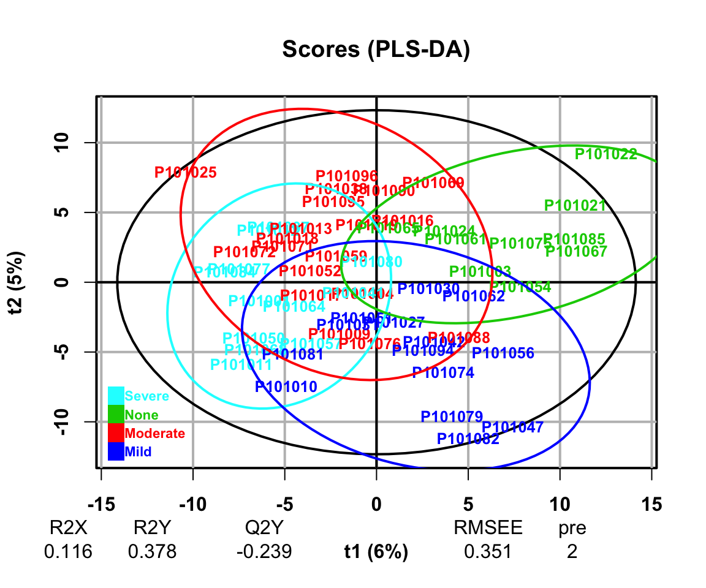

# Dimension Reduction {#DimensionReduction}


降维分析是为了查看样本的差异或挖掘潜在标志物。方法有以下三种：

+ 主成分分析（PCA）

主成分分析PCA（Principal Component Analysis）是一种常用的数据分析方法。PCA通过线性变换将原始数据变换为一组各维度线性无关的表示，可用于提取数据的主要特征分量，常用于高维数据的降维。

+ 偏最小二乘回归分析法（PLS-DA）

偏最小二乘判别分析（PLS-DA）是一种有监督模式识别的多元统计分析方法，将多维数据在压缩前先按需要寻找的差异因素分组。

+ 正交偏最小二乘判别分析（OPLS-DA）

正交偏最小二乘判别分析（OPLS-DA）结合了正交信号矫正（OSC）和PLS-DA方法，能够将X矩阵信息分解成与Y相关和不相关的两类信息，通过去除不相关的差异来筛选差异变量。


## 加载R包

```r
knitr::opts_chunk$set(message = FALSE, warning = FALSE)
library(tidyverse)
library(ropls)
library(SummarizedExperiment)
library(MicrobiomeAnalysis)

# rm(list = ls())
options(stringsAsFactors = F)
options(future.globals.maxSize = 1000 * 1024^2)

grp_names <- c("None", "Mild", "Moderate", "Severe")
grp_colors <- c("#7DD06F", "#844081", "#688EC1", "#C17E73")
```


## 导入数据

对数据[OmicsDataSet-Zeybel et al. - 2022.xlsx](https://github.com/HuaZou/DraftNotes/blob/main/InputData/Zeybel-2022/OmicsDataSet-Zeybel et al. - 2022.xlsx)处理后生成的，可参考数据预处理章节。

> ```R
> saveRDS(se_scale, "./InputData/result/QC/se_scale.RDS", compress = TRUE)
> ```


```r
data_meta <- readRDS("./InputData/result/QC/se_scale.RDS")
```


## 函数

```r
DR_fun <- function(
    x,
    group,
    group_names,
    group_colors,
    DRtype = c("PCA", "PLS", "OPLS"),
    occ_cutoff = 0.5) {
  
  # x = data_meta
  # group = "LiverFatClass"
  # group_names = grp_names
  # group_colors = grp_colors
  # DRtype = "PLS" # PCA
  # occ_cutoff = 0.5
  
  # dataseat
  metadata <- SummarizedExperiment::colData(x) %>%
      as.data.frame()
  profile <- SummarizedExperiment::assay(x) %>%
      as.data.frame()

  colnames(metadata)[which(colnames(metadata) == group)] <- "CompVar"
  phenotype <- metadata %>%
    dplyr::filter(CompVar %in% group_names) %>%
    dplyr::mutate(CompVar = as.character(CompVar)) %>%
    dplyr::mutate(CompVar = factor(CompVar, levels = group_names))
  
  sid <- intersect(rownames(phenotype), colnames(profile))
  phen <- phenotype[pmatch(sid, rownames(phenotype)), , ]
  prof <- profile %>%
    dplyr::select(all_of(sid))
  
  if (!all(colnames(prof) == rownames(phen))) {
    stop("Wrong Order")
  }
  
  trim_FeatureOrSample <- function(x, nRow, threshold) {
  
    df_occ <- apply(x, nRow, function(x) {
      length(x[c(which(!is.na(x) & x!=0))]) / length(x)
    }) %>%
      data.frame() %>% stats::setNames("Occ") %>%
      tibble::rownames_to_column("type")
    if(nRow == 1){
      rownames(df_occ) <- rownames(x)
    }else{
      rownames(df_occ) <- colnames(x)
    }
    df_KEEP <- apply(df_occ > threshold, 1, all) %>%
      data.frame() %>% stats::setNames("Status") %>%
      dplyr::filter(Status)
  
    res <- x %>%
      tibble::rownames_to_column("featureid") %>%
      dplyr::filter(featureid %in% rownames(df_KEEP)) %>%
      tibble::column_to_rownames("featureid")
    
    return(res)
  }

  prof_cln <- trim_FeatureOrSample(prof, 1, occ_cutoff)
  dataMatrix <- prof_cln %>% t() # row->sampleID; col->features
  sampleMetadata <- phen %>% # row->sampleID; col->features
    dplyr::mutate(CompVar = factor(CompVar, levels = group_names)) %>%
    dplyr::mutate(Color = factor(CompVar, 
                                  levels = group_names,
                                  labels = group_colors),
                  Color = as.character(Color))    
  
  if (DRtype == "PCA") {
    fit <- opls(dataMatrix)
    plot(fit,
         typeVc = "x-score",
         parAsColFcVn = sampleMetadata$CompVar,
         )
  } else if (DRtype == "PLS") {
    fit <- opls(dataMatrix, sampleMetadata$CompVar, predI = 2)
    plot(fit,
         typeVc = "x-score",
         parAsColFcVn = sampleMetadata$CompVar,
         )
  } else if (DRtype == "OPLS") {
    # only for binary classification
    fit <- opls(dataMatrix, sampleMetadata$CompVar, predI = 1, orthoI = NA)
    plot(fit,
         typeVc = "x-score",
         parAsColFcVn = sampleMetadata$CompVar,
         )
  }

  return(fit)
}
```


## 主成分分析（PCA）

```r
PCA_res <- DR_fun(
    x = data_meta,
    group = "LiverFatClass",
    group_names = grp_names,
    group_colors = grp_colors,    
    DRtype = "PCA",
    occ_cutoff = 0.5)
#> PCA
#> 55 samples x 641 variables
#> standard scaling of predictors
#>       R2X(cum) pre ort
#> Total    0.523  10   0
```


结果：PCA将原始features重新组合成新的主成分，进而形成了基于主成分的矩阵。每个主成分是由原来features的线性组合而成。

+ **左上图**: 碎石图展示不同主成分的可解释度，也即是代表全体的features，评估主成分是否足够

+ **右上图**: 离群点图，它展示的各样本在投影平面和投影平面正交的距离，数值较高样本表明它们与其他样本间的差异较大 

+ **左下图**：每个样本的主成分得分（可简单理解为系数，此处只展示第一和第二主成分），该数值表示主成分能解释多少features: 该数值由features矩阵分解得到。各个样本在PC1和PC2轴的排序坐标差异，通过它们可评估样本在组成上的差异。

+ **右下图**：载荷值: 理解为构成每个主成分的features，可以认为一个主成分是由N个feature线性组合合成，每个features对该主成分的贡献程度作为loading的数值。边缘处的变量表示它们在各样本中的含量差别明显（如在某些样本中具有较大/较小的极端值等），即对排序空间的贡献较大，暗示它们可能为一些重要的代谢物。


## 偏最小二乘回归分析法（PLS-DA）

PLS-DA需要提供Y响应变量，它通过投影分别将预测变量（Y响应变量）和观测变量（自变量）投影到一个新空间，来寻找一个线性回归模型。通过建立组学数据与样本类别之间的关系模型，实现对样本类别的预测，为有监督的建模方式。

偏最小二乘（PLS）是一种基于预测变量和响应变量之间协方差的潜在变量回归方法，找到不同类别的分割信息最优的线性组合，PLS的每一个成分都赋予一个权值，即对应该成分的分离能力。


```r
PLS_res <- DR_fun(
    x = data_meta,
    group = "LiverFatClass",
    group_names = grp_names,
    group_colors = grp_colors,    
    DRtype = "PLS",
    occ_cutoff = 0.5)
#> PLS-DA
#> 55 samples x 641 variables and 1 response
#> standard scaling of predictors and response(s)
#>       R2X(cum) R2Y(cum) Q2(cum) RMSEE pre ort pR2Y  pQ2
#> Total    0.116    0.378  -0.239 0.351   2   0  0.1 0.65
```



结果：R2X和R2Y分别表示所建模型对X和Y矩阵的解释率，Q2标示模型的预测能力，它们的值越接近于1表明模型的拟合度越好，训练集的样本越能够被准确划分到其原始归属中。

+ **左上图**: 展示了2个正交轴的R2Y和Q2Y

+ **右上图**: PLS-DA模型的R2Y和Q2Y与随机置换数据后获得的相应值进行比较 

+ **左下图**：展示了各样本在投影平面内以及正交投影面的距离，具有高值的样本标注出名称，表明它们与其它样本间的差异较大。颜色代表性别分组。

+ **右下图**：各样本在PLS-DA轴中的坐标，颜色代表不同分组。我们可以看到，相对于上文的PCA（仅通过方差特征值分解），PLS-DA在区分组间差异时更有效（带监督的偏最小二乘判别分析）。图的下方还提供了R2X、R2Y等值，用于评估模型优度。


此外，还可通过变量投影重要度（Variable Importance for the Projection，VIP）衡量各代谢物组分含量对样本分类判别的影响强度和解释能力，辅助标志代谢物的筛选。通常以**VIP > 1**作为筛选标准。


```r
vip_values <- getVipVn(PLS_res)

vip_select <- vip_values[vip_values > 1]

head(vip_select)
#> Chem_100002356 Chem_100009217 Chem_100000657 Chem_100009014 
#>       1.027678       1.261799       1.045749       1.390236 
#> Chem_100009002 Chem_100009009 
#>       1.053974       1.997828
```


## 正交偏最小二乘判别分析（OPLS-DA）

PLS-DA容易出现过拟合（overfitting）问题。所谓过拟合，即通过训练集建立了一个预测模型，它在训练集上表现出色，但通过测试集测试时却表现不佳。过拟合是机器学习中的一个常见问题，主要出现在具有比样本数量更多的变量数量的数据集的分析中。主要是因为PLS-DA是有监督的预测模型且偏向训练数据。

相比PLS-DA，叠加了正交分解的OPLS-DA能更好地避免过拟合现象，这是因为它会通过将与X和Y正交的变量删除，避免不差异的变量影响结果。OPLS从给定的自变量数据集中移除正交变量，并把这些正交变量和非正交变量区分开来。然后再对非正交变量做偏最小二乘法获得载荷矩阵也即是在Y情况下的最大方差。


+ None vs Severe

```r
DR_fun(
    x = data_meta,
    group = "LiverFatClass",
    group_names = grp_names[c(1, 4)],
    group_colors = grp_colors[c(1, 4)],
    DRtype = "OPLS",
    occ_cutoff = 0.5)
#> OPLS-DA
#> 22 samples x 641 variables and 1 response
#> standard scaling of predictors and response(s)
#>       R2X(cum) R2Y(cum) Q2(cum) RMSEE pre ort pR2Y  pQ2
#> Total     0.25    0.989   0.644 0.059   1   2  0.6 0.05
```


```
#> OPLS-DA
#> 22 samples x 641 variables and 1 response
#> standard scaling of predictors and response(s)
#>       R2X(cum) R2Y(cum) Q2(cum) RMSEE pre ort pR2Y  pQ2
#> Total     0.25    0.989   0.644 0.059   1   2  0.6 0.05
```


结果和PLS-DA一致。

+ **左上图**: 展示了2个正交轴的R2Y和Q2Y

+ **右上图**: PLS-DA模型的R2Y和Q2Y与随机置换数据后获得的相应值进行比较 

+ **左下图**：展示了各样本在投影平面内以及正交投影面的距离，具有高值的样本标注出名称，表明它们与其它样本间的差异较大。颜色代表性别分组。

+ **右下图**：各样本在PLS-DA轴中的坐标，颜色代表不同分组。我们可以看到，相对于上文的PCA（仅通过方差特征值分解），PLS-DA在区分组间差异时更有效（带监督的偏最小二乘判别分析）。图的下方还提供了R2X、R2Y等值，用于评估模型优度。


## Session info

```r
devtools::session_info()
#> ─ Session info ───────────────────────────────────────────
#>  setting  value
#>  version  R version 4.3.1 (2023-06-16)
#>  os       macOS Monterey 12.2.1
#>  system   x86_64, darwin20
#>  ui       X11
#>  language (EN)
#>  collate  en_US.UTF-8
#>  ctype    en_US.UTF-8
#>  tz       Asia/Shanghai
#>  date     2024-02-06
#>  pandoc   3.1.3 @ /Users/zouhua/opt/anaconda3/bin/ (via rmarkdown)
#> 
#> ─ Packages ───────────────────────────────────────────────
#>  package                  * version    date (UTC) lib source
#>  abind                      1.4-5      2016-07-21 [1] CRAN (R 4.3.0)
#>  ade4                       1.7-22     2023-02-06 [1] CRAN (R 4.3.0)
#>  ANCOMBC                    2.4.0      2023-10-24 [1] Bioconductor
#>  ape                        5.7-1      2023-03-13 [1] CRAN (R 4.3.0)
#>  backports                  1.4.1      2021-12-13 [1] CRAN (R 4.3.0)
#>  base64enc                  0.1-3      2015-07-28 [1] CRAN (R 4.3.0)
#>  beachmat                   2.18.0     2023-10-24 [1] Bioconductor
#>  beeswarm                   0.4.0      2021-06-01 [1] CRAN (R 4.3.0)
#>  Biobase                  * 2.62.0     2023-10-24 [1] Bioconductor
#>  BiocGenerics             * 0.48.1     2023-11-01 [1] Bioconductor
#>  BiocNeighbors              1.20.2     2024-01-07 [1] Bioconductor 3.18 (R 4.3.2)
#>  BiocParallel               1.36.0     2023-10-24 [1] Bioconductor
#>  BiocSingular               1.18.0     2023-10-24 [1] Bioconductor
#>  biomformat                 1.30.0     2023-10-24 [1] Bioconductor
#>  Biostrings                 2.70.2     2024-01-28 [1] Bioconductor 3.18 (R 4.3.2)
#>  bit                        4.0.5      2022-11-15 [1] CRAN (R 4.3.0)
#>  bit64                      4.0.5      2020-08-30 [1] CRAN (R 4.3.0)
#>  bitops                     1.0-7      2021-04-24 [1] CRAN (R 4.3.0)
#>  blob                       1.2.4      2023-03-17 [1] CRAN (R 4.3.0)
#>  bluster                    1.12.0     2023-10-24 [1] Bioconductor
#>  bookdown                   0.37       2023-12-01 [1] CRAN (R 4.3.0)
#>  boot                       1.3-28.1   2022-11-22 [1] CRAN (R 4.3.1)
#>  bslib                      0.6.1      2023-11-28 [1] CRAN (R 4.3.0)
#>  cachem                     1.0.8      2023-05-01 [1] CRAN (R 4.3.0)
#>  calibrate                  1.7.7      2020-06-19 [1] CRAN (R 4.3.0)
#>  caTools                    1.18.2     2021-03-28 [1] CRAN (R 4.3.0)
#>  cellranger                 1.1.0      2016-07-27 [1] CRAN (R 4.3.0)
#>  checkmate                  2.3.1      2023-12-04 [1] CRAN (R 4.3.0)
#>  class                      7.3-22     2023-05-03 [1] CRAN (R 4.3.1)
#>  cli                        3.6.2      2023-12-11 [1] CRAN (R 4.3.0)
#>  cluster                    2.1.4      2022-08-22 [1] CRAN (R 4.3.1)
#>  codetools                  0.2-19     2023-02-01 [1] CRAN (R 4.3.1)
#>  colorspace                 2.1-0      2023-01-23 [1] CRAN (R 4.3.0)
#>  crayon                     1.5.2      2022-09-29 [1] CRAN (R 4.3.0)
#>  CVXR                       1.0-12     2024-02-02 [1] CRAN (R 4.3.2)
#>  data.table                 1.15.0     2024-01-30 [1] CRAN (R 4.3.2)
#>  DBI                        1.2.1      2024-01-12 [1] CRAN (R 4.3.0)
#>  DECIPHER                   2.30.0     2023-10-24 [1] Bioconductor
#>  decontam                   1.22.0     2023-10-24 [1] Bioconductor
#>  DelayedArray               0.28.0     2023-10-24 [1] Bioconductor
#>  DelayedMatrixStats         1.24.0     2023-10-24 [1] Bioconductor
#>  DescTools                  0.99.54    2024-02-03 [1] CRAN (R 4.3.2)
#>  DESeq2                     1.42.0     2023-10-24 [1] Bioconductor
#>  devtools                   2.4.5      2022-10-11 [1] CRAN (R 4.3.0)
#>  digest                     0.6.34     2024-01-11 [1] CRAN (R 4.3.0)
#>  DirichletMultinomial       1.44.0     2023-10-24 [1] Bioconductor
#>  doParallel                 1.0.17     2022-02-07 [1] CRAN (R 4.3.0)
#>  doRNG                      1.8.6      2023-01-16 [1] CRAN (R 4.3.0)
#>  downlit                    0.4.3      2023-06-29 [1] CRAN (R 4.3.0)
#>  dplyr                    * 1.1.4      2023-11-17 [1] CRAN (R 4.3.0)
#>  e1071                      1.7-14     2023-12-06 [1] CRAN (R 4.3.0)
#>  ellipsis                   0.3.2      2021-04-29 [1] CRAN (R 4.3.0)
#>  energy                     1.7-11     2022-12-22 [1] CRAN (R 4.3.0)
#>  evaluate                   0.23       2023-11-01 [1] CRAN (R 4.3.0)
#>  Exact                      3.2        2022-09-25 [1] CRAN (R 4.3.0)
#>  expm                       0.999-9    2024-01-11 [1] CRAN (R 4.3.0)
#>  fansi                      1.0.6      2023-12-08 [1] CRAN (R 4.3.0)
#>  fastmap                    1.1.1      2023-02-24 [1] CRAN (R 4.3.0)
#>  forcats                  * 1.0.0      2023-01-29 [1] CRAN (R 4.3.0)
#>  foreach                    1.5.2      2022-02-02 [1] CRAN (R 4.3.0)
#>  foreign                    0.8-84     2022-12-06 [1] CRAN (R 4.3.1)
#>  Formula                    1.2-5      2023-02-24 [1] CRAN (R 4.3.0)
#>  fs                         1.6.3      2023-07-20 [1] CRAN (R 4.3.0)
#>  generics                   0.1.3      2022-07-05 [1] CRAN (R 4.3.0)
#>  GenomeInfoDb             * 1.38.5     2023-12-28 [1] Bioconductor 3.18 (R 4.3.2)
#>  GenomeInfoDbData           1.2.11     2024-01-24 [1] Bioconductor
#>  GenomicRanges            * 1.54.1     2023-10-29 [1] Bioconductor
#>  ggbeeswarm                 0.7.2      2023-04-29 [1] CRAN (R 4.3.0)
#>  ggplot2                  * 3.4.4      2023-10-12 [1] CRAN (R 4.3.0)
#>  ggrepel                    0.9.5      2024-01-10 [1] CRAN (R 4.3.0)
#>  gld                        2.6.6      2022-10-23 [1] CRAN (R 4.3.0)
#>  glmnet                     4.1-8      2023-08-22 [1] CRAN (R 4.3.0)
#>  glue                       1.7.0      2024-01-09 [1] CRAN (R 4.3.0)
#>  gmp                        0.7-4      2024-01-15 [1] CRAN (R 4.3.0)
#>  gplots                     3.1.3.1    2024-02-02 [1] CRAN (R 4.3.2)
#>  gridExtra                  2.3        2017-09-09 [1] CRAN (R 4.3.0)
#>  gsl                        2.1-8      2023-01-24 [1] CRAN (R 4.3.0)
#>  gtable                     0.3.4      2023-08-21 [1] CRAN (R 4.3.0)
#>  gtools                     3.9.5      2023-11-20 [1] CRAN (R 4.3.0)
#>  highr                      0.10       2022-12-22 [1] CRAN (R 4.3.0)
#>  Hmisc                      5.1-1      2023-09-12 [1] CRAN (R 4.3.0)
#>  hms                        1.1.3      2023-03-21 [1] CRAN (R 4.3.0)
#>  htmlTable                  2.4.2      2023-10-29 [1] CRAN (R 4.3.0)
#>  htmltools                  0.5.7      2023-11-03 [1] CRAN (R 4.3.0)
#>  htmlwidgets                1.6.4      2023-12-06 [1] CRAN (R 4.3.0)
#>  httpuv                     1.6.14     2024-01-26 [1] CRAN (R 4.3.2)
#>  httr                       1.4.7      2023-08-15 [1] CRAN (R 4.3.0)
#>  igraph                     2.0.1.1    2024-01-30 [1] CRAN (R 4.3.2)
#>  IRanges                  * 2.36.0     2023-10-24 [1] Bioconductor
#>  irlba                      2.3.5.1    2022-10-03 [1] CRAN (R 4.3.0)
#>  iterators                  1.0.14     2022-02-05 [1] CRAN (R 4.3.0)
#>  jquerylib                  0.1.4      2021-04-26 [1] CRAN (R 4.3.0)
#>  jsonlite                   1.8.8      2023-12-04 [1] CRAN (R 4.3.0)
#>  KernSmooth                 2.23-21    2023-05-03 [1] CRAN (R 4.3.1)
#>  knitr                      1.45       2023-10-30 [1] CRAN (R 4.3.0)
#>  later                      1.3.2      2023-12-06 [1] CRAN (R 4.3.0)
#>  lattice                    0.21-8     2023-04-05 [1] CRAN (R 4.3.1)
#>  lazyeval                   0.2.2      2019-03-15 [1] CRAN (R 4.3.0)
#>  lifecycle                  1.0.4      2023-11-07 [1] CRAN (R 4.3.0)
#>  limma                      3.58.1     2023-10-31 [1] Bioconductor
#>  lme4                       1.1-35.1   2023-11-05 [1] CRAN (R 4.3.0)
#>  lmerTest                   3.1-3      2020-10-23 [1] CRAN (R 4.3.0)
#>  lmom                       3.0        2023-08-29 [1] CRAN (R 4.3.0)
#>  locfit                     1.5-9.8    2023-06-11 [1] CRAN (R 4.3.0)
#>  lubridate                * 1.9.3      2023-09-27 [1] CRAN (R 4.3.0)
#>  magrittr                   2.0.3      2022-03-30 [1] CRAN (R 4.3.0)
#>  MASS                       7.3-60     2023-05-04 [1] CRAN (R 4.3.1)
#>  Matrix                     1.6-5      2024-01-11 [1] CRAN (R 4.3.0)
#>  MatrixGenerics           * 1.14.0     2023-10-24 [1] Bioconductor
#>  matrixStats              * 1.2.0      2023-12-11 [1] CRAN (R 4.3.0)
#>  memoise                    2.0.1      2021-11-26 [1] CRAN (R 4.3.0)
#>  metagenomeSeq              1.43.0     2023-04-25 [1] Bioconductor
#>  mgcv                       1.8-42     2023-03-02 [1] CRAN (R 4.3.1)
#>  mia                        1.10.0     2023-10-24 [1] Bioconductor
#>  MicrobiomeAnalysis       * 1.0.3      2024-02-06 [1] Github (HuaZou/MicrobiomeAnalysis@fd2a6a2)
#>  mime                       0.12       2021-09-28 [1] CRAN (R 4.3.0)
#>  miniUI                     0.1.1.1    2018-05-18 [1] CRAN (R 4.3.0)
#>  minqa                      1.2.6      2023-09-11 [1] CRAN (R 4.3.0)
#>  multcomp                   1.4-25     2023-06-20 [1] CRAN (R 4.3.0)
#>  MultiAssayExperiment       1.28.0     2023-10-24 [1] Bioconductor
#>  MultiDataSet               1.30.0     2023-10-24 [1] Bioconductor
#>  multtest                   2.58.0     2023-10-24 [1] Bioconductor
#>  munsell                    0.5.0      2018-06-12 [1] CRAN (R 4.3.0)
#>  mvtnorm                    1.2-4      2023-11-27 [1] CRAN (R 4.3.0)
#>  nlme                       3.1-162    2023-01-31 [1] CRAN (R 4.3.1)
#>  nloptr                     2.0.3      2022-05-26 [1] CRAN (R 4.3.0)
#>  nnet                       7.3-19     2023-05-03 [1] CRAN (R 4.3.1)
#>  numDeriv                   2016.8-1.1 2019-06-06 [1] CRAN (R 4.3.0)
#>  permute                    0.9-7      2022-01-27 [1] CRAN (R 4.3.0)
#>  phyloseq                   1.46.0     2023-10-24 [1] Bioconductor
#>  pillar                     1.9.0      2023-03-22 [1] CRAN (R 4.3.0)
#>  pkgbuild                   1.4.3      2023-12-10 [1] CRAN (R 4.3.0)
#>  pkgconfig                  2.0.3      2019-09-22 [1] CRAN (R 4.3.0)
#>  pkgload                    1.3.4      2024-01-16 [1] CRAN (R 4.3.0)
#>  plyr                       1.8.9      2023-10-02 [1] CRAN (R 4.3.0)
#>  profvis                    0.3.8      2023-05-02 [1] CRAN (R 4.3.0)
#>  promises                   1.2.1      2023-08-10 [1] CRAN (R 4.3.0)
#>  proxy                      0.4-27     2022-06-09 [1] CRAN (R 4.3.0)
#>  purrr                    * 1.0.2      2023-08-10 [1] CRAN (R 4.3.0)
#>  qqman                      0.1.9      2023-08-23 [1] CRAN (R 4.3.0)
#>  R6                         2.5.1      2021-08-19 [1] CRAN (R 4.3.0)
#>  rbibutils                  2.2.16     2023-10-25 [1] CRAN (R 4.3.0)
#>  RColorBrewer               1.1-3      2022-04-03 [1] CRAN (R 4.3.0)
#>  Rcpp                       1.0.12     2024-01-09 [1] CRAN (R 4.3.0)
#>  RCurl                      1.98-1.14  2024-01-09 [1] CRAN (R 4.3.0)
#>  Rdpack                     2.6        2023-11-08 [1] CRAN (R 4.3.0)
#>  readr                    * 2.1.5      2024-01-10 [1] CRAN (R 4.3.0)
#>  readxl                     1.4.3      2023-07-06 [1] CRAN (R 4.3.0)
#>  remotes                    2.4.2.1    2023-07-18 [1] CRAN (R 4.3.0)
#>  reshape2                   1.4.4      2020-04-09 [1] CRAN (R 4.3.0)
#>  rhdf5                      2.46.1     2023-11-29 [1] Bioconductor
#>  rhdf5filters               1.14.1     2023-11-06 [1] Bioconductor
#>  Rhdf5lib                   1.24.1     2023-12-12 [1] Bioconductor 3.18 (R 4.3.2)
#>  rlang                      1.1.3      2024-01-10 [1] CRAN (R 4.3.0)
#>  rmarkdown                  2.25       2023-09-18 [1] CRAN (R 4.3.0)
#>  Rmpfr                      0.9-5      2024-01-21 [1] CRAN (R 4.3.0)
#>  rngtools                   1.5.2      2021-09-20 [1] CRAN (R 4.3.0)
#>  rootSolve                  1.8.2.4    2023-09-21 [1] CRAN (R 4.3.0)
#>  ropls                    * 1.34.0     2023-10-24 [1] Bioconductor
#>  rpart                      4.1.19     2022-10-21 [1] CRAN (R 4.3.1)
#>  RSQLite                    2.3.5      2024-01-21 [1] CRAN (R 4.3.0)
#>  rstudioapi                 0.15.0     2023-07-07 [1] CRAN (R 4.3.0)
#>  rsvd                       1.0.5      2021-04-16 [1] CRAN (R 4.3.0)
#>  S4Arrays                   1.2.0      2023-10-24 [1] Bioconductor
#>  S4Vectors                * 0.40.2     2023-11-23 [1] Bioconductor
#>  sandwich                   3.1-0      2023-12-11 [1] CRAN (R 4.3.0)
#>  sass                       0.4.8      2023-12-06 [1] CRAN (R 4.3.0)
#>  ScaledMatrix               1.10.0     2023-10-24 [1] Bioconductor
#>  scales                     1.3.0      2023-11-28 [1] CRAN (R 4.3.0)
#>  scater                     1.30.1     2023-12-06 [1] Bioconductor
#>  scuttle                    1.12.0     2023-10-24 [1] Bioconductor
#>  sessioninfo                1.2.2      2021-12-06 [1] CRAN (R 4.3.0)
#>  shape                      1.4.6      2021-05-19 [1] CRAN (R 4.3.0)
#>  shiny                      1.8.0      2023-11-17 [1] CRAN (R 4.3.0)
#>  SingleCellExperiment       1.24.0     2023-10-24 [1] Bioconductor
#>  SparseArray                1.2.3      2023-12-25 [1] Bioconductor 3.18 (R 4.3.2)
#>  sparseMatrixStats          1.14.0     2023-10-24 [1] Bioconductor
#>  statmod                    1.5.0      2023-01-06 [1] CRAN (R 4.3.0)
#>  stringi                    1.8.3      2023-12-11 [1] CRAN (R 4.3.0)
#>  stringr                  * 1.5.1      2023-11-14 [1] CRAN (R 4.3.0)
#>  SummarizedExperiment     * 1.32.0     2023-10-24 [1] Bioconductor
#>  survival                   3.5-5      2023-03-12 [1] CRAN (R 4.3.1)
#>  TH.data                    1.1-2      2023-04-17 [1] CRAN (R 4.3.0)
#>  tibble                   * 3.2.1      2023-03-20 [1] CRAN (R 4.3.0)
#>  tidyr                    * 1.3.1      2024-01-24 [1] CRAN (R 4.3.2)
#>  tidyselect                 1.2.0      2022-10-10 [1] CRAN (R 4.3.0)
#>  tidytree                   0.4.6      2023-12-12 [1] CRAN (R 4.3.0)
#>  tidyverse                * 2.0.0      2023-02-22 [1] CRAN (R 4.3.0)
#>  timechange                 0.3.0      2024-01-18 [1] CRAN (R 4.3.0)
#>  treeio                     1.26.0     2023-10-24 [1] Bioconductor
#>  TreeSummarizedExperiment   2.10.0     2023-10-24 [1] Bioconductor
#>  tzdb                       0.4.0      2023-05-12 [1] CRAN (R 4.3.0)
#>  urlchecker                 1.0.1      2021-11-30 [1] CRAN (R 4.3.0)
#>  usethis                    2.2.2      2023-07-06 [1] CRAN (R 4.3.0)
#>  utf8                       1.2.4      2023-10-22 [1] CRAN (R 4.3.0)
#>  vctrs                      0.6.5      2023-12-01 [1] CRAN (R 4.3.0)
#>  vegan                      2.6-4      2022-10-11 [1] CRAN (R 4.3.0)
#>  vipor                      0.4.7      2023-12-18 [1] CRAN (R 4.3.0)
#>  viridis                    0.6.5      2024-01-29 [1] CRAN (R 4.3.2)
#>  viridisLite                0.4.2      2023-05-02 [1] CRAN (R 4.3.0)
#>  withr                      3.0.0      2024-01-16 [1] CRAN (R 4.3.0)
#>  Wrench                     1.20.0     2023-10-24 [1] Bioconductor
#>  xfun                       0.41       2023-11-01 [1] CRAN (R 4.3.0)
#>  xml2                       1.3.6      2023-12-04 [1] CRAN (R 4.3.0)
#>  xtable                     1.8-4      2019-04-21 [1] CRAN (R 4.3.0)
#>  XVector                    0.42.0     2023-10-24 [1] Bioconductor
#>  yaml                       2.3.8      2023-12-11 [1] CRAN (R 4.3.0)
#>  yulab.utils                0.1.4      2024-01-28 [1] CRAN (R 4.3.2)
#>  zlibbioc                   1.48.0     2023-10-24 [1] Bioconductor
#>  zoo                        1.8-12     2023-04-13 [1] CRAN (R 4.3.0)
#> 
#>  [1] /Library/Frameworks/R.framework/Versions/4.3-x86_64/Resources/library
#> 
#> ──────────────────────────────────────────────────────────
```


## Reference

+ [ropls: PCA, PLS(-DA) and OPLS(-DA) for multivariate analysis and feature selection of omics data](https://master.bioconductor.org/packages/release/bioc/vignettes/ropls/inst/doc/ropls-vignette.html)

