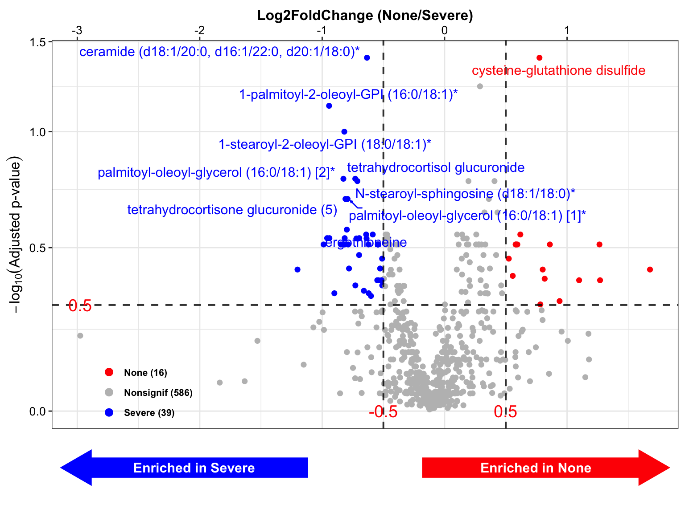

# Differetial Analysis {#DifferetialAnalysis}


差异分析的目的是为了筛选代谢物标记物，常用的方法有以下几种

+ 倍数变化法 (Fold Change)，也有基于log2的Fold change，计算组间倍数变化

+ T检验，计算组间均值的t统计量差别

+ PLS-DA或OPLS-DA的VIP(Variable Importance for the Projection，变量投影重要度)，计算代谢物在投影平面坐标的重要度打分，个人理解有点类似主成分的特征系数


## 安装MicrobiomeAnalysis包

+ MicrobiomeAnalysis可提供下面分析使用的函数

```R
if (!requireNamespace(c("remotes", "devtools"), quietly=TRUE)) {
  install.packages(c("devtools", "remotes"))
}
remotes::install_github("HuaZou/MicrobiomeAnalysis")
```


## 加载R包

```r
knitr::opts_chunk$set(message = FALSE, warning = FALSE)
library(tidyverse)
library(ropls)
library(SummarizedExperiment)
library(MicrobiomeAnalysis)
library(ggplot2)
library(ggrepel)

# rm(list = ls())
options(stringsAsFactors = F)
options(future.globals.maxSize = 1000 * 1024^2)

grp_names <- c("None", "Mild", "Moderate", "Severe")
grp_colors <- c("#7DD06F", "#844081", "#688EC1", "#C17E73")
```


## 导入数据

对数据[OmicsDataSet-Zeybel et al. - 2022.xlsx](https://github.com/HuaZou/DraftNotes/blob/main/InputData/Zeybel-2022/OmicsDataSet-Zeybel et al. - 2022.xlsx)处理后生成的，可参考数据预处理章节。

> ```R
> saveRDS(se_filter, "./InputData/result/QC/se_filter.RDS", compress = TRUE)
> saveRDS(se_scale, "./InputData/result/QC/se_scale.RDS", compress = TRUE)
> ```

+ se_filter.RDS用于计算倍数变化

+ se_scale.RDS用于T检验和PLS-DA


```r
se_filter <- readRDS("./InputData/result/QC/se_filter.RDS")
se_scale <- readRDS("./InputData/result/QC/se_scale.RDS")
```


## 平均值和方差 (mean +/- sd)

根据代谢物的相对定量或绝对定量结果，计算某个代谢物在两组间表达量的平均值和方差

这里选择"None"和"Severe"两组计算


```r
meansd_fun <- function(
    x,
    group,
    group_names,
    occ_cutoff = 0.5) {
  
  # x = se_filter
  # group = "LiverFatClass"
  # group_names = grp_names[c(1, 4)]
  # occ_cutoff = 0.5
  
  # dataseat
  metadata <- SummarizedExperiment::colData(x) %>%
      as.data.frame()
  profile <- SummarizedExperiment::assay(x) %>%
      as.data.frame()
  feature <- SummarizedExperiment::rowData(x) %>%
      as.data.frame() 

  colnames(metadata)[which(colnames(metadata) == group)] <- "CompVar"
  phenotype <- metadata %>%
    dplyr::filter(CompVar %in% group_names) %>%
    dplyr::mutate(CompVar = as.character(CompVar)) %>%
    dplyr::mutate(CompVar = factor(CompVar, levels = group_names))
  
  sid <- intersect(rownames(phenotype), colnames(profile))
  phen <- phenotype[pmatch(sid, rownames(phenotype)), , ]
  prof <- profile %>%
    dplyr::select(all_of(sid))
  
  if (!all(colnames(prof) == rownames(phen))) {
    stop("Wrong Order")
  }
  
  trim_FeatureOrSample <- function(x, nRow, threshold) {
  
    df_occ <- apply(x, nRow, function(x) {
      length(x[c(which(!is.na(x) & x!=0))]) / length(x)
    }) %>%
      data.frame() %>% stats::setNames("Occ") %>%
      tibble::rownames_to_column("type")
    if (nRow == 1) {
      rownames(df_occ) <- rownames(x)
    } else {
      rownames(df_occ) <- colnames(x)
    }
    df_KEEP <- apply(df_occ > threshold, 1, all) %>%
      data.frame() %>% stats::setNames("Status") %>%
      dplyr::filter(Status)
  
    res <- x %>%
      tibble::rownames_to_column("featureid") %>%
      dplyr::filter(featureid %in% rownames(df_KEEP)) %>%
      tibble::column_to_rownames("featureid")
    
    return(res)
  }

  prof_cln <- trim_FeatureOrSample(prof, 1, occ_cutoff)
  mean_res <- apply(prof_cln, 1, function(x1, y1) {
    dat <- data.frame(value = as.numeric(x1), group = y1)
    
    mn <- tapply(dat$value, dat$group, function(x){mean(x, na.rm = TRUE)}) %>%
      data.frame() %>% stats::setNames("value") %>%
      tibble::rownames_to_column("Group")
    mn1 <- with(mn, mn[Group %in% group_names[1], "value"])
    mn2 <- with(mn, mn[Group %in% group_names[2], "value"])
    mn3 <- with(mn, mn[Group %in% group_names[3], "value"])
    mnall <- mean(dat$value, na.rm = TRUE)
    
    SD <- tapply(dat$value, dat$group, function(x){sd(x, na.rm = TRUE)}) %>%
      data.frame() %>% stats::setNames("value") %>%
      tibble::rownames_to_column("Group")
    SD1 <- with(SD, SD[Group %in% group_names[1], "value"])
    SD2 <- with(SD, SD[Group %in% group_names[2], "value"])
    SD3 <- with(SD, SD[Group %in% group_names[3], "value"])
    SDall <- sd(dat$value, na.rm = TRUE)
    
    mean_sd_all <- paste(round(mnall, 8), round(SDall, 8), sep = "+/-")
    mean_sd_1 <- paste(round(mn1, 8), round(SD1, 8), sep = "+/-")
    mean_sd_2 <- paste(round(mn2, 8), round(SD2, 8), sep = "+/-")
    mean_sd_3 <- paste(round(mn3, 8), round(SD3, 8), sep = "+/-")
    
    res <- c(mean_sd_all, mean_sd_1, mean_sd_2, mean_sd_3)
    return(res)
  }, phen$CompVar) %>%
    t() %>% as.data.frame() %>%
    tibble::rownames_to_column("Feature")
  
  colnames(mean_res) <- c("FeatureID", 
                        "Mean+/-SD Abundance(All)",
                     paste0("Mean Abundance ", group_names)) 
  
  if (!is.null(feature)) {
    res <- mean_res %>%
      dplyr::inner_join(feature %>%
                          tibble::rownames_to_column("FeatureID"),
                        by = "FeatureID")    
  } else {
    res <- mean_res    
  }  

  return(res)
}

meansd_result <- meansd_fun(
  x = se_filter,
  group = "LiverFatClass",
  group_names = grp_names[c(1, 4)],
  occ_cutoff = 0.5)

head(meansd_result)
#>        FeatureID            Mean+/-SD Abundance(All)
#> 1 Chem_100002945 33862956.0909091+/-15764070.6522433
#> 2 Chem_100002356 3629040.02272727+/-1307163.71272114
#> 3 Chem_100008903 102839488.727273+/-27950099.0087515
#> 4 Chem_100009217     271679.023921+/-150803.63870239
#> 5 Chem_100000657 27786810.8181818+/-3032359.06117482
#> 6 Chem_100001397   149974.40593328+/-100685.20837937
#>                Mean Abundance None
#> 1      31958567+/-19461108.7209389
#> 2   3322149.325+/-1301360.05772809
#> 3    103557801.6+/-25226703.757032
#> 4 240673.17259333+/-99898.12882191
#> 5      27636924+/-3730876.87127851
#> 6 127445.79324222+/-62193.05747798
#>                 Mean Abundance Severe  metabolitesID
#> 1         35449947+/-12589758.3211378 Chem_100002945
#> 2 3884782.27083333+/-1311269.55266439 Chem_100002356
#> 3 102240894.666667+/-31142531.5321634 Chem_100008903
#> 4   297517.23336071+/-183435.59090425 Chem_100009217
#> 5       27911716.5+/-2475560.05052023 Chem_100000657
#> 6    168748.2498425+/-123866.15828415 Chem_100001397
#>                                   BIOCHEMICAL SUPER.PATHWAY
#> 1 (14 or 15)-methylpalmitate (a17:0 or i17:0)         Lipid
#> 2  (16 or 17)-methylstearate (a19:0 or i19:0)         Lipid
#> 3             1,2-dilinoleoyl-GPC (18:2/18:2)         Lipid
#> 4            1,2-dilinoleoyl-GPE (18:2/18:2)*         Lipid
#> 5             1,2-dipalmitoyl-GPC (16:0/16:0)         Lipid
#> 6                        1,3,7-trimethylurate   Xenobiotics
#>                     SUB.PATHWAY COMPID       PLATFORM
#> 1          Fatty Acid, Branched  38768      LC/MS Neg
#> 2          Fatty Acid, Branched  38296      LC/MS Neg
#> 3      Phosphatidylcholine (PC)  52603 LC/MS Pos Late
#> 4 Phosphatidylethanolamine (PE)  53174 LC/MS Pos Late
#> 5      Phosphatidylcholine (PC)  19130 LC/MS Pos Late
#> 6           Xanthine Metabolism  34404      LC/MS Neg
#>   CHEMICALID   RI     MASS       PUBCHEM       CAS   KEGG
#> 1  100002945 5695 269.2487 8181;17903417      <NA> C16995
#> 2  100002356 5993 297.2799       3083779 2724-59-6   <NA>
#> 3  100008903 2100 782.5694       5288075  998-06-1   <NA>
#> 4  100009217 2150 740.5225       9546812      <NA>   <NA>
#> 5  100000657 2450 734.5694        452110   63-89-8 D03585
#> 6  100001397 1985 209.0680         79437 5415-44-1 C16361
#>   SampleIDHMDBID
#> 1    HMDB0061859
#> 2    HMDB0037397
#> 3    HMDB0008138
#> 4    HMDB0009093
#> 5    HMDB0000564
#> 6    HMDB0002123
```


## 倍数变化法 (Fold Change)

> 倍数变化法即根据代谢物的相对定量或绝对定量结果，计算某个代谢物在两组间表达量的差异倍数（Fold Change），简称FC值。假设A物质在对照组中定量结果为1，在疾病组中定量结果为3，那么此物质的FC值即为3。由于代谢物定量结果肯定是非负数，那么FC的取值就是(0, +∞)。为筛选到差异更为显著的代谢物，小迈提供给各位老师的结果中默认选择的是FC值≥2或≤0.5的物质，此标准设置的较为严格，若因此筛到的差异代谢物较少，可根据需求将差异倍数标准调整为1.5倍或者1.2倍，这两种阈值在代谢组研究相关文章中也是较为常见的。


```r
fc_result <- MicrobiomeAnalysis::run_metabolomeDA(
  object_raw = se_filter,
  variable = "LiverFatClass",
  variable_name = grp_names[c(1, 4)],
  DA_method = "fc",
  cutoff_prev = 0.5)

head(fc_result)
#>        FeatureID                Block FoldChange
#> 1 Chem_100002945 10_None vs 12_Severe  0.9015124
#> 2 Chem_100002356 10_None vs 12_Severe  0.8551700
#> 3 Chem_100008903 10_None vs 12_Severe  1.0128804
#> 4 Chem_100009217 10_None vs 12_Severe  0.8089386
#> 5 Chem_100000657 10_None vs 12_Severe  0.9901549
#> 6 Chem_100001397 10_None vs 12_Severe  0.7552422
#>   Log2FoldChange Mean Abundance (All) Mean Abundance None
#> 1    -0.14958075           33862956.1          31958567.0
#> 2    -0.22571682            3629040.0           3322149.3
#> 3     0.01846388          102839488.7         103557801.6
#> 4    -0.30589790             271679.0            240673.2
#> 5    -0.01427380           27786810.8          27636924.0
#> 6    -0.40498879             149974.4            127445.8
#>   Mean Abundance Severe  metabolitesID
#> 1            35449947.0 Chem_100002945
#> 2             3884782.3 Chem_100002356
#> 3           102240894.7 Chem_100008903
#> 4              297517.2 Chem_100009217
#> 5            27911716.5 Chem_100000657
#> 6              168748.2 Chem_100001397
#>                                   BIOCHEMICAL SUPER.PATHWAY
#> 1 (14 or 15)-methylpalmitate (a17:0 or i17:0)         Lipid
#> 2  (16 or 17)-methylstearate (a19:0 or i19:0)         Lipid
#> 3             1,2-dilinoleoyl-GPC (18:2/18:2)         Lipid
#> 4            1,2-dilinoleoyl-GPE (18:2/18:2)*         Lipid
#> 5             1,2-dipalmitoyl-GPC (16:0/16:0)         Lipid
#> 6                        1,3,7-trimethylurate   Xenobiotics
#>                     SUB.PATHWAY COMPID       PLATFORM
#> 1          Fatty Acid, Branched  38768      LC/MS Neg
#> 2          Fatty Acid, Branched  38296      LC/MS Neg
#> 3      Phosphatidylcholine (PC)  52603 LC/MS Pos Late
#> 4 Phosphatidylethanolamine (PE)  53174 LC/MS Pos Late
#> 5      Phosphatidylcholine (PC)  19130 LC/MS Pos Late
#> 6           Xanthine Metabolism  34404      LC/MS Neg
#>   CHEMICALID   RI     MASS       PUBCHEM       CAS   KEGG
#> 1  100002945 5695 269.2487 8181;17903417      <NA> C16995
#> 2  100002356 5993 297.2799       3083779 2724-59-6   <NA>
#> 3  100008903 2100 782.5694       5288075  998-06-1   <NA>
#> 4  100009217 2150 740.5225       9546812      <NA>   <NA>
#> 5  100000657 2450 734.5694        452110   63-89-8 D03585
#> 6  100001397 1985 209.0680         79437 5415-44-1 C16361
#>   SampleIDHMDBID
#> 1    HMDB0061859
#> 2    HMDB0037397
#> 3    HMDB0008138
#> 4    HMDB0009093
#> 5    HMDB0000564
#> 6    HMDB0002123
```


结果：

+ FoldChange是组间倍数变化

+ Log2FoldChange是组间倍数变化的log2对数值


## T检验

> T检验，又叫student t 检验（Student’s t test）,是一种常用的假设检验方法，也是差异代谢物筛选中常见的统计策略之一。假设检验首先必须要有假设，我们假设某代谢物在A组和B组的含量没有差异（H0，零假设），然后基于此假设，通过t test计算出统计量t值和其对应的p值，如果P-value<0.05，那么说明小概率事件出现了，我们应该拒绝零假设，即A组和B组的含量不一样，即有显著差异。


```r
t_result <- MicrobiomeAnalysis::run_metabolomeDA(
  object_norm = se_scale,
  variable = "LiverFatClass",
  variable_name = grp_names[c(1, 4)],
  DA_method = "t")

head(t_result)
#>        FeatureID                Block  Statistic    Pvalue
#> 1 Chem_100002945 10_None vs 12_Severe -0.5377938 0.5991744
#> 2 Chem_100002356 10_None vs 12_Severe -0.6996453 0.4943413
#> 3 Chem_100008903 10_None vs 12_Severe  1.0412691 0.3101863
#> 4 Chem_100009217 10_None vs 12_Severe -0.4245388 0.6757161
#> 5 Chem_100000657 10_None vs 12_Severe  1.2972515 0.2172603
#> 6 Chem_100001397 10_None vs 12_Severe -0.2587599 0.7984845
#>   AdjustedPvalue  metabolitesID
#> 1      0.8733002 Chem_100002945
#> 2      0.8316870 Chem_100002356
#> 3      0.7277134 Chem_100008903
#> 4      0.8996698 Chem_100009217
#> 5      0.6451390 Chem_100000657
#> 6      0.9205550 Chem_100001397
#>                                   BIOCHEMICAL SUPER.PATHWAY
#> 1 (14 or 15)-methylpalmitate (a17:0 or i17:0)         Lipid
#> 2  (16 or 17)-methylstearate (a19:0 or i19:0)         Lipid
#> 3             1,2-dilinoleoyl-GPC (18:2/18:2)         Lipid
#> 4            1,2-dilinoleoyl-GPE (18:2/18:2)*         Lipid
#> 5             1,2-dipalmitoyl-GPC (16:0/16:0)         Lipid
#> 6                        1,3,7-trimethylurate   Xenobiotics
#>                     SUB.PATHWAY COMPID       PLATFORM
#> 1          Fatty Acid, Branched  38768      LC/MS Neg
#> 2          Fatty Acid, Branched  38296      LC/MS Neg
#> 3      Phosphatidylcholine (PC)  52603 LC/MS Pos Late
#> 4 Phosphatidylethanolamine (PE)  53174 LC/MS Pos Late
#> 5      Phosphatidylcholine (PC)  19130 LC/MS Pos Late
#> 6           Xanthine Metabolism  34404      LC/MS Neg
#>   CHEMICALID   RI     MASS       PUBCHEM       CAS   KEGG
#> 1  100002945 5695 269.2487 8181;17903417      <NA> C16995
#> 2  100002356 5993 297.2799       3083779 2724-59-6   <NA>
#> 3  100008903 2100 782.5694       5288075  998-06-1   <NA>
#> 4  100009217 2150 740.5225       9546812      <NA>   <NA>
#> 5  100000657 2450 734.5694        452110   63-89-8 D03585
#> 6  100001397 1985 209.0680         79437 5415-44-1 C16361
#>   SampleIDHMDBID
#> 1    HMDB0061859
#> 2    HMDB0037397
#> 3    HMDB0008138
#> 4    HMDB0009093
#> 5    HMDB0000564
#> 6    HMDB0002123
```

结果：

+ Pvalue是组间t检验结果

+ AdjustedPvalue是组间t检验结果pvalue的FDR校正结果，多次假设检验需要做FDR校正


## 变量投影重要度 (VIP) 正交偏最小二乘判别分析（OPLS-DA）

> 由于代谢组数据具有“高维、高噪音、高变异”的特点，因此一般采用多元统计分析方法，可以在最大程度保留原始信息的基础上将高维复杂的数据进行“简化和降维”，建立可靠的数学模型对研究对象的代谢谱特点进行归纳和总结。常见的多元统计分析方法包括PLS-DA或OPLS-DA。

> 偏最小二乘判别分析（PLS-DA）是一种有监督模式识别的多元统计分析方法，将多维数据在压缩前先按需要寻找的差异因素分组（预先设定Y值来进行目标分类和判别），这样可以找到与用于分组的因素最相关的变量，而减少一些其它因素的影响。PLS-DA常用于区分各组间代谢轮廓的总体差异，筛选组间的差异代谢物。

> 正交偏最小二乘判别分析（OPLS-DA）结合了正交信号矫正（OSC）和PLS-DA方法，能够将X矩阵信息分解成与Y相关和不相关的两类信息，通过去除不相关的差异来筛选差异变量。

> VIP（Variable important in projection）是(O)PLS-DA模型变量的变量权重值，可用于衡量各代谢物积累差异对各组样本分类判别的影响强度和解释能力，VIP≥1为常见的差异代谢物筛选标准。


```r
VIP_result <- MicrobiomeAnalysis::run_metabolomeDA(
  object_norm = se_scale,
  variable = "LiverFatClass",
  variable_name = grp_names[c(1, 4)],
  DA_method = "vip")
#> PLS-DA
#> 22 samples x 641 variables and 1 response
#> standard scaling of predictors and response(s)
#>       R2X(cum) R2Y(cum) Q2(cum) RMSEE pre ort pR2Y  pQ2
#> Total    0.101    0.829   0.538 0.216   1   0  0.2 0.05

head(VIP_result)
#>        FeatureID                Block      VIP    CorPvalue
#> 1 Chem_100015755 10_None vs 12_Severe 2.713879 6.487126e-05
#> 2 Chem_100001437 10_None vs 12_Severe 2.653166 1.139027e-04
#> 3 Chem_100009066 10_None vs 12_Severe 2.539496 2.952154e-04
#> 4       Chem_503 10_None vs 12_Severe 2.531054 3.153670e-04
#> 5 Chem_100009181 10_None vs 12_Severe 2.488347 4.365061e-04
#> 6 Chem_100022013 10_None vs 12_Severe 2.455659 5.544266e-04
#>    metabolitesID
#> 1 Chem_100015755
#> 2 Chem_100001437
#> 3 Chem_100009066
#> 4       Chem_503
#> 5 Chem_100009181
#> 6 Chem_100022013
#>                                      BIOCHEMICAL
#> 1 ceramide (d18:1/20:0, d16:1/22:0, d20:1/18:0)*
#> 2                 cysteine-glutathione disulfide
#> 3          1-palmitoyl-2-oleoyl-GPI (16:0/18:1)*
#> 4                                         serine
#> 5           1-stearoyl-2-oleoyl-GPI (18:0/18:1)*
#> 6                 tetrahydrocortisol glucuronide
#>   SUPER.PATHWAY                              SUB.PATHWAY
#> 1         Lipid                                Ceramides
#> 2    Amino Acid                   Glutathione Metabolism
#> 3         Lipid                Phosphatidylinositol (PI)
#> 4    Amino Acid Glycine, Serine and Threonine Metabolism
#> 5         Lipid                Phosphatidylinositol (PI)
#> 6         Lipid                          Corticosteroids
#>   COMPID        PLATFORM CHEMICALID   RI     MASS  PUBCHEM
#> 1  57440  LC/MS Pos Late  100015755 3920 594.5820     <NA>
#> 2  35159 LC/MS Pos Early  100001437 2465 427.0952  3080690
#> 3  52669  LC/MS Pos Late  100009066 3140 854.5753 71296232
#> 4   1648 LC/MS Pos Early        503 1239 106.0499     5951
#> 5  52726  LC/MS Pos Late  100009181 3711 882.6066     <NA>
#> 6  64411       LC/MS Neg  100022013 4666 541.2654     <NA>
#>          CAS   KEGG SampleIDHMDBID
#> 1       <NA>   <NA>           <NA>
#> 2 13081-14-6 R00900    HMDB0000656
#> 3       <NA>   <NA>    HMDB0009783
#> 4    56-45-1 C00065    HMDB0000187
#> 5       <NA>   <NA>           <NA>
#> 6       <NA>   <NA>           <NA>
```

结果：

+ **VIP**是每个代谢物和投影平面向量的投影重要度

+ **CorPvalue**是每个代谢物和投影平面向量的相关系数


## 合并所有结果

合并上述六个指标，用于后续判断差异代谢物


```r
mergedResults <- function(
    fc_result,
    vip_result,
    test_result,
    group_names,
    group_labels) {
  
  overlap_cols <- intersect(
    intersect(colnames(fc_result),
              colnames(vip_result)),
    colnames(test_result))
  
  overlap_cols <- overlap_cols[overlap_cols != "FeatureID"]
  
  mdat <- fc_result %>%
    dplyr::mutate(Block2 = paste(group_labels, collapse = " vs ")) %>%
    dplyr::mutate(FeatureID = make.names(FeatureID)) %>%
    dplyr::inner_join(vip_result %>%
                        # dplyr::select(-Block) %>%
                        dplyr::select(-dplyr::all_of(overlap_cols)) %>%
                        dplyr::mutate(FeatureID = make.names(FeatureID)),
                      by = "FeatureID") %>%
    dplyr::inner_join(test_result %>%
                        # dplyr::select(-Block) %>%
                        dplyr::select(-dplyr::all_of(overlap_cols)) %>%                        
                        dplyr::mutate(FeatureID = make.names(FeatureID)),
                      by = "FeatureID") 
  
  res <- mdat %>%
    dplyr::select(FeatureID, Block2, Block,
                  FoldChange, Log2FoldChange,
                  VIP, CorPvalue,
                  Statistic, Pvalue, AdjustedPvalue,
                  everything()) %>%
    dplyr::arrange(AdjustedPvalue, Log2FoldChange)
    
  return(res)
}

final_result <- mergedResults(
  fc_result = fc_result,
  vip_result = VIP_result,
  test_result = t_result,
  group_names = grp_names[c(1, 4)],
  group_labels = grp_names[c(1, 4)])

head(final_result)
#>        FeatureID         Block2                Block
#> 1 Chem_100015755 None vs Severe 10_None vs 12_Severe
#> 2 Chem_100001437 None vs Severe 10_None vs 12_Severe
#> 3       Chem_503 None vs Severe 10_None vs 12_Severe
#> 4 Chem_100009066 None vs Severe 10_None vs 12_Severe
#> 5 Chem_100009181 None vs Severe 10_None vs 12_Severe
#> 6 Chem_100010917 None vs Severe 10_None vs 12_Severe
#>   FoldChange Log2FoldChange      VIP    CorPvalue Statistic
#> 1  0.6444244     -0.6339170 2.713879 6.487126e-05 -4.923988
#> 2  1.7109000      0.7747554 2.653166 1.139027e-04  4.989637
#> 3  1.2218596      0.2890785 2.531054 3.153670e-04  4.409792
#> 4  0.5199556     -0.9435396 2.539496 2.952154e-04 -4.294439
#> 5  0.5667863     -0.8191231 2.488347 4.365061e-04 -4.098726
#> 6  0.5638085     -0.8267228 2.398322 8.276438e-04 -3.781813
#>         Pvalue AdjustedPvalue Mean Abundance (All)
#> 1 1.234968e-04     0.03958071              3841099
#> 2 8.636192e-05     0.03958071              1246453
#> 3 2.705095e-04     0.05779885             63358904
#> 4 4.600563e-04     0.07372402              2243154
#> 5 7.802676e-04     0.10003031              1817773
#> 6 1.814397e-03     0.16614697              1192929
#>   Mean Abundance None Mean Abundance Severe  metabolitesID
#> 1           2952496.1             4581602.1 Chem_100015755
#> 2           1611743.8              942044.4 Chem_100001437
#> 3          70323857.2            57554776.3       Chem_503
#> 4           1491869.7             2869225.1 Chem_100009066
#> 5           1282914.5             2263488.8 Chem_100009181
#> 6            838913.8             1487941.0 Chem_100010917
#>                                      BIOCHEMICAL
#> 1 ceramide (d18:1/20:0, d16:1/22:0, d20:1/18:0)*
#> 2                 cysteine-glutathione disulfide
#> 3                                         serine
#> 4          1-palmitoyl-2-oleoyl-GPI (16:0/18:1)*
#> 5           1-stearoyl-2-oleoyl-GPI (18:0/18:1)*
#> 6     palmitoyl-oleoyl-glycerol (16:0/18:1) [2]*
#>   SUPER.PATHWAY                              SUB.PATHWAY
#> 1         Lipid                                Ceramides
#> 2    Amino Acid                   Glutathione Metabolism
#> 3    Amino Acid Glycine, Serine and Threonine Metabolism
#> 4         Lipid                Phosphatidylinositol (PI)
#> 5         Lipid                Phosphatidylinositol (PI)
#> 6         Lipid                           Diacylglycerol
#>   COMPID        PLATFORM CHEMICALID   RI     MASS  PUBCHEM
#> 1  57440  LC/MS Pos Late  100015755 3920 594.5820     <NA>
#> 2  35159 LC/MS Pos Early  100001437 2465 427.0952  3080690
#> 3   1648 LC/MS Pos Early        503 1239 106.0499     5951
#> 4  52669  LC/MS Pos Late  100009066 3140 854.5753 71296232
#> 5  52726  LC/MS Pos Late  100009181 3711 882.6066     <NA>
#> 6  54942  LC/MS Pos Late  100010917 3695 612.5562  5282283
#>          CAS   KEGG SampleIDHMDBID
#> 1       <NA>   <NA>           <NA>
#> 2 13081-14-6 R00900    HMDB0000656
#> 3    56-45-1 C00065    HMDB0000187
#> 4       <NA>   <NA>    HMDB0009783
#> 5       <NA>   <NA>           <NA>
#> 6       <NA> C13861    HMDB0007102
```


## 一键生成差异结果

`MicrobiomeAnalysis::run_metabolomeDA`函数提供一键式生成差异结果。


```r
final_result <- MicrobiomeAnalysis::run_metabolomeDA(
  object_raw = se_filter,
  object_norm = se_scale,
  variable = "LiverFatClass",
  variable_name = grp_names[c(1, 4)],
  DA_method = "all")
#> PLS-DA
#> 22 samples x 641 variables and 1 response
#> standard scaling of predictors and response(s)
#>       R2X(cum) R2Y(cum) Q2(cum) RMSEE pre ort pR2Y  pQ2
#> Total    0.101    0.829   0.538 0.216   1   0 0.15 0.05

head(final_result)
#>        FeatureID         Block2                Block
#> 1 Chem_100015755 None vs Severe 10_None vs 12_Severe
#> 2 Chem_100001437 None vs Severe 10_None vs 12_Severe
#> 3       Chem_503 None vs Severe 10_None vs 12_Severe
#> 4 Chem_100009066 None vs Severe 10_None vs 12_Severe
#> 5 Chem_100009181 None vs Severe 10_None vs 12_Severe
#> 6 Chem_100010917 None vs Severe 10_None vs 12_Severe
#>   FoldChange Log2FoldChange      VIP    CorPvalue Statistic
#> 1  0.6444244     -0.6339170 2.713879 6.487126e-05 -4.923988
#> 2  1.7109000      0.7747554 2.653166 1.139027e-04  4.989637
#> 3  1.2218596      0.2890785 2.531054 3.153670e-04  4.409792
#> 4  0.5199556     -0.9435396 2.539496 2.952154e-04 -4.294439
#> 5  0.5667863     -0.8191231 2.488347 4.365061e-04 -4.098726
#> 6  0.5638085     -0.8267228 2.398322 8.276438e-04 -3.781813
#>         Pvalue AdjustedPvalue Mean Abundance (All)
#> 1 1.234968e-04     0.03958071              3841099
#> 2 8.636192e-05     0.03958071              1246453
#> 3 2.705095e-04     0.05779885             63358904
#> 4 4.600563e-04     0.07372402              2243154
#> 5 7.802676e-04     0.10003031              1817773
#> 6 1.814397e-03     0.16614697              1192929
#>   Mean Abundance None Mean Abundance Severe  metabolitesID
#> 1           2952496.1             4581602.1 Chem_100015755
#> 2           1611743.8              942044.4 Chem_100001437
#> 3          70323857.2            57554776.3       Chem_503
#> 4           1491869.7             2869225.1 Chem_100009066
#> 5           1282914.5             2263488.8 Chem_100009181
#> 6            838913.8             1487941.0 Chem_100010917
#>                                      BIOCHEMICAL
#> 1 ceramide (d18:1/20:0, d16:1/22:0, d20:1/18:0)*
#> 2                 cysteine-glutathione disulfide
#> 3                                         serine
#> 4          1-palmitoyl-2-oleoyl-GPI (16:0/18:1)*
#> 5           1-stearoyl-2-oleoyl-GPI (18:0/18:1)*
#> 6     palmitoyl-oleoyl-glycerol (16:0/18:1) [2]*
#>   SUPER.PATHWAY                              SUB.PATHWAY
#> 1         Lipid                                Ceramides
#> 2    Amino Acid                   Glutathione Metabolism
#> 3    Amino Acid Glycine, Serine and Threonine Metabolism
#> 4         Lipid                Phosphatidylinositol (PI)
#> 5         Lipid                Phosphatidylinositol (PI)
#> 6         Lipid                           Diacylglycerol
#>   COMPID        PLATFORM CHEMICALID   RI     MASS  PUBCHEM
#> 1  57440  LC/MS Pos Late  100015755 3920 594.5820     <NA>
#> 2  35159 LC/MS Pos Early  100001437 2465 427.0952  3080690
#> 3   1648 LC/MS Pos Early        503 1239 106.0499     5951
#> 4  52669  LC/MS Pos Late  100009066 3140 854.5753 71296232
#> 5  52726  LC/MS Pos Late  100009181 3711 882.6066     <NA>
#> 6  54942  LC/MS Pos Late  100010917 3695 612.5562  5282283
#>          CAS   KEGG SampleIDHMDBID
#> 1       <NA>   <NA>           <NA>
#> 2 13081-14-6 R00900    HMDB0000656
#> 3    56-45-1 C00065    HMDB0000187
#> 4       <NA>   <NA>    HMDB0009783
#> 5       <NA>   <NA>           <NA>
#> 6       <NA> C13861    HMDB0007102
```


## 可视化结果

以火山图展示差异结果，使用`MicrobiomeAnalysis::plot_volcano`画图。


```r
get_volcano <- function(
    inputdata,
    group_names,
    group_labels,
    group_colors,
    x_index,
    x_cutoff,
    y_index,
    y_cutoff,
    topN_features,
    plot = TRUE) {
  
  # inputdata = final_result
  # group_names = c("None", "Severe")
  # group_labels = c("None", "Severe")
  # group_colors = c("red", "blue")
  # x_index = "Log2FoldChange"
  # x_cutoff = 0.5
  # y_index = "AdjustedPvalue"
  # y_cutoff = 0.5
  # plot = FALSE
  
  selected_group2 <- paste(group_labels, collapse = " vs ") 
  dat <- inputdata %>%
    dplyr::filter(Block2 %in% selected_group2) 
  plotdata <- dat %>%
    dplyr::mutate(FeatureID = paste(FeatureID, sep = ":")) %>%
    dplyr::select(all_of(c("FeatureID", "Block2", x_index, y_index)))
  
  if (!any(colnames(plotdata) %in% "TaxaID")) {
    colnames(plotdata)[1] <- "TaxaID"
  }
  if (y_index == "CorPvalue") {
    colnames(plotdata)[which(colnames(plotdata) == y_index)] <- "Pvalue"
    y_index <- "Pvalue"
  }
 
  
  pl <- MicrobiomeAnalysis::plot_volcano(
      da_res = plotdata,
      group_names = group_labels,
      x_index = x_index,
      x_index_cutoff = x_cutoff,
      y_index = y_index,
      y_index_cutoff = y_cutoff,
      group_colors = c(group_colors[1], "grey", group_colors[2]),
      topN = topN_features,
      add_enrich_arrow = TRUE)
  
  if (plot) {
    res <- pl
  } else {
    colnames(plotdata)[which(colnames(plotdata) == x_index)] <- "Xindex"
    colnames(plotdata)[which(colnames(plotdata) == y_index)] <- "Yindex"
    
    datsignif <- plotdata %>%
      dplyr::filter(abs(Xindex) > x_cutoff) %>%
      dplyr::filter(Yindex < y_cutoff)
    
    colnames(datsignif)[which(colnames(datsignif) == "Xindex")] <- x_index
    colnames(datsignif)[which(colnames(datsignif) == "Yindex")] <- y_index
        
    res <- list(figure = pl,
                data = datsignif)
    
  }
  
  return(res)
}

final_result$FeatureID <- final_result$BIOCHEMICAL

lgfc_FDR_vol <- get_volcano(
  inputdata = final_result,
  group_names = c("None", "Severe"),
  group_labels = c("None", "Severe"),
  group_colors = c("red", "blue"),
  x_index = "Log2FoldChange",
  x_cutoff = 0.5,
  y_index = "AdjustedPvalue",
  y_cutoff = 0.5,
  topN_features = 10,
  plot = FALSE)

lgfc_FDR_vol$figure
```




## 输出结果


```r
if(!dir.exists("./InputData/result/DA/")) {
  dir.create("./InputData/result/DA/", recursive = TRUE)
}

write.table(final_result, "./InputData/result/DA/Metabolites_FC_VIP_ttest.tsv", 
            row.names = F, quote = F, sep = "\t", fileEncoding = "UTF-8")
```


## Session info

```r
devtools::session_info()
#> ─ Session info ───────────────────────────────────────────
#>  setting  value
#>  version  R version 4.3.1 (2023-06-16)
#>  os       macOS Monterey 12.2.1
#>  system   x86_64, darwin20
#>  ui       X11
#>  language (EN)
#>  collate  en_US.UTF-8
#>  ctype    en_US.UTF-8
#>  tz       Asia/Shanghai
#>  date     2024-02-06
#>  pandoc   3.1.3 @ /Users/zouhua/opt/anaconda3/bin/ (via rmarkdown)
#> 
#> ─ Packages ───────────────────────────────────────────────
#>  package                  * version    date (UTC) lib source
#>  abind                      1.4-5      2016-07-21 [1] CRAN (R 4.3.0)
#>  ade4                       1.7-22     2023-02-06 [1] CRAN (R 4.3.0)
#>  ANCOMBC                    2.4.0      2023-10-24 [1] Bioconductor
#>  ape                        5.7-1      2023-03-13 [1] CRAN (R 4.3.0)
#>  backports                  1.4.1      2021-12-13 [1] CRAN (R 4.3.0)
#>  base64enc                  0.1-3      2015-07-28 [1] CRAN (R 4.3.0)
#>  beachmat                   2.18.0     2023-10-24 [1] Bioconductor
#>  beeswarm                   0.4.0      2021-06-01 [1] CRAN (R 4.3.0)
#>  Biobase                  * 2.62.0     2023-10-24 [1] Bioconductor
#>  BiocGenerics             * 0.48.1     2023-11-01 [1] Bioconductor
#>  BiocNeighbors              1.20.2     2024-01-07 [1] Bioconductor 3.18 (R 4.3.2)
#>  BiocParallel               1.36.0     2023-10-24 [1] Bioconductor
#>  BiocSingular               1.18.0     2023-10-24 [1] Bioconductor
#>  biomformat                 1.30.0     2023-10-24 [1] Bioconductor
#>  Biostrings                 2.70.2     2024-01-28 [1] Bioconductor 3.18 (R 4.3.2)
#>  bit                        4.0.5      2022-11-15 [1] CRAN (R 4.3.0)
#>  bit64                      4.0.5      2020-08-30 [1] CRAN (R 4.3.0)
#>  bitops                     1.0-7      2021-04-24 [1] CRAN (R 4.3.0)
#>  blob                       1.2.4      2023-03-17 [1] CRAN (R 4.3.0)
#>  bluster                    1.12.0     2023-10-24 [1] Bioconductor
#>  bookdown                   0.37       2023-12-01 [1] CRAN (R 4.3.0)
#>  boot                       1.3-28.1   2022-11-22 [1] CRAN (R 4.3.1)
#>  bslib                      0.6.1      2023-11-28 [1] CRAN (R 4.3.0)
#>  cachem                     1.0.8      2023-05-01 [1] CRAN (R 4.3.0)
#>  calibrate                  1.7.7      2020-06-19 [1] CRAN (R 4.3.0)
#>  caTools                    1.18.2     2021-03-28 [1] CRAN (R 4.3.0)
#>  cellranger                 1.1.0      2016-07-27 [1] CRAN (R 4.3.0)
#>  checkmate                  2.3.1      2023-12-04 [1] CRAN (R 4.3.0)
#>  class                      7.3-22     2023-05-03 [1] CRAN (R 4.3.1)
#>  cli                        3.6.2      2023-12-11 [1] CRAN (R 4.3.0)
#>  cluster                    2.1.4      2022-08-22 [1] CRAN (R 4.3.1)
#>  codetools                  0.2-19     2023-02-01 [1] CRAN (R 4.3.1)
#>  colorspace                 2.1-0      2023-01-23 [1] CRAN (R 4.3.0)
#>  cowplot                    1.1.3      2024-01-22 [1] CRAN (R 4.3.2)
#>  crayon                     1.5.2      2022-09-29 [1] CRAN (R 4.3.0)
#>  CVXR                       1.0-12     2024-02-02 [1] CRAN (R 4.3.2)
#>  data.table                 1.15.0     2024-01-30 [1] CRAN (R 4.3.2)
#>  DBI                        1.2.1      2024-01-12 [1] CRAN (R 4.3.0)
#>  DECIPHER                   2.30.0     2023-10-24 [1] Bioconductor
#>  decontam                   1.22.0     2023-10-24 [1] Bioconductor
#>  DelayedArray               0.28.0     2023-10-24 [1] Bioconductor
#>  DelayedMatrixStats         1.24.0     2023-10-24 [1] Bioconductor
#>  DescTools                  0.99.54    2024-02-03 [1] CRAN (R 4.3.2)
#>  DESeq2                     1.42.0     2023-10-24 [1] Bioconductor
#>  devtools                   2.4.5      2022-10-11 [1] CRAN (R 4.3.0)
#>  digest                     0.6.34     2024-01-11 [1] CRAN (R 4.3.0)
#>  DirichletMultinomial       1.44.0     2023-10-24 [1] Bioconductor
#>  doParallel                 1.0.17     2022-02-07 [1] CRAN (R 4.3.0)
#>  doRNG                      1.8.6      2023-01-16 [1] CRAN (R 4.3.0)
#>  downlit                    0.4.3      2023-06-29 [1] CRAN (R 4.3.0)
#>  dplyr                    * 1.1.4      2023-11-17 [1] CRAN (R 4.3.0)
#>  e1071                      1.7-14     2023-12-06 [1] CRAN (R 4.3.0)
#>  ellipsis                   0.3.2      2021-04-29 [1] CRAN (R 4.3.0)
#>  energy                     1.7-11     2022-12-22 [1] CRAN (R 4.3.0)
#>  evaluate                   0.23       2023-11-01 [1] CRAN (R 4.3.0)
#>  Exact                      3.2        2022-09-25 [1] CRAN (R 4.3.0)
#>  expm                       0.999-9    2024-01-11 [1] CRAN (R 4.3.0)
#>  fansi                      1.0.6      2023-12-08 [1] CRAN (R 4.3.0)
#>  farver                     2.1.1      2022-07-06 [1] CRAN (R 4.3.0)
#>  fastmap                    1.1.1      2023-02-24 [1] CRAN (R 4.3.0)
#>  forcats                  * 1.0.0      2023-01-29 [1] CRAN (R 4.3.0)
#>  foreach                    1.5.2      2022-02-02 [1] CRAN (R 4.3.0)
#>  foreign                    0.8-84     2022-12-06 [1] CRAN (R 4.3.1)
#>  Formula                    1.2-5      2023-02-24 [1] CRAN (R 4.3.0)
#>  fs                         1.6.3      2023-07-20 [1] CRAN (R 4.3.0)
#>  generics                   0.1.3      2022-07-05 [1] CRAN (R 4.3.0)
#>  GenomeInfoDb             * 1.38.5     2023-12-28 [1] Bioconductor 3.18 (R 4.3.2)
#>  GenomeInfoDbData           1.2.11     2024-01-24 [1] Bioconductor
#>  GenomicRanges            * 1.54.1     2023-10-29 [1] Bioconductor
#>  ggbeeswarm                 0.7.2      2023-04-29 [1] CRAN (R 4.3.0)
#>  ggplot2                  * 3.4.4      2023-10-12 [1] CRAN (R 4.3.0)
#>  ggrepel                  * 0.9.5      2024-01-10 [1] CRAN (R 4.3.0)
#>  gld                        2.6.6      2022-10-23 [1] CRAN (R 4.3.0)
#>  glmnet                     4.1-8      2023-08-22 [1] CRAN (R 4.3.0)
#>  glue                       1.7.0      2024-01-09 [1] CRAN (R 4.3.0)
#>  gmp                        0.7-4      2024-01-15 [1] CRAN (R 4.3.0)
#>  gplots                     3.1.3.1    2024-02-02 [1] CRAN (R 4.3.2)
#>  gridExtra                  2.3        2017-09-09 [1] CRAN (R 4.3.0)
#>  gsl                        2.1-8      2023-01-24 [1] CRAN (R 4.3.0)
#>  gtable                     0.3.4      2023-08-21 [1] CRAN (R 4.3.0)
#>  gtools                     3.9.5      2023-11-20 [1] CRAN (R 4.3.0)
#>  highr                      0.10       2022-12-22 [1] CRAN (R 4.3.0)
#>  Hmisc                      5.1-1      2023-09-12 [1] CRAN (R 4.3.0)
#>  hms                        1.1.3      2023-03-21 [1] CRAN (R 4.3.0)
#>  htmlTable                  2.4.2      2023-10-29 [1] CRAN (R 4.3.0)
#>  htmltools                  0.5.7      2023-11-03 [1] CRAN (R 4.3.0)
#>  htmlwidgets                1.6.4      2023-12-06 [1] CRAN (R 4.3.0)
#>  httpuv                     1.6.14     2024-01-26 [1] CRAN (R 4.3.2)
#>  httr                       1.4.7      2023-08-15 [1] CRAN (R 4.3.0)
#>  igraph                     2.0.1.1    2024-01-30 [1] CRAN (R 4.3.2)
#>  IRanges                  * 2.36.0     2023-10-24 [1] Bioconductor
#>  irlba                      2.3.5.1    2022-10-03 [1] CRAN (R 4.3.0)
#>  iterators                  1.0.14     2022-02-05 [1] CRAN (R 4.3.0)
#>  jquerylib                  0.1.4      2021-04-26 [1] CRAN (R 4.3.0)
#>  jsonlite                   1.8.8      2023-12-04 [1] CRAN (R 4.3.0)
#>  KernSmooth                 2.23-21    2023-05-03 [1] CRAN (R 4.3.1)
#>  knitr                      1.45       2023-10-30 [1] CRAN (R 4.3.0)
#>  labeling                   0.4.3      2023-08-29 [1] CRAN (R 4.3.0)
#>  later                      1.3.2      2023-12-06 [1] CRAN (R 4.3.0)
#>  lattice                    0.21-8     2023-04-05 [1] CRAN (R 4.3.1)
#>  lazyeval                   0.2.2      2019-03-15 [1] CRAN (R 4.3.0)
#>  lifecycle                  1.0.4      2023-11-07 [1] CRAN (R 4.3.0)
#>  limma                      3.58.1     2023-10-31 [1] Bioconductor
#>  lme4                       1.1-35.1   2023-11-05 [1] CRAN (R 4.3.0)
#>  lmerTest                   3.1-3      2020-10-23 [1] CRAN (R 4.3.0)
#>  lmom                       3.0        2023-08-29 [1] CRAN (R 4.3.0)
#>  locfit                     1.5-9.8    2023-06-11 [1] CRAN (R 4.3.0)
#>  lubridate                * 1.9.3      2023-09-27 [1] CRAN (R 4.3.0)
#>  magrittr                   2.0.3      2022-03-30 [1] CRAN (R 4.3.0)
#>  MASS                       7.3-60     2023-05-04 [1] CRAN (R 4.3.1)
#>  Matrix                     1.6-5      2024-01-11 [1] CRAN (R 4.3.0)
#>  MatrixGenerics           * 1.14.0     2023-10-24 [1] Bioconductor
#>  matrixStats              * 1.2.0      2023-12-11 [1] CRAN (R 4.3.0)
#>  memoise                    2.0.1      2021-11-26 [1] CRAN (R 4.3.0)
#>  metagenomeSeq              1.43.0     2023-04-25 [1] Bioconductor
#>  mgcv                       1.8-42     2023-03-02 [1] CRAN (R 4.3.1)
#>  mia                        1.10.0     2023-10-24 [1] Bioconductor
#>  MicrobiomeAnalysis       * 1.0.3      2024-02-06 [1] Github (HuaZou/MicrobiomeAnalysis@fd2a6a2)
#>  mime                       0.12       2021-09-28 [1] CRAN (R 4.3.0)
#>  miniUI                     0.1.1.1    2018-05-18 [1] CRAN (R 4.3.0)
#>  minqa                      1.2.6      2023-09-11 [1] CRAN (R 4.3.0)
#>  multcomp                   1.4-25     2023-06-20 [1] CRAN (R 4.3.0)
#>  MultiAssayExperiment       1.28.0     2023-10-24 [1] Bioconductor
#>  MultiDataSet               1.30.0     2023-10-24 [1] Bioconductor
#>  multtest                   2.58.0     2023-10-24 [1] Bioconductor
#>  munsell                    0.5.0      2018-06-12 [1] CRAN (R 4.3.0)
#>  mvtnorm                    1.2-4      2023-11-27 [1] CRAN (R 4.3.0)
#>  nlme                       3.1-162    2023-01-31 [1] CRAN (R 4.3.1)
#>  nloptr                     2.0.3      2022-05-26 [1] CRAN (R 4.3.0)
#>  nnet                       7.3-19     2023-05-03 [1] CRAN (R 4.3.1)
#>  numDeriv                   2016.8-1.1 2019-06-06 [1] CRAN (R 4.3.0)
#>  permute                    0.9-7      2022-01-27 [1] CRAN (R 4.3.0)
#>  phyloseq                   1.46.0     2023-10-24 [1] Bioconductor
#>  pillar                     1.9.0      2023-03-22 [1] CRAN (R 4.3.0)
#>  pkgbuild                   1.4.3      2023-12-10 [1] CRAN (R 4.3.0)
#>  pkgconfig                  2.0.3      2019-09-22 [1] CRAN (R 4.3.0)
#>  pkgload                    1.3.4      2024-01-16 [1] CRAN (R 4.3.0)
#>  plyr                       1.8.9      2023-10-02 [1] CRAN (R 4.3.0)
#>  profvis                    0.3.8      2023-05-02 [1] CRAN (R 4.3.0)
#>  promises                   1.2.1      2023-08-10 [1] CRAN (R 4.3.0)
#>  proxy                      0.4-27     2022-06-09 [1] CRAN (R 4.3.0)
#>  purrr                    * 1.0.2      2023-08-10 [1] CRAN (R 4.3.0)
#>  qqman                      0.1.9      2023-08-23 [1] CRAN (R 4.3.0)
#>  R6                         2.5.1      2021-08-19 [1] CRAN (R 4.3.0)
#>  rbibutils                  2.2.16     2023-10-25 [1] CRAN (R 4.3.0)
#>  RColorBrewer               1.1-3      2022-04-03 [1] CRAN (R 4.3.0)
#>  Rcpp                       1.0.12     2024-01-09 [1] CRAN (R 4.3.0)
#>  RCurl                      1.98-1.14  2024-01-09 [1] CRAN (R 4.3.0)
#>  Rdpack                     2.6        2023-11-08 [1] CRAN (R 4.3.0)
#>  readr                    * 2.1.5      2024-01-10 [1] CRAN (R 4.3.0)
#>  readxl                     1.4.3      2023-07-06 [1] CRAN (R 4.3.0)
#>  remotes                    2.4.2.1    2023-07-18 [1] CRAN (R 4.3.0)
#>  reshape2                   1.4.4      2020-04-09 [1] CRAN (R 4.3.0)
#>  rhdf5                      2.46.1     2023-11-29 [1] Bioconductor
#>  rhdf5filters               1.14.1     2023-11-06 [1] Bioconductor
#>  Rhdf5lib                   1.24.1     2023-12-12 [1] Bioconductor 3.18 (R 4.3.2)
#>  rlang                      1.1.3      2024-01-10 [1] CRAN (R 4.3.0)
#>  rmarkdown                  2.25       2023-09-18 [1] CRAN (R 4.3.0)
#>  Rmpfr                      0.9-5      2024-01-21 [1] CRAN (R 4.3.0)
#>  rngtools                   1.5.2      2021-09-20 [1] CRAN (R 4.3.0)
#>  rootSolve                  1.8.2.4    2023-09-21 [1] CRAN (R 4.3.0)
#>  ropls                    * 1.34.0     2023-10-24 [1] Bioconductor
#>  rpart                      4.1.19     2022-10-21 [1] CRAN (R 4.3.1)
#>  RSQLite                    2.3.5      2024-01-21 [1] CRAN (R 4.3.0)
#>  rstudioapi                 0.15.0     2023-07-07 [1] CRAN (R 4.3.0)
#>  rsvd                       1.0.5      2021-04-16 [1] CRAN (R 4.3.0)
#>  S4Arrays                   1.2.0      2023-10-24 [1] Bioconductor
#>  S4Vectors                * 0.40.2     2023-11-23 [1] Bioconductor
#>  sandwich                   3.1-0      2023-12-11 [1] CRAN (R 4.3.0)
#>  sass                       0.4.8      2023-12-06 [1] CRAN (R 4.3.0)
#>  ScaledMatrix               1.10.0     2023-10-24 [1] Bioconductor
#>  scales                     1.3.0      2023-11-28 [1] CRAN (R 4.3.0)
#>  scater                     1.30.1     2023-12-06 [1] Bioconductor
#>  scuttle                    1.12.0     2023-10-24 [1] Bioconductor
#>  sessioninfo                1.2.2      2021-12-06 [1] CRAN (R 4.3.0)
#>  shape                      1.4.6      2021-05-19 [1] CRAN (R 4.3.0)
#>  shiny                      1.8.0      2023-11-17 [1] CRAN (R 4.3.0)
#>  SingleCellExperiment       1.24.0     2023-10-24 [1] Bioconductor
#>  SparseArray                1.2.3      2023-12-25 [1] Bioconductor 3.18 (R 4.3.2)
#>  sparseMatrixStats          1.14.0     2023-10-24 [1] Bioconductor
#>  statmod                    1.5.0      2023-01-06 [1] CRAN (R 4.3.0)
#>  stringi                    1.8.3      2023-12-11 [1] CRAN (R 4.3.0)
#>  stringr                  * 1.5.1      2023-11-14 [1] CRAN (R 4.3.0)
#>  SummarizedExperiment     * 1.32.0     2023-10-24 [1] Bioconductor
#>  survival                   3.5-5      2023-03-12 [1] CRAN (R 4.3.1)
#>  TH.data                    1.1-2      2023-04-17 [1] CRAN (R 4.3.0)
#>  tibble                   * 3.2.1      2023-03-20 [1] CRAN (R 4.3.0)
#>  tidyr                    * 1.3.1      2024-01-24 [1] CRAN (R 4.3.2)
#>  tidyselect                 1.2.0      2022-10-10 [1] CRAN (R 4.3.0)
#>  tidytree                   0.4.6      2023-12-12 [1] CRAN (R 4.3.0)
#>  tidyverse                * 2.0.0      2023-02-22 [1] CRAN (R 4.3.0)
#>  timechange                 0.3.0      2024-01-18 [1] CRAN (R 4.3.0)
#>  treeio                     1.26.0     2023-10-24 [1] Bioconductor
#>  TreeSummarizedExperiment   2.10.0     2023-10-24 [1] Bioconductor
#>  tzdb                       0.4.0      2023-05-12 [1] CRAN (R 4.3.0)
#>  urlchecker                 1.0.1      2021-11-30 [1] CRAN (R 4.3.0)
#>  usethis                    2.2.2      2023-07-06 [1] CRAN (R 4.3.0)
#>  utf8                       1.2.4      2023-10-22 [1] CRAN (R 4.3.0)
#>  vctrs                      0.6.5      2023-12-01 [1] CRAN (R 4.3.0)
#>  vegan                      2.6-4      2022-10-11 [1] CRAN (R 4.3.0)
#>  vipor                      0.4.7      2023-12-18 [1] CRAN (R 4.3.0)
#>  viridis                    0.6.5      2024-01-29 [1] CRAN (R 4.3.2)
#>  viridisLite                0.4.2      2023-05-02 [1] CRAN (R 4.3.0)
#>  withr                      3.0.0      2024-01-16 [1] CRAN (R 4.3.0)
#>  Wrench                     1.20.0     2023-10-24 [1] Bioconductor
#>  xfun                       0.41       2023-11-01 [1] CRAN (R 4.3.0)
#>  xml2                       1.3.6      2023-12-04 [1] CRAN (R 4.3.0)
#>  xtable                     1.8-4      2019-04-21 [1] CRAN (R 4.3.0)
#>  XVector                    0.42.0     2023-10-24 [1] Bioconductor
#>  yaml                       2.3.8      2023-12-11 [1] CRAN (R 4.3.0)
#>  yulab.utils                0.1.4      2024-01-28 [1] CRAN (R 4.3.2)
#>  zlibbioc                   1.48.0     2023-10-24 [1] Bioconductor
#>  zoo                        1.8-12     2023-04-13 [1] CRAN (R 4.3.0)
#> 
#>  [1] /Library/Frameworks/R.framework/Versions/4.3-x86_64/Resources/library
#> 
#> ──────────────────────────────────────────────────────────
```


## Reference

+ [FC/T检验/PLS-DA筛选差异代谢物方法介绍](https://zhuanlan.zhihu.com/p/354562604)
