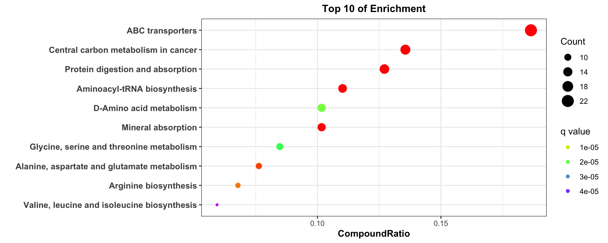
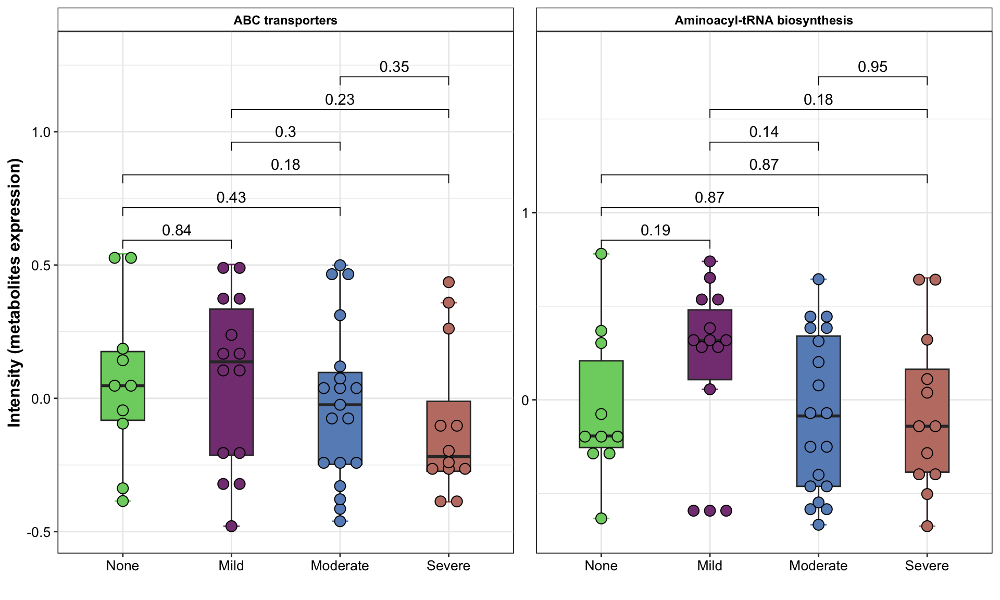

# Functional Analysis {#FunctionalAnalysis}


代谢物通路包含了基因、催化酶或代谢物等上下游关系的先验知识，通过将关心的代谢物比对到通路上，再根据如超级几何分析等数学方法计算受影响的代谢物是否能够影响通路。


代谢物富集分析的目的是为了解析某些差异代谢物是否落在某些pathway上（*可简单理解为单个差异代谢物解释pathway较弱，同一pathway的代谢物共同解释该通路变化则证据较为robust，在很多生物领域均存在类似的处理逻辑*），进而影响pathway的功能。基于pathway可分析代谢物的上下游基因或酶等影响，最终阐明作用机制。

代谢组服务公司反馈回来的代谢组表一般是基于intensity也即是质谱峰强度的数据，需要做前处理方可使用。本次使用直接处理后的数据用于分析。


功能分析方法主流有三类：

+ **ORA (Over-Representative analysis)**：将表达基因ORA放置在通路内，通过超级几何检验判断这些基因是否随机出现在通路内，从而判断功能是否富集

+ **GSEA (Gene set enrichment analysis)**：将所有基因按照log2foldchange的可以排序基因顺序的指标排序，再计算它们出现在每个通路的累积富集分数

+ **ssGSEA (single sample Gene set enrichment analysis)**：将每个样本的基因或代谢物表达值作为输入文件，结合对应通路数据库list，再计算每个通路的每个样本的累积富集分数


**注意：代谢组ID也有类似基因ID的多平台多命名问题，可以参考类似的名称转换工具包。本次直接使用cpdid，可直接用于KEGG COMPOUND数据库。**


| Analysis                                                     | 输入文件                                                     | 输出结果                         | ✅ 优点                                                       | ⚠️ 缺点                                                       |
| ------------------------------------------------------------ | ------------------------------------------------------------ | -------------------------------- | ------------------------------------------------------------ | ------------------------------------------------------------ |
| **ORA (Over-representation Analysis)**                       | 基因或代谢物等列表 (一般输入差异表达基因列表)                | 每条通路的超几何检验结果         | 简单；计算检验结果消耗计算资源少                             | 需要任意随心的基因阈值（比如选择上调基因），忽略与基因相关的任何统计数据；假设基因和通路的独立性 |
| **GSEA (Gene Set Enrichment Analysis)**                      | 具有基因水平统计结果（如差异检验的log2foldchange）的基因id列表 | 每条通路的富集打分               | 包含所有基因(不是任意选择的阈值) ；试图计算基因之间的协调性  | permutation计算资源消耗大；不能解释重叠通路的关系；两组比较不总是合适或可行的 |
| **GSVA (Gene Set Variation Analysis)**或**ssGSEA (Single sample gene set enrichment analysis)** | 基因表达谱（一般行是基因，列是样本）                         | 基于每个样本的通路水平的富集分数 | 不需要两组事先比较；输入数据要求正态分布（一般会对表达矩阵做转换处理） | 不适合包含上下调基因的基因集合；该方法本身不具有统计显著性；建议样本量大于10才采用该方法 |


## 加载R包

```r
knitr::opts_chunk$set(message = FALSE, warning = FALSE)
library(tidyverse)
library(massdatabase)
library(clusterProfiler)
library(MicrobiomeProfiler)

# rm(list = ls())
options(stringsAsFactors = F)
options(future.globals.maxSize = 1000 * 1024^2)

grp_names <- c("None", "Mild", "Moderate", "Severe")
grp_colors <- c("#7DD06F", "#844081", "#688EC1", "#C17E73")
```


## 导入数据

对数据[OmicsDataSet-Zeybel et al. - 2022.xlsx](https://github.com/HuaZou/DraftNotes/blob/main/InputData/Zeybel-2022/OmicsDataSet-Zeybel et al. - 2022.xlsx)处理后生成的，可参考数据预处理等章节。


> ```R
> write.table(final_res, "./InputData/result/DA/Metabolites_FC_VIP_ttest.tsv", 
            row.names = F, quote = F, sep = "\t", fileEncoding = "UTF-8")
> ```


```r
datSignif <- data.table::fread("./InputData/result/DA/Metabolites_FC_VIP_ttest.tsv")

# DT::datatable(datSignif)

head(datSignif)
#>                                         FeatureID
#>                                            <char>
#> 1: ceramide (d18:1/20:0, d16:1/22:0, d20:1/18:0)*
#> 2:                 cysteine-glutathione disulfide
#> 3:                                         serine
#> 4:          1-palmitoyl-2-oleoyl-GPI (16:0/18:1)*
#> 5:           1-stearoyl-2-oleoyl-GPI (18:0/18:1)*
#> 6:     palmitoyl-oleoyl-glycerol (16:0/18:1) [2]*
#>            Block2                Block FoldChange
#>            <char>               <char>      <num>
#> 1: None vs Severe 10_None vs 12_Severe  0.6444244
#> 2: None vs Severe 10_None vs 12_Severe  1.7109000
#> 3: None vs Severe 10_None vs 12_Severe  1.2218596
#> 4: None vs Severe 10_None vs 12_Severe  0.5199556
#> 5: None vs Severe 10_None vs 12_Severe  0.5667863
#> 6: None vs Severe 10_None vs 12_Severe  0.5638085
#>    Log2FoldChange      VIP    CorPvalue Statistic
#>             <num>    <num>        <num>     <num>
#> 1:     -0.6339170 2.713879 6.487126e-05 -4.923988
#> 2:      0.7747554 2.653166 1.139027e-04  4.989637
#> 3:      0.2890785 2.531054 3.153670e-04  4.409792
#> 4:     -0.9435396 2.539496 2.952154e-04 -4.294439
#> 5:     -0.8191231 2.488347 4.365061e-04 -4.098726
#> 6:     -0.8267228 2.398322 8.276438e-04 -3.781813
#>          Pvalue AdjustedPvalue Mean Abundance (All)
#>           <num>          <num>                <num>
#> 1: 1.234968e-04     0.03958071              3841099
#> 2: 8.636192e-05     0.03958071              1246453
#> 3: 2.705095e-04     0.05779885             63358904
#> 4: 4.600563e-04     0.07372402              2243154
#> 5: 7.802676e-04     0.10003031              1817773
#> 6: 1.814397e-03     0.16614697              1192929
#>    Mean Abundance None Mean Abundance Severe  metabolitesID
#>                  <num>                 <num>         <char>
#> 1:           2952496.1             4581602.1 Chem_100015755
#> 2:           1611743.8              942044.4 Chem_100001437
#> 3:          70323857.2            57554776.3       Chem_503
#> 4:           1491869.7             2869225.1 Chem_100009066
#> 5:           1282914.5             2263488.8 Chem_100009181
#> 6:            838913.8             1487941.0 Chem_100010917
#>                                       BIOCHEMICAL
#>                                            <char>
#> 1: ceramide (d18:1/20:0, d16:1/22:0, d20:1/18:0)*
#> 2:                 cysteine-glutathione disulfide
#> 3:                                         serine
#> 4:          1-palmitoyl-2-oleoyl-GPI (16:0/18:1)*
#> 5:           1-stearoyl-2-oleoyl-GPI (18:0/18:1)*
#> 6:     palmitoyl-oleoyl-glycerol (16:0/18:1) [2]*
#>    SUPER.PATHWAY                              SUB.PATHWAY
#>           <char>                                   <char>
#> 1:         Lipid                                Ceramides
#> 2:    Amino Acid                   Glutathione Metabolism
#> 3:    Amino Acid Glycine, Serine and Threonine Metabolism
#> 4:         Lipid                Phosphatidylinositol (PI)
#> 5:         Lipid                Phosphatidylinositol (PI)
#> 6:         Lipid                           Diacylglycerol
#>    COMPID        PLATFORM CHEMICALID    RI     MASS
#>     <int>          <char>      <int> <num>    <num>
#> 1:  57440  LC/MS Pos Late  100015755  3920 594.5820
#> 2:  35159 LC/MS Pos Early  100001437  2465 427.0952
#> 3:   1648 LC/MS Pos Early        503  1239 106.0499
#> 4:  52669  LC/MS Pos Late  100009066  3140 854.5753
#> 5:  52726  LC/MS Pos Late  100009181  3711 882.6066
#> 6:  54942  LC/MS Pos Late  100010917  3695 612.5562
#>     PUBCHEM        CAS   KEGG SampleIDHMDBID
#>      <char>     <char> <char>         <char>
#> 1:     <NA>       <NA>   <NA>           <NA>
#> 2:  3080690 13081-14-6 R00900    HMDB0000656
#> 3:     5951    56-45-1 C00065    HMDB0000187
#> 4: 71296232       <NA>   <NA>    HMDB0009783
#> 5:     <NA>       <NA>   <NA>           <NA>
#> 6:  5282283       <NA> C13861    HMDB0007102
```


## 获取KEGG pathway和代谢物ID对应关系

1. 下载KEGG pathway对应的compound信息。本次分析是针对人，因此在选择pathway的时候物种设置为人

2. 读取每个pathway包含的compound后，整理成pathway和compound一一对应的关系表


合并1和2步骤为一个脚本，步骤1推荐使用`massdatabase`R包，该步是为了获取特定物种的pathway和compound对应关系


```r
get_kegg_pathway_compound <- function(
    org_id = c("hsa", "mmu")) {
  
  pathway_names <- request_kegg_pathway_info(organism = org_id)
  
  res <- data.frame()
  for (i in 1:nrow(pathway_names)) {
    temp_pathway <- request_kegg_pathway(pathway_id = pathway_names$KEGG.ID[i])
    temp_colnames <- names(temp_pathway)
    if (all(c("COMPOUND", "ENTRY", "NAME", "CLASS", "PATHWAY_MAP") %in% temp_colnames)) {
      print(i)
      temp_compound <- temp_pathway$COMPOUND
      temp_class <- unlist(strsplit(temp_pathway$CLASS, "; "))
      temp_df1 <- data.frame(Pathway = temp_pathway$ENTRY,
                             NAME = temp_pathway$NAME,
                             #DESCRIPTION = temp_pathway$DESCRIPTION,
                             CLASS1 = temp_class[1],
                             CLASS2 = temp_class[2],
                             PATHWAY_MAP = temp_pathway$PATHWAY_MAP)
      temp_df2 <- data.frame(Pathway = rep(temp_pathway$ENTRY, length(temp_compound)),
                             COMPOUND = names(temp_compound),
                             COMPOUND_DESCRIPTION = temp_compound)
      
      temp_df <- temp_df1 %>%
        dplyr::full_join(temp_df2, by = "Pathway")
      
      res <- rbind(res, temp_df)
    }
  }
  
  return(res)
}

if(!dir.exists("./InputData/result/KEGG/")) {
  dir.create("./InputData/result/KEGG/", recursive = TRUE)
}

if (file.exists("./InputData/result/KEGG/KEGG_COMPOUND_PATHWAY_hsa.csv")) {
  hsa_kegg_compound <- read.csv("./InputData/result/KEGG/KEGG_COMPOUND_PATHWAY_hsa.csv") 
} else {
  hsa_kegg_compound <- get_kegg_pathway_compound(org_id = "hsa")
  write.csv(hsa_kegg_compound, "./InputData/result/KEGG/KEGG_COMPOUND_PATHWAY_hsa.csv", row.names = F)
}

# DT::datatable(hsa_kegg_compound)

head(hsa_kegg_compound)
#>    Pathway
#> 1 hsa00010
#> 2 hsa00010
#> 3 hsa00010
#> 4 hsa00010
#> 5 hsa00010
#> 6 hsa00010
#>                                                  NAME
#> 1 Glycolysis / Gluconeogenesis - Homo sapiens (human)
#> 2 Glycolysis / Gluconeogenesis - Homo sapiens (human)
#> 3 Glycolysis / Gluconeogenesis - Homo sapiens (human)
#> 4 Glycolysis / Gluconeogenesis - Homo sapiens (human)
#> 5 Glycolysis / Gluconeogenesis - Homo sapiens (human)
#> 6 Glycolysis / Gluconeogenesis - Homo sapiens (human)
#>       CLASS1                  CLASS2
#> 1 Metabolism Carbohydrate metabolism
#> 2 Metabolism Carbohydrate metabolism
#> 3 Metabolism Carbohydrate metabolism
#> 4 Metabolism Carbohydrate metabolism
#> 5 Metabolism Carbohydrate metabolism
#> 6 Metabolism Carbohydrate metabolism
#>                    PATHWAY_MAP COMPOUND
#> 1 Glycolysis / Gluconeogenesis   C00022
#> 2 Glycolysis / Gluconeogenesis   C00024
#> 3 Glycolysis / Gluconeogenesis   C00031
#> 4 Glycolysis / Gluconeogenesis   C00033
#> 5 Glycolysis / Gluconeogenesis   C00036
#> 6 Glycolysis / Gluconeogenesis   C00068
#>   COMPOUND_DESCRIPTION
#> 1             Pyruvate
#> 2           Acetyl-CoA
#> 3            D-Glucose
#> 4              Acetate
#> 5         Oxaloacetate
#> 6  Thiamin diphosphate
```


## 差异代谢物筛选

根据ORA或GSEA的原理，可以选择上下调差异代谢物或者按照log2foldchange排序好的代谢物用于差异分析

+ none: 所有代谢物

+ all: 所有差异代谢物

+ up (UpRegulated): 上调差异代谢物 

+ down (DownRegulated): 下调差异代谢物


```r
get_significant <- function(
    dat,
    group_names,
    lg2fc_cutoff = 0.5,
    pval_cutoff = 0.05,
    qval_cutoff = 0.3) {

  dat_group <- dat %>%
    dplyr::filter(Block2 %in% paste(group_names, collapse = " vs ")) %>%
    dplyr::distinct()
  
  # remove KEGG eq "-" or NA
  dat_fa <- dat_group %>% 
    dplyr::filter(KEGG != "-") %>%
    dplyr::filter(!is.na(KEGG)) %>%
    dplyr::rename(cpd_ID = KEGG)
  
  colnames(dat_fa)[which(colnames(dat_fa) == "Log2FoldChange")] <- "lg2fc" # Log2FoldChange (Median)
  colnames(dat_fa)[which(colnames(dat_fa) == "Pvalue")] <- "pval"
  colnames(dat_fa)[which(colnames(dat_fa) == "AdjustedPvalue")] <- "qval"
  
  # convert NA into 1
  dat_fa$qval[is.na(dat_fa$qval)] <- 1
  
  # enrichment by beta and Pvalue AdjustedPvalue
  dat_fa[which(dat_fa$lg2fc > lg2fc_cutoff &
              dat_fa$pval < pval_cutoff &
              dat_fa$qval < qval_cutoff),
      "EnrichedDir"] <- group_names[1]
  dat_fa[which(dat_fa$lg2fc < -lg2fc_cutoff &
              dat_fa$pval < pval_cutoff &
              dat_fa$qval < qval_cutoff),
      "EnrichedDir"] <- group_names[2]
  dat_fa[which(abs(dat_fa$lg2fc) <= lg2fc_cutoff |
              dat_fa$pval >= pval_cutoff |
              dat_fa$qval >= qval_cutoff),
      "EnrichedDir"] <- "Nonsignif"

  # dat status
  dat_fa$EnrichedDir <- factor(dat_fa$EnrichedDir,
                            levels = c(group_names[1], "Nonsignif", group_names[2]))
  df_status <- table(dat_fa$EnrichedDir) %>% data.frame() %>%
    stats::setNames(c("Group", "Number"))
  grp1_number <- with(df_status, df_status[Group %in% group_names[1], "Number"])
  grp2_number <- with(df_status, df_status[Group %in% group_names[2], "Number"])
  nsf_number <- with(df_status, df_status[Group %in% "Nonsignif", "Number"])
  legend_label <- c(paste0(group_names[1], " (", grp1_number, ")"),
                    paste0("Nonsignif", " (", nsf_number, ")"),
                    paste0(group_names[2], " (", grp2_number, ")"))

  # significant features
  dat_signif <- dat_fa %>%
    dplyr::arrange(lg2fc, pval, qval) %>%
    dplyr::filter(pval < pval_cutoff) %>%
    dplyr::filter(qval < qval_cutoff) %>%
    dplyr::filter(abs(lg2fc) > lg2fc_cutoff) %>%
    dplyr::select(FeatureID, Block, EnrichedDir, lg2fc, pval, qval, cpd_ID, everything()) %>%
    dplyr::mutate(FeatureID = gsub("\\.", "-", FeatureID))
  
  # print(table(dat_signif$EnrichedDir))

  res_up <- dat_signif %>% # enriched in 1st group
    dplyr::filter(EnrichedDir == group_names[1]) %>%
    dplyr::mutate(Status = "UpRegulated")

  res_down <- dat_signif %>% # enriched in 2st group
    dplyr::filter(EnrichedDir == group_names[2]) %>%
    dplyr::mutate(Status = "DownRegulated")

  res <- list(none = dat_fa %>%
                dplyr::select(FeatureID, Block, EnrichedDir, lg2fc, pval, qval, cpd_ID, everything()),
              all = dat_signif,
              up = res_up,
              down = res_down)

  return(res)
}
```


## 富集分析

用ClusterProfiler提供的enrichr和GESA做分析，这两个函数可自行配置输入pathway database，然后采用超几何检验和富集rank得分评估富集状况。除了常见的KEGG 通路富集分析外，还可以有Gene Ontology和MSigDB Hallmark gene sets等富集分析数据库。

> Gene Ontology: Biological Process (BP), Cellular Component (CC) 和 Molecular Function (MF)

+ ORA: 差异代谢物的超级几何检验

+ GSEA: 排好序的代谢物的富集rank打分


```r
get_enrichment <- function(
  dat,
  ref,
  group_names,
  direction = c("none", "All", "DownRegulated", "UpRegulated"), # DownRegulated->1st group; UpRegulated->2nd group 
  lg2fc_cutoff = 0.5,
  pval_cutoff = 0.05,
  qval_cutoff = 0.05,
  enrich_type = c("ORA", "GSEA")) {
  
  
  temp_input <- get_significant(
    dat = dat,
    group_names = group_names,
    lg2fc_cutoff = lg2fc_cutoff,
    pval_cutoff = pval_cutoff,
    qval_cutoff = qval_cutoff)  
  
  if (direction == "All") {
    inputdata <- temp_input$all
  } else if (direction == "UpRegulated") {
    inputdata <- temp_input$up
  } else if (direction == "DownRegulated") {
    inputdata <- temp_input$down
  } else if (direction == "none") {
    inputdata <- temp_input$none
  } 
  if (nrow(inputdata) == 0) {
    stop("Beyond these thresholds, no significant metabolites were selected")
  }  
  
  inputdata$cpd_ID <- gsub("\\s+\\|\\s+\\w+\\d+", "", inputdata$cpd_ID)
  inputdata$cpd_ID <- gsub(",\\S+", "", inputdata$cpd_ID)
  
  ref_cln <- ref %>%
    dplyr::select(PATHWAY_MAP, COMPOUND) %>%
    dplyr::rename(Pathway = PATHWAY_MAP)

  if (enrich_type == "ORA") {
    fit <- clusterProfiler::enricher(
                gene = inputdata$cpd_ID,
                pvalueCutoff = 0.05,
                pAdjustMethod = "BH",
                minGSSize = 10,
                maxGSSize = 500,
                qvalueCutoff = 0.2,
                TERM2GENE = ref_cln)
  } else if (enrich_type == "GSEA") {
    dat_GSEA <- inputdata %>%
      dplyr::arrange(desc(lg2fc))
    cpd_lg2fc <- dat_GSEA$lg2fc
    names(cpd_lg2fc) <- dat_GSEA$cpd_ID
    fit <- clusterProfiler::GSEA(
                geneList = cpd_lg2fc,
                pvalueCutoff = 0.05,
                pAdjustMethod = "BH",
                minGSSize = 10,
                maxGSSize = 500,
                TERM2GENE = ref_cln)
  }

  if (nrow(fit@result) != 0) {
    if (enrich_type == "ORA") {
      EA_res <- fit@result %>%
        dplyr::filter(!is.na(Description)) %>%
        dplyr::rename(CompoundRatio = GeneRatio,
                      CompoundID = geneID,
                      NAME = Description) %>%
        dplyr::select(ID, NAME, everything())      
    } else if (enrich_type == "GSEA") {
      EA_res <- fit@result %>%
        dplyr::filter(!is.na(Description)) %>%
        dplyr::rename(NAME = Description) %>%
        dplyr::select(ID, NAME, everything())       
    }
  } else {
    EA_res <- NULL
  }

  res <- list(data = inputdata,
              enrich = EA_res)

  return(res)
}
```


## 可视化通路

画气泡图或者条形图，根据qvalue和CompoundRatio以及Count画图


```r
plot_enrichment <- function(
    inputdata,
    qval_cutoff = 0.05,
    topN = 10,
    plot_type = c("bubble", "bar"),
    enrich_type = c("ORA", "GSEA")) {
  
  if (nrow(inputdata) == 0) {
    stop("No pathway please check your input")
  }  
  
  if (enrich_type == "ORA") {
    
    if (any(is.na(inputdata$qvalue))) {
      inputdata$qvalue <- inputdata$p.adjust
    }
    
    plotdata_temp <- inputdata %>%
      # dplyr::select(ID, NAME, CompoundRatio, qvalue, Count, CLASS1, CLASS2, PATHWAY_MAP) %>%
      dplyr::select(ID, NAME, CompoundRatio, qvalue, Count) %>%      
      dplyr::filter(qvalue < qval_cutoff)
    
    if (nrow(plotdata_temp) == 0) {
      stop("No pathway met the threshold of qvalue")
    }    
      
    plotdata <- plotdata_temp %>%  
      dplyr::slice(1:topN) %>%
      dplyr::mutate(qvalue = as.numeric(qvalue),
                    Count = as.numeric(Count)) %>%
      dplyr::group_by(ID) %>%
      dplyr::mutate(CompoundRatio1 = unlist(strsplit(CompoundRatio, "/"))[1],
                    CompoundRatio2 = unlist(strsplit(CompoundRatio, "/"))[2],
                    CompoundRatio = as.numeric(CompoundRatio1) / as.numeric(CompoundRatio2)) %>%
      dplyr::select(-dplyr::all_of(c("CompoundRatio1", "CompoundRatio2"))) %>%
      dplyr::mutate(NAME = gsub(" - Mus musculus \\(house mouse\\)", "", NAME)) %>%
      dplyr::arrange(CompoundRatio)  %>%
      dplyr::rename(Yvalue = CompoundRatio)
    y_lab <- "CompoundRatio"
  } else if (enrich_type == "GSEA") {
    if (any(is.na(inputdata$qvalue))) {
      inputdata$qvalues <- inputdata$p.adjust
    }    
    plotdata_temp <- inputdata %>%
      # dplyr::select(ID, NAME, enrichmentScore, qvalues, setSize, CLASS1, CLASS2, PATHWAY_MAP) %>%
      dplyr::select(ID, NAME, enrichmentScore, qvalues, setSize) %>%      
      dplyr::filter(qvalues < qval_cutoff)
    
    if (nrow(plotdata_temp) == 0) {
      stop("No pathway met the threshold of qvalue")
    }    
      
    plotdata <- plotdata_temp %>%  
      dplyr::slice(1:topN) %>%
      dplyr::rename(qvalue = qvalues,
                    Count = setSize) %>%
      dplyr::mutate(qvalue = as.numeric(qvalue),
                    Count = as.numeric(Count),
                    enrichmentScore = as.numeric(enrichmentScore)) %>%
      dplyr::mutate(NAME = gsub(" - Mus musculus \\(house mouse\\)", "", NAME)) %>%
      dplyr::arrange(enrichmentScore) %>%
      dplyr::rename(Yvalue = enrichmentScore)
    y_lab <- "enrichmentScore"
  } 

  plotdata$NAME <- factor(plotdata$NAME, levels = as.character(plotdata$NAME))
  
  final_topN <- nrow(plotdata)
  
  if (plot_type == "bubble") {
    pl <- ggplot(plotdata, aes(x = NAME, y = Yvalue)) +
      geom_point(aes(size = Count, color = qvalue)) +
      coord_flip() + 
      labs(x = "", y = y_lab, title = paste("Top", final_topN, "of Enrichment")) +
      theme_bw() +
      guides(size = guide_legend(order = 1),
             color = guide_legend(order = 2))+
      scale_color_gradientn(name = "q value", 
                            colours = rainbow(5)) +
      theme(plot.title = element_text(face = 'bold', size = 12, hjust = .5),
            axis.title = element_text(face = 'bold', size = 11),
            axis.text.y = element_text(face = 'bold', size = 10),
            legend.position = "right")    
  } else if (plot_type == "bar") {
    pl <- ggplot(plotdata, aes(x = NAME, y = Yvalue, fill = -log(qvalue))) +
      geom_bar(stat = "identity", position = position_dodge()) +
      coord_flip() + 
      labs(x = "", y = y_lab, title = paste("Top", final_topN, "of Enrichment")) +
      theme_bw() +
      guides(fill = guide_legend(order = 1))+
      scale_color_gradientn(name = "-log10(q value)",
                            colours = rainbow(5)) +
      theme(plot.title = element_text(face = 'bold', size = 12, hjust = .5),
            axis.title = element_text(face = 'bold', size = 11),
            axis.text.y = element_text(face = 'bold', size = 10),
            legend.position = "right")      
  }
  
  return(pl)
}
```


## 案例

比较"None"和"Severe"两组的差异代谢物在KEGG通路上是否显著富集。在明确富集通路后，可聚焦在这些通路的代谢物，通过解析上下游代谢物的变化，进而阐明潜在的生物学机制。

+ ORA: 所有差异代谢物富集分析结果


```r
ORA_res <- get_enrichment(
  dat = datSignif,
  ref = hsa_kegg_compound,
  group = grp_names[c(1, 4)],
  direction = "All",  
  lg2fc_cutoff = 0,
  pval_cutoff = 0.5,
  qval_cutoff = 1,
  enrich_type = "ORA")

head(ORA_res$enrich[, 1:6])
#>                                                                                      ID
#> Central carbon metabolism in cancer                 Central carbon metabolism in cancer
#> Protein digestion and absorption                       Protein digestion and absorption
#> Mineral absorption                                                   Mineral absorption
#> ABC transporters                                                       ABC transporters
#> Aminoacyl-tRNA biosynthesis                                 Aminoacyl-tRNA biosynthesis
#> Alanine, aspartate and glutamate metabolism Alanine, aspartate and glutamate metabolism
#>                                                                                    NAME
#> Central carbon metabolism in cancer                 Central carbon metabolism in cancer
#> Protein digestion and absorption                       Protein digestion and absorption
#> Mineral absorption                                                   Mineral absorption
#> ABC transporters                                                       ABC transporters
#> Aminoacyl-tRNA biosynthesis                                 Aminoacyl-tRNA biosynthesis
#> Alanine, aspartate and glutamate metabolism Alanine, aspartate and glutamate metabolism
#>                                             CompoundRatio
#> Central carbon metabolism in cancer                16/118
#> Protein digestion and absorption                   15/118
#> Mineral absorption                                 12/118
#> ABC transporters                                   22/118
#> Aminoacyl-tRNA biosynthesis                        13/118
#> Alanine, aspartate and glutamate metabolism         9/118
#>                                              BgRatio
#> Central carbon metabolism in cancer          37/3527
#> Protein digestion and absorption             47/3527
#> Mineral absorption                           29/3527
#> ABC transporters                            139/3527
#> Aminoacyl-tRNA biosynthesis                  52/3527
#> Alanine, aspartate and glutamate metabolism  28/3527
#>                                                   pvalue
#> Central carbon metabolism in cancer         6.317539e-15
#> Protein digestion and absorption            9.212369e-12
#> Mineral absorption                          3.607391e-11
#> ABC transporters                            4.235413e-10
#> Aminoacyl-tRNA biosynthesis                 7.164608e-09
#> Alanine, aspartate and glutamate metabolism 1.566506e-07
#>                                                 p.adjust
#> Central carbon metabolism in cancer         7.517872e-13
#> Protein digestion and absorption            5.481360e-10
#> Mineral absorption                          1.430932e-09
#> ABC transporters                            1.260035e-08
#> Aminoacyl-tRNA biosynthesis                 1.705177e-07
#> Alanine, aspartate and glutamate metabolism 3.106904e-06
```


结果：在设置提取差异代谢物阈值后，可以得知ORA结果下有119, 9条通路存在，再根据qvalue卡差异通路即可。

+ 差异代谢物涉及到的通路

+ 超级几何检验后得到的统计结果pvalue等


```r
ORA_bubble <- plot_enrichment(
    inputdata = ORA_res$enrich,
    qval_cutoff = 0.05,
    topN = 10,
    plot_type = "bubble",
    enrich_type = "ORA") 

ORA_bubble
```



结果：

从上述富集通路看，**ABC transporters**可通过代谢*Tryptophan*产生影响宿主的物质如(该通路涉及到的31个代谢物)

> sucrose/myo-inositol/glycerol/arginine/alanine/sulfate
/heme/uridine/betaine/taurine/maltose/histidine/cystine
/deoxycarnitine/maltotriose/valine/phenylalanine/erythritol
/glutamine/glucose/phosphate/leucine/serine/threonine/urea
/choline/ornithine/glycine/aspartate/hydroxyproline/fructose

综上，可对富集在该通路的代谢物的上下游基因或酶做进一步研究。


+ GSEA: 所有差异代谢物富集分析结果
```R
GSEA_res <- get_enrichment(
  dat = datSignif,
  ref = hsa_kegg_compound,
  group = grp_names[c(1, 4)],
  direction = "none",  
  lg2fc_cutoff = 0,
  pval_cutoff = 1,
  qval_cutoff = 1,
  enrich_type = "GSEA")

head(GSEA_res$enrich[, 1:6])
```


## 问题

上述参考数据库是基于human的，而本次数据是人肠道粪便的代谢组，它们大多数是来自于微生物。为了更精确计算富集结果，这里采用`MicrobiomeProfiler`提供的代谢物参考数据库

> 先前有想过把所有微生物涉及到的代谢物和通路的对应关系提取出来，但是太麻烦了，后来找到了`MicrobiomeProfiler`包，它里面提供微生物代谢组数据库

只需要对上述*get_enrichment*函数修改参考数据库即可，但它目前只提供ORA的方法(下方是沟通的邮件对话)。


询问

> Hi，Meijun老师您好，
> 
> 您开发的MicrobiomeProfiler极大方便了微生物的代谢物等的功能富集分析。作为受益者，对此表示非常感谢，生信领域因为有你们这样优秀的开发者而更加美好。
>  
> 现在有2个问题想咨询下您：
> 在KEGG pathway数据库中，不同的物种对应不同的pathway，且每个pathway下又有不同的compound和gene。比如在做人的富集分析的时候，会设置organism = > “hsa”，然后提取对应pathway里面的compound数据构建代谢物和pathway的对应关系表，但看到microbiomeprofiler在代谢物富集分析的时候，用的是KEGG > compound的数据库，该数据是没有物种区分的，这样做是合理的吗？
> 在microbiomeprofiler富集分析使用的是clusterProfiler的enrichr函数，该方法只能做ORA的分析，像clusterProfiler还提供了GESA的方法，是否后期也会支持该富集分析方法？


Meijun chen回复

> 感谢来信。关于信中提到的两个问题，第一个，由于不同组织来源或者生态环境中的微生物组成及其遗传信息差异很大，此外，需要将整个微生物群落当作一个整体来研究，因此在做微生物富集分析时，我们推荐用户使用自己的背景库（即实验中检测到的全部基因作为universe，差异基因作为query list），因此未提供给用户可供选择的固定背景库；第二个问题，GSEA目前在微生物领域应用较少，我们后续会考虑支持GSEA方法。


```r
get_enrichment2 <- function(
  dat = datSignif,
  group,
  direction = c(NULL, "DownRegulated", "UpRegulated"), # DownRegulated->1st group; UpRegulated->2nd group 
  index_names = c("FoldChange", "Log2FoldChange", "VIP", "CorPvalue", "Pvalue", "AdjustedPvalue"),
  index_cutoff = c(1, 1, 1, 0.05, 0.05, 0.2)) {
 
  # dat = datSignif
  # group = grp_names[c(1, 4)]
  # direction = NULL
  # index_names = c("Log2FoldChange", "AdjustedPvalue")
  # index_cutoff = c(0, 1)
  
  group_collapse <- paste(group, collapse = " vs ")
  signif_df <- dat %>%
    dplyr::filter(Block2 %in% group_collapse)
  
  colnames(signif_df)[which(colnames(signif_df) == index_names[1])] <- "DA_index1"
  colnames(signif_df)[which(colnames(signif_df) == index_names[2])] <- "DA_index2"
  
  signif_df_cln <- signif_df %>%
    dplyr::filter(abs(DA_index1) > index_cutoff[1]) %>%
    dplyr::filter(DA_index2 < index_cutoff[2]) %>%
    dplyr::filter(KEGG != "-") %>%
    dplyr::filter(!is.na(KEGG))

  signif_df_cln$KEGG <- gsub("\\s+\\|\\s+\\w+\\d+", "", signif_df_cln$KEGG)
  
  if (nrow(signif_df_cln) == 0) {
    stop("Beyond these thresholds, no significant metabolites were selected")
  }
  
  signif_temp <- signif_df_cln %>%
    dplyr::select(FeatureID, Block2, KEGG, BIOCHEMICAL, DA_index1, DA_index2) %>%
    dplyr::arrange(desc(DA_index1)) %>%
    dplyr::distinct()
  
  if (all(index_names[1] == "Log2FoldChange", direction == "DownRegulated", !is.null(direction))) {
    inputdata <- signif_temp %>%
      dplyr::filter(DA_index1 > 0)
  } else if (all(index_names[1] == "Log2FoldChange", direction == "UpRegulated", !is.null(direction))) {
    inputdata <- signif_temp %>%
      dplyr::filter(DA_index1 < 0)    
  } else if (any(index_names[1] != "Log2FoldChange", is.null(direction))) {
    inputdata <- signif_temp   
  }
  
  if (nrow(inputdata) == 0) {
    stop("Beyond these thresholds, no significant metabolites were selected when using direction")
  }  
  
  # inputdata$cpd_ID <- paste0("PW_", inputdata$cpd_ID)
  # bitr_smpdb(inputdata$cpd_ID, from_Type = "KEGG.ID", to_Type = "HMDB.ID")
  fit <- MicrobiomeProfiler::enrichMBKEGG(
            metabo_list = inputdata$KEGG,
            pvalueCutoff = 0.05,
            pAdjustMethod = "BH",
            minGSSize = 10,
            maxGSSize = 500,
            qvalueCutoff = 0.2)


  if (nrow(fit@result) != 0) {
    EA_res <- fit@result %>%
      dplyr::filter(!is.na(Description)) %>%
      dplyr::mutate(Group = group_collapse) %>%
      dplyr::rename(CompoundRatio = GeneRatio,
                    CompoundID = geneID,
                    NAME = Description) %>%
      dplyr::select(ID, NAME, everything()) 
  } else {
    EA_res <- NULL
  }

  colnames(inputdata)[which(colnames(inputdata) == "DA_index1")] <- index_names[1]
  colnames(inputdata)[which(colnames(inputdata) == "DA_index2")] <- index_names[2]  
  
  if (!is.null(EA_res)) {
    EA_res$CompoundName <- NA
    for (i in 1:nrow(EA_res)) {
      compound_list <- unlist(strsplit(EA_res$CompoundID[i], "\\/"))
      
      CompoundName <- c()
      for (j in 1:length(compound_list)) {
        for (k in 1:nrow(inputdata)) {
          if (compound_list[j] == inputdata$KEGG[k]) {
            CompoundName <- c(CompoundName, inputdata$BIOCHEMICAL[k])
          }
        }
      }
      EA_res$CompoundName[i] <- paste(CompoundName, collapse = "/")
    }
    
    res_score <- EA_res %>%
      dplyr::select(Group, ID, NAME, 
                    CompoundRatio, BgRatio, 
                    pvalue, p.adjust, qvalue, 
                    CompoundName, everything())
    
  } else {
    res_score <- EA_res
  }
  
  res <- list(data = inputdata,
              enrich = res_score)
  
  return(res)
}

ORA_res <- get_enrichment2(
  dat = datSignif,
  group = grp_names[c(1, 4)],
  direction = NULL,
  index_names = c("Log2FoldChange", "AdjustedPvalue"),
  index_cutoff = c(0, 1))

head(ORA_res$enrich[, 1:6])
#>                   Group       ID
#> map05230 None vs Severe map05230
#> map01060 None vs Severe map01060
#> map01230 None vs Severe map01230
#> map04974 None vs Severe map04974
#> map02010 None vs Severe map02010
#> map04978 None vs Severe map04978
#>                                                 NAME
#> map05230         Central carbon metabolism in cancer
#> map01060 Biosynthesis of plant secondary metabolites
#> map01230                 Biosynthesis of amino acids
#> map04974            Protein digestion and absorption
#> map02010                            ABC transporters
#> map04978                          Mineral absorption
#>          CompoundRatio  BgRatio       pvalue
#> map05230        22/190  37/6390 4.819405e-25
#> map01060        35/190 141/6390 1.760987e-23
#> map01230        30/190 128/6390 2.040244e-19
#> map04974        20/190  47/6390 5.191989e-19
#> map02010        30/190 138/6390 2.029215e-18
#> map04978        14/190  29/6390 1.374612e-14
```


```r
ORA_bubble <- plot_enrichment(
    inputdata = ORA_res$enrich,
    qval_cutoff = 0.05,
    topN = 10,
    plot_type = "bubble",
    enrich_type = "ORA") 

ORA_bubble
```


## ssGSEA: Single sample gene set enrichment analysis

单样本基因富集分析ssGSEA是另一种寻找富集分析通路的办法，相比将不同表型的样本所有基因混合在一起做富集分析的GSEA方法，ssGSEA通过计算每个样本的富集得分，然后通过一些差异分析方法比较通路在组间的异同。


> 原理
> 
> ssGSEA是一种常用于免疫细胞浸润分析的方法。该方法通过将每个样本的基因表达数据与特定的基因集（免疫细胞基因集）进行比较，来估计该基因集在该样本中的相对富集程度。在免疫细胞浸润分析中，我们可以使用ssGSEA来估计每个样本中不同免疫细胞类型的相对丰度。
> 
> 具体而言，ssGSEA首先将所有基因按照其表达量从大到小进行排序，并计算在某个基因集内，基因表达量较高的基因的累积分布函数。这个累积分布函数被称为基因集富集得分（gene set enrichment score，GSE）。然后，对于每个样本，将该样本中的所有基因的表达量按照从大到小的顺序排列，计算每个位置上所对应的基因集富集得分。最后，将这些位置上的得分进行平均或加权平均，得到该样本在该基因集上的ssGSEA得分，用于估计该样本中该免疫细胞类型的相对丰度。


### 加载R包

```r
if (!("GSVA" %in% installed.packages())) {
  # Install this package if it isn't installed yet
  BiocManager::install("GSVA", update = FALSE)
}

library(GSVA)
library(tidyverse)
```


### 导入数据

对数据[OmicsDataSet-Zeybel et al. - 2022.xlsx](https://github.com/HuaZou/DraftNotes/blob/main/InputData/Zeybel-2022/OmicsDataSet-Zeybel et al. - 2022.xlsx)处理后生成的，可参考数据预处理章节。

> ```R
> saveRDS(se_scale, "./InputData/result/QC/se_scale.RDS", compress = TRUE)
> ```

+ se_scale.RDS用于计算单个样本的富集打分


```r
se_scale <- readRDS("./InputData/result/QC/se_scale.RDS")
```


### 准备代谢组文件

以KEGG ID作为代谢物表达谱的行名


```r
phenotype <- SummarizedExperiment::colData(se_scale) %>%
  as.data.frame()
profile <- SummarizedExperiment::assay(se_scale) %>%
  as.data.frame()

feature <- SummarizedExperiment::rowData(se_scale) %>%
  as.data.frame()

feature$KEGG <- gsub("\\s+\\|\\s+\\w+\\d+", "", feature$KEGG)
feature$KEGG <- gsub(",\\S+", "", feature$KEGG)

feature_cln <- feature %>%
  dplyr::filter(KEGG != "-") %>%
  dplyr::filter(!is.na(KEGG)) %>%
  dplyr::select(metabolitesID, KEGG)

unique_KEGGID <- unique(feature_cln$KEGG)
feature_final <- feature_cln[pmatch(unique_KEGGID, feature_cln$KEGG), , F]

profile_final <- profile[pmatch(feature_final$metabolitesID, rownames(profile)), , F]
rownames(profile_final) <- feature_final$KEGG
```


### 准备KEGG配置文件

准备基因富集数据集，一般可以用**The Molecular Signatures Database (MSigDB)**，但它好像没有提供代谢组对应的数据集。

```R
hallmark_gene_sets <- msigdbr::msigdbr(
  species = "Homo sapiens", # Can change this to what species you need
  category = "H" # Only hallmark gene sets
)
```

方法1: 本文采用从KEGG官网下载的数据转换成gsva包所需要的数据库文件格式（每一个通路作为一个list对象，该list元素是代谢物名字）。


```r
hsa_kegg_compound <- read.csv("./InputData/result/KEGG/KEGG_COMPOUND_PATHWAY_hsa.csv") 

kegg_compound_gsva_list <- base::split(
  hsa_kegg_compound$COMPOUND,
  hsa_kegg_compound$PATHWAY_MAP)

head(kegg_compound_gsva_list, n = 2)
#> $`ABC transporters`
#>   [1] "C00009" "C00025" "C00031" "C00032" "C00034" "C00037"
#>   [7] "C00038" "C00041" "C00047" "C00049" "C00051" "C00059"
#>  [13] "C00062" "C00064" "C00065" "C00070" "C00077" "C00079"
#>  [19] "C00086" "C00088" "C00089" "C00093" "C00095" "C00098"
#>  [25] "C00107" "C00114" "C00116" "C00120" "C00121" "C00123"
#>  [31] "C00134" "C00135" "C00137" "C00140" "C00148" "C00151"
#>  [37] "C00159" "C00175" "C00181" "C00183" "C00185" "C00188"
#>  [43] "C00208" "C00212" "C00243" "C00244" "C00245" "C00255"
#>  [49] "C00259" "C00288" "C00291" "C00294" "C00299" "C00315"
#>  [55] "C00320" "C00330" "C00333" "C00338" "C00378" "C00379"
#>  [61] "C00387" "C00392" "C00407" "C00430" "C00470" "C00475"
#>  [67] "C00487" "C00491" "C00492" "C00503" "C00526" "C00559"
#>  [73] "C00719" "C00794" "C00855" "C00865" "C00881" "C00919"
#>  [79] "C00973" "C01083" "C01153" "C01157" "C01177" "C01181"
#>  [85] "C01279" "C01330" "C01417" "C01487" "C01606" "C01630"
#>  [91] "C01667" "C01674" "C01682" "C01684" "C01762" "C01834"
#>  [97] "C01835" "C01935" "C01946" "C02160" "C02273" "C03557"
#> [103] "C03611" "C03619" "C04114" "C04137" "C05349" "C05402"
#> [109] "C05512" "C05776" "C06227" "C06229" "C06230" "C06232"
#> [115] "C06687" "C06705" "C06706" "C06707" "C06767" "C07662"
#> [121] "C07663" "C11612" "C13768" "C14818" "C14819" "C15521"
#> [127] "C15719" "C16421" "C16692" "C19609" "C19872" "C20570"
#> [133] "C20571" "C20572" "C20573" "C20679" "C21066" "C22040"
#> [139] "G00457"
#> 
#> $`Acute myeloid leukemia`
#> [1] "C05981"
```


方法2: 采用`massdatabase`包提供的12个在线数据库下载物种的化合物/通路数据，并将其转换成数据框格式。它主要提供了

+ download_kegg_pathway：下载KEGG通路函数

+ read_kegg_pathway：读取KEGG通路

+ convert_kegg2metpath：转换KEGG通路

先前下载代码有使用过request_kegg_pathway函数，获取对应物种的KEGG信息，KEGG的物种简称见[KEGG Organisms: Complete Genomes](https://www.genome.jp/kegg/catalog/org_list.html)。本文使用*hsa* (Homo sapiens (human))。

```R
if (!("massdatabase" %in% installed.packages())) {
  remotes::install_github("tidymass/massdatabase", dependencies = TRUE)
}

library(massdatabase)

download_kegg_pathway(
  path = "./InputData/KEGG/hsa_KEGG",
  sleep = 2,
  organism = "hsa")

KEGG_data <- read_kegg_pathway(
  path = "./InputData/KEGG/hsa_KEGG")

KEGG_pathway_database <- convert_kegg2metpath(
  data = KEGG_data, 
  path = "./InputData/KEGG/hsa_KEGG")

KEGG_pathway_database
```


+ KEGG通路和基因关系 (包含pahtwya对应的module信息)

```R
KEGG_gene_path <- data.frame()

for (i in 1:length(KEGG_data)) {
  
  pathID <-  KEGG_data[[i]]$pathway_id
  pathName <- KEGG_data[[i]]$pathway_name 
  geneList <- KEGG_data[[i]]$gene_list
  pathClass <- KEGG_data[[i]]$pathway_class
  pathModule <- KEGG_data[[i]]$related_module
  describtion <- paste(KEGG_data[[i]]$describtion, collapse = ";")
  
  if (nrow(geneList) == 0) {
    next
  } else {
    
    temp <- geneList %>% 
      dplyr::group_by(Gene.name) %>%
      dplyr::mutate(Gene.symbol = unlist(strsplit(Gene.name, ";"))[1]) %>%
      dplyr::mutate(KO.ID = stringr::str_extract(Gene.name, "KO:K\\d+")) %>%
      dplyr::mutate(EC.ID = paste0("[EC", unlist(strsplit(Gene.name, "EC"))[2])) %>%
      dplyr::mutate(EC.ID = ifelse(EC.ID == "[ECNA", NA, EC.ID)) %>%
      dplyr::ungroup() %>%
      dplyr::mutate(pathway_id = pathID,
                    pathway_name = pathName)    
    
    if (!is.null(describtion)) {
      temp <- temp %>%
        dplyr::mutate(describtion = describtion)       
    } else {
      temp <- temp %>%
        dplyr::mutate(describtion = NA)       
    }
    
    
    if (!is.null(pathClass)) {
      temp <- temp %>%
        dplyr::mutate(pathway_class = pathClass) %>% 
        tidyr::separate(pathway_class, into = c("pathway_level2", "pathway_level1"), sep = ';', remove = FALSE)      
    } else {
       temp <- temp %>%
        dplyr::mutate(pathway_class = NA,
                      pathway_level1 = NA,
                      pathway_level2 = NA)      
    }
    
    if (nrow(pathModule) != 0) {
    temp <- temp %>%
      dplyr::inner_join(
        pathModule %>%
          dplyr::mutate(pathway_id = pathID),
        by = "pathway_id"
      ) %>%
      dplyr::select(pathway_id, pathway_level1, pathway_level2, Module.ID, Module.name, everything())     
    } else {
       temp <- temp %>%
        dplyr::mutate(Module.ID = NA,
                      Module.name = NA)      
    }    
    
    KEGG_gene_path <- rbind(KEGG_gene_path, temp)
  }
}
```


+ KEGG通路和代谢物关系 (包含pahtwya对应的module信息)

```R
KEGG_metabolite_path <- data.frame()

for (j in 1:length(KEGG_data)) {
  
  pathID <-  KEGG_data[[j]]$pathway_id
  pathName <- KEGG_data[[j]]$pathway_name 
  compoundList <- KEGG_data[[j]]$compound_list
  pathClass <- KEGG_data[[j]]$pathway_class
  pathModule <- KEGG_data[[j]]$related_module
  describtion <- paste(KEGG_data[[j]]$describtion, collapse = ";")
  
  if (nrow(compoundList) == 0) {
    next
  } else {
    
    temp <- compoundList %>% 
      dplyr::mutate(pathway_id = pathID,
                    pathway_name = pathName)    
    
    if (!is.null(describtion)) {
      temp <- temp %>%
        dplyr::mutate(describtion = describtion)       
    } else {
      temp <- temp %>%
        dplyr::mutate(describtion = NA)       
    }
    
    
    if (!is.null(pathClass)) {
      temp <- temp %>%
        dplyr::mutate(pathway_class = pathClass) %>% 
        tidyr::separate(pathway_class, into = c("pathway_level2", "pathway_level1"), sep = ';', remove = FALSE)      
    } else {
       temp <- temp %>%
        dplyr::mutate(pathway_class = NA,
                      pathway_level1 = NA,
                      pathway_level2 = NA)      
    }
    
    if (nrow(pathModule) != 0) {
    temp <- temp %>%
      dplyr::inner_join(
        pathModule %>%
          dplyr::mutate(pathway_id = pathID),
        by = "pathway_id"
      ) %>%
      dplyr::select(pathway_id, pathway_level1, pathway_level2, Module.ID, Module.name, everything())     
    } else {
       temp <- temp %>%
        dplyr::mutate(Module.ID = NA,
                      Module.name = NA)      
    }    
    
    KEGG_metabolite_path <- rbind(KEGG_metabolite_path, temp)
  }
}
```


### 计算单个样本的GSEA

`gsva`函数提供了四种计算方法，详情见`?GSVA::gsva`。

+ gsva (Hänzelmann et al, 2013): GSVA拟合一个模型，并根据相对于样本分布的表达水平对基因进行排序。计算的通路水平分数是一种询问基因集中的基因与该基因集中以外的基因相比如何变化的方法。

+ ssgsea (Barbie et al, 2009)：单样本GSEA (ssGSEA)，基因集富集分析(GSEA)的扩展，计算样品和基因集的每对单独的富集分数。每个ssGSEA富集分数代表了一个特定基因集中的基因在一个样本中协调上调或下调的程度。

+ zscore (Lee et al, 2008)

+ plage (Tomfohr et al, 2005)


```r
gsva_results <- gsva(
  as.matrix(profile_final),
  kegg_compound_gsva_list,
  method = "gsva",
  kcdf = "Gaussian",
  min.sz = 15,
  max.sz = 500,
  mx.diff = TRUE,
  verbose = FALSE)

head(gsva_results[, 1:3])
#>                                            P101001
#> ABC transporters                        -0.1969847
#> Aminoacyl-tRNA biosynthesis             -0.3747325
#> Bile secretion                           0.1317401
#> Biosynthesis of unsaturated fatty acids  0.3425360
#> Central carbon metabolism in cancer     -0.3105238
#> D-Amino acid metabolism                 -0.2673661
#>                                            P101003
#> ABC transporters                        -0.3853362
#> Aminoacyl-tRNA biosynthesis             -0.2669277
#> Bile secretion                           0.2239382
#> Biosynthesis of unsaturated fatty acids  0.6966145
#> Central carbon metabolism in cancer     -0.3902289
#> D-Amino acid metabolism                 -0.1233907
#>                                             P101004
#> ABC transporters                         0.07454968
#> Aminoacyl-tRNA biosynthesis              0.20151569
#> Bile secretion                          -0.14599557
#> Biosynthesis of unsaturated fatty acids  0.29420257
#> Central carbon metabolism in cancer      0.17196637
#> D-Amino acid metabolism                  0.06324261
```

### 可视化结果


```r
annot_df <- phenotype %>%
  dplyr::select(
    LiverFatClass) %>%
  tibble::rownames_to_column("TempRow") %>%
  dplyr::arrange(desc(LiverFatClass)) %>%
  dplyr::mutate(LiverFatClass = factor(LiverFatClass,
                                       levels = grp_names)) %>%
  tibble::column_to_rownames("TempRow")

plotdata <- gsva_results %>%
  as.data.frame() %>%
  dplyr::select(dplyr::all_of(rownames(annot_df))) %>%
  as.matrix()

pheatmap::pheatmap(
  plotdata,
  annotation_col = annot_df,
  show_colnames = FALSE,
  cluster_cols = FALSE,
  fontsize_row = 8,
  cellwidth = 7,
  cellheight = 20)
```


结果：

+ ssgsva计算出8条通路，它们的富集得分变化用热图展示，也可以做差异检验。


### 箱线图展示结果

除了热图展示外，还可以用更为直观的箱线图展示并加上差异分析结果。


```r
library(ggplot2)

get_topN_boxplot <- function(
    x,
    y,
    features,
    group,
    group_names = grp_names,
    group_colors = grp_colors,
    dotsize = 1.2) {
  
 
  # x = phenotype
  # y = gsva_results  
  # features = c("ABC transporters")
  # group = "LiverFatClass"
  # group_names = grp_names[1:2]
  # group_colors = grp_colors[1:2]
  # dotsize = 1.2

  # group
  colnames(x)[which(colnames(x) == group)] <- "Group_new"
  phen <- x %>%
    dplyr::filter(Group_new %in% group_names) %>%
    dplyr::select(Group_new) %>%
    tibble::rownames_to_column("TempRowNames")
  
  # profile
  prof <- y %>% 
    as.data.frame() %>% 
    t() %>% 
    as.data.frame() %>%
    dplyr::select(dplyr::all_of(features))
  
  # merge phenotype and profile
  feature_merge <- prof %>% 
    tibble::rownames_to_column("TempRowNames") %>%
    tidyr::gather(key = "Feature", value = "Abundance", -TempRowNames) %>%
    # dplyr::inner_join(feature, by = c("Feature" = "TempRowNames")) %>%
    dplyr::mutate(Feature_new = Feature) 

  # ordering feature
  feature_merge$Feature <- factor(feature_merge$Feature, levels = features)
  
  match_order_index <- sort(pmatch(unique(phen$Group_new), group_names), decreasing = F)
  group_names_new <- group_names[match_order_index]
  group_colors_new <- group_colors[match_order_index]   
  
  mdat <- phen %>% 
    dplyr::inner_join(feature_merge, by = "TempRowNames")
  mdat$Group_new <- factor(mdat$Group_new, levels = group_names_new)
  
  # comparison list
  cmp <- list()
  num <- utils::combn(length(unique(group_names_new)), 2)
  for (i in 1:ncol(num)) {
    cmp[[i]] <- num[, i]
  }
  
  pl <-
    ggplot(data = mdat, aes(x = Group_new, y = Abundance, fill = Group_new)) +
      stat_boxplot(aes(color = Group_new), geom = "errorbar", width = 0.15) +
      geom_boxplot(width = .4, outlier.shape = 3, outlier.size = 0.5) +
      ggpubr::stat_compare_means(comparisons = cmp,
                                 method = "wilcox.test",
                                 hide.ns = TRUE) + 
      geom_dotplot(binaxis = "y", stackdir = "center",
                 stackratio = 1.5, dotsize = dotsize) +
      scale_fill_manual(values = group_colors_new) +
      scale_color_manual(values = group_colors_new) +
      scale_y_continuous(expand = expansion(mult = c(0.05, 0.1))) +
      labs(x = "", y = "Intensity (metabolites expression)") +
      guides(color = "none", fill = "none") +
      facet_wrap(facets = "Feature_new", scales = "free", ncol = 4) +
      theme_bw() +
      theme(axis.title = element_text(size = 12, color = "black", face = "bold"),
            axis.text = element_text(size = 10, color = "black"),
            text = element_text(size = 9, color = "black"),
            strip.text = element_text(size = 9, color = "black", face = "bold"),
            panel.background = element_rect(fill = "white", colour = "black"),
            strip.background = element_rect(fill = "white", colour = "black"))
  
  return(pl)
}


get_topN_boxplot(
  x = phenotype,
  y = gsva_results, 
  features = rownames(gsva_results)[1:2], #c("Bile secretion", "ABC transporters")
  group = "LiverFatClass",
  group_names = grp_names,
  group_colors = grp_colors,
  dotsize = 1.2)
```




## Session info

```r
devtools::session_info()
#> ─ Session info ───────────────────────────────────────────
#>  setting  value
#>  version  R version 4.3.1 (2023-06-16)
#>  os       macOS Monterey 12.2.1
#>  system   x86_64, darwin20
#>  ui       X11
#>  language (EN)
#>  collate  en_US.UTF-8
#>  ctype    en_US.UTF-8
#>  tz       Asia/Shanghai
#>  date     2024-02-06
#>  pandoc   3.1.3 @ /Users/zouhua/opt/anaconda3/bin/ (via rmarkdown)
#> 
#> ─ Packages ───────────────────────────────────────────────
#>  package              * version     date (UTC) lib source
#>  abind                  1.4-5       2016-07-21 [1] CRAN (R 4.3.0)
#>  affy                   1.80.0      2023-10-24 [1] Bioconductor
#>  affyio                 1.72.0      2023-10-24 [1] Bioconductor
#>  annotate               1.80.0      2023-10-24 [1] Bioconductor
#>  AnnotationDbi          1.64.1      2023-11-03 [1] Bioconductor
#>  ape                    5.7-1       2023-03-13 [1] CRAN (R 4.3.0)
#>  aplot                  0.2.2       2023-10-06 [1] CRAN (R 4.3.0)
#>  attempt                0.3.1       2020-05-03 [1] CRAN (R 4.3.0)
#>  backports              1.4.1       2021-12-13 [1] CRAN (R 4.3.0)
#>  beachmat               2.18.0      2023-10-24 [1] Bioconductor
#>  Biobase              * 2.62.0      2023-10-24 [1] Bioconductor
#>  BiocGenerics         * 0.48.1      2023-11-01 [1] Bioconductor
#>  BiocManager            1.30.22     2023-08-08 [1] CRAN (R 4.3.0)
#>  BiocParallel           1.36.0      2023-10-24 [1] Bioconductor
#>  BiocSingular           1.18.0      2023-10-24 [1] Bioconductor
#>  Biostrings             2.70.2      2024-01-28 [1] Bioconductor 3.18 (R 4.3.2)
#>  bit                    4.0.5       2022-11-15 [1] CRAN (R 4.3.0)
#>  bit64                  4.0.5       2020-08-30 [1] CRAN (R 4.3.0)
#>  bitops                 1.0-7       2021-04-24 [1] CRAN (R 4.3.0)
#>  blob                   1.2.4       2023-03-17 [1] CRAN (R 4.3.0)
#>  bookdown               0.37        2023-12-01 [1] CRAN (R 4.3.0)
#>  broom                  1.0.5       2023-06-09 [1] CRAN (R 4.3.0)
#>  bslib                  0.6.1       2023-11-28 [1] CRAN (R 4.3.0)
#>  cachem                 1.0.8       2023-05-01 [1] CRAN (R 4.3.0)
#>  car                    3.1-2       2023-03-30 [1] CRAN (R 4.3.0)
#>  carData                3.0-5       2022-01-06 [1] CRAN (R 4.3.0)
#>  cellranger             1.1.0       2016-07-27 [1] CRAN (R 4.3.0)
#>  circlize               0.4.15      2022-05-10 [1] CRAN (R 4.3.0)
#>  cli                    3.6.2       2023-12-11 [1] CRAN (R 4.3.0)
#>  clue                   0.3-65      2023-09-23 [1] CRAN (R 4.3.0)
#>  cluster                2.1.4       2022-08-22 [1] CRAN (R 4.3.1)
#>  clusterProfiler      * 4.10.0      2023-10-24 [1] Bioconductor
#>  codetools              0.2-19      2023-02-01 [1] CRAN (R 4.3.1)
#>  colorspace             2.1-0       2023-01-23 [1] CRAN (R 4.3.0)
#>  ComplexHeatmap         2.18.0      2023-10-24 [1] Bioconductor
#>  config                 0.3.2       2023-08-30 [1] CRAN (R 4.3.0)
#>  cowplot                1.1.3       2024-01-22 [1] CRAN (R 4.3.2)
#>  crayon                 1.5.2       2022-09-29 [1] CRAN (R 4.3.0)
#>  curl                   5.2.0       2023-12-08 [1] CRAN (R 4.3.0)
#>  data.table             1.15.0      2024-01-30 [1] CRAN (R 4.3.2)
#>  DBI                    1.2.1       2024-01-12 [1] CRAN (R 4.3.0)
#>  DelayedArray           0.28.0      2023-10-24 [1] Bioconductor
#>  DelayedMatrixStats     1.24.0      2023-10-24 [1] Bioconductor
#>  devtools               2.4.5       2022-10-11 [1] CRAN (R 4.3.0)
#>  digest                 0.6.34      2024-01-11 [1] CRAN (R 4.3.0)
#>  doParallel             1.0.17      2022-02-07 [1] CRAN (R 4.3.0)
#>  DOSE                   3.28.2      2023-12-10 [1] Bioconductor
#>  downlit                0.4.3       2023-06-29 [1] CRAN (R 4.3.0)
#>  dplyr                * 1.1.4       2023-11-17 [1] CRAN (R 4.3.0)
#>  DT                     0.31        2023-12-09 [1] CRAN (R 4.3.0)
#>  ellipsis               0.3.2       2021-04-29 [1] CRAN (R 4.3.0)
#>  enrichplot             1.22.0      2023-10-24 [1] Bioconductor
#>  evaluate               0.23        2023-11-01 [1] CRAN (R 4.3.0)
#>  fansi                  1.0.6       2023-12-08 [1] CRAN (R 4.3.0)
#>  farver                 2.1.1       2022-07-06 [1] CRAN (R 4.3.0)
#>  fastmap                1.1.1       2023-02-24 [1] CRAN (R 4.3.0)
#>  fastmatch              1.1-4       2023-08-18 [1] CRAN (R 4.3.0)
#>  fgsea                  1.28.0      2023-10-24 [1] Bioconductor
#>  forcats              * 1.0.0       2023-01-29 [1] CRAN (R 4.3.0)
#>  foreach                1.5.2       2022-02-02 [1] CRAN (R 4.3.0)
#>  fs                     1.6.3       2023-07-20 [1] CRAN (R 4.3.0)
#>  furrr                  0.3.1       2022-08-15 [1] CRAN (R 4.3.0)
#>  future                 1.33.1      2023-12-22 [1] CRAN (R 4.3.0)
#>  generics               0.1.3       2022-07-05 [1] CRAN (R 4.3.0)
#>  GenomeInfoDb           1.38.5      2023-12-28 [1] Bioconductor 3.18 (R 4.3.2)
#>  GenomeInfoDbData       1.2.11      2024-01-24 [1] Bioconductor
#>  GenomicRanges          1.54.1      2023-10-29 [1] Bioconductor
#>  GetoptLong             1.0.5       2020-12-15 [1] CRAN (R 4.3.0)
#>  ggforce                0.4.1       2022-10-04 [1] CRAN (R 4.3.0)
#>  ggfun                  0.1.4       2024-01-19 [1] CRAN (R 4.3.0)
#>  ggplot2              * 3.4.4       2023-10-12 [1] CRAN (R 4.3.0)
#>  ggplotify              0.1.2       2023-08-09 [1] CRAN (R 4.3.0)
#>  ggpubr                 0.6.0       2023-02-10 [1] CRAN (R 4.3.0)
#>  ggraph                 2.1.0       2022-10-09 [1] CRAN (R 4.3.0)
#>  ggrepel                0.9.5       2024-01-10 [1] CRAN (R 4.3.0)
#>  ggsignif               0.6.4       2022-10-13 [1] CRAN (R 4.3.0)
#>  ggtree                 3.10.0      2023-10-24 [1] Bioconductor
#>  GlobalOptions          0.1.2       2020-06-10 [1] CRAN (R 4.3.0)
#>  globals                0.16.2      2022-11-21 [1] CRAN (R 4.3.0)
#>  glue                   1.7.0       2024-01-09 [1] CRAN (R 4.3.0)
#>  GO.db                  3.18.0      2024-02-06 [1] Bioconductor
#>  golem                  0.4.1       2023-06-05 [1] CRAN (R 4.3.0)
#>  GOSemSim               2.28.1      2024-01-17 [1] Bioconductor 3.18 (R 4.3.2)
#>  graph                  1.80.0      2023-10-24 [1] Bioconductor
#>  graphlayouts           1.1.0       2024-01-19 [1] CRAN (R 4.3.0)
#>  gridExtra              2.3         2017-09-09 [1] CRAN (R 4.3.0)
#>  gridGraphics           0.5-1       2020-12-13 [1] CRAN (R 4.3.0)
#>  GSEABase               1.64.0      2023-10-24 [1] Bioconductor
#>  gson                   0.1.0       2023-03-07 [1] CRAN (R 4.3.0)
#>  GSVA                 * 1.50.0      2023-10-24 [1] Bioconductor
#>  gtable                 0.3.4       2023-08-21 [1] CRAN (R 4.3.0)
#>  HDF5Array              1.30.0      2023-10-24 [1] Bioconductor
#>  HDO.db                 0.99.1      2024-02-06 [1] Bioconductor
#>  highr                  0.10        2022-12-22 [1] CRAN (R 4.3.0)
#>  hms                    1.1.3       2023-03-21 [1] CRAN (R 4.3.0)
#>  htmltools              0.5.7       2023-11-03 [1] CRAN (R 4.3.0)
#>  htmlwidgets            1.6.4       2023-12-06 [1] CRAN (R 4.3.0)
#>  httpuv                 1.6.14      2024-01-26 [1] CRAN (R 4.3.2)
#>  httr                   1.4.7       2023-08-15 [1] CRAN (R 4.3.0)
#>  igraph                 2.0.1.1     2024-01-30 [1] CRAN (R 4.3.2)
#>  impute                 1.76.0      2023-10-24 [1] Bioconductor
#>  IRanges                2.36.0      2023-10-24 [1] Bioconductor
#>  irlba                  2.3.5.1     2022-10-03 [1] CRAN (R 4.3.0)
#>  iterators              1.0.14      2022-02-05 [1] CRAN (R 4.3.0)
#>  jquerylib              0.1.4       2021-04-26 [1] CRAN (R 4.3.0)
#>  jsonlite               1.8.8       2023-12-04 [1] CRAN (R 4.3.0)
#>  KEGGREST               1.42.0      2023-10-24 [1] Bioconductor
#>  knitr                  1.45        2023-10-30 [1] CRAN (R 4.3.0)
#>  labeling               0.4.3       2023-08-29 [1] CRAN (R 4.3.0)
#>  later                  1.3.2       2023-12-06 [1] CRAN (R 4.3.0)
#>  lattice                0.21-8      2023-04-05 [1] CRAN (R 4.3.1)
#>  lazyeval               0.2.2       2019-03-15 [1] CRAN (R 4.3.0)
#>  lifecycle              1.0.4       2023-11-07 [1] CRAN (R 4.3.0)
#>  limma                  3.58.1      2023-10-31 [1] Bioconductor
#>  listenv                0.9.1       2024-01-29 [1] CRAN (R 4.3.2)
#>  lubridate            * 1.9.3       2023-09-27 [1] CRAN (R 4.3.0)
#>  magrittr             * 2.0.3       2022-03-30 [1] CRAN (R 4.3.0)
#>  MALDIquant             1.22.2      2024-01-22 [1] CRAN (R 4.3.2)
#>  MASS                   7.3-60      2023-05-04 [1] CRAN (R 4.3.1)
#>  massdatabase         * 1.0.10      2024-02-06 [1] Github (tidymass/massdatabase@211399a)
#>  massdataset          * 1.0.29      2024-02-06 [1] gitlab (tidymass/massdataset@90e65be)
#>  masstools            * 1.0.13      2024-02-06 [1] gitlab (tidymass/masstools@95a6b2b)
#>  Matrix                 1.6-5       2024-01-11 [1] CRAN (R 4.3.0)
#>  MatrixGenerics         1.14.0      2023-10-24 [1] Bioconductor
#>  matrixStats            1.2.0       2023-12-11 [1] CRAN (R 4.3.0)
#>  memoise                2.0.1       2021-11-26 [1] CRAN (R 4.3.0)
#>  metid                * 1.2.30      2024-02-06 [1] gitlab (tidymass/metid@659b771)
#>  metpath              * 1.0.8       2024-02-06 [1] gitlab (tidymass/metpath@62ac694)
#>  MicrobiomeProfiler   * 1.8.0       2023-10-24 [1] Bioconductor
#>  mime                   0.12        2021-09-28 [1] CRAN (R 4.3.0)
#>  miniUI                 0.1.1.1     2018-05-18 [1] CRAN (R 4.3.0)
#>  MsCoreUtils            1.14.1      2023-11-03 [1] Bioconductor
#>  MSnbase              * 2.28.1      2023-11-06 [1] Bioconductor
#>  munsell                0.5.0       2018-06-12 [1] CRAN (R 4.3.0)
#>  mzID                   1.40.0      2023-10-24 [1] Bioconductor
#>  mzR                  * 2.36.0      2023-10-24 [1] Bioconductor
#>  ncdf4                  1.22        2023-11-28 [1] CRAN (R 4.3.0)
#>  nlme                   3.1-162     2023-01-31 [1] CRAN (R 4.3.1)
#>  openxlsx               4.2.5.2     2023-02-06 [1] CRAN (R 4.3.0)
#>  parallelly             1.36.0      2023-05-26 [1] CRAN (R 4.3.0)
#>  patchwork              1.2.0       2024-01-08 [1] CRAN (R 4.3.0)
#>  pbapply                1.7-2       2023-06-27 [1] CRAN (R 4.3.0)
#>  pcaMethods             1.94.0      2023-10-24 [1] Bioconductor
#>  pheatmap               1.0.12      2019-01-04 [1] CRAN (R 4.3.0)
#>  pillar                 1.9.0       2023-03-22 [1] CRAN (R 4.3.0)
#>  pkgbuild               1.4.3       2023-12-10 [1] CRAN (R 4.3.0)
#>  pkgconfig              2.0.3       2019-09-22 [1] CRAN (R 4.3.0)
#>  pkgload                1.3.4       2024-01-16 [1] CRAN (R 4.3.0)
#>  plotly                 4.10.4      2024-01-13 [1] CRAN (R 4.3.0)
#>  plyr                   1.8.9       2023-10-02 [1] CRAN (R 4.3.0)
#>  png                    0.1-8       2022-11-29 [1] CRAN (R 4.3.0)
#>  polyclip               1.10-6      2023-09-27 [1] CRAN (R 4.3.0)
#>  preprocessCore         1.64.0      2023-10-24 [1] Bioconductor
#>  prettyunits            1.2.0       2023-09-24 [1] CRAN (R 4.3.0)
#>  profvis                0.3.8       2023-05-02 [1] CRAN (R 4.3.0)
#>  progress               1.2.3       2023-12-06 [1] CRAN (R 4.3.0)
#>  promises               1.2.1       2023-08-10 [1] CRAN (R 4.3.0)
#>  ProtGenerics         * 1.34.0      2023-10-24 [1] Bioconductor
#>  purrr                * 1.0.2       2023-08-10 [1] CRAN (R 4.3.0)
#>  qvalue                 2.34.0      2023-10-24 [1] Bioconductor
#>  R6                     2.5.1       2021-08-19 [1] CRAN (R 4.3.0)
#>  RColorBrewer           1.1-3       2022-04-03 [1] CRAN (R 4.3.0)
#>  Rcpp                 * 1.0.12      2024-01-09 [1] CRAN (R 4.3.0)
#>  RCurl                  1.98-1.14   2024-01-09 [1] CRAN (R 4.3.0)
#>  Rdisop                 1.62.0      2023-10-24 [1] Bioconductor
#>  readr                * 2.1.5       2024-01-10 [1] CRAN (R 4.3.0)
#>  readxl                 1.4.3       2023-07-06 [1] CRAN (R 4.3.0)
#>  remotes                2.4.2.1     2023-07-18 [1] CRAN (R 4.3.0)
#>  reshape2               1.4.4       2020-04-09 [1] CRAN (R 4.3.0)
#>  rhdf5                  2.46.1      2023-11-29 [1] Bioconductor
#>  rhdf5filters           1.14.1      2023-11-06 [1] Bioconductor
#>  Rhdf5lib               1.24.1      2023-12-12 [1] Bioconductor 3.18 (R 4.3.2)
#>  rjson                  0.2.21      2022-01-09 [1] CRAN (R 4.3.0)
#>  rlang                  1.1.3       2024-01-10 [1] CRAN (R 4.3.0)
#>  rmarkdown              2.25        2023-09-18 [1] CRAN (R 4.3.0)
#>  RSQLite                2.3.5       2024-01-21 [1] CRAN (R 4.3.0)
#>  rstatix                0.7.2       2023-02-01 [1] CRAN (R 4.3.0)
#>  rstudioapi             0.15.0      2023-07-07 [1] CRAN (R 4.3.0)
#>  rsvd                   1.0.5       2021-04-16 [1] CRAN (R 4.3.0)
#>  rvest                  1.0.3       2022-08-19 [1] CRAN (R 4.3.0)
#>  S4Arrays               1.2.0       2023-10-24 [1] Bioconductor
#>  S4Vectors            * 0.40.2      2023-11-23 [1] Bioconductor
#>  sass                   0.4.8       2023-12-06 [1] CRAN (R 4.3.0)
#>  ScaledMatrix           1.10.0      2023-10-24 [1] Bioconductor
#>  scales                 1.3.0       2023-11-28 [1] CRAN (R 4.3.0)
#>  scatterpie             0.2.1       2023-06-07 [1] CRAN (R 4.3.0)
#>  sessioninfo            1.2.2       2021-12-06 [1] CRAN (R 4.3.0)
#>  shadowtext             0.1.3       2024-01-19 [1] CRAN (R 4.3.0)
#>  shape                  1.4.6       2021-05-19 [1] CRAN (R 4.3.0)
#>  shiny                  1.8.0       2023-11-17 [1] CRAN (R 4.3.0)
#>  shinycustomloader      0.9.0       2018-03-27 [1] CRAN (R 4.3.0)
#>  shinyWidgets           0.8.1       2024-01-10 [1] CRAN (R 4.3.0)
#>  SingleCellExperiment   1.24.0      2023-10-24 [1] Bioconductor
#>  SparseArray            1.2.3       2023-12-25 [1] Bioconductor 3.18 (R 4.3.2)
#>  sparseMatrixStats      1.14.0      2023-10-24 [1] Bioconductor
#>  statmod                1.5.0       2023-01-06 [1] CRAN (R 4.3.0)
#>  stringdist             0.9.12      2023-11-28 [1] CRAN (R 4.3.0)
#>  stringi                1.8.3       2023-12-11 [1] CRAN (R 4.3.0)
#>  stringr              * 1.5.1       2023-11-14 [1] CRAN (R 4.3.0)
#>  SummarizedExperiment   1.32.0      2023-10-24 [1] Bioconductor
#>  tibble               * 3.2.1       2023-03-20 [1] CRAN (R 4.3.0)
#>  tidygraph              1.3.0       2023-12-18 [1] CRAN (R 4.3.0)
#>  tidyr                * 1.3.1       2024-01-24 [1] CRAN (R 4.3.2)
#>  tidyselect             1.2.0       2022-10-10 [1] CRAN (R 4.3.0)
#>  tidytree               0.4.6       2023-12-12 [1] CRAN (R 4.3.0)
#>  tidyverse            * 2.0.0       2023-02-22 [1] CRAN (R 4.3.0)
#>  timechange             0.3.0       2024-01-18 [1] CRAN (R 4.3.0)
#>  treeio                 1.26.0      2023-10-24 [1] Bioconductor
#>  tweenr                 2.0.2       2022-09-06 [1] CRAN (R 4.3.0)
#>  tzdb                   0.4.0       2023-05-12 [1] CRAN (R 4.3.0)
#>  urlchecker             1.0.1       2021-11-30 [1] CRAN (R 4.3.0)
#>  usethis                2.2.2       2023-07-06 [1] CRAN (R 4.3.0)
#>  utf8                   1.2.4       2023-10-22 [1] CRAN (R 4.3.0)
#>  vctrs                  0.6.5       2023-12-01 [1] CRAN (R 4.3.0)
#>  viridis                0.6.5       2024-01-29 [1] CRAN (R 4.3.2)
#>  viridisLite            0.4.2       2023-05-02 [1] CRAN (R 4.3.0)
#>  vsn                    3.70.0      2023-10-24 [1] Bioconductor
#>  withr                  3.0.0       2024-01-16 [1] CRAN (R 4.3.0)
#>  xfun                   0.41        2023-11-01 [1] CRAN (R 4.3.0)
#>  XML                    3.99-0.16.1 2024-01-22 [1] CRAN (R 4.3.2)
#>  xml2                   1.3.6       2023-12-04 [1] CRAN (R 4.3.0)
#>  xtable                 1.8-4       2019-04-21 [1] CRAN (R 4.3.0)
#>  XVector                0.42.0      2023-10-24 [1] Bioconductor
#>  yaml                   2.3.8       2023-12-11 [1] CRAN (R 4.3.0)
#>  yulab.utils            0.1.4       2024-01-28 [1] CRAN (R 4.3.2)
#>  zip                    2.3.0       2023-04-17 [1] CRAN (R 4.3.0)
#>  zlibbioc               1.48.0      2023-10-24 [1] Bioconductor
#> 
#>  [1] /Library/Frameworks/R.framework/Versions/4.3-x86_64/Resources/library
#> 
#> ──────────────────────────────────────────────────────────
```


## Reference

+ [massdatabase github](https://github.com/tidymass/massdatabase/) 

+ [Univeral enrichment analysis](https://yulab-smu.top/biomedical-knowledge-mining-book/universal-api.html)

+ [Gene set variation analysis - RNA-seq](https://alexslemonade.github.io/refinebio-examples/03-rnaseq/pathway-analysis_rnaseq_03_gsva.html#1_Purpose_of_this_analysis)
