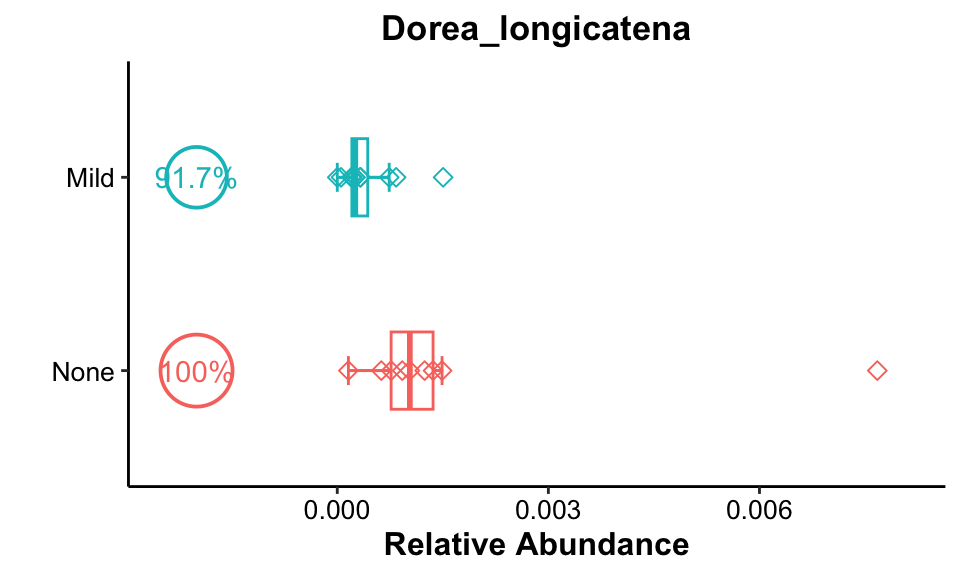
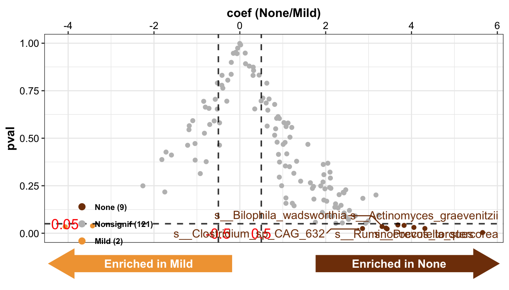
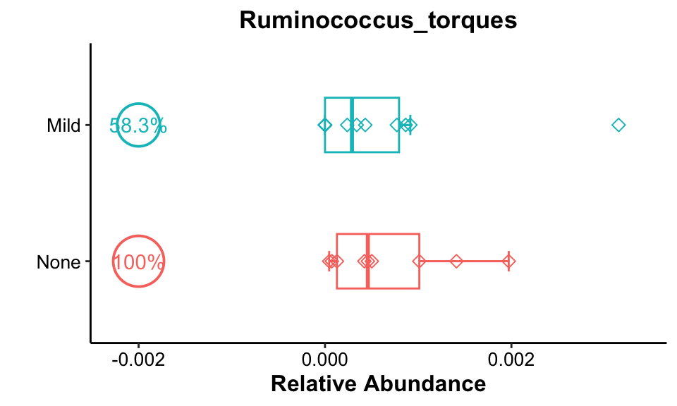
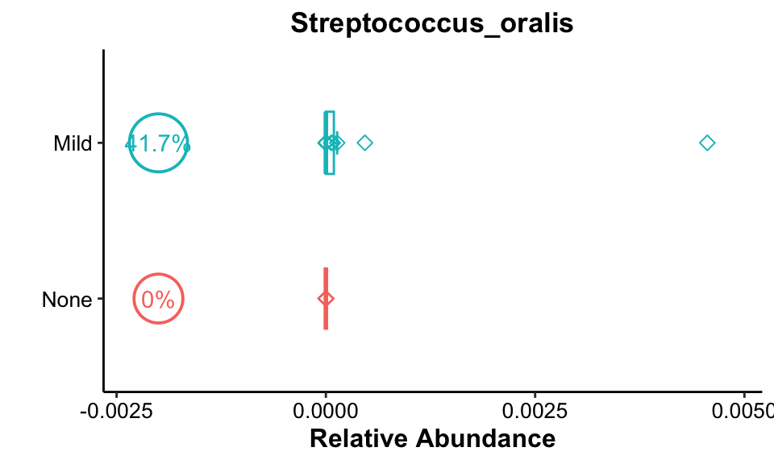
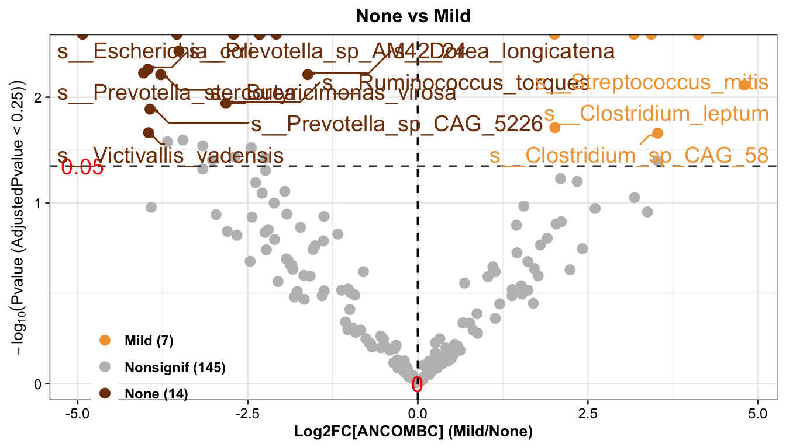
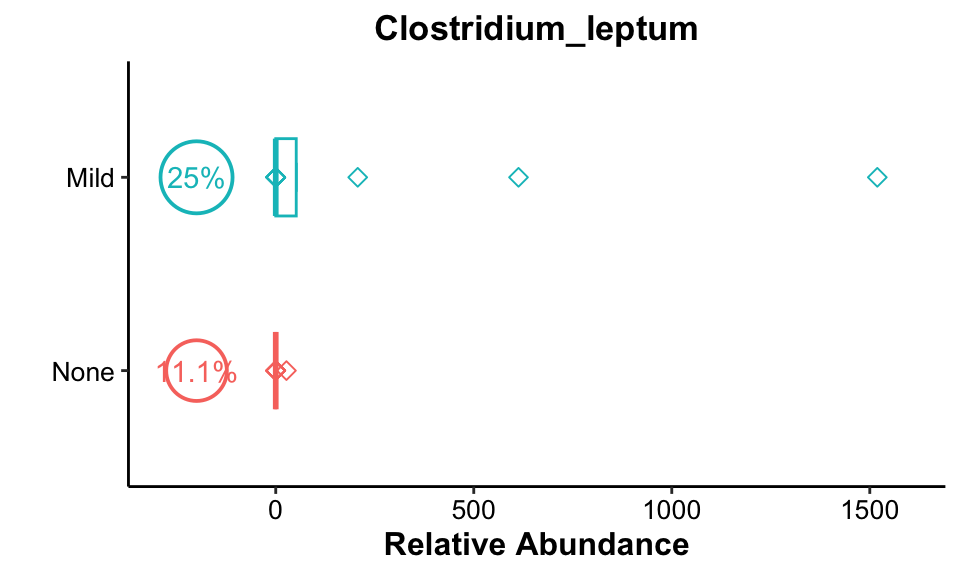
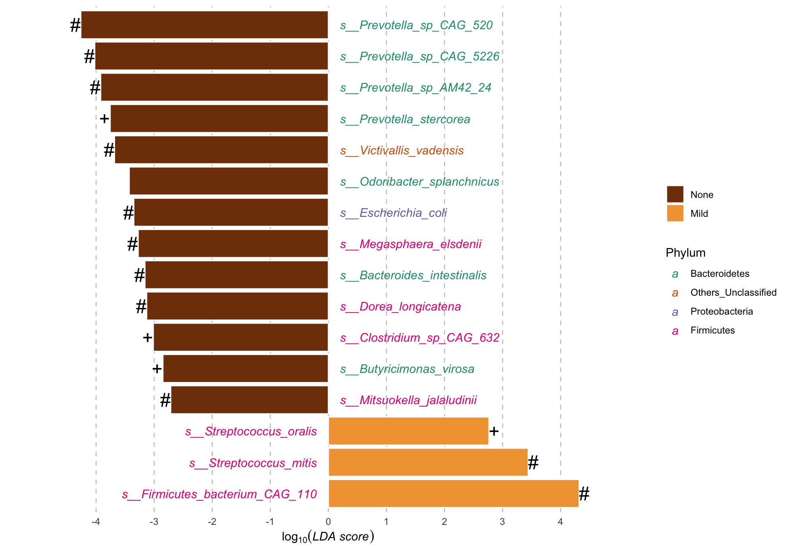

# (PART) Metagenomics Data Analysis {.unnumbered}


# Multiple Differetial Analysis {#MultipleDifferetialAnalysis}


识别组间差异物种是微生物领域常见的数据分析。我们采用三类不同的差异分析方法来发现显著差异的微生物物种，它们分别是：

+ Linear Discriminant Analysis of Effect Size (LefSe).

+ Microbiome Multivariable Association with Linear Models (Maaslin2).

+ Analysis of Composition of Microbiomes with Bias Correction (ANCOM-BC).


**LefSe**是一种基于有监督的线性判别筛选差异物种的方法；**Maaslin2**是一种基于线性回归算法鉴定差异物种的方法；**ANCOM-BC**是一种校正样本之间绝对丰度偏差和零值膨胀等后再发现差异物种的方法。

我们将以**LefSe**识别出的差异物种作为基准，合并另外两种方法的差异结果，最后以柱状图展示结果。


## 安装MicrobiomeAnalysis包

+ MicrobiomeAnalysis可提供下面分析使用的函数

```R
if (!requireNamespace(c("remotes", "devtools"), quietly=TRUE)) {
  install.packages(c("devtools", "remotes"))
}
remotes::install_github("HuaZou/MicrobiomeAnalysis")
```


## 加载R包

```r
knitr::opts_chunk$set(message = FALSE, warning = FALSE)
library(tidyverse)
library(MicrobiomeAnalysis)
library(Maaslin2)
library(ANCOMBC)
library(phyloseq)
library(ggpubr)

# rm(list = ls())
options(stringsAsFactors = F)
options(future.globals.maxSize = 1000 * 1024^2)

# group & color
sex_grp <- c("Male", "Female")
sex_col <- c("#F28880", "#60C4D3")

lf_grp <- c("None", "Mild", "Moderate", "Severe")
lf_col <- c("#803C08", "#F1A340", "#2C0a4B", "#998EC3")
```


## 导入数据

数据来自于Zeybel_2022的肠道微生物数据，可以在**Zeybel Dataset**章节的输出结果获取。


```r
phy <- readRDS("InputData/result/Zeybel_2022_gut_MGS_ps.RDS")

phy
#> phyloseq-class experiment-level object
#> otu_table()   OTU Table:         [ 547 taxa and 42 samples ]
#> sample_data() Sample Data:       [ 42 samples by 46 sample variables ]
#> tax_table()   Taxonomy Table:    [ 547 taxa by 7 taxonomic ranks ]
```

+ 因为没有绝对丰度表，暂时对相对丰度表进行转换成绝对丰度表（注意：需要提供准确的相对丰度表格，扩增子可用counts，Metaphlan系列可用FPKM等counts）


```r
phy_count <- phyloseq::transform_sample_counts(
  phy, function(x){round(x*10^7, 0)})

# head(otu_table(phy_count), 4)
```


## Linear Discriminant Analysis of Effect Size (LefSe)


+ 计算函数

```r
get_lefse <- function(
  ps,
  taxa_level = c(NULL, "Phylum", "Class", "Order", 
                 "Family", "Genus", "Species"),
  filterCol = NULL,
  filterVars = NULL,
  group = c("LiverFatClass", "Gender"),
  group_names = c("None", "Mild", "Moderate", "Severe",
                  "Male", "Female"),
  prev_cutoff = 0.1,
  mean_threshold = 0.0001,
  one_threshold = 0.001,
  LDA_cutoff = 2) {
  
  # ps = phy
  # taxa_level = NULL
  # filterCol = NULL
  # filterVars = NULL
  # group = "LiverFatClass"
  # group_names = c("None", "Mild")
  # prev_cutoff = 0.1
  # mean_threshold = 0.0001
  # one_threshold = 0.001
  # LDA_cutoff = 0
  

  if (!is.null(taxa_level)) {
    ps_taxa <- MicrobiomeAnalysis::aggregate_taxa(
      x = ps, level = taxa_level)
  } else {
    ps_taxa <- ps
  }

  metadata <- ps_taxa@sam_data %>%
    data.frame()
  
  if (is.null(filterCol)) {
    dat_cln <- metadata
  } else {
    colnames(metadata)[which(colnames(metadata) == filterCol)] <- "FiltCol"
    dat_cln <- metadata %>%
      dplyr::filter(FiltCol %in% filterVars)
    colnames(metadata)[which(colnames(metadata) == "FiltCol")] <- filterCol   
  }
  
  # group for test 
  dat_cln2 <- dat_cln
  colnames(dat_cln2)[which(colnames(dat_cln2) == group)] <- "Group_new"
  if (group_names[1] == "all") {
    dat_cln3 <- dat_cln2
  } else {
    dat_cln3 <- dat_cln2 %>%
      dplyr::filter(Group_new %in% group_names)
  }
  
  dat_cln3$Group_new <- factor(dat_cln3$Group_new, levels = group_names)
  colnames(dat_cln3)[which(colnames(dat_cln3) == "Group_new")] <- group
  
  ps_temp <- ps_taxa
  phyloseq::sample_data(ps_temp) <- phyloseq::sample_data(dat_cln3)  
  
  # trim & filter
  ps_trim <- MicrobiomeAnalysis::trim_prevalence(
    object = ps_temp,
    cutoff = prev_cutoff,
    trim = "feature")
  ps_filter <- MicrobiomeAnalysis::filter_abundance(
    object = ps_trim,
    cutoff_mean = mean_threshold,
    cutoff_one = one_threshold)
  
  # run lefse
  set.seed(123)
  res_lefse <- MicrobiomeAnalysis::run_lefse(
                    ps = ps_filter,
                    group = group,
                    taxa_rank = "none",
                    norm = "CPM",
                    lda_cutoff = LDA_cutoff) 
  
  res_lda <- res_lefse@marker_table %>%
    data.frame() %>%
    dplyr::inner_join(ps_filter@tax_table %>%
                        data.frame() %>%
                        tibble::rownames_to_column("feature"),
                      by = "feature")
  # Number of Group
  input_metadata <- ps_filter@sam_data %>%
    data.frame()
  colnames(input_metadata)[which(colnames(input_metadata) == group)] <- "Compvar"
  dat_status <- table(input_metadata$Compvar)
  dat_status_number <- as.numeric(dat_status)
  dat_status_name <- names(dat_status)
  res_lda$Block <- paste(paste(dat_status_number[1], dat_status_name[1], sep = "_"),
                       "vs",
                       paste(dat_status_number[2], dat_status_name[2], sep = "_"))  
  res_DA <- res_lda %>%
    dplyr::rename(TaxaID = feature,
                  Enrichment = enrich_group,
                  LDA_Score = ef_lda) %>%
    dplyr::mutate(LDA_Score = ifelse(Enrichment == group_names[1], 
                                     -LDA_Score, LDA_Score)) %>%
    dplyr::select(TaxaID, Block, everything())
  
  
  # final results list
  res <- list(ps = ps_filter,
              test_res = res_DA)
  
  return(res)
}

get_lefse_pl <- function(
  dat,
  index,
  cutoff = 2,
  group_color) {
  
  # dat = res_DA
  # index = "LDA_Score"
  # cutoff = 2
  # group_color = lf_col[c(1, 4)]  
  
  
  plot_lefse <- function(
    da_res,
    group_names = NULL,
    x_index,
    x_index_cutoff = 2,
    group_color = c("green", "red"),
    line_size = 0.6,
    theme_text_size = 10,
    theme_title_size = 12,
    theme_legend_size = 12) {
  
    # group
    da_res_group_names <- gsub("\\d+_", "", unlist(strsplit(da_res$Block[1], " vs ")))
    if (is.null(group_names)) {
      group_names <- da_res_group_names
    } else {
      if (!all(group_names == da_res_group_names)) {
        message("group names are in wrong order, and reoder them")
        group_names <- da_res_group_names
      }else{
        group_names <- group_names
      }
    }
  
    if (!x_index %in% colnames(da_res)) {
      stop("No x_index matched the DA results' column, please check out your inputdata")
    }
    colnames(da_res)[which(colnames(da_res) == x_index)] <- "Xindex"
    # significant results
  
    # enrichment by new LDA cutoff
    da_res[which(da_res$Xindex > x_index_cutoff), "EnrichedDir"] <- group_names[2]
    da_res[which(da_res$Xindex < -x_index_cutoff), "EnrichedDir"] <- group_names[1]
    da_res[which(abs(da_res$Xindex) <= x_index_cutoff), "EnrichedDir"] <- "Nonsignif"
    df_status <- table(da_res$EnrichedDir) %>%
      data.frame() %>%
      stats::setNames(c("Group", "Number"))
    grp1_number <- with(df_status, df_status[Group %in% group_names[1], "Number"])
    grp2_number <- with(df_status, df_status[Group %in% group_names[2], "Number"])
    nsf_number <- with(df_status, df_status[Group %in% "Nonsignif", "Number"])
    legend_label <- c(paste0(group_names[1], " (", grp1_number, ")"),
                      paste0("Nonsignif", " (", nsf_number, ")"),
                      paste0(group_names[2], " (", grp2_number, ")"))
  
    da_res_signif <- da_res %>%
      dplyr::arrange(Xindex) %>%
      dplyr::filter(abs(Xindex) >= x_index_cutoff)
    if (nrow(da_res_signif) == 0) {
      message("There is no significant taxa matched the threshold of LDA_Score")
    }
  
    if (!is.null(group_color)) {
      plot_group_color <- group_color
      names(plot_group_color) <- group_names
    } else{
      plot_group_color <- c("green", "red")
      names(plot_group_color) <- group_names
    }
  
    dat_range <- range(da_res_signif$Xindex)
    if (dat_range[1] > 0) {
      x_range <- c(0, ceiling(dat_range[2]))
      limits <- c(0, range(da_res_signif$Xindex)[2])
    }
    if (dat_range[2] < 0) {
      dat_start <- round(dat_range[1] - 1)
      x_range <- c(dat_start, round(dat_range[2]))
      limits <- c(range(da_res_signif$Xindex)[1], 0)
    }
    if (all(dat_range[1] < 0, dat_range[2] > 0)) {
      dat_start <- round(dat_range[1] - 1)
      x_range <- c(dat_start, ceiling(dat_range[2]))
      limits <- x_range
    }
  
  
    break_scale <- sum(abs(ceiling(range(da_res_signif$Xindex)))) / 6
    if (break_scale > 0.5) {
      break_scale_final <- ceiling(break_scale)
    } else {
      break_scale_final <- round(break_scale, 1)
    }
    breaks <- seq(x_range[1], x_range[2], break_scale_final)
  
    pl <- ggplot(da_res_signif, aes(x = reorder(TaxaID, Xindex), y = Xindex)) +
      geom_bar(stat = "identity", aes(fill = Enrichment),
               color = "black", width = .6) +
      geom_hline(yintercept = 0, alpha = .8, linetype = 1, size = line_size + 0.1) +
      geom_hline(yintercept = breaks[breaks != 0], alpha = .8, linetype = 2, size = line_size) +
      scale_fill_manual(values = plot_group_color) +
      scale_y_continuous(breaks = breaks, limits = limits) +
      ylab(x_index) +
      xlab("") +
      coord_flip() +
      theme_bw() +
      theme(axis.ticks.length = unit(0.4, "lines"),
            axis.ticks = element_line(color = "black"),
            axis.line = element_line(color = "black"),
            axis.title.x = element_text(size = theme_title_size, color = "black", face = "bold"),
            axis.text.x = element_text(size = theme_text_size, color = "black", face = "bold"),
            axis.text.y = element_text(size = theme_text_size, color = "black", face = "italic"),
            legend.title = element_blank(),
            legend.text = element_text(size = theme_legend_size, face = "bold", color = "black",
                                     margin = margin(r = 20)),
            legend.position = c(.76, .05),
            legend.direction = "horizontal",
            legend.key.width = unit(0.8, "cm"),
            legend.key.height = unit(0.5, "cm")
            )
  
    return(pl)
  }
  
  pl <- plot_lefse(
    da_res = dat,
    x_index = index,
    x_index_cutoff = cutoff,
    group_color = group_color,
    theme_legend_size = 8) +
    theme(legend.background = element_rect(fill = rgb(1, 1, 1, alpha = 0.001), color = NA))
  
  return(pl)
}


# plot boxplot
get_boxplot <- function(
  ps,
  feature,
  group = c("LiverFatClass", "Gender"),
  group_names = c("None", "Mild", "Moderate", "Severe",
                  "Male", "Female"),
  group_color,
  pl_title,
  pos_cutoff = -0.002) {
                                  
  # ps = lefse_df$ps
  # feature = "s__Dorea_longicatena"
  # group = "LiverFatClass"
  # group_names = c("None", "Mild")
  # group_color = lf_col[c(1, 2)]
  # pl_title = "Dorea_longicatena"
  # pos_cutoff = -0.002
  
  # metadata
  dat_phe <- phyloseq::sample_data(ps) %>%
    data.frame()
  
  # group
  colnames(dat_phe)[which(colnames(dat_phe) == group)] <- "Group_new"
  phen <- dat_phe %>%
    dplyr::filter(Group_new %in% group_names) %>%
    dplyr::select(Group_new) %>%
    tibble::rownames_to_column("TempRowNames")
  
  # features
  prof <- phyloseq::otu_table(ps) %>% 
    data.frame() %>% t() %>% data.frame() %>%
    dplyr::select(all_of(feature)) %>%
    tibble::rownames_to_column("TempRowNames")    
  
  plotdata <- phen %>%
    dplyr::inner_join(prof, by = "TempRowNames") %>%
    dplyr::mutate(Group_new = factor(Group_new, levels = group_names))
  colnames(plotdata)[2:3] <- c("Group", "Index")
  
  occ_cutoff <- 0
  occ_fun <- function(x) {
    return(round(length(x[x > occ_cutoff])/length(x), 4))
  }
  
  plotOcc <- plotdata |>
    dplyr::group_by(Group) |>
    dplyr::summarise(occ = occ_fun(Index)) |>
    dplyr::mutate(occ_lab = paste0(round(occ, 3) * 100, "%")) |>
    dplyr::mutate(position = min(plotdata$Index) - min(plotdata$Index) * 0.1,
                  position = ifelse(position == 0, pos_cutoff, position))
  
  pl <- ggplot(data = plotdata, aes(x = Group, y = Index, color = Group)) +
    stat_boxplot(geom = "errorbar", width = 0.15) +
    geom_boxplot(width = .4, outlier.shape = NA) +
    geom_point(size = 2, shape = 5) +
    labs(x = "", y = "Relative Abundance", title = pl_title) + 
    scale_y_continuous(expand = expansion(mult = c(0.1, 0.1))) +
    geom_point(data = plotOcc, aes(x = Group, y = position, size = occ), 
               show.legend = FALSE, shape = 1, stroke = 1) +
    geom_text(data = plotOcc, aes(x = Group, y = position, label = occ_lab),
              show.legend = FALSE) +
    scale_size_continuous(range = c(10, 12)) +
    coord_flip() +
    guides(color = "none") +
    theme_classic() +
    theme(plot.title = element_text(size = 13, color = "black", face = "bold", hjust = .5),
          axis.title = element_text(size = 12, color = "black", face = "bold"),
          axis.text = element_text(size = 10, color = "black"),
          text = element_text(size = 9, color = "black"))  
  
  return(pl)
}
```

+ lefse结果

以LiverFatClass作为分组，选择None和Mild两个分组进行差异分析

```r
lefse_df <- get_lefse(
  ps = phy,
  taxa_level = NULL,
  filterCol = NULL,
  filterVars = NULL,
  group = "LiverFatClass",
  group_names = c("None", "Mild"),
  prev_cutoff = 0.1,
  mean_threshold = 0.0001,
  one_threshold = 0.001,
  LDA_cutoff = 2)

head(lefse_df$test_res[, 1:3], 3)
#>                      TaxaID             Block Enrichment
#> 1  s__Prevotella_sp_CAG_520 9_None vs 12_Mild       None
#> 2 s__Prevotella_sp_CAG_5226 9_None vs 12_Mild       None
#> 3  s__Prevotella_sp_AM42_24 9_None vs 12_Mild       None
```


结果：总计16种显著差异的species被lefse方法识别出来

+ 可视化结果

```r
lefse_pl <- get_lefse_pl(
  dat = lefse_df$test_res,
  index = "LDA_Score",
  cutoff = 2,
  group_color = lf_col[c(1, 2)])

lefse_pl
```


结果：13类差异菌富集在None组，3类差异菌富集在Mild组


+ 箱线图展示特定菌


```r
get_boxplot(
  ps = lefse_df$ps,
  feature = "s__Dorea_longicatena",
  group = "LiverFatClass",
  group_names = c("None", "Mild"),
  group_color = lf_col[c(1, 2)],
  pl_title = "Dorea_longicatena",
  pos_cutoff = -0.002)
```



结果：*Dorea longicatena*在两组出现率均很高（大于90%），并且相对丰度在None组更高，但这种现象可能由于最右边的离群点导致的。


## Microbiome Multivariable Association with Linear Models (Maaslin2)

+ 计算函数


```r
get_Maaslin2 <- function(
  ps,
  taxa_level = c(NULL, "Phylum", "Class", "Order", 
                 "Family", "Genus", "Species", "Strain"),
  filterCol = NULL,
  filterVars = NULL,
  group = c("LiverFatClass", "Gender"),
  group_names = c("None", "Mild", "Moderate", "Severe",
                  "Male", "Female"),
  prev_cutoff = 0.1,
  mean_threshold = 0.0001,
  one_threshold = 0.001,
  fix_vars = c("Age", "Gender"),
  outputname) {
  
  # ps = phy
  # taxa_level = NULL
  # filterCol = NULL
  # filterVars = NULL
  # group = "LiverFatClass"
  # group_names = c("None", "Mild")
  # prev_cutoff = 0.1
  # mean_threshold = 0.0001
  # one_threshold = 0.001
  # fix_vars = c("Age", "Gender")
  # outputname = "LiverFatClass_NM"

  if (!is.null(taxa_level)) {
    ps_taxa <- MicrobiomeAnalysis::aggregate_taxa(
      x = ps, level = taxa_level)
  } else {
    ps_taxa <- ps
  }

  metadata <- ps_taxa@sam_data %>%
    data.frame()
  
  if (is.null(filterCol)) {
    dat_cln <- metadata
  } else {
    colnames(metadata)[which(colnames(metadata) == filterCol)] <- "FiltCol"
    dat_cln <- metadata %>%
      dplyr::filter(FiltCol %in% filterVars)
    colnames(metadata)[which(colnames(metadata) == "FiltCol")] <- filterCol   
  }
  
  # group for test 
  dat_cln2 <- dat_cln
  colnames(dat_cln2)[which(colnames(dat_cln2) == group)] <- "Group_new"
  if (group_names[1] == "all") {
    dat_cln3 <- dat_cln2
  } else {
    dat_cln3 <- dat_cln2 %>%
      dplyr::filter(Group_new %in% group_names)
  }
  
  dat_cln3$Group_new <- factor(dat_cln3$Group_new, levels = group_names)
  colnames(dat_cln3)[which(colnames(dat_cln3) == "Group_new")] <- group
  
  ps_temp <- ps_taxa
  phyloseq::sample_data(ps_temp) <- phyloseq::sample_data(dat_cln3)  
  
  # trim & filter
  ps_trim <- MicrobiomeAnalysis::trim_prevalence(
    object = ps_temp,
    cutoff = prev_cutoff,
    trim = "feature")
  ps_filter <- MicrobiomeAnalysis::filter_abundance(
    object = ps_trim,
    cutoff_mean = mean_threshold,
    cutoff_one = one_threshold)
  
  
  # maaslin2
  inputdata <- phyloseq::otu_table(ps_filter) %>%
    data.frame() %>%
    t() %>%
    data.frame()
  input_metadata <- phyloseq::sample_data(ps_filter) %>%
    data.frame() 
  ## output
  if(!dir.exists("./InputData/result/Maaslin2")) {
    dir.create("./InputData/result/Maaslin2", recursive = TRUE)
  }
  output <- paste0("./InputData/result/Maaslin2/", outputname)
  if(!dir.exists(output)) {
    unlink(output, recursive = TRUE)
  }
  
  #################################################################
  # how to set random or fixed effects: https://forum.biobakery.org/t/confounding-factors/154/3
  fix_factors <- c(group, fix_vars)
  
  # reference 
  ref_value_group <- paste0(group, "," ,group_names[1])
  ref_value_factor <- c()
  for (g in fix_vars) {
    if (!is.numeric(input_metadata[, g])) {
      temp_ref <- paste0(g, ",", unique(input_metadata[, g])[1])
      ref_value_factor <- c(ref_value_factor, temp_ref)      
    }
  }  
  
  ref_value_final <- paste(c(ref_value_group, ref_value_factor), collapse = ";")
  #################################################################
  # Masslin2 (v.1.4.0) was run using Logit-transformed relative abundances 
  # that were normalized with total-sum-scaling (TSS) and using the variable of interest as a fixed effect
  fit <- Maaslin2::Maaslin2(
            input_data = inputdata,
            input_metadata = input_metadata,
            output = output,
            min_abundance = 0.0,
            min_prevalence = 0.1,
            min_variance = 0.0,
            normalization = "TSS", # "NONE", "TSS", "CLR", "CSS", "TMM"
            transform = "LOGIT", # "NONE", "LOG", "LOGIT", "AST"
            analysis_method = "LM", # "LM", "CPLM", "NEGBIN", "ZINB"
            max_significance = 0.3,
            # random_effects = rand_var,
            fixed_effects = fix_factors,
            correction = "BH",
            standardize = FALSE,
            cores = 5,
            plot_heatmap = FALSE,
            plot_scatter = FALSE,
            heatmap_first_n = 50,
            reference = ref_value_final)
  
  res_temp <- fit$results %>%
    dplyr::slice(grep(group_names[2], name))
  
  # Number of Group
  colnames(input_metadata)[which(colnames(input_metadata) == group)] <- "Compvar"
  dat_status <- table(input_metadata$Compvar)
  dat_status_number <- as.numeric(dat_status)
  dat_status_name <- names(dat_status)
  res_temp$Block <- paste(paste(dat_status_number[1], dat_status_name[1], sep = "_"),
                       "vs",
                       paste(dat_status_number[2], dat_status_name[2], sep = "_"))
  res_test <- res_temp %>%
    dplyr::select(feature, Block, everything()) %>%
    dplyr::inner_join(ps_filter@tax_table %>%
                        data.frame() %>%
                        tibble::rownames_to_column("feature"),
                      by = "feature") %>%
    dplyr::rename(TaxaID = feature) %>%
    dplyr::mutate(Enrichment = ifelse(as.numeric(coef) > 0, group_names[1], group_names[2])) %>%
    dplyr::select(TaxaID, Block, metadata, value, Enrichment, coef, everything())
  
  # final results list
  res <- list(ps = ps_filter,
              test_res = res_test)
  
  return(res)
}

# plot
get_Maaslin2_pl <- function(
    dat,
    lg2fc_cutoff = 0,
    pval_cutoff = 0.05,
    qval_cutoff = 0.8, #0.05,
    group_color,
    plot_title) {
  
  # dat = Maaslin2_df$test_res
  # lg2fc_cutoff = 0
  # pval_cutoff = 0.05
  # qval_cutoff = 0.8
  # group_color = lf_col[c(1, 2)]
  # plot_title = "None vs Mild"  
  
  # group_names
  group_names <- gsub("\\d+_", "", unlist(strsplit(dat$Block[1], " vs ")))
  
  # convert coef into log2foldchange
  dat$fc <- exp(dat$coef)
  dat$lg2fc <- log2(dat$fc)
  
  # enrichment by beta and Pvalue AdjustedPvalue
  dat[which(dat$lg2fc > lg2fc_cutoff & 
              dat$pval < pval_cutoff & 
              dat$qval < qval_cutoff),
      "EnrichedDir"] <- group_names[1]
  dat[which(dat$lg2fc < -lg2fc_cutoff & 
              dat$pval < pval_cutoff & 
              dat$qval < qval_cutoff),
      "EnrichedDir"] <- group_names[2]
  dat[which(abs(dat$lg2fc) <= lg2fc_cutoff | 
              dat$pval >= pval_cutoff |
              dat$qval >= qval_cutoff),
      "EnrichedDir"] <- "Nonsignif"
  
  dat$EnrichedDir <- factor(dat$EnrichedDir,
                            levels = c(group_names[1], "Nonsignif", group_names[2]))
  
  # dat status 
  df_status <- table(dat$EnrichedDir) %>% 
    data.frame() %>%
    stats::setNames(c("Group", "Number"))
  grp1_number <- with(df_status, df_status[Group %in% group_names[1], "Number"])
  grp2_number <- with(df_status, df_status[Group %in% group_names[2], "Number"])
  nsf_number <- with(df_status, df_status[Group %in% "Nonsignif", "Number"])
  legend_label <- c(paste0(group_names[1], " (", grp1_number, ")"),
                    paste0("Nonsignif", " (", nsf_number, ")"),
                    paste0(group_names[2], " (", grp2_number, ")"))
  
  # significant features
  dat_signif <- dat %>%
    dplyr::arrange(lg2fc, pval, qval) %>%
    dplyr::filter(pval < pval_cutoff) %>%    
    dplyr::filter(qval < qval_cutoff) %>%
    dplyr::filter(abs(lg2fc) > lg2fc_cutoff)
  
  # color 
  plot_group_color <- c(group_color[1], "grey", group_color[2])
  names(plot_group_color) <- c(group_names[1], "Nonsignif", group_names[2])
  
  # labels
  xlabel <- paste0("Log2FC[Maaslin2] (", paste(group_names, collapse = "/"), ")")
  ylable <- expression(-log[10]("Pvalue (AdjustedPvalue < 0.8)"))
  
  pl <- ggplot(dat, aes(x = lg2fc, y = -log10(pval), color = EnrichedDir)) +
    geom_point(size = 2, alpha = 1, stroke = 1) +
    scale_color_manual(name = NULL,
                       values = plot_group_color,
                       labels = legend_label) +
    xlab(xlabel) +
    ylab(ylable) +
    geom_vline(xintercept = lg2fc_cutoff, alpha = .8, linetype = 2, size = 0.6) +
    geom_vline(xintercept = -lg2fc_cutoff, alpha = .8, linetype = 2, size = 0.6) +
    annotate("text",
             x = lg2fc_cutoff, y = 0,
             label = lg2fc_cutoff,
             size = 5, color = "red") +
    annotate("text", x = -lg2fc_cutoff, y = 0,
             label = -lg2fc_cutoff,
             size = 5, color = "red") +
    guides(color = guide_legend(override.aes = list(size = 2))) +
    scale_y_continuous(trans = "log1p") +
    geom_hline(yintercept = -log10(pval_cutoff), alpha = .8, linetype = 2, size = 0.6) +
    annotate("text",
             x = min(dat$lg2fc),
             y = -log10(pval_cutoff),
             label = pval_cutoff,
             size = 5, color = "red") +
    ggrepel::geom_text_repel(data = dat_signif,
                             aes(label = TaxaID),
                             size = 5,
                             max.overlaps = getOption("ggrepel.max.overlaps", default = 80),
                             segment.linetype = 1,
                             segment.curvature = -1e-20,
                             box.padding = unit(0.35, "lines"),
                             point.padding = unit(0.3, "lines"),
                             arrow = arrow(length = unit(0.005, "npc")),
                             bg.r = 0.15) +
    theme_bw() +
    theme(axis.title = element_text(size = 10, face = "bold", color = "black"),
          axis.text = element_text(size = 9, color = "black"),
          text = element_text(size = 8, color = "black"),
          legend.position = c(.15, .1),
          legend.key.height = unit(0.6, "cm"),
          legend.text = element_text(size = 9, face = "bold", color = "black"),
          strip.text = element_text(size = 8, face = "bold"),
          legend.background = element_rect(fill = rgb(1, 1, 1, alpha = 0.001), color = NA)) +
    ggtitle(plot_title) +
    theme(plot.title = element_text(face = "bold", size = 12, hjust = .5))
  
  return(pl)
}
```


+ Maaslin2结果

以LiverFatClass作为分组，选择None和Mild两个分组进行差异分析

```r
Maaslin2_df <- get_Maaslin2(
  ps = phy,
  taxa_level = NULL,
  filterCol = NULL,
  filterVars = NULL,
  group = "LiverFatClass",
  group_names = c("None", "Mild"),
  prev_cutoff = 0.1,
  mean_threshold = 0.0001,
  one_threshold = 0.001,
  fix_vars = c("Age", "Gender"),
  outputname = "LiverFatClass_NM")
#> [1] "Warning: Deleting existing log file: ./InputData/result/Maaslin2/LiverFatClass_NM/maaslin2.log"
#> 2024-02-06 22:17:11.85232 INFO::Writing function arguments to log file
#> 2024-02-06 22:17:11.866709 INFO::Verifying options selected are valid
#> 2024-02-06 22:17:11.905568 INFO::Determining format of input files
#> 2024-02-06 22:17:11.906125 INFO::Input format is data samples as rows and metadata samples as rows
#> 2024-02-06 22:17:11.908775 INFO::Formula for fixed effects: expr ~  LiverFatClass + Age + Gender
#> 2024-02-06 22:17:11.909789 INFO::Filter data based on min abundance and min prevalence
#> 2024-02-06 22:17:11.910164 INFO::Total samples in data: 21
#> 2024-02-06 22:17:11.910524 INFO::Min samples required with min abundance for a feature not to be filtered: 2.100000
#> 2024-02-06 22:17:11.912028 INFO::Total filtered features: 0
#> 2024-02-06 22:17:11.912498 INFO::Filtered feature names from abundance and prevalence filtering:
#> 2024-02-06 22:17:11.91579 INFO::Total filtered features with variance filtering: 0
#> 2024-02-06 22:17:11.916185 INFO::Filtered feature names from variance filtering:
#> 2024-02-06 22:17:11.916535 INFO::Running selected normalization method: TSS
#> 2024-02-06 22:17:11.919173 INFO::Bypass z-score application to metadata
#> 2024-02-06 22:17:11.919756 INFO::Running selected transform method: LOGIT
#> 2024-02-06 22:17:11.922996 INFO::Running selected analysis method: LM
#> 2024-02-06 22:17:11.924694 INFO::Creating cluster of 5 R processes
#> 2024-02-06 22:17:13.330128 INFO::Counting total values for each feature
#> 2024-02-06 22:17:13.346912 WARNING::Deleting existing residuals file: ./InputData/result/Maaslin2/LiverFatClass_NM/residuals.rds
#> 2024-02-06 22:17:13.348054 INFO::Writing residuals to file ./InputData/result/Maaslin2/LiverFatClass_NM/residuals.rds
#> 2024-02-06 22:17:13.349395 WARNING::Deleting existing fitted file: ./InputData/result/Maaslin2/LiverFatClass_NM/fitted.rds
#> 2024-02-06 22:17:13.350187 INFO::Writing fitted values to file ./InputData/result/Maaslin2/LiverFatClass_NM/fitted.rds
#> 2024-02-06 22:17:13.351336 INFO::Writing all results to file (ordered by increasing q-values): ./InputData/result/Maaslin2/LiverFatClass_NM/all_results.tsv
#> 2024-02-06 22:17:13.357204 INFO::Writing the significant results (those which are less than or equal to the threshold of 0.300000 ) to file (ordered by increasing q-values): ./InputData/result/Maaslin2/LiverFatClass_NM/significant_results.tsv


head(Maaslin2_df$test_res[, 1:3], 3)
#>                        TaxaID             Block
#> 1 s__Actinomyces_graevenitzii 9_None vs 12_Mild
#> 2   s__Alistipes_indistinctus 9_None vs 12_Mild
#> 3 s__Bacteroides_intestinalis 9_None vs 12_Mild
#>        metadata
#> 1 LiverFatClass
#> 2 LiverFatClass
#> 3 LiverFatClass
```

结果：校正的pval也即是qval均大于0.05，没有筛选出差异物种，为了可视化结果，下图用了qvalue阈值为0.8。


+ 可视化结果

```r
Maaslin2_pl <- get_Maaslin2_pl(
  dat = Maaslin2_df$test_res,
  lg2fc_cutoff = 0,
  pval_cutoff = 0.05,
  qval_cutoff = 0.8,
  group_color = lf_col[c(1, 2)],
  plot_title = "None vs Mild")

Maaslin2_pl
```


结果：9类差异菌富集在None组，2类差异菌富集在Mild组


同时推荐使用MicrobiomeAnalysis内置的火山图`plot_volcano`函数，它提供了更多的参数用于可视化火山图。


```r
MicrobiomeAnalysis::plot_volcano(
  da_res = Maaslin2_df$test_res,
  group_names = lf_grp[c(1, 2)],
  x_index = "coef",
  x_index_cutoff = 0.5,
  y_index = "pval",
  y_index_cutoff = 0.05,
  topN = 5,
  group_colors = c(lf_col[1], "grey", lf_col[2]),
  add_enrich_arrow = TRUE)
```




+ 箱线图展示特定菌


```r
get_boxplot(
  ps = Maaslin2_df$ps,
  feature = "s__Ruminococcus_torques",
  group = "LiverFatClass",
  group_names = c("None", "Mild"),
  group_color = lf_col[c(1, 2)],
  pl_title = "Ruminococcus_torques",
  pos_cutoff = -0.002)
```




结果：*Ruminococcus_torques*在None组出现率均很高，并且相对丰度在None组更高。


```r
get_boxplot(
  ps = Maaslin2_df$ps,
  feature = "s__Streptococcus_oralis",
  group = "LiverFatClass",
  group_names = c("None", "Mild"),
  group_color = lf_col[c(1, 2)],
  pl_title = "Streptococcus_oralis",
  pos_cutoff = -0.002)
```




结果：*Streptococcus_oralis*在Mild组出现率均很高，并且相对丰度在Mild组更高。


## Analysis of Composition of Microbiomes with Bias Correction (ANCOM-BC)

+ 计算函数

```r
# ANCOMBC
get_ANCOMBC <- function(
  ps,
  taxa_level = c(NULL, "Phylum", "Class", "Order", 
                 "Family", "Genus", "Species", "Strain"),
  filterCol = NULL,
  filterVars = NULL,
  group = c("LiverFatClass", "Gender"),
  group_names = c("None", "Mild", "Moderate", "Severe",
                  "Male", "Female"),
  prev_cutoff = 0.1,
  mean_threshold = 100,
  one_threshold = 1000,  
  fix_vars = c("Age", "Gender")
  ) {
  
  # ps = phy_count
  # taxa_level = NULL
  # filterCol = NULL
  # filterVars = NULL
  # group = "LiverFatClass"
  # group_names = c("None", "Mild")
  # prev_cutoff = 0.1
  # mean_threshold = 100
  # one_threshold = 1000  
  # fix_vars = c("Age", "Gender")
  

  if (!is.null(taxa_level)) {
    ps_taxa <- MicrobiomeAnalysis::aggregate_taxa(
      x = ps, level = taxa_level)
  } else {
    ps_taxa <- ps
  }

  metadata <- ps_taxa@sam_data %>%
    data.frame()
  
  if (is.null(filterCol)) {
    dat_cln <- metadata
  } else {
    colnames(metadata)[which(colnames(metadata) == filterCol)] <- "FiltCol"
    dat_cln <- metadata %>%
      dplyr::filter(FiltCol %in% filterVars)
    colnames(metadata)[which(colnames(metadata) == "FiltCol")] <- filterCol   
  }
  
  # group for test 
  dat_cln2 <- dat_cln
  colnames(dat_cln2)[which(colnames(dat_cln2) == group)] <- "Group_new"
  if (group_names[1] == "all") {
    dat_cln3 <- dat_cln2
  } else {
    dat_cln3 <- dat_cln2 %>%
      dplyr::filter(Group_new %in% group_names)
  }
  
  dat_cln3$Group_new <- factor(dat_cln3$Group_new, levels = group_names)
  colnames(dat_cln3)[which(colnames(dat_cln3) == "Group_new")] <- group
  
  ps_temp <- ps_taxa
  phyloseq::sample_data(ps_temp) <- phyloseq::sample_data(dat_cln3)  
  
  # trim & filter
  ps_trim <- MicrobiomeAnalysis::trim_prevalence(
    object = ps_temp,
    cutoff = prev_cutoff,
    trim = "feature")
  ps_filter <- MicrobiomeAnalysis::filter_abundance(
    object = ps_trim,
    cutoff_mean = mean_threshold,
    cutoff_one = one_threshold)
  ps_filter <- ps_trim
  
  #################################################################
  # https://www.bioconductor.org/packages/release/bioc/vignettes/ANCOMBC/inst/doc/ANCOMBC.html

  fix_factors <- c(group, fix_vars)
  out <- ANCOMBC::ancombc(
    phyloseq = ps_filter,
    formula = paste(fix_factors, collapse = " + "), 
    p_adj_method = "BH", 
    prv_cut = 0.1,
    lib_cut = 0,
    group = group,
    struc_zero = TRUE,
    neg_lb = FALSE,
    tol = 1e-05,
    max_iter = 100,
    conserve = FALSE,
    alpha = 0.05,
    global = FALSE,
    n_cl = 1,
    verbose = FALSE)  
  
  # Result from the ANCOM-BC log-linear model to determine taxa that are differentially abundant according to the covariate of interest. 
  # It contains: 1) log fold changes; 2) standard errors; 
  # 3) test statistics; 4) p-values; 5) adjusted p-values; 
  # 6) indicators whether the taxon is differentially abundant (TRUE) or not (FALSE)  
  
  res_list <- out$res
  res_temp <- cbind(res_list$lfc$taxon,
                    res_list$lfc[3],
                    res_list$se[3],
                    res_list$W[3],
                    res_list$p_val[3],
                    res_list$q_val[3],
                    res_list$diff_abn[3]) %>%
    setNames(c("feature", "lfc", "se", "W", "p_val", "q_val", "diff_abu"))
  
  # Number of Group
  input_metadata <- phyloseq::sample_data(ps_filter) %>%
    data.frame()   
  colnames(input_metadata)[which(colnames(input_metadata) == group)] <- "Compvar"
  dat_status <- table(input_metadata$Compvar)
  dat_status_number <- as.numeric(dat_status)
  dat_status_name <- names(dat_status)
  res_temp$Block <- paste(paste(dat_status_number[1], dat_status_name[1], sep = "_"),
                       "vs",
                       paste(dat_status_number[2], dat_status_name[2], sep = "_"))
  res_test <- res_temp %>%
    dplyr::select(feature, Block, everything()) %>%
    dplyr::inner_join(ps_filter@tax_table %>%
                        data.frame() %>%
                        tibble::rownames_to_column("feature"),
                      by = "feature") %>%
    dplyr::rename(TaxaID = feature) %>%
    dplyr::mutate(Enrichment = ifelse(as.numeric(lfc) > 0, group_names[2], group_names[1])) %>%
    dplyr::select(TaxaID, Block, lfc, Enrichment, everything())
  
  # final results list
  res <- list(ps = ps_filter,
              test_res = res_test)
  
  return(res)
}

# plot
get_ANCOMBC_pl <- function(
    dat,
    lg2fc_cutoff = 0,
    pval_cutoff = 0.05,
    qval_cutoff = 0.8, #0.05,
    group_color,
    plot_title) {
  
  # group_names
  group_names <- gsub("\\d+_", "", unlist(strsplit(dat$Block[1], " vs ")))
  
  dat$lg2fc <- dat$lfc
  dat$pval <- dat$p_val
  dat$qval <- dat$q_val
  
  # enrichment by beta and Pvalue AdjustedPvalue
  dat[which(dat$lg2fc > lg2fc_cutoff & 
              dat$pval < pval_cutoff & 
              dat$qval < qval_cutoff),
      "EnrichedDir"] <- group_names[2]
  dat[which(dat$lg2fc < -lg2fc_cutoff & 
              dat$pval < pval_cutoff & 
              dat$qval < qval_cutoff),
      "EnrichedDir"] <- group_names[1]
  dat[which(abs(dat$lg2fc) <= lg2fc_cutoff | 
              dat$pval >= pval_cutoff |
              dat$qval >= qval_cutoff),
      "EnrichedDir"] <- "Nonsignif"   
  
  dat$EnrichedDir <- factor(dat$EnrichedDir,
                            levels = c(group_names[2], "Nonsignif", group_names[1]))
  
  # dat status 
  df_status <- table(dat$EnrichedDir) %>% 
    data.frame() %>%
    stats::setNames(c("Group", "Number"))
  grp1_number <- with(df_status, df_status[Group %in% group_names[2], "Number"])
  grp2_number <- with(df_status, df_status[Group %in% group_names[1], "Number"])
  nsf_number <- with(df_status, df_status[Group %in% "Nonsignif", "Number"])
  legend_label <- c(paste0(group_names[2], " (", grp1_number, ")"),
                    paste0("Nonsignif", " (", nsf_number, ")"),
                    paste0(group_names[1], " (", grp2_number, ")"))
  
  # significant features
  dat_signif <- dat %>%
    dplyr::arrange(lg2fc, pval, qval) %>%
    dplyr::filter(pval < pval_cutoff) %>%    
    dplyr::filter(qval < qval_cutoff) %>%
    dplyr::filter(abs(lg2fc) > lg2fc_cutoff)
  
  # color 
  plot_group_color <- c(group_color[1], "grey", group_color[2])
  names(plot_group_color) <- c(group_names[1], "Nonsignif", group_names[2])
  
  # labels
  xlabel <- paste0("Log2FC[ANCOMBC] (", paste(rev(group_names), collapse = "/"), ")")
  ylable <- expression(-log[10]("Pvalue (AdjustedPvalue < 0.25)"))
  
  
  pl <- ggplot(dat, aes(x = lg2fc, y = -log10(pval), color = EnrichedDir)) +
    geom_point(size = 2, alpha = 1, stroke = 1) +
    scale_color_manual(name = NULL,
                       values = plot_group_color,
                       labels = legend_label) +
    xlab(xlabel) +
    ylab(ylable) +
    geom_vline(xintercept = lg2fc_cutoff, alpha = .8, linetype = 2, size = 0.6) +
    geom_vline(xintercept = -lg2fc_cutoff, alpha = .8, linetype = 2, size = 0.6) +
    annotate("text",
             x = lg2fc_cutoff, y = 0,
             label = lg2fc_cutoff,
             size = 5, color = "red") +
    annotate("text", x = -lg2fc_cutoff, y = 0,
             label = -lg2fc_cutoff,
             size = 5, color = "red") +
    guides(color = guide_legend(override.aes = list(size = 2))) +
    scale_y_continuous(trans = "log1p") +
    geom_hline(yintercept = -log10(pval_cutoff), alpha = .8, linetype = 2, size = 0.6) +
    annotate("text",
             x = min(dat$lg2fc),
             y = -log10(pval_cutoff),
             label = pval_cutoff,
             size = 5, color = "red") +
    ggrepel::geom_text_repel(data = dat_signif,
                             aes(label = TaxaID),
                             size = 5,
                             max.overlaps = getOption("ggrepel.max.overlaps", default = 80),
                             segment.linetype = 1,
                             segment.curvature = -1e-20,
                             box.padding = unit(0.35, "lines"),
                             point.padding = unit(0.3, "lines"),
                             arrow = arrow(length = unit(0.005, "npc")),
                             bg.r = 0.15) +
    theme_bw() +
    theme(axis.title = element_text(size = 10, face = "bold", color = "black"),
          axis.text = element_text(size = 9, color = "black"),
          text = element_text(size = 8, color = "black"),
          legend.position = c(.15, .1),
          legend.key.height = unit(0.6, "cm"),
          legend.text = element_text(size = 9, face = "bold", color = "black"),
          strip.text = element_text(size = 8, face = "bold"),
          legend.background = element_rect(fill = rgb(1, 1, 1, alpha = 0.001), color = NA)) + # legend background transparency
    ggtitle(plot_title) +
    theme(plot.title = element_text(face = "bold", size = 12, hjust = .5))
  
  return(pl)
}
```


+ ANCOMBC结果

以LiverFatClass作为分组，选择None和Mild两个分组进行差异分析

```r
ANCOMBC_df <- get_ANCOMBC(
  ps = phy_count,
  taxa_level = NULL,
  filterCol = NULL,
  filterVars = NULL,
  group = "LiverFatClass",
  group_names = c("None", "Mild"),
  prev_cutoff = 0.1,
  mean_threshold = 100,
  one_threshold = 1000,
  fix_vars = c("Age", "Gender"))


head(ANCOMBC_df$test_res[, 1:3], 3)
#>                         TaxaID             Block
#> 1  s__Actinomyces_graevenitzii 9_None vs 12_Mild
#> 2 s__Actinomyces_odontolyticus 9_None vs 12_Mild
#> 3      s__Actinomyces_sp_ICM47 9_None vs 12_Mild
#>           lfc
#> 1 -0.69410607
#> 2  0.07148274
#> 3  1.80267320
```

结果：校正的pval也即是qval均大于0.05，没有筛选出差异物种，为了可视化结果，下图用了qvalue阈值为0.8。


+ 可视化结果

```r
ANCOMBC_pl <- get_ANCOMBC_pl(
  dat = ANCOMBC_df$test_res,
  lg2fc_cutoff = 0,
  pval_cutoff = 0.05,
  qval_cutoff = 0.25,
  group_color = lf_col[c(1, 2)],
  plot_title = "None vs Mild")

ANCOMBC_pl
```



结果：14类差异菌富集在None组，7类差异菌富集在Mild组


+ 箱线图展示特定菌


```r
get_boxplot(
  ps = ANCOMBC_df$ps,
  feature = "s__Dorea_longicatena",
  group = "LiverFatClass",
  group_names = c("None", "Mild"),
  group_color = lf_col[c(1, 2)],
  pl_title = "Dorea_longicatena",
  pos_cutoff = -15000)
```


结果：*Dorea_longicatena*在None组出现率均很高，并且相对丰度在None组更高。


```r
get_boxplot(
  ps = ANCOMBC_df$ps,
  feature = "s__Clostridium_leptum",
  group = "LiverFatClass",
  group_names = c("None", "Mild"),
  group_color = lf_col[c(1, 2)],
  pl_title = "Clostridium_leptum",
  pos_cutoff = -200)
```




结果：*Clostridium_leptum*在Mild组出现率均很高，并且相对丰度在Mild组更高。


## 合并上述结果

以lefse的结果为基准，合并上述三种分析方法的结果。


```r
get_mergeRes <- function(
    DA1,
    DA2,
    DA3,
    lg2fc_cutoff = 0,
    pval_cutoff = 0.05,
    qval_cutoff = 0.3,
    group_colors) {
  
  # DA1 = lefse_df$test_res
  # DA2 = Maaslin2_df$test_res
  # DA3 = ANCOMBC_df$test_res
  # lg2fc_cutoff = 0
  # pval_cutoff = 0.05
  # qval_cutoff = 0.8
  # group_colors = lf_col[c(1, 2)]
  
  # group_names
  group_names <- gsub("\\d+_", "", unlist(strsplit(DA1$Block[1], " vs ")))  
  
  DA_lefse_cln <- DA1 %>%
    dplyr::select(TaxaID, Block, LDA_Score, Enrichment,
                  Kingdom, Phylum, Genus, Species) %>%
    dplyr::rename(Lefse_Enrichment = Enrichment)
  
  DA_maaslin2_cln <- DA2 %>%
    dplyr::select(TaxaID, coef, Enrichment,
                  pval, qval) %>%
    dplyr::mutate(lg2fc = log2(exp(coef))) %>%
    dplyr::rename(Maaslin2_Enrichment = Enrichment,
                  Maaslin2_pval = pval,
                  Maaslin2_qval = qval,
                  Maaslin2_lg2fc = lg2fc) 
  DA_maaslin2_cln[which(DA_maaslin2_cln$Maaslin2_lg2fc > lg2fc_cutoff & 
            DA_maaslin2_cln$Maaslin2_pval < pval_cutoff & 
            DA_maaslin2_cln$Maaslin2_qval < qval_cutoff),
      "Maaslin2_Enrichment"] <- group_names[2]
  DA_maaslin2_cln[which(DA_maaslin2_cln$Maaslin2_lg2fc < -lg2fc_cutoff & 
            DA_maaslin2_cln$Maaslin2_pval < pval_cutoff & 
            DA_maaslin2_cln$Maaslin2_qval < qval_cutoff),
      "Maaslin2_Enrichment"] <- group_names[1]
  DA_maaslin2_cln[which(abs(DA_maaslin2_cln$Maaslin2_lg2fc) <= lg2fc_cutoff | 
            DA_maaslin2_cln$Maaslin2_pval >= pval_cutoff |
            DA_maaslin2_cln$Maaslin2_qval >= qval_cutoff),
      "Maaslin2_Enrichment"] <- "Nonsignif"   
  
  DA_ANCOMBC_cln <- DA3 %>%
    dplyr::select(TaxaID, lfc, Enrichment,
                  p_val, q_val) %>%
    dplyr::rename(ANCOMBC_Enrichment = Enrichment,
                  ANCOMBC_pval = p_val,
                  ANCOMBC_qval = q_val,
                  ANCOMBC_lg2fc = lfc) 
  DA_ANCOMBC_cln[which(DA_ANCOMBC_cln$ANCOMBC_lg2fc > lg2fc_cutoff & 
            DA_ANCOMBC_cln$ANCOMBC_pval < pval_cutoff & 
            DA_ANCOMBC_cln$ANCOMBC_qval < qval_cutoff),
      "ANCOMBC_Enrichment"] <- group_names[2]
  DA_ANCOMBC_cln[which(DA_ANCOMBC_cln$ANCOMBC_lg2fc < -lg2fc_cutoff & 
            DA_ANCOMBC_cln$ANCOMBC_pval < pval_cutoff & 
            DA_ANCOMBC_cln$ANCOMBC_qval < qval_cutoff),
      "ANCOMBC_Enrichment"] <- group_names[1]
  DA_ANCOMBC_cln[which(abs(DA_ANCOMBC_cln$ANCOMBC_lg2fc) <= lg2fc_cutoff | 
            DA_ANCOMBC_cln$ANCOMBC_pval >= pval_cutoff |
            DA_ANCOMBC_cln$ANCOMBC_qval >= qval_cutoff),
      "ANCOMBC_Enrichment"] <- "Nonsignif"   
  
  res <- DA_lefse_cln %>%
    dplyr::left_join(DA_maaslin2_cln,
                      by = "TaxaID") %>%
    dplyr::left_join(DA_ANCOMBC_cln,
                      by = "TaxaID") %>%
    dplyr::select(TaxaID, Block, LDA_Score, Lefse_Enrichment,
                  Maaslin2_Enrichment, coef, Maaslin2_lg2fc, Maaslin2_pval, Maaslin2_qval,
                  ANCOMBC_Enrichment, ANCOMBC_lg2fc, ANCOMBC_pval, ANCOMBC_qval,
                  Kingdom, Phylum, Genus, Species) %>%
    dplyr::group_by(TaxaID) %>%
    dplyr::mutate(Signif = ifelse(
      all(Maaslin2_Enrichment != "Nonsignif",
          ANCOMBC_Enrichment != "Nonsignif"), "+", 
      ifelse(Maaslin2_Enrichment != "Nonsignif", "*",
        ifelse(ANCOMBC_Enrichment != "Nonsignif", "#", "")))) %>%
    
    # dplyr::mutate(Signif = ifelse(Maaslin2_Enrichment != "Nonsignif", "*",
    #                               ifelse(ANCOMBC_Enrichment != "Nonsignif", "#", 
    #                                      ifelse(all(Maaslin2_Enrichment != "Nonsignif",
    #                                                 ANCOMBC_Enrichment != "Nonsignif"), 
    #                                             "+", "")))) %>%
    dplyr::ungroup()
  
  if (length(grep("^t__", res$TaxaID)) > 1) {
    plotdata <- res %>%
      dplyr::group_by(TaxaID) %>%
      dplyr::mutate(TaxaID = gsub("t__", "", TaxaID)) %>% 
      dplyr::ungroup() %>%
      dplyr::mutate(FeatureID = paste0(TaxaID, " (", Species, ")")) %>%
      dplyr::select(FeatureID, LDA_Score, Lefse_Enrichment, Signif, Phylum) %>%
      dplyr::mutate(Lefse_Enrichment = factor(Lefse_Enrichment, levels = group_names)) %>%
      dplyr::mutate(
        FeatureID = factor(FeatureID, levels = FeatureID[order(LDA_Score, decreasing = TRUE)]),
        label_y = ifelse(LDA_Score < 0, 0.2, -0.2),
        label_hjust = ifelse(LDA_Score < 0, 0, 1),
        label_hjust2 = ifelse(LDA_Score > 0, 0, 1))
  } else {
    plotdata <- res %>%
      dplyr::mutate(FeatureID = TaxaID) %>%
      dplyr::select(FeatureID, LDA_Score, Lefse_Enrichment, Signif, Phylum) %>%
      dplyr::mutate(Lefse_Enrichment = factor(Lefse_Enrichment, levels = group_names)) %>%
      dplyr::mutate(
        FeatureID = factor(FeatureID, levels = FeatureID[order(LDA_Score, decreasing = TRUE)]),
        label_y = ifelse(LDA_Score < 0, 0.2, -0.2),
        label_hjust = ifelse(LDA_Score < 0, 0, 1),
        label_hjust2 = ifelse(LDA_Score > 0, 0, 1)) 
  }
  
  if (length(grep("unclassified", plotdata$Phylum)) > 0) {
    plotdata <- plotdata[-grep("unclassified", plotdata$Phylum), , ] %>%
      dplyr::mutate(Phylum = gsub("p__", "", Phylum))    
  } else {
    plotdata <- plotdata %>%
      dplyr::mutate(Phylum = gsub("p__", "", Phylum))
  }
  
  plotdata$Phylum <- factor(plotdata$Phylum, levels = unique(plotdata$Phylum))
  phylum_colors <- RColorBrewer::brewer.pal(n = length(levels(plotdata$Phylum)), 
                                            name = "Dark2")
  
  pl <- ggplot(plotdata, aes(x = FeatureID, y = LDA_Score, fill = Lefse_Enrichment)) +
    geom_bar(stat = "identity", color = "white") +
    geom_text(aes(y = label_y, label = FeatureID, hjust = label_hjust, color = Phylum), fontface = "italic") +
    geom_text(aes(y = LDA_Score, label = Signif, hjust = label_hjust2), size = 6) +    
    coord_flip() +
    scale_y_continuous(expression(log[10](italic("LDA score"))),
                       breaks = -4:4, limits = c(-5, 5)) +  
    scale_fill_manual(name = NULL, values = group_colors) +
    scale_color_manual(name = "Phylum", values = phylum_colors) +    
    guides(fill = guide_legend(order = 1),
           color = guide_legend(order = 2)) +
    theme_minimal() +
    theme(axis.text.y = element_blank(),
          axis.ticks.y = element_blank(),
          axis.title.y = element_blank(),
          legend.position = "right",
          legend.justification = 0.5,
          panel.grid.major.y = element_blank(),
          panel.grid.minor.y = element_blank(),
          panel.grid.major.x = element_line(color = "grey80", linetype = "dashed"),
          panel.grid.minor.x = element_blank())
  
  return(pl)
}


Merge_DA_pl <- get_mergeRes(
  DA1 = lefse_df$test_res,
  DA2 = Maaslin2_df$test_res,
  DA3 = ANCOMBC_df$test_res,
  lg2fc_cutoff = 0,
  pval_cutoff = 0.05,
  qval_cutoff = 0.8,
  group_colors = lf_col[c(1, 2)])

Merge_DA_pl
```




结果：

+ Differential abundance of metagenomic species measured by linear discriminant analysis of effect size (LefSe) according to the LiverFatClass group.

+ LDA; Linear discriminant analysis.

+ **+** Multivariate analysis (ANCOM-BC & Maaslin2) with a false discovery rate (FDR) adjusted p-value < 0.8.

+ \* Multivariate analysis (Maaslin2) with a false discovery rate (FDR) adjusted p-value < 0.8.

+ **#** Multivariate analysis (ANCOM-BC) with a false discovery rate (FDR) adjusted p-value < 0.8.


## 总结

+ 三种差异分析方法筛选出来的物种（以lefse作为基准）的交集相对较多（高于50%）。

+ 三种差异方法，Maaslin2方法相对最严苛，筛选出的差异物种较少，而lefse和ANCOM-BC则筛选出较多物种。lefse没有考虑到多重检验校正，ANCOM-BC使用零膨胀以及校正样本间差异方法，这导致了更多差异物种被识别出来。需要注意点是，从后面单个物种的箱线图能看出，需要对物种出现率进行严格的过滤，可避免出现低出现率物种被识别出来（根据研究目的选择恰当的过滤参数）。


## Session info

```r
devtools::session_info()
#> ─ Session info ───────────────────────────────────────────
#>  setting  value
#>  version  R version 4.3.1 (2023-06-16)
#>  os       macOS Monterey 12.2.1
#>  system   x86_64, darwin20
#>  ui       X11
#>  language (EN)
#>  collate  en_US.UTF-8
#>  ctype    en_US.UTF-8
#>  tz       Asia/Shanghai
#>  date     2024-02-06
#>  pandoc   3.1.3 @ /Users/zouhua/opt/anaconda3/bin/ (via rmarkdown)
#> 
#> ─ Packages ───────────────────────────────────────────────
#>  package                  * version    date (UTC) lib source
#>  abind                      1.4-5      2016-07-21 [1] CRAN (R 4.3.0)
#>  ade4                       1.7-22     2023-02-06 [1] CRAN (R 4.3.0)
#>  ANCOMBC                  * 2.4.0      2023-10-24 [1] Bioconductor
#>  ape                        5.7-1      2023-03-13 [1] CRAN (R 4.3.0)
#>  backports                  1.4.1      2021-12-13 [1] CRAN (R 4.3.0)
#>  base64enc                  0.1-3      2015-07-28 [1] CRAN (R 4.3.0)
#>  beachmat                   2.18.0     2023-10-24 [1] Bioconductor
#>  beeswarm                   0.4.0      2021-06-01 [1] CRAN (R 4.3.0)
#>  biglm                      0.9-2.1    2020-11-27 [1] CRAN (R 4.3.0)
#>  Biobase                    2.62.0     2023-10-24 [1] Bioconductor
#>  BiocGenerics               0.48.1     2023-11-01 [1] Bioconductor
#>  BiocNeighbors              1.20.2     2024-01-07 [1] Bioconductor 3.18 (R 4.3.2)
#>  BiocParallel               1.36.0     2023-10-24 [1] Bioconductor
#>  BiocSingular               1.18.0     2023-10-24 [1] Bioconductor
#>  biomformat                 1.30.0     2023-10-24 [1] Bioconductor
#>  Biostrings                 2.70.2     2024-01-28 [1] Bioconductor 3.18 (R 4.3.2)
#>  bit                        4.0.5      2022-11-15 [1] CRAN (R 4.3.0)
#>  bit64                      4.0.5      2020-08-30 [1] CRAN (R 4.3.0)
#>  bitops                     1.0-7      2021-04-24 [1] CRAN (R 4.3.0)
#>  blob                       1.2.4      2023-03-17 [1] CRAN (R 4.3.0)
#>  bluster                    1.12.0     2023-10-24 [1] Bioconductor
#>  bookdown                   0.37       2023-12-01 [1] CRAN (R 4.3.0)
#>  boot                       1.3-28.1   2022-11-22 [1] CRAN (R 4.3.1)
#>  broom                      1.0.5      2023-06-09 [1] CRAN (R 4.3.0)
#>  bslib                      0.6.1      2023-11-28 [1] CRAN (R 4.3.0)
#>  cachem                     1.0.8      2023-05-01 [1] CRAN (R 4.3.0)
#>  car                        3.1-2      2023-03-30 [1] CRAN (R 4.3.0)
#>  carData                    3.0-5      2022-01-06 [1] CRAN (R 4.3.0)
#>  caTools                    1.18.2     2021-03-28 [1] CRAN (R 4.3.0)
#>  cellranger                 1.1.0      2016-07-27 [1] CRAN (R 4.3.0)
#>  checkmate                  2.3.1      2023-12-04 [1] CRAN (R 4.3.0)
#>  class                      7.3-22     2023-05-03 [1] CRAN (R 4.3.1)
#>  cli                        3.6.2      2023-12-11 [1] CRAN (R 4.3.0)
#>  cluster                    2.1.4      2022-08-22 [1] CRAN (R 4.3.1)
#>  codetools                  0.2-19     2023-02-01 [1] CRAN (R 4.3.1)
#>  colorspace                 2.1-0      2023-01-23 [1] CRAN (R 4.3.0)
#>  cowplot                    1.1.3      2024-01-22 [1] CRAN (R 4.3.2)
#>  crayon                     1.5.2      2022-09-29 [1] CRAN (R 4.3.0)
#>  CVXR                       1.0-12     2024-02-02 [1] CRAN (R 4.3.2)
#>  data.table                 1.15.0     2024-01-30 [1] CRAN (R 4.3.2)
#>  DBI                        1.2.1      2024-01-12 [1] CRAN (R 4.3.0)
#>  DECIPHER                   2.30.0     2023-10-24 [1] Bioconductor
#>  decontam                   1.22.0     2023-10-24 [1] Bioconductor
#>  DelayedArray               0.28.0     2023-10-24 [1] Bioconductor
#>  DelayedMatrixStats         1.24.0     2023-10-24 [1] Bioconductor
#>  DEoptimR                   1.1-3      2023-10-07 [1] CRAN (R 4.3.0)
#>  DescTools                  0.99.54    2024-02-03 [1] CRAN (R 4.3.2)
#>  DESeq2                     1.42.0     2023-10-24 [1] Bioconductor
#>  devtools                   2.4.5      2022-10-11 [1] CRAN (R 4.3.0)
#>  digest                     0.6.34     2024-01-11 [1] CRAN (R 4.3.0)
#>  DirichletMultinomial       1.44.0     2023-10-24 [1] Bioconductor
#>  doParallel                 1.0.17     2022-02-07 [1] CRAN (R 4.3.0)
#>  doRNG                    * 1.8.6      2023-01-16 [1] CRAN (R 4.3.0)
#>  downlit                    0.4.3      2023-06-29 [1] CRAN (R 4.3.0)
#>  dplyr                    * 1.1.4      2023-11-17 [1] CRAN (R 4.3.0)
#>  e1071                      1.7-14     2023-12-06 [1] CRAN (R 4.3.0)
#>  ellipsis                   0.3.2      2021-04-29 [1] CRAN (R 4.3.0)
#>  energy                     1.7-11     2022-12-22 [1] CRAN (R 4.3.0)
#>  evaluate                   0.23       2023-11-01 [1] CRAN (R 4.3.0)
#>  Exact                      3.2        2022-09-25 [1] CRAN (R 4.3.0)
#>  expm                       0.999-9    2024-01-11 [1] CRAN (R 4.3.0)
#>  fansi                      1.0.6      2023-12-08 [1] CRAN (R 4.3.0)
#>  farver                     2.1.1      2022-07-06 [1] CRAN (R 4.3.0)
#>  fastmap                    1.1.1      2023-02-24 [1] CRAN (R 4.3.0)
#>  forcats                  * 1.0.0      2023-01-29 [1] CRAN (R 4.3.0)
#>  foreach                  * 1.5.2      2022-02-02 [1] CRAN (R 4.3.0)
#>  foreign                    0.8-84     2022-12-06 [1] CRAN (R 4.3.1)
#>  Formula                    1.2-5      2023-02-24 [1] CRAN (R 4.3.0)
#>  fs                         1.6.3      2023-07-20 [1] CRAN (R 4.3.0)
#>  generics                   0.1.3      2022-07-05 [1] CRAN (R 4.3.0)
#>  GenomeInfoDb               1.38.5     2023-12-28 [1] Bioconductor 3.18 (R 4.3.2)
#>  GenomeInfoDbData           1.2.11     2024-01-24 [1] Bioconductor
#>  GenomicRanges              1.54.1     2023-10-29 [1] Bioconductor
#>  getopt                     1.20.4     2023-10-01 [1] CRAN (R 4.3.0)
#>  ggbeeswarm                 0.7.2      2023-04-29 [1] CRAN (R 4.3.0)
#>  ggplot2                  * 3.4.4      2023-10-12 [1] CRAN (R 4.3.0)
#>  ggpubr                   * 0.6.0      2023-02-10 [1] CRAN (R 4.3.0)
#>  ggrepel                    0.9.5      2024-01-10 [1] CRAN (R 4.3.0)
#>  ggsignif                   0.6.4      2022-10-13 [1] CRAN (R 4.3.0)
#>  gld                        2.6.6      2022-10-23 [1] CRAN (R 4.3.0)
#>  glmnet                     4.1-8      2023-08-22 [1] CRAN (R 4.3.0)
#>  glue                       1.7.0      2024-01-09 [1] CRAN (R 4.3.0)
#>  gmp                        0.7-4      2024-01-15 [1] CRAN (R 4.3.0)
#>  gplots                     3.1.3.1    2024-02-02 [1] CRAN (R 4.3.2)
#>  gridExtra                  2.3        2017-09-09 [1] CRAN (R 4.3.0)
#>  gsl                        2.1-8      2023-01-24 [1] CRAN (R 4.3.0)
#>  gtable                     0.3.4      2023-08-21 [1] CRAN (R 4.3.0)
#>  gtools                     3.9.5      2023-11-20 [1] CRAN (R 4.3.0)
#>  hash                       2.2.6.3    2023-08-19 [1] CRAN (R 4.3.0)
#>  highr                      0.10       2022-12-22 [1] CRAN (R 4.3.0)
#>  Hmisc                      5.1-1      2023-09-12 [1] CRAN (R 4.3.0)
#>  hms                        1.1.3      2023-03-21 [1] CRAN (R 4.3.0)
#>  htmlTable                  2.4.2      2023-10-29 [1] CRAN (R 4.3.0)
#>  htmltools                  0.5.7      2023-11-03 [1] CRAN (R 4.3.0)
#>  htmlwidgets                1.6.4      2023-12-06 [1] CRAN (R 4.3.0)
#>  httpuv                     1.6.14     2024-01-26 [1] CRAN (R 4.3.2)
#>  httr                       1.4.7      2023-08-15 [1] CRAN (R 4.3.0)
#>  igraph                     2.0.1.1    2024-01-30 [1] CRAN (R 4.3.2)
#>  IRanges                    2.36.0     2023-10-24 [1] Bioconductor
#>  irlba                      2.3.5.1    2022-10-03 [1] CRAN (R 4.3.0)
#>  iterators                  1.0.14     2022-02-05 [1] CRAN (R 4.3.0)
#>  jquerylib                  0.1.4      2021-04-26 [1] CRAN (R 4.3.0)
#>  jsonlite                   1.8.8      2023-12-04 [1] CRAN (R 4.3.0)
#>  KernSmooth                 2.23-21    2023-05-03 [1] CRAN (R 4.3.1)
#>  knitr                      1.45       2023-10-30 [1] CRAN (R 4.3.0)
#>  labeling                   0.4.3      2023-08-29 [1] CRAN (R 4.3.0)
#>  later                      1.3.2      2023-12-06 [1] CRAN (R 4.3.0)
#>  lattice                    0.21-8     2023-04-05 [1] CRAN (R 4.3.1)
#>  lazyeval                   0.2.2      2019-03-15 [1] CRAN (R 4.3.0)
#>  lifecycle                  1.0.4      2023-11-07 [1] CRAN (R 4.3.0)
#>  limma                      3.58.1     2023-10-31 [1] Bioconductor
#>  lme4                       1.1-35.1   2023-11-05 [1] CRAN (R 4.3.0)
#>  lmerTest                   3.1-3      2020-10-23 [1] CRAN (R 4.3.0)
#>  lmom                       3.0        2023-08-29 [1] CRAN (R 4.3.0)
#>  locfit                     1.5-9.8    2023-06-11 [1] CRAN (R 4.3.0)
#>  logging                    0.10-108   2019-07-14 [1] CRAN (R 4.3.0)
#>  lpsymphony                 1.30.0     2023-10-24 [1] Bioconductor (R 4.3.1)
#>  lubridate                * 1.9.3      2023-09-27 [1] CRAN (R 4.3.0)
#>  Maaslin2                 * 1.7.3      2024-01-24 [1] Bioconductor
#>  magrittr                   2.0.3      2022-03-30 [1] CRAN (R 4.3.0)
#>  MASS                       7.3-60     2023-05-04 [1] CRAN (R 4.3.1)
#>  Matrix                     1.6-5      2024-01-11 [1] CRAN (R 4.3.0)
#>  MatrixGenerics             1.14.0     2023-10-24 [1] Bioconductor
#>  matrixStats                1.2.0      2023-12-11 [1] CRAN (R 4.3.0)
#>  memoise                    2.0.1      2021-11-26 [1] CRAN (R 4.3.0)
#>  metagenomeSeq              1.43.0     2023-04-25 [1] Bioconductor
#>  mgcv                       1.8-42     2023-03-02 [1] CRAN (R 4.3.1)
#>  mia                        1.10.0     2023-10-24 [1] Bioconductor
#>  MicrobiomeAnalysis       * 1.0.3      2024-02-06 [1] Github (HuaZou/MicrobiomeAnalysis@fd2a6a2)
#>  mime                       0.12       2021-09-28 [1] CRAN (R 4.3.0)
#>  miniUI                     0.1.1.1    2018-05-18 [1] CRAN (R 4.3.0)
#>  minqa                      1.2.6      2023-09-11 [1] CRAN (R 4.3.0)
#>  multcomp                   1.4-25     2023-06-20 [1] CRAN (R 4.3.0)
#>  MultiAssayExperiment       1.28.0     2023-10-24 [1] Bioconductor
#>  multtest                   2.58.0     2023-10-24 [1] Bioconductor
#>  munsell                    0.5.0      2018-06-12 [1] CRAN (R 4.3.0)
#>  mvtnorm                    1.2-4      2023-11-27 [1] CRAN (R 4.3.0)
#>  nlme                       3.1-162    2023-01-31 [1] CRAN (R 4.3.1)
#>  nloptr                     2.0.3      2022-05-26 [1] CRAN (R 4.3.0)
#>  nnet                       7.3-19     2023-05-03 [1] CRAN (R 4.3.1)
#>  numDeriv                   2016.8-1.1 2019-06-06 [1] CRAN (R 4.3.0)
#>  optparse                   1.7.4      2024-01-16 [1] CRAN (R 4.3.0)
#>  pbapply                    1.7-2      2023-06-27 [1] CRAN (R 4.3.0)
#>  pcaPP                      2.0-4      2023-12-07 [1] CRAN (R 4.3.0)
#>  permute                    0.9-7      2022-01-27 [1] CRAN (R 4.3.0)
#>  phyloseq                 * 1.46.0     2023-10-24 [1] Bioconductor
#>  pillar                     1.9.0      2023-03-22 [1] CRAN (R 4.3.0)
#>  pkgbuild                   1.4.3      2023-12-10 [1] CRAN (R 4.3.0)
#>  pkgconfig                  2.0.3      2019-09-22 [1] CRAN (R 4.3.0)
#>  pkgload                    1.3.4      2024-01-16 [1] CRAN (R 4.3.0)
#>  plyr                       1.8.9      2023-10-02 [1] CRAN (R 4.3.0)
#>  profvis                    0.3.8      2023-05-02 [1] CRAN (R 4.3.0)
#>  promises                   1.2.1      2023-08-10 [1] CRAN (R 4.3.0)
#>  proxy                      0.4-27     2022-06-09 [1] CRAN (R 4.3.0)
#>  purrr                    * 1.0.2      2023-08-10 [1] CRAN (R 4.3.0)
#>  R6                         2.5.1      2021-08-19 [1] CRAN (R 4.3.0)
#>  rbibutils                  2.2.16     2023-10-25 [1] CRAN (R 4.3.0)
#>  RColorBrewer               1.1-3      2022-04-03 [1] CRAN (R 4.3.0)
#>  Rcpp                       1.0.12     2024-01-09 [1] CRAN (R 4.3.0)
#>  RCurl                      1.98-1.14  2024-01-09 [1] CRAN (R 4.3.0)
#>  Rdpack                     2.6        2023-11-08 [1] CRAN (R 4.3.0)
#>  readr                    * 2.1.5      2024-01-10 [1] CRAN (R 4.3.0)
#>  readxl                     1.4.3      2023-07-06 [1] CRAN (R 4.3.0)
#>  remotes                    2.4.2.1    2023-07-18 [1] CRAN (R 4.3.0)
#>  reshape2                   1.4.4      2020-04-09 [1] CRAN (R 4.3.0)
#>  rhdf5                      2.46.1     2023-11-29 [1] Bioconductor
#>  rhdf5filters               1.14.1     2023-11-06 [1] Bioconductor
#>  Rhdf5lib                   1.24.1     2023-12-12 [1] Bioconductor 3.18 (R 4.3.2)
#>  rlang                      1.1.3      2024-01-10 [1] CRAN (R 4.3.0)
#>  rmarkdown                  2.25       2023-09-18 [1] CRAN (R 4.3.0)
#>  Rmpfr                      0.9-5      2024-01-21 [1] CRAN (R 4.3.0)
#>  rngtools                 * 1.5.2      2021-09-20 [1] CRAN (R 4.3.0)
#>  robustbase                 0.99-1     2023-11-29 [1] CRAN (R 4.3.0)
#>  rootSolve                  1.8.2.4    2023-09-21 [1] CRAN (R 4.3.0)
#>  rpart                      4.1.19     2022-10-21 [1] CRAN (R 4.3.1)
#>  RSQLite                    2.3.5      2024-01-21 [1] CRAN (R 4.3.0)
#>  rstatix                    0.7.2      2023-02-01 [1] CRAN (R 4.3.0)
#>  rstudioapi                 0.15.0     2023-07-07 [1] CRAN (R 4.3.0)
#>  rsvd                       1.0.5      2021-04-16 [1] CRAN (R 4.3.0)
#>  S4Arrays                   1.2.0      2023-10-24 [1] Bioconductor
#>  S4Vectors                  0.40.2     2023-11-23 [1] Bioconductor
#>  sandwich                   3.1-0      2023-12-11 [1] CRAN (R 4.3.0)
#>  sass                       0.4.8      2023-12-06 [1] CRAN (R 4.3.0)
#>  ScaledMatrix               1.10.0     2023-10-24 [1] Bioconductor
#>  scales                     1.3.0      2023-11-28 [1] CRAN (R 4.3.0)
#>  scater                     1.30.1     2023-12-06 [1] Bioconductor
#>  scuttle                    1.12.0     2023-10-24 [1] Bioconductor
#>  sessioninfo                1.2.2      2021-12-06 [1] CRAN (R 4.3.0)
#>  shape                      1.4.6      2021-05-19 [1] CRAN (R 4.3.0)
#>  shiny                      1.8.0      2023-11-17 [1] CRAN (R 4.3.0)
#>  SingleCellExperiment       1.24.0     2023-10-24 [1] Bioconductor
#>  SparseArray                1.2.3      2023-12-25 [1] Bioconductor 3.18 (R 4.3.2)
#>  sparseMatrixStats          1.14.0     2023-10-24 [1] Bioconductor
#>  statmod                    1.5.0      2023-01-06 [1] CRAN (R 4.3.0)
#>  stringi                    1.8.3      2023-12-11 [1] CRAN (R 4.3.0)
#>  stringr                  * 1.5.1      2023-11-14 [1] CRAN (R 4.3.0)
#>  SummarizedExperiment       1.32.0     2023-10-24 [1] Bioconductor
#>  survival                   3.5-5      2023-03-12 [1] CRAN (R 4.3.1)
#>  TH.data                    1.1-2      2023-04-17 [1] CRAN (R 4.3.0)
#>  tibble                   * 3.2.1      2023-03-20 [1] CRAN (R 4.3.0)
#>  tidyr                    * 1.3.1      2024-01-24 [1] CRAN (R 4.3.2)
#>  tidyselect                 1.2.0      2022-10-10 [1] CRAN (R 4.3.0)
#>  tidytree                   0.4.6      2023-12-12 [1] CRAN (R 4.3.0)
#>  tidyverse                * 2.0.0      2023-02-22 [1] CRAN (R 4.3.0)
#>  timechange                 0.3.0      2024-01-18 [1] CRAN (R 4.3.0)
#>  treeio                     1.26.0     2023-10-24 [1] Bioconductor
#>  TreeSummarizedExperiment   2.10.0     2023-10-24 [1] Bioconductor
#>  tzdb                       0.4.0      2023-05-12 [1] CRAN (R 4.3.0)
#>  urlchecker                 1.0.1      2021-11-30 [1] CRAN (R 4.3.0)
#>  usethis                    2.2.2      2023-07-06 [1] CRAN (R 4.3.0)
#>  utf8                       1.2.4      2023-10-22 [1] CRAN (R 4.3.0)
#>  vctrs                      0.6.5      2023-12-01 [1] CRAN (R 4.3.0)
#>  vegan                      2.6-4      2022-10-11 [1] CRAN (R 4.3.0)
#>  vipor                      0.4.7      2023-12-18 [1] CRAN (R 4.3.0)
#>  viridis                    0.6.5      2024-01-29 [1] CRAN (R 4.3.2)
#>  viridisLite                0.4.2      2023-05-02 [1] CRAN (R 4.3.0)
#>  withr                      3.0.0      2024-01-16 [1] CRAN (R 4.3.0)
#>  Wrench                     1.20.0     2023-10-24 [1] Bioconductor
#>  xfun                       0.41       2023-11-01 [1] CRAN (R 4.3.0)
#>  xml2                       1.3.6      2023-12-04 [1] CRAN (R 4.3.0)
#>  xtable                     1.8-4      2019-04-21 [1] CRAN (R 4.3.0)
#>  XVector                    0.42.0     2023-10-24 [1] Bioconductor
#>  yaml                       2.3.8      2023-12-11 [1] CRAN (R 4.3.0)
#>  yulab.utils                0.1.4      2024-01-28 [1] CRAN (R 4.3.2)
#>  zlibbioc                   1.48.0     2023-10-24 [1] Bioconductor
#>  zoo                        1.8-12     2023-04-13 [1] CRAN (R 4.3.0)
#> 
#>  [1] /Library/Frameworks/R.framework/Versions/4.3-x86_64/Resources/library
#> 
#> ──────────────────────────────────────────────────────────
```


## Reference

