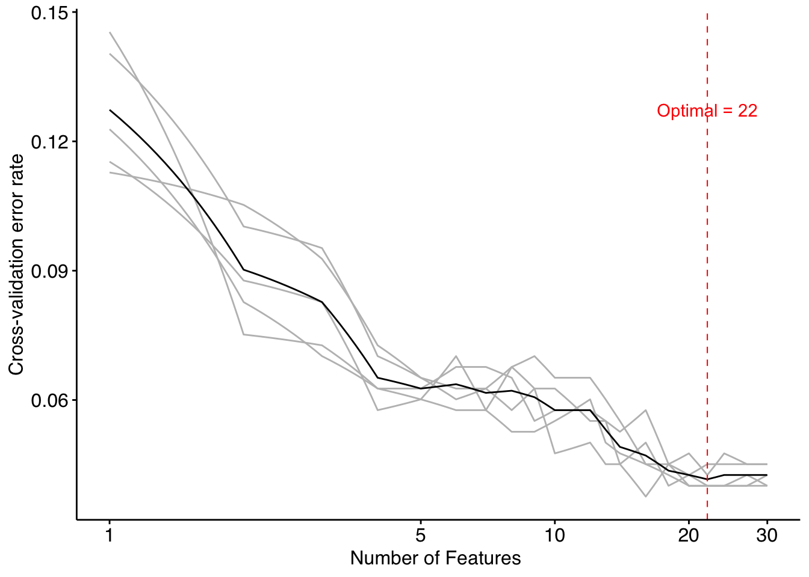
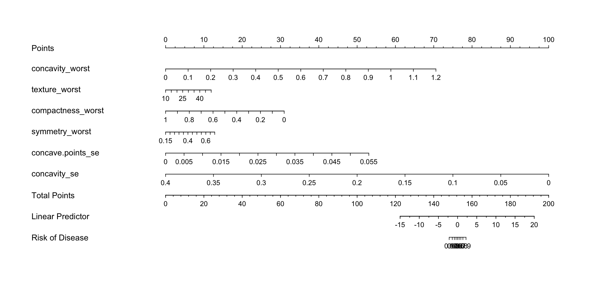
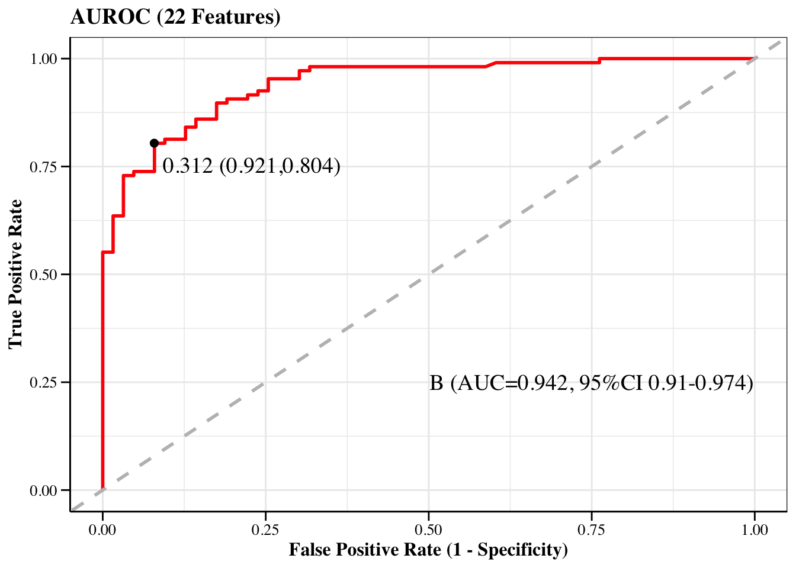
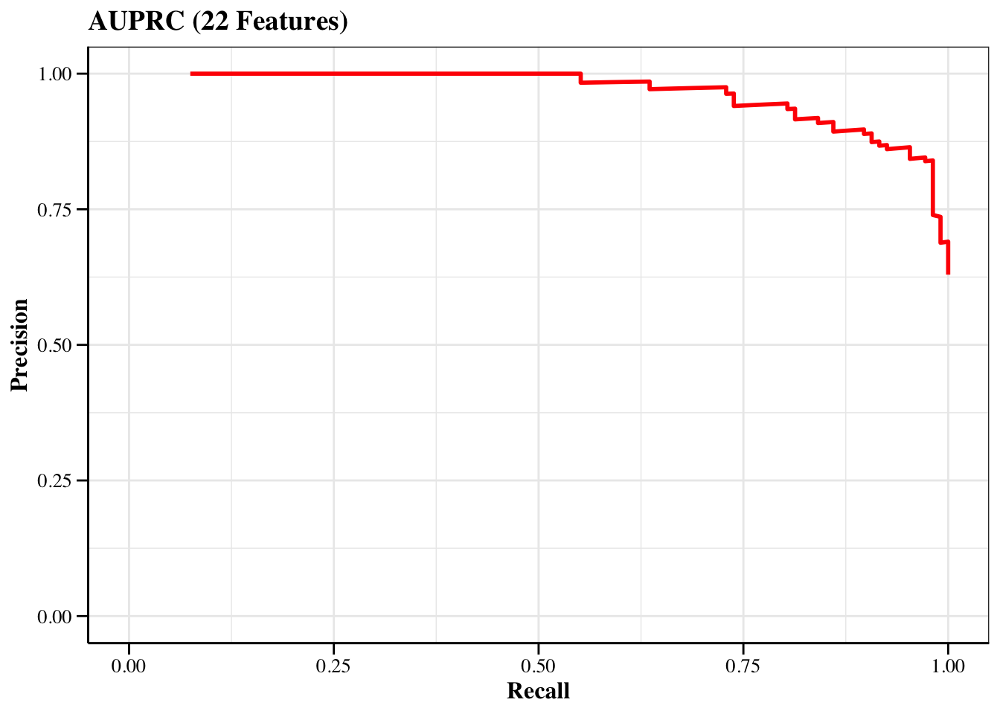
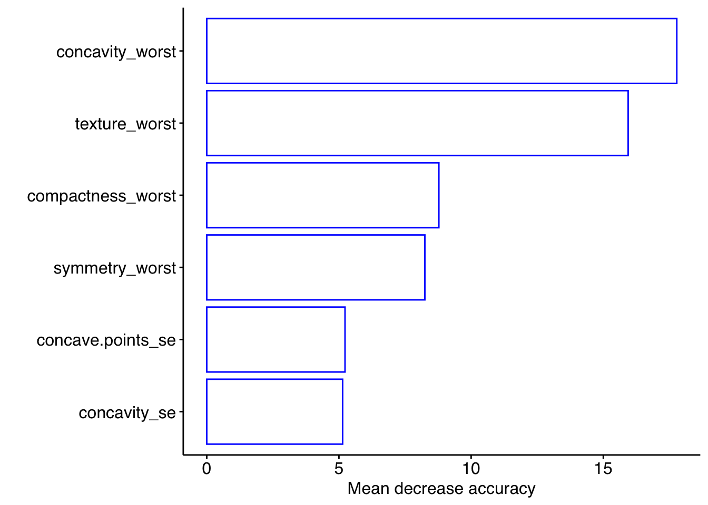

# (PART) Machine Learning {.unnumbered}

# Random Forest Algorithm {#randomforestalgorithm}


随机森林是常用的非线性用于构建分类器的算法，它是由数目众多的弱决策树构建成森林进而对结果进行投票判断标签的方法。随机森林用于分类器的算法过程，

+ 随机切分样本，然后选择2/3用于建模，剩余1/3用于验证袋外误差；

+ 随机选择特征构建决策树，每个叶子节点分成二类；

+ 根据GINI系数判断分类内部纯度程度，进行裁剪树枝；

+ 1/3数据预测，根据每个决策树的结果投票确定标签；

+ 输出标签结果，并给出OOB rate；

+ 随机的含义在于样本和特征是随机选择去构建决策树，这可以有效避免偏差，另外弱分类器组成强分类器也即是多棵决策树组成森林能提升模型效果。

**本文旨在通过R实现随机森林的应用，总共包含：**

+ 下载数据
+ 加载R包
+ 数据切割
+ 调参（选择最佳决策树数目）
+ 建模（重要性得分）
+ 多次建模选择最佳特征数目（基于OOB rate）
+ 多元回归分析筛选相关特征
+ 风险得分
+ 重新建模
+ 模型效能评估


## 下载数据

可以点击此处下载数据[clean_data.csv](https://github.com/HuaZou/DraftNotes/blob/main/InputData/Breast_cancer/clean_data.csv)或使用`wget`

```bash
wget https://github.com/HuaZou/DraftNotes/blob/main/InputData/Breast_cancer/clean_data.csv
```

> 该数据集包含569份恶性和良性肿瘤的样本的32类指标，通过这些特征构建区分恶性和良性肿瘤的随机森林分类器.

> The Breast Cancer datasets is available machine learning repository maintained by the University of California, Irvine. The dataset contains 569 samples of malignant and benign tumor cells.


## 加载R包

```r
knitr::opts_chunk$set(message = FALSE, warning = FALSE)
library(dplyr)
library(tibble)
library(randomForest)
library(ggplot2)
library(data.table)
library(caret)
library(pROC)

# rm(list = ls())
options(stringsAsFactors = F)
options(future.globals.maxSize = 1000 * 1024^2)

group_names <- c("M", "B")
```


## 加载数据

```r
datset <- data.table::fread("./InputData/Breast_cancer/clean_data.csv")

head(datset)
#>    V1 diagnosis radius_mean texture_mean perimeter_mean
#> 1:  0         M       17.99        10.38         122.80
#> 2:  1         M       20.57        17.77         132.90
#> 3:  2         M       19.69        21.25         130.00
#> 4:  3         M       11.42        20.38          77.58
#> 5:  4         M       20.29        14.34         135.10
#> 6:  5         M       12.45        15.70          82.57
#>    area_mean smoothness_mean compactness_mean
#> 1:    1001.0         0.11840          0.27760
#> 2:    1326.0         0.08474          0.07864
#> 3:    1203.0         0.10960          0.15990
#> 4:     386.1         0.14250          0.28390
#> 5:    1297.0         0.10030          0.13280
#> 6:     477.1         0.12780          0.17000
#>    concavity_mean concave points_mean symmetry_mean
#> 1:         0.3001             0.14710        0.2419
#> 2:         0.0869             0.07017        0.1812
#> 3:         0.1974             0.12790        0.2069
#> 4:         0.2414             0.10520        0.2597
#> 5:         0.1980             0.10430        0.1809
#> 6:         0.1578             0.08089        0.2087
#>    fractal_dimension_mean radius_se texture_se perimeter_se
#> 1:                0.07871    1.0950     0.9053        8.589
#> 2:                0.05667    0.5435     0.7339        3.398
#> 3:                0.05999    0.7456     0.7869        4.585
#> 4:                0.09744    0.4956     1.1560        3.445
#> 5:                0.05883    0.7572     0.7813        5.438
#> 6:                0.07613    0.3345     0.8902        2.217
#>    area_se smoothness_se compactness_se concavity_se
#> 1:  153.40      0.006399        0.04904      0.05373
#> 2:   74.08      0.005225        0.01308      0.01860
#> 3:   94.03      0.006150        0.04006      0.03832
#> 4:   27.23      0.009110        0.07458      0.05661
#> 5:   94.44      0.011490        0.02461      0.05688
#> 6:   27.19      0.007510        0.03345      0.03672
#>    concave points_se symmetry_se fractal_dimension_se
#> 1:           0.01587     0.03003             0.006193
#> 2:           0.01340     0.01389             0.003532
#> 3:           0.02058     0.02250             0.004571
#> 4:           0.01867     0.05963             0.009208
#> 5:           0.01885     0.01756             0.005115
#> 6:           0.01137     0.02165             0.005082
#>    radius_worst texture_worst perimeter_worst area_worst
#> 1:        25.38         17.33          184.60     2019.0
#> 2:        24.99         23.41          158.80     1956.0
#> 3:        23.57         25.53          152.50     1709.0
#> 4:        14.91         26.50           98.87      567.7
#> 5:        22.54         16.67          152.20     1575.0
#> 6:        15.47         23.75          103.40      741.6
#>    smoothness_worst compactness_worst concavity_worst
#> 1:           0.1622            0.6656          0.7119
#> 2:           0.1238            0.1866          0.2416
#> 3:           0.1444            0.4245          0.4504
#> 4:           0.2098            0.8663          0.6869
#> 5:           0.1374            0.2050          0.4000
#> 6:           0.1791            0.5249          0.5355
#>    concave points_worst symmetry_worst
#> 1:               0.2654         0.4601
#> 2:               0.1860         0.2750
#> 3:               0.2430         0.3613
#> 4:               0.2575         0.6638
#> 5:               0.1625         0.2364
#> 6:               0.1741         0.3985
#>    fractal_dimension_worst
#> 1:                 0.11890
#> 2:                 0.08902
#> 3:                 0.08758
#> 4:                 0.17300
#> 5:                 0.07678
#> 6:                 0.12440
```


## 数据切割

对数据集按照70%的比例划分成训练集和测试集，其中训练集用于构建模型，测试集用于评估模型效能。另外，在这一步前也有教程对特征进行选择，筛选组间差异大的特征用于建模。这里使用 caret::createDataPartition函数进行划分数据集，它能够根据组间比例合理分割数据。


```r
mdat <- datset %>%
  dplyr::select(-V1) %>%
  dplyr::rename(Group = diagnosis) %>%
  dplyr::mutate(Group = factor(Group, levels = group_names)) %>%
  data.frame()
colnames(mdat) <- make.names(colnames(mdat))


set.seed(123)
trainIndex <- caret::createDataPartition(
          mdat$Group, 
          p = 0.7, 
          list = FALSE, 
          times = 1)

trainData <- mdat[trainIndex, ]
X_train <- trainData[, -1]
y_train <- trainData[, 1]

testData <- mdat[-trainIndex, ]
X_test <- testData[, -1]
y_test <- testData[, 1]
```


## 调参（选择最佳决策树数目）

随机森林算法的参数众多，本文选择对mtry和ntree两个参数进行调参，其他均使用默认参数。

+ *mtry*：随机选择特征数目
+ *ntree*：构成森林的决策树数目


```r

RUN <- F

if (RUN) {
  # N-repeat K-fold cross-validation
  myControl <- trainControl(
    method = "repeatedcv",
    number = 10,
    repeats = 3,
    search = "random",
    classProbs = TRUE,
    verboseIter = TRUE,
    allowParallel = TRUE)
  
  # customRF
  # https://machinelearningmastery.com/tune-machine-learning-algorithms-in-r/
  customRF <- list(type = "Classification",
                   library = "randomForest",
                   loop = NULL)
  
  customRF$parameters <- data.frame(
    parameter = c("mtry", "ntree"),
    class = rep("numeric", 2),
    label = c("mtry", "ntree"))
  
  customRF$grid <- function(x, y, len = NULL, search = "grid") {}
  customRF$fit <- function(x, y, wts, param, lev, last, weights, classProbs, ...) {
    randomForest(x, y, mtry = param$mtry, ntree=param$ntree, ...)
  }
  
  customRF$predict <- function(modelFit, newdata, preProc = NULL, submodels = NULL) {
    predict(modelFit, newdata)
  }
  
  customRF$prob <- function(modelFit, newdata, preProc = NULL, submodels = NULL) {
    predict(modelFit, newdata, type = "prob")
  }
  
  customRF$sort <- function(x) {x[order(x[, 1]), ]}
  customRF$levels <- function(x) {x$classes}
  
  # tuning parameters
  tuneGrid <- expand.grid(
    .mtry = c(12:15), # sqrt(ncol(X_train))
    .ntree = seq(1000, 2000, 500))
  
  # Register parallel cores
  doParallel::registerDoParallel(4)
  
  # train model
  set.seed(123)
  tune_fit <- train(
    Group ~.,
    data = trainData,
    method = customRF, #"rf",
    trControl = myControl,
    tuneGrid = tuneGrid,
    metric = "Accuracy",
    verbose = FALSE)
  
  ## Plot model accuracy vs different values of Cost
  print(plot(tune_fit))
  
  ## Print the best tuning parameter that maximizes model accuracy
  optimalVar <- data.frame(tune_fit$results[which.max(tune_fit$results[, 3]), ])
  print(optimalVar)  
} 

optimalVar <- list(mtry = 10, ntree = 1000)
```


+ 结果：

  - 最佳随机特征数目（使用32个特征用于建模，从中随机抽取7个特征构建决策树）：7
  - 最佳决策树数目：1000


## 建模

使用上述最佳参数建模


```r
set.seed(123)
rf_fit <- randomForest(
  Group ~ .,
  data = trainData,
  importance = TRUE,
  proximity = TRUE,
  mtry = optimalVar$mtry,
  ntree = optimalVar$ntree)

rf_fit
#> 
#> Call:
#>  randomForest(formula = Group ~ ., data = trainData, importance = TRUE,      proximity = TRUE, mtry = optimalVar$mtry, ntree = optimalVar$ntree) 
#>                Type of random forest: classification
#>                      Number of trees: 1000
#> No. of variables tried at each split: 10
#> 
#>         OOB estimate of  error rate: 4.01%
#> Confusion matrix:
#>     M   B class.error
#> M 140   9  0.06040268
#> B   7 243  0.02800000
```

+ 结果：

  - 该模型的袋外误差OOB仅为4.01%，也即是准确率高达95.99%。


## 特征的重要性得分

获取所有特征的重要性得分，此处使用MeanDecreaseAccuracy。


```r
imp_biomarker <- tibble::as_tibble(round(importance(rf_fit), 2), rownames = "Features") %>% 
  dplyr::arrange(desc(MeanDecreaseAccuracy))
imp_biomarker
#> # A tibble: 30 × 5
#>    Features                 M     B MeanDecreaseAccuracy
#>    <chr>                <dbl> <dbl>                <dbl>
#>  1 radius_worst         16.4  23.4                  25.9
#>  2 concave.points_worst 15.0  21.2                  25.2
#>  3 area_worst           16.9  20.4                  24.4
#>  4 concave.points_mean  17.3  14.9                  22.3
#>  5 perimeter_worst      15.6  17.2                  21.8
#>  6 area_se               8.81 17.5                  19.3
#>  7 concavity_worst      15.4   7.74                 17.8
#>  8 concavity_mean        9.93 12.8                  16.4
#>  9 texture_worst        13.3  10.9                  15.9
#> 10 radius_se             6.94 12.6                  14.7
#> # ℹ 20 more rows
#> # ℹ 1 more variable: MeanDecreaseGini <dbl>
```


## 多次建模选择最佳特征数目（基于OOB rate）

上述模型选了所有32个特征用于建模，这是单次建模的结果，为了更好确定最佳特征数目，采用五次建模的结果寻找最小OOB rate对应的特征数目作为最佳特征数目。

另外，最佳决策树数目参考第一次模型的 1000，也作为本次最佳决策树数目。


```r
error.cv <- c()
for (i in 1:5){
  print(i)
  set.seed(i)
  fit <- rfcv(trainx = X_train, 
              trainy = y_train, 
              cv.fold = 5, 
              scale = "log", 
              step = 0.9,
              ntree = optimalVar$ntree)
  error.cv <- cbind(error.cv, fit$error.cv)
}
#> [1] 1
#> [1] 2
#> [1] 3
#> [1] 4
#> [1] 5

n.var <- as.numeric(rownames(error.cv))
colnames(error.cv) <- paste('error', 1:5, sep = '.')
err.mean <- apply(error.cv, 1, mean)
err.df <- data.frame(num = n.var, 
                     err.mean = err.mean,
                     error.cv) 
head(err.df[, 1:6])
#>    num   err.mean    error.1    error.2    error.3
#> 30  30 0.04260652 0.04511278 0.04511278 0.04010025
#> 27  27 0.04260652 0.04511278 0.04511278 0.04260652
#> 24  24 0.04260652 0.04761905 0.04511278 0.04010025
#> 22  22 0.04160401 0.04260652 0.04511278 0.04010025
#> 20  20 0.04260652 0.04761905 0.04260652 0.04260652
#> 18  18 0.04360902 0.04511278 0.04511278 0.04010025
#>       error.4
#> 30 0.04260652
#> 27 0.04010025
#> 24 0.04010025
#> 22 0.04010025
#> 20 0.04010025
#> 18 0.04511278
```

+ optimal number of biomarkers chosen by min cv.error

```r
optimal <- err.df$num[which(err.df$err.mean == min(err.df$err.mean))]
main_theme <- 
  theme(
    panel.background = element_blank(),
    panel.grid = element_blank(),
    axis.line.x = element_line(linewidth = 0.5, color = "black"),
    axis.line.y = element_line(linewidth = 0.5, color = "black"),
    axis.ticks = element_line(color = "black"),
    axis.text = element_text(color = "black", size = 12),
    legend.position = "right",
    legend.background = element_blank(),
    legend.key = element_blank(),
    legend.text = element_text(size = 12),
    text = element_text(family = "sans", size = 12))

pl <- 
  ggplot(data = err.df, aes(x = err.df$num)) + 
    geom_line(aes(y = err.df$error.1), color = 'grey', linewidth = 0.5) + 
    geom_line(aes(y = err.df$error.2), color = 'grey', linewidth = 0.5) +
    geom_line(aes(y = err.df$error.3), color = 'grey', linewidth = 0.5) +
    geom_line(aes(y = err.df$error.4), color = 'grey', linewidth = 0.5) +
    geom_line(aes(y = err.df$error.5), color = 'grey', linewidth = 0.5) +
    geom_line(aes(y = err.df$err.mean), color = 'black', linewidth = 0.5) + 
    geom_vline(xintercept = optimal, color = 'red', lwd = 0.36, linetype = 2) + 
    coord_trans(x = "log2") +
    scale_x_continuous(breaks = c(1, 5, 10, 20, 30)) +
    labs(x = 'Number of Features ', y = 'Cross-validation error rate') + 
    annotate("text", 
             x = optimal, 
             y = max(err.df$err.mean), 
             label = paste("Optimal = ", optimal, sep = ""),
             color = "red") +
    main_theme
pl
```




+ 结果：

  - 袋外误差OOB rate从特征数目为1到特征数目为20呈快速下降趋势，虽然下降数目仅在小数点二位上；
  
  - 最佳特征数目是22，也即是选择重要性得分最高的22个特征即可（原本是32个特征，剔除10个特征用于建模）。


+ importance of optimal biomarker

```r
imp_biomarker[1:optimal, ] %>%
  dplyr::select(Features, MeanDecreaseAccuracy) %>%
  dplyr::arrange(MeanDecreaseAccuracy) %>%
  dplyr::mutate(Features = forcats::fct_inorder(Features)) %>%
  ggplot(aes(x = Features, y = MeanDecreaseAccuracy))+
    geom_bar(stat = "identity", fill = "white", color = "blue") +
    labs(x = "", y = "Mean decrease accuracy") +
    coord_flip() +
    main_theme
```


+ 结果：

  - MeanDecreaseAccuracy得分最高的是area_worst（MDA = 24.52%）


## 多元回归分析筛选相关特征

上述22个特征在建模过程还是偏多，可以通过多元回归分析筛选与响应变量（分类变量）最相关的自变量。

+ 转换字符型标签成数值型
+ 标准化自变量，降低不同单位的影响
+ 采用logist regression算法

该步骤可选择也可不选择，因为后续分析发现如果严格按照pvalue < 0.05则仅能筛选到2-3个特征。


```r
mdat_mulvar <- mdat |>
  dplyr::select(all_of(c("Group", imp_biomarker[1:optimal, ]$Features))) |>
  dplyr::mutate(Group = ifelse(Group == group_names[1], 1, 0))

mdat_mulvar[, -1] <- scale(mdat_mulvar[, -1], center = TRUE, scale = TRUE)

fma <- formula(paste0(colnames(mdat_mulvar)[1], " ~ ", 
              paste(colnames(mdat_mulvar)[2:ncol(mdat_mulvar)], collapse = " + ")))

fit <- glm(fma, data = mdat_mulvar, family = "binomial")

dat_coef <- coef(summary(fit)) |> 
  as.data.frame() |>
  dplyr::slice(-1) |>
  dplyr::filter(`Pr(>|z|)` < 0.2) |>
  tibble::rownames_to_column("FeatureID")

head(dat_coef)
#>           FeatureID  Estimate Std. Error   z value
#> 1   concavity_worst  8.093168  4.4049617  1.837285
#> 2     texture_worst  1.942546  1.4717008  1.319932
#> 3 compactness_worst -4.415926  2.4731083 -1.785577
#> 4    symmetry_worst  1.354215  0.7515816  1.801820
#> 5 concave.points_se  4.185960  2.2931514  1.825418
#> 6      concavity_se -6.405829  2.9571126 -2.166244
#>     Pr(>|z|)
#> 1 0.06616790
#> 2 0.18685757
#> 3 0.07416774
#> 4 0.07157373
#> 5 0.06793796
#> 6 0.03029252
```


+ 结果：

  - 在选择Pr(>|z|) < 0.05后，结果不好，后将阈值设置为Pr(>|z|) < 0.2，最终5个特征符合要求。


## 疾病风险得分

nomogram是一类可以可视化上述5个特征对恶性肿瘤贡献的图形，它也是通过多元线性回归对疾病贡献得到打分，然后分别累加各个特征对疾病的得分得到一个总分，最后总分对应疾病分享百分比。

该处没有对自变量进行标准化，本来是要做的，但考虑到每个指标所含有的临床学意义，就使用了原始值。


```r
library(rms)

selected_columns <- c("Group", dat_coef$FeatureID)
nom_optimal <- trainData %>%
  dplyr::select(all_of(selected_columns)) |>
  dplyr::mutate(Group = ifelse(Group == "B", 0, 1))

ddist <- datadist(nom_optimal[, -1])
options(datadist = "ddist")
fit_nom <- lrm(formula(paste0(colnames(nom_optimal)[1], " ~ ", 
              paste(colnames(nom_optimal)[2:ncol(nom_optimal)], collapse = " + "))),
         data = nom_optimal)
nom <- nomogram(fit_nom, fun = plogis, funlabel = "Risk of Disease")
plot(nom)
```




+ 结果：

concave points_mean(凹点), concavity_worst(凹度), texture_worst(质地) 和 symmetry_worst(对称) 都随着数值增大获得更高的疾病得分， 而 compactness_mean(紧密) 则是数值越高，疾病得分越低。综合这五个指标的疾病得分即可获得疾病总得分，然后再对应到疾病风险概率上。

Notice: 上述四个指标均与乳腺癌发生正相关，而最后一个指标则是负相关，这在临床上也是符合要求的

比如:

  - concave points_mean_= 0.04 (20 points)
  - concavity_worst = 1.2 (20 points)
  - texture_worst = 25 (10 points)
  - symmetry_worst = 0.4 (10 points)
  - compactness_mean = 0.25 (20 points)

计算得分总和:

20 + 20 + 10 + 10 + 20 = 80
80分对应疾病风险概率是100%，也即是说某位检查者的上述五类指标符合该要求，意味着她有100%的概率患有恶性乳腺癌。


## 重新建模

使用上述五个指标重新建模


```r
selected_columns <- c("Group", dat_coef$FeatureID)

trainData_optimal <- trainData %>%
  dplyr::select(all_of(selected_columns))

testData_optimal <- testData %>%
  dplyr::select(all_of(selected_columns))

set.seed(123)
rf_fit_optimal <- randomForest(
  Group ~ ., 
  data = trainData_optimal, 
  importance = TRUE, 
  proximity = TRUE,
  ntree = optimalVar$ntree)

rf_fit_optimal
#> 
#> Call:
#>  randomForest(formula = Group ~ ., data = trainData_optimal, importance = TRUE,      proximity = TRUE, ntree = optimalVar$ntree) 
#>                Type of random forest: classification
#>                      Number of trees: 1000
#> No. of variables tried at each split: 2
#> 
#>         OOB estimate of  error rate: 12.03%
#> Confusion matrix:
#>     M   B class.error
#> M 127  22    0.147651
#> B  26 224    0.104000
```

+ ConfusionMatrix

```r
group_names <- c("B", "M")
pred_raw <- predict(rf_fit_optimal, newdata = testData_optimal, type = "response")
print(caret::confusionMatrix(pred_raw, testData_optimal$Group))
#> Confusion Matrix and Statistics
#> 
#>           Reference
#> Prediction  M  B
#>          M 52 14
#>          B 11 93
#>                                           
#>                Accuracy : 0.8529          
#>                  95% CI : (0.7906, 0.9025)
#>     No Information Rate : 0.6294          
#>     P-Value [Acc > NIR] : 9.513e-11       
#>                                           
#>                   Kappa : 0.6878          
#>                                           
#>  Mcnemar's Test P-Value : 0.6892          
#>                                           
#>             Sensitivity : 0.8254          
#>             Specificity : 0.8692          
#>          Pos Pred Value : 0.7879          
#>          Neg Pred Value : 0.8942          
#>              Prevalence : 0.3706          
#>          Detection Rate : 0.3059          
#>    Detection Prevalence : 0.3882          
#>       Balanced Accuracy : 0.8473          
#>                                           
#>        'Positive' Class : M               
#> 
pred_prob <- predict(rf_fit_optimal, newdata = testData_optimal, type = "prob")  
```


+ performance of classifier

```r
Evaluate_index <- function(
    DataTest, 
    PredProb = pred_prob, 
    label = group_names[1], 
    PredRaw = pred_raw) {
  
  # DataTest = testData
  # PredProb = pred_prob
  # label = group_names[1]
  # PredRaw = pred_raw
  
  # ROC object
  rocobj <- roc(DataTest$Group, PredProb[, 1])
  
  # confusionMatrix
  con_matrix <- table(PredRaw, DataTest$Group)
  
  # index
  TP <- con_matrix[1, 1]
  FN <- con_matrix[2, 1]
  FP <- con_matrix[1, 2]
  TN <- con_matrix[2, 2]
  
  rocbj_df <- data.frame(threshold = round(rocobj$thresholds, 3),
                         sensitivities = round(rocobj$sensitivities, 3),
                         specificities = round(rocobj$specificities, 3),
                         value = rocobj$sensitivities + 
                           rocobj$specificities)
  max_value_row <- which(max(rocbj_df$value) == rocbj_df$value)[1]
  
  threshold <- rocbj_df$threshold[max_value_row]
  sen <- round(TP / (TP + FN), 3) # caret::sensitivity(con_matrix)
  spe <- round(TN / (TN + FP), 3) # caret::specificity(con_matrix)
  acc <- round((TP + TN) / (TP + TN + FP + FN), 3) # Accuracy
  pre <- round(TP / (TP + FP), 3) # precision
  rec <- round(TP / (TP + FN), 3) # recall
  #F1S <- round(2 * TP / (TP + TN + FP + FN + TP - TN), 3)# F1-Score
  F1S <- round(2 * TP / (2 * TP + FP + FN), 3)# F1-Score
  youden <- sen + spe - 1 # youden index
  
  index_df <- data.frame(Index = c("Threshold", "Sensitivity",
                                   "Specificity", "Accuracy",
                                   "Precision", "Recall",
                                   "F1 Score", "Youden index"),
                         Value = c(threshold, sen, spe,
                                   acc, pre, rec, F1S, youden)) %>%
    stats::setNames(c("Index", label))
  
  return(index_df)
}

Evaluate_index(
    DataTest = testData, 
    PredProb = pred_prob, 
    label = group_names[1], 
    PredRaw = pred_raw)
#>          Index     B
#> 1    Threshold 0.312
#> 2  Sensitivity 0.825
#> 3  Specificity 0.869
#> 4     Accuracy 0.853
#> 5    Precision 0.788
#> 6       Recall 0.825
#> 7     F1 Score 0.806
#> 8 Youden index 0.694
```

+ AUROC

```r
AUROC <- function(
    DataTest, 
    PredProb = pred_prob, 
    label = group_names[1], 
    DataProf = profile) {
  
  # DataTest = testData
  # PredProb = pred_prob
  # label = group_names[1]
  # DataProf = profile
  
  # ROC object
  rocobj <- roc(DataTest$Group, PredProb[, 1])
  
  # Youden index: cutoff point
  # plot(rocobj,
  #      legacy.axes = TRUE,
  #      of = "thresholds", 
  #      thresholds = "best", 
  #      print.thres="best")
  
  # AUROC data
  roc <- data.frame(tpr = rocobj$sensitivities,
                    fpr = 1 - rocobj$specificities)
  
  # AUC 95% CI
  rocobj_CI <- roc(DataTest$Group, PredProb[, 1], 
                   ci = TRUE, percent = TRUE)
  roc_CI <- round(as.numeric(rocobj_CI$ci)/100, 3)
  roc_CI_lab <- paste0(label, 
                       " (", "AUC=", roc_CI[2], 
                       ", 95%CI ", roc_CI[1], "-", roc_CI[3], 
                       ")")
  # ROC dataframe
  rocbj_df <- data.frame(threshold = round(rocobj$thresholds, 3),
                         sensitivities = round(rocobj$sensitivities, 3),
                         specificities = round(rocobj$specificities, 3),
                         value = rocobj$sensitivities + 
                           rocobj$specificities)
  max_value_row <- which(max(rocbj_df$value) == rocbj_df$value)
  threshold <- rocbj_df$threshold[max_value_row]
  
  # plot
  pl <- ggplot(data = roc, aes(x = fpr, y = tpr)) +
    geom_path(color = "red", size = 1) +
    geom_abline(intercept = 0, slope = 1, 
                color = "grey", linewidth = 1, linetype = 2) +
    labs(x = "False Positive Rate (1 - Specificity)",
         y = "True Positive Rate",
         title = paste0("AUROC (", DataProf, " Features)")) +
    annotate("text", 
             x = 1 - rocbj_df$specificities[max_value_row] + 0.15, 
             y = rocbj_df$sensitivities[max_value_row] - 0.05, 
             label = paste0(threshold, " (", 
                            rocbj_df$specificities[max_value_row], ",",
                            rocbj_df$sensitivities[max_value_row], ")"),
             size=5, family="serif") +
    annotate("point", 
             x = 1 - rocbj_df$specificities[max_value_row], 
             y = rocbj_df$sensitivities[max_value_row], 
             color = "black", size = 2) +    
    annotate("text", 
             x = .75, y = .25, 
             label = roc_CI_lab,
             size = 5, family = "serif") +
    coord_cartesian(xlim = c(0, 1), ylim = c(0, 1)) +
    theme_bw() +
    theme(panel.background = element_rect(fill = "transparent"),
          plot.title = element_text(color = "black", size = 14, face = "bold"),
          axis.ticks.length = unit(0.4, "lines"),
          axis.ticks = element_line(color = "black"),
          axis.line = element_line(size = .5, color = "black"),
          axis.title = element_text(color = "black", size = 12, face = "bold"),
          axis.text = element_text(color = "black", size = 10),
          text = element_text(size = 8, color = "black", family = "serif"))
  
  res <- list(rocobj = rocobj,
              roc_CI = roc_CI_lab,
              roc_pl = pl)
  
  return(res)
}

AUROC_res <- AUROC(
    DataTest = testData, 
    PredProb = pred_prob, 
    label = group_names[1], 
    DataProf = optimal)

AUROC_res$roc_pl
```



+ AUPRC

```r
AUPRC <- function(
    DataTest, 
    PredProb = pred_prob, 
    DataProf = optimal) {
  
  # DataTest = testData
  # PredProb = pred_prob
  # DataProf = optimal
  
  # ROC object
  rocobj <- roc(DataTest$Group, PredProb[, 1])
  
  # p-r value 
  dat_PR <- coords(rocobj, "all", ret = c("precision", "recall"))
  
  # AUPRC data
  prc <- data.frame(precision = dat_PR$precision,
                    recall = dat_PR$recall)
  
  # plot
  pl <- ggplot(data = prc, aes(x = recall, y = precision)) +
    geom_path(color = "red", size = 1) +
    labs(x = "Recall",
         y = "Precision",
         title = paste0("AUPRC (", DataProf, " Features)")) +
    coord_cartesian(xlim = c(0, 1), ylim = c(0, 1)) +
    theme_bw() +
    theme(panel.background = element_rect(fill = "transparent"),
          plot.title = element_text(color = "black", size = 14, face = "bold"),
          axis.ticks.length = unit(0.4, "lines"),
          axis.ticks = element_line(color = "black"),
          axis.line = element_line(size = .5, color = "black"),
          axis.title = element_text(color = "black", size = 12, face = "bold"),
          axis.text = element_text(color = "black", size = 10),
          text = element_text(size = 8, color = "black", family = "serif"))
  
  res <- list(dat_PR = dat_PR,
              PC_pl = pl)
  
  return(res)
}

AUPRC_res <- AUPRC(
    DataTest = testData, 
    PredProb = pred_prob, 
    DataProf = optimal)

AUPRC_res$PC_pl
```




## Final biomarkers

+ importance score

```r
imp_biomarker |> 
  dplyr::filter(Features %in% dat_coef$FeatureID) |>
  dplyr::select(Features, MeanDecreaseAccuracy) |>
  dplyr::arrange(MeanDecreaseAccuracy) |>
  dplyr::mutate(Features = forcats::fct_inorder(Features)) |>
  ggplot(aes(x = Features, y = MeanDecreaseAccuracy))+
    geom_bar(stat = "identity", fill = "white", color = "blue") +
    labs(x = "", y = "Mean decrease accuracy") +
    coord_flip() +
    main_theme
```




## systemic information

```r
devtools::session_info()
#> ─ Session info ───────────────────────────────────────────
#>  setting  value
#>  version  R version 4.1.3 (2022-03-10)
#>  os       macOS Big Sur/Monterey 10.16
#>  system   x86_64, darwin17.0
#>  ui       X11
#>  language (EN)
#>  collate  en_US.UTF-8
#>  ctype    en_US.UTF-8
#>  tz       Asia/Shanghai
#>  date     2023-12-08
#>  pandoc   3.1.3 @ /Users/zouhua/opt/anaconda3/bin/ (via rmarkdown)
#> 
#> ─ Packages ───────────────────────────────────────────────
#>  package      * version    date (UTC) lib source
#>  backports      1.4.1      2021-12-13 [2] CRAN (R 4.1.0)
#>  base64enc      0.1-3      2015-07-28 [2] CRAN (R 4.1.0)
#>  bookdown       0.34       2023-05-09 [2] CRAN (R 4.1.2)
#>  bslib          0.6.0      2023-11-21 [1] CRAN (R 4.1.3)
#>  cachem         1.0.8      2023-05-01 [2] CRAN (R 4.1.2)
#>  callr          3.7.3      2022-11-02 [2] CRAN (R 4.1.2)
#>  caret        * 6.0-94     2023-03-21 [2] CRAN (R 4.1.2)
#>  checkmate      2.2.0      2023-04-27 [2] CRAN (R 4.1.2)
#>  class          7.3-22     2023-05-03 [2] CRAN (R 4.1.2)
#>  cli            3.6.1      2023-03-23 [2] CRAN (R 4.1.2)
#>  cluster        2.1.4      2022-08-22 [2] CRAN (R 4.1.2)
#>  codetools      0.2-19     2023-02-01 [2] CRAN (R 4.1.2)
#>  colorspace     2.1-0      2023-01-23 [2] CRAN (R 4.1.2)
#>  crayon         1.5.2      2022-09-29 [2] CRAN (R 4.1.2)
#>  data.table   * 1.14.8     2023-02-17 [2] CRAN (R 4.1.2)
#>  devtools       2.4.5      2022-10-11 [2] CRAN (R 4.1.2)
#>  digest         0.6.33     2023-07-07 [1] CRAN (R 4.1.3)
#>  downlit        0.4.3      2023-06-29 [2] CRAN (R 4.1.3)
#>  dplyr        * 1.1.2      2023-04-20 [2] CRAN (R 4.1.2)
#>  e1071          1.7-13     2023-02-01 [2] CRAN (R 4.1.2)
#>  ellipsis       0.3.2      2021-04-29 [2] CRAN (R 4.1.0)
#>  evaluate       0.21       2023-05-05 [2] CRAN (R 4.1.2)
#>  fansi          1.0.4      2023-01-22 [2] CRAN (R 4.1.2)
#>  farver         2.1.1      2022-07-06 [2] CRAN (R 4.1.2)
#>  fastmap        1.1.1      2023-02-24 [2] CRAN (R 4.1.2)
#>  forcats        1.0.0      2023-01-29 [2] CRAN (R 4.1.2)
#>  foreach        1.5.2      2022-02-02 [2] CRAN (R 4.1.2)
#>  foreign        0.8-84     2022-12-06 [2] CRAN (R 4.1.2)
#>  Formula        1.2-5      2023-02-24 [2] CRAN (R 4.1.2)
#>  fs             1.6.2      2023-04-25 [2] CRAN (R 4.1.2)
#>  future         1.33.0     2023-07-01 [2] CRAN (R 4.1.3)
#>  future.apply   1.11.0     2023-05-21 [2] CRAN (R 4.1.3)
#>  generics       0.1.3      2022-07-05 [2] CRAN (R 4.1.2)
#>  ggplot2      * 3.4.2      2023-04-03 [2] CRAN (R 4.1.2)
#>  globals        0.16.2     2022-11-21 [2] CRAN (R 4.1.2)
#>  glue           1.6.2      2022-02-24 [2] CRAN (R 4.1.2)
#>  gower          1.0.1      2022-12-22 [2] CRAN (R 4.1.2)
#>  gridExtra      2.3        2017-09-09 [2] CRAN (R 4.1.0)
#>  gtable         0.3.3      2023-03-21 [2] CRAN (R 4.1.2)
#>  hardhat        1.3.0      2023-03-30 [2] CRAN (R 4.1.2)
#>  highr          0.10       2022-12-22 [2] CRAN (R 4.1.2)
#>  Hmisc        * 5.1-0      2023-05-08 [2] CRAN (R 4.1.2)
#>  htmlTable      2.4.1      2022-07-07 [2] CRAN (R 4.1.2)
#>  htmltools      0.5.7      2023-11-03 [1] CRAN (R 4.1.3)
#>  htmlwidgets    1.6.2      2023-03-17 [2] CRAN (R 4.1.2)
#>  httpuv         1.6.11     2023-05-11 [2] CRAN (R 4.1.3)
#>  ipred          0.9-14     2023-03-09 [2] CRAN (R 4.1.2)
#>  iterators      1.0.14     2022-02-05 [2] CRAN (R 4.1.2)
#>  jquerylib      0.1.4      2021-04-26 [2] CRAN (R 4.1.0)
#>  jsonlite       1.8.7      2023-06-29 [2] CRAN (R 4.1.3)
#>  knitr          1.43       2023-05-25 [2] CRAN (R 4.1.3)
#>  labeling       0.4.2      2020-10-20 [2] CRAN (R 4.1.0)
#>  later          1.3.1      2023-05-02 [2] CRAN (R 4.1.2)
#>  lattice      * 0.21-8     2023-04-05 [2] CRAN (R 4.1.2)
#>  lava           1.7.2.1    2023-02-27 [2] CRAN (R 4.1.2)
#>  lifecycle      1.0.3      2022-10-07 [2] CRAN (R 4.1.2)
#>  listenv        0.9.0      2022-12-16 [2] CRAN (R 4.1.2)
#>  lubridate      1.9.2      2023-02-10 [2] CRAN (R 4.1.2)
#>  magrittr       2.0.3      2022-03-30 [2] CRAN (R 4.1.2)
#>  MASS           7.3-60     2023-05-04 [2] CRAN (R 4.1.2)
#>  Matrix         1.6-0      2023-07-08 [2] CRAN (R 4.1.3)
#>  MatrixModels   0.5-2      2023-07-10 [2] CRAN (R 4.1.3)
#>  memoise        2.0.1      2021-11-26 [2] CRAN (R 4.1.0)
#>  mime           0.12       2021-09-28 [2] CRAN (R 4.1.0)
#>  miniUI         0.1.1.1    2018-05-18 [2] CRAN (R 4.1.0)
#>  ModelMetrics   1.2.2.2    2020-03-17 [2] CRAN (R 4.1.0)
#>  multcomp       1.4-25     2023-06-20 [2] CRAN (R 4.1.3)
#>  munsell        0.5.0      2018-06-12 [2] CRAN (R 4.1.0)
#>  mvtnorm        1.2-2      2023-06-08 [2] CRAN (R 4.1.3)
#>  nlme           3.1-162    2023-01-31 [2] CRAN (R 4.1.2)
#>  nnet           7.3-19     2023-05-03 [2] CRAN (R 4.1.2)
#>  parallelly     1.36.0     2023-05-26 [2] CRAN (R 4.1.3)
#>  pillar         1.9.0      2023-03-22 [2] CRAN (R 4.1.2)
#>  pkgbuild       1.4.2      2023-06-26 [2] CRAN (R 4.1.3)
#>  pkgconfig      2.0.3      2019-09-22 [2] CRAN (R 4.1.0)
#>  pkgload        1.3.2.1    2023-07-08 [2] CRAN (R 4.1.3)
#>  plyr           1.8.8      2022-11-11 [2] CRAN (R 4.1.2)
#>  polspline      1.1.23     2023-06-29 [1] CRAN (R 4.1.3)
#>  prettyunits    1.1.1      2020-01-24 [2] CRAN (R 4.1.0)
#>  pROC         * 1.18.4     2023-07-06 [2] CRAN (R 4.1.3)
#>  processx       3.8.2      2023-06-30 [2] CRAN (R 4.1.3)
#>  prodlim        2023.03.31 2023-04-02 [2] CRAN (R 4.1.2)
#>  profvis        0.3.8      2023-05-02 [2] CRAN (R 4.1.2)
#>  promises       1.2.0.1    2021-02-11 [2] CRAN (R 4.1.0)
#>  proxy          0.4-27     2022-06-09 [2] CRAN (R 4.1.2)
#>  ps             1.7.5      2023-04-18 [2] CRAN (R 4.1.2)
#>  purrr          1.0.1      2023-01-10 [2] CRAN (R 4.1.2)
#>  quantreg       5.95       2023-04-08 [2] CRAN (R 4.1.2)
#>  R6             2.5.1      2021-08-19 [2] CRAN (R 4.1.0)
#>  randomForest * 4.7-1.1    2022-05-23 [2] CRAN (R 4.1.2)
#>  Rcpp           1.0.11     2023-07-06 [1] CRAN (R 4.1.3)
#>  recipes        1.0.6      2023-04-25 [2] CRAN (R 4.1.2)
#>  remotes        2.4.2      2021-11-30 [2] CRAN (R 4.1.0)
#>  reshape2       1.4.4      2020-04-09 [2] CRAN (R 4.1.0)
#>  rlang          1.1.1      2023-04-28 [1] CRAN (R 4.1.2)
#>  rmarkdown      2.23       2023-07-01 [2] CRAN (R 4.1.3)
#>  rms          * 6.7-0      2023-05-08 [1] CRAN (R 4.1.2)
#>  rpart          4.1.19     2022-10-21 [2] CRAN (R 4.1.2)
#>  rstudioapi     0.15.0     2023-07-07 [2] CRAN (R 4.1.3)
#>  sandwich       3.0-2      2022-06-15 [2] CRAN (R 4.1.2)
#>  sass           0.4.6      2023-05-03 [2] CRAN (R 4.1.2)
#>  scales         1.2.1      2022-08-20 [2] CRAN (R 4.1.2)
#>  sessioninfo    1.2.2      2021-12-06 [2] CRAN (R 4.1.0)
#>  shiny          1.7.4.1    2023-07-06 [2] CRAN (R 4.1.3)
#>  SparseM        1.81       2021-02-18 [2] CRAN (R 4.1.0)
#>  stringi        1.7.12     2023-01-11 [2] CRAN (R 4.1.2)
#>  stringr        1.5.0      2022-12-02 [2] CRAN (R 4.1.2)
#>  survival       3.5-5      2023-03-12 [2] CRAN (R 4.1.2)
#>  TH.data        1.1-2      2023-04-17 [2] CRAN (R 4.1.2)
#>  tibble       * 3.2.1      2023-03-20 [2] CRAN (R 4.1.2)
#>  tidyselect     1.2.0      2022-10-10 [2] CRAN (R 4.1.2)
#>  timechange     0.2.0      2023-01-11 [2] CRAN (R 4.1.2)
#>  timeDate       4022.108   2023-01-07 [2] CRAN (R 4.1.2)
#>  urlchecker     1.0.1      2021-11-30 [2] CRAN (R 4.1.0)
#>  usethis        2.2.2      2023-07-06 [2] CRAN (R 4.1.3)
#>  utf8           1.2.3      2023-01-31 [2] CRAN (R 4.1.2)
#>  vctrs          0.6.3      2023-06-14 [1] CRAN (R 4.1.3)
#>  withr          2.5.0      2022-03-03 [2] CRAN (R 4.1.2)
#>  xfun           0.40       2023-08-09 [1] CRAN (R 4.1.3)
#>  xml2           1.3.5      2023-07-06 [2] CRAN (R 4.1.3)
#>  xtable         1.8-4      2019-04-21 [2] CRAN (R 4.1.0)
#>  yaml           2.3.7      2023-01-23 [2] CRAN (R 4.1.2)
#>  zoo            1.8-12     2023-04-13 [2] CRAN (R 4.1.2)
#> 
#>  [1] /Users/zouhua/Library/R/x86_64/4.1/library
#>  [2] /Library/Frameworks/R.framework/Versions/4.1/Resources/library
#> 
#> ──────────────────────────────────────────────────────────
```
