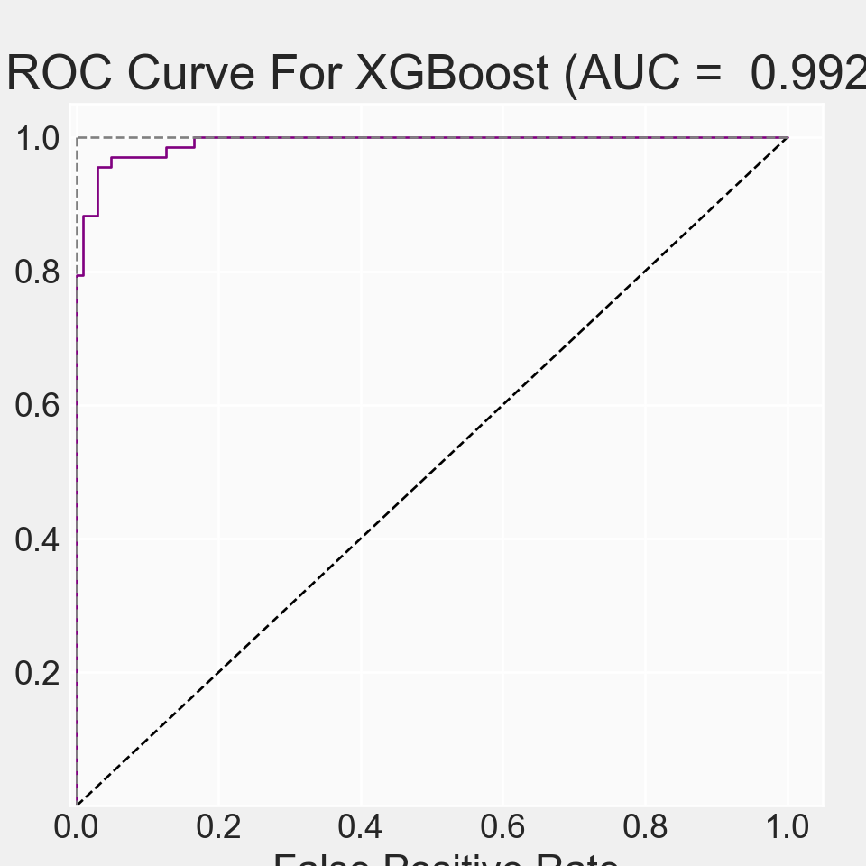

# XGBoost Algorithm {#XGBoostalgorithm}


> The XGBoost or Extreme Gradient Boosting algorithm is a decision tree based machine learning algorithm which uses a process called boosting to help improve performance.
>
> The basic classification modeling process involves obtaining a dataset, creating features of independent variables, and using them to predict a dependent variable or target class. Most classification datasets require some preparation before they can be used by classifiers, and also usually require the creation of additional features through a process called feature engineering. 
>
> “Gradient boosting is a machine learning technique for regression, classification and other tasks, which produces a prediction model in the form of an ensemble of weak prediction models, typically decision trees. When a decision tree is the weak learner, the resulting algorithm is called gradient boosted trees, which usually outperforms random forest. It builds the model in a stage-wise fashion like other boosting methods do, and it generalizes them by allowing optimization of an arbitrary differentiable loss function” Note: XGBoost is ditinguished from other gradient boosting techniques by its regularization mechanism to prevent overfitting.


### Data Preparation

+ **data table**: `clean_data.csv` with group information (Row->samples;Column->features)

可以点击此处下载数据[clean_data.csv](https://github.com/HuaZou/DraftNotes/blob/main/InputData/Breast_cancer/clean_data.csv)或使用`wget`

```bash
wget https://github.com/HuaZou/DraftNotes/blob/main/InputData/Breast_cancer/clean_data.csv
```

> 该数据集包含569份恶性和良性肿瘤的样本的32类指标，通过这些特征构建区分恶性和良性肿瘤的随机森林分类器.

> The Breast Cancer datasets is available machine learning repository maintained by the University of California, Irvine. The dataset contains 569 samples of malignant and benign tumor cells.


### Data Description

+ **Feature table**:

    - M samples x N Features

+ **metadata**

    - main response/independent variable: `diagnosis: M vs B`


### Data Preprocessing


+ **Prevalence filtering**: reducing the sparsity of data (default: 10%)


### Data Partition


+ train dataset: 80% or 70% (default 70%);
+ test dataset: 20% or 30% (default 30%).


### Feature Selection

+ Importance of features by random forest;

Feature selection should be taken only in training set, which avoiding overfitting.


### Model training 

+ Base model construction with higher performance
+ Tuning the hyperparameters
+ Best model building and evaluations


### python environment 

```r
library(reticulate)

# myenvs <- conda_list()
# 
# envname <- myenvs$name[2]
# use_condaenv(envname, required = TRUE)
# # or
use_condaenv("base", required = TRUE)
```


## Loading required packages


```python
import warnings
warnings.filterwarnings('ignore')

import pandas as pd
import numpy as np
import time
import random

# machine learning
from sklearn.preprocessing import LabelEncoder
from sklearn.model_selection import train_test_split

#from xgboost import XGBClassifier
import xgboost as xgb

#classes for grid search and cross-validation, function for splitting data and evaluating models
from sklearn.metrics import accuracy_score
from sklearn.metrics import f1_score
from sklearn.metrics import roc_auc_score
from sklearn.metrics import roc_curve, auc
from sklearn.metrics import confusion_matrix 
from sklearn.metrics import precision_score
from sklearn.metrics import recall_score
from sklearn.model_selection import cross_val_score
from sklearn.metrics import classification_report
from sklearn.model_selection import GridSearchCV, RandomizedSearchCV
from skopt import BayesSearchCV

# plotting 
import matplotlib.pyplot as plt
import seaborn as sns

plt.style.use('fivethirtyeight')
sns.set_style("darkgrid")

plt.rcParams['figure.figsize'] = (8, 4)
plt.rcParams["axes.linewidth"] = 1
```

## Data Preparation

> The Breast Cancer datasets is available machine learning repository maintained by the University of California, Irvine. The dataset contains 569 samples of malignant and benign tumor cells.
> The first two columns in the dataset store the unique ID numbers of the samples and the corresponding diagnosis (M=malignant, B=benign), respectively.
> The columns 3-32 contain 30 real-value features that have been computed from digitized images of the cell nuclei, which can be used to build a model to predict whether a tumor is benign or malignant.


```python
dat = pd.read_csv("InputData/Breast_cancer/clean_data.csv", index_col=0)

dat.head()
#>   diagnosis  radius_mean  ...  symmetry_worst  fractal_dimension_worst
#> 0         M        17.99  ...          0.4601                  0.11890
#> 1         M        20.57  ...          0.2750                  0.08902
#> 2         M        19.69  ...          0.3613                  0.08758
#> 3         M        11.42  ...          0.6638                  0.17300
#> 4         M        20.29  ...          0.2364                  0.07678
#> 
#> [5 rows x 31 columns]
```

## XGBoost classification

+ Transforming group label

+ Principal component analysis

+ Data partition

+ Feaeture selection

+ Base model

+ Tuning hyperparameters

+ Building final model

+ Evaluating model performance


### Transforming label

Machine learning does not accept string labels for categorical variables

+ B -> 0
+ M -> 1

```python
#creating deepcopy of model instances
from copy import deepcopy

group_names = ['B', "M"]

dat_copy = deepcopy(dat)
dat_copy['diagnosis'] = dat_copy['diagnosis'].map({'B':0, 'M':1})
dat_copy.head(n=6)
#>    diagnosis  radius_mean  ...  symmetry_worst  fractal_dimension_worst
#> 0          1        17.99  ...          0.4601                  0.11890
#> 1          1        20.57  ...          0.2750                  0.08902
#> 2          1        19.69  ...          0.3613                  0.08758
#> 3          1        11.42  ...          0.6638                  0.17300
#> 4          1        20.29  ...          0.2364                  0.07678
#> 5          1        12.45  ...          0.3985                  0.12440
#> 
#> [6 rows x 31 columns]
```

### Principal component analysis


```python
from sklearn.decomposition import PCA
#from sklearn.preprocessing import StandardScaler

data_remove = dat_copy.drop(['diagnosis'], axis = 1)

#sc = StandardScaler()
#sc.fit_transform(data_remove)

pca = PCA(n_components=2)
pca.fit(data_remove)
```


```{=html}
<style>#sk-container-id-1 {color: black;}#sk-container-id-1 pre{padding: 0;}#sk-container-id-1 div.sk-toggleable {background-color: white;}#sk-container-id-1 label.sk-toggleable__label {cursor: pointer;display: block;width: 100%;margin-bottom: 0;padding: 0.3em;box-sizing: border-box;text-align: center;}#sk-container-id-1 label.sk-toggleable__label-arrow:before {content: "▸";float: left;margin-right: 0.25em;color: #696969;}#sk-container-id-1 label.sk-toggleable__label-arrow:hover:before {color: black;}#sk-container-id-1 div.sk-estimator:hover label.sk-toggleable__label-arrow:before {color: black;}#sk-container-id-1 div.sk-toggleable__content {max-height: 0;max-width: 0;overflow: hidden;text-align: left;background-color: #f0f8ff;}#sk-container-id-1 div.sk-toggleable__content pre {margin: 0.2em;color: black;border-radius: 0.25em;background-color: #f0f8ff;}#sk-container-id-1 input.sk-toggleable__control:checked~div.sk-toggleable__content {max-height: 200px;max-width: 100%;overflow: auto;}#sk-container-id-1 input.sk-toggleable__control:checked~label.sk-toggleable__label-arrow:before {content: "▾";}#sk-container-id-1 div.sk-estimator input.sk-toggleable__control:checked~label.sk-toggleable__label {background-color: #d4ebff;}#sk-container-id-1 div.sk-label input.sk-toggleable__control:checked~label.sk-toggleable__label {background-color: #d4ebff;}#sk-container-id-1 input.sk-hidden--visually {border: 0;clip: rect(1px 1px 1px 1px);clip: rect(1px, 1px, 1px, 1px);height: 1px;margin: -1px;overflow: hidden;padding: 0;position: absolute;width: 1px;}#sk-container-id-1 div.sk-estimator {font-family: monospace;background-color: #f0f8ff;border: 1px dotted black;border-radius: 0.25em;box-sizing: border-box;margin-bottom: 0.5em;}#sk-container-id-1 div.sk-estimator:hover {background-color: #d4ebff;}#sk-container-id-1 div.sk-parallel-item::after {content: "";width: 100%;border-bottom: 1px solid gray;flex-grow: 1;}#sk-container-id-1 div.sk-label:hover label.sk-toggleable__label {background-color: #d4ebff;}#sk-container-id-1 div.sk-serial::before {content: "";position: absolute;border-left: 1px solid gray;box-sizing: border-box;top: 0;bottom: 0;left: 50%;z-index: 0;}#sk-container-id-1 div.sk-serial {display: flex;flex-direction: column;align-items: center;background-color: white;padding-right: 0.2em;padding-left: 0.2em;position: relative;}#sk-container-id-1 div.sk-item {position: relative;z-index: 1;}#sk-container-id-1 div.sk-parallel {display: flex;align-items: stretch;justify-content: center;background-color: white;position: relative;}#sk-container-id-1 div.sk-item::before, #sk-container-id-1 div.sk-parallel-item::before {content: "";position: absolute;border-left: 1px solid gray;box-sizing: border-box;top: 0;bottom: 0;left: 50%;z-index: -1;}#sk-container-id-1 div.sk-parallel-item {display: flex;flex-direction: column;z-index: 1;position: relative;background-color: white;}#sk-container-id-1 div.sk-parallel-item:first-child::after {align-self: flex-end;width: 50%;}#sk-container-id-1 div.sk-parallel-item:last-child::after {align-self: flex-start;width: 50%;}#sk-container-id-1 div.sk-parallel-item:only-child::after {width: 0;}#sk-container-id-1 div.sk-dashed-wrapped {border: 1px dashed gray;margin: 0 0.4em 0.5em 0.4em;box-sizing: border-box;padding-bottom: 0.4em;background-color: white;}#sk-container-id-1 div.sk-label label {font-family: monospace;font-weight: bold;display: inline-block;line-height: 1.2em;}#sk-container-id-1 div.sk-label-container {text-align: center;}#sk-container-id-1 div.sk-container {/* jupyter's `normalize.less` sets `[hidden] { display: none; }` but bootstrap.min.css set `[hidden] { display: none !important; }` so we also need the `!important` here to be able to override the default hidden behavior on the sphinx rendered scikit-learn.org. See: https://github.com/scikit-learn/scikit-learn/issues/21755 */display: inline-block !important;position: relative;}#sk-container-id-1 div.sk-text-repr-fallback {display: none;}</style><div id="sk-container-id-1" class="sk-top-container"><div class="sk-text-repr-fallback"><pre>PCA(n_components=2)</pre><b>In a Jupyter environment, please rerun this cell to show the HTML representation or trust the notebook. <br />On GitHub, the HTML representation is unable to render, please try loading this page with nbviewer.org.</b></div><div class="sk-container" hidden><div class="sk-item"><div class="sk-estimator sk-toggleable"><input class="sk-toggleable__control sk-hidden--visually" id="sk-estimator-id-1" type="checkbox" checked><label for="sk-estimator-id-1" class="sk-toggleable__label sk-toggleable__label-arrow">PCA</label><div class="sk-toggleable__content"><pre>PCA(n_components=2)</pre></div></div></div></div></div>
```


```python
data_remove_pca = pca.transform(data_remove)

PCA_df = pd.DataFrame()
PCA_df['PCA_1'] = data_remove_pca[:, 0]
PCA_df['PCA_2'] = data_remove_pca[:, 1]
PCA_df['diagnosis'] = dat['diagnosis'].tolist()

plt.figure(figsize=(4, 4))
sns.scatterplot(data = PCA_df,
                x = 'PCA_1', 
                y = 'PCA_2',
                hue = 'diagnosis')

plt.title("PCA")
plt.xlabel("First Principal Component")
plt.ylabel("Second Principal Component")
plt.legend(loc='lower right', fontsize="8")
plt.show()
```


### Data partition

Creating train and test dataset under probability 0.7


```python
X = data_remove
Y = dat_copy.diagnosis

x_train, x_test, y_train, y_test = train_test_split(
    X,
    Y,
    test_size = 0.30,
    random_state = 123)

# Cleaning test sets to avoid future warning messages
y_train = y_train.values.ravel() 
y_test = y_test.values.ravel() 

print("training dataset:", x_train.shape[0], "sampels;", x_train.shape[1], "features")
#> training dataset: 398 sampels; 30 features
print("test dataset:", x_test.shape[0], "sampels;", x_test.shape[1], "features")
#> test dataset: 171 sampels; 30 features
```


### Feature selection

We use the **importance of random forest** to select features by `selectFromModel`, selecting thoese features which importance is greater than the mean importance of all features by default. The following parameters:

+ **estimator**: The base estimator from which the transformer is built
+ **threshold**: The threshold value to use for feature selection (mean default)


```python
from sklearn.feature_selection import SelectFromModel
from sklearn.ensemble import RandomForestClassifier

sel = SelectFromModel(estimator=RandomForestClassifier(n_estimators = 1000),
                      threshold="mean")
sel.fit(x_train, y_train)
```


```{=html}
<style>#sk-container-id-2 {color: black;}#sk-container-id-2 pre{padding: 0;}#sk-container-id-2 div.sk-toggleable {background-color: white;}#sk-container-id-2 label.sk-toggleable__label {cursor: pointer;display: block;width: 100%;margin-bottom: 0;padding: 0.3em;box-sizing: border-box;text-align: center;}#sk-container-id-2 label.sk-toggleable__label-arrow:before {content: "▸";float: left;margin-right: 0.25em;color: #696969;}#sk-container-id-2 label.sk-toggleable__label-arrow:hover:before {color: black;}#sk-container-id-2 div.sk-estimator:hover label.sk-toggleable__label-arrow:before {color: black;}#sk-container-id-2 div.sk-toggleable__content {max-height: 0;max-width: 0;overflow: hidden;text-align: left;background-color: #f0f8ff;}#sk-container-id-2 div.sk-toggleable__content pre {margin: 0.2em;color: black;border-radius: 0.25em;background-color: #f0f8ff;}#sk-container-id-2 input.sk-toggleable__control:checked~div.sk-toggleable__content {max-height: 200px;max-width: 100%;overflow: auto;}#sk-container-id-2 input.sk-toggleable__control:checked~label.sk-toggleable__label-arrow:before {content: "▾";}#sk-container-id-2 div.sk-estimator input.sk-toggleable__control:checked~label.sk-toggleable__label {background-color: #d4ebff;}#sk-container-id-2 div.sk-label input.sk-toggleable__control:checked~label.sk-toggleable__label {background-color: #d4ebff;}#sk-container-id-2 input.sk-hidden--visually {border: 0;clip: rect(1px 1px 1px 1px);clip: rect(1px, 1px, 1px, 1px);height: 1px;margin: -1px;overflow: hidden;padding: 0;position: absolute;width: 1px;}#sk-container-id-2 div.sk-estimator {font-family: monospace;background-color: #f0f8ff;border: 1px dotted black;border-radius: 0.25em;box-sizing: border-box;margin-bottom: 0.5em;}#sk-container-id-2 div.sk-estimator:hover {background-color: #d4ebff;}#sk-container-id-2 div.sk-parallel-item::after {content: "";width: 100%;border-bottom: 1px solid gray;flex-grow: 1;}#sk-container-id-2 div.sk-label:hover label.sk-toggleable__label {background-color: #d4ebff;}#sk-container-id-2 div.sk-serial::before {content: "";position: absolute;border-left: 1px solid gray;box-sizing: border-box;top: 0;bottom: 0;left: 50%;z-index: 0;}#sk-container-id-2 div.sk-serial {display: flex;flex-direction: column;align-items: center;background-color: white;padding-right: 0.2em;padding-left: 0.2em;position: relative;}#sk-container-id-2 div.sk-item {position: relative;z-index: 1;}#sk-container-id-2 div.sk-parallel {display: flex;align-items: stretch;justify-content: center;background-color: white;position: relative;}#sk-container-id-2 div.sk-item::before, #sk-container-id-2 div.sk-parallel-item::before {content: "";position: absolute;border-left: 1px solid gray;box-sizing: border-box;top: 0;bottom: 0;left: 50%;z-index: -1;}#sk-container-id-2 div.sk-parallel-item {display: flex;flex-direction: column;z-index: 1;position: relative;background-color: white;}#sk-container-id-2 div.sk-parallel-item:first-child::after {align-self: flex-end;width: 50%;}#sk-container-id-2 div.sk-parallel-item:last-child::after {align-self: flex-start;width: 50%;}#sk-container-id-2 div.sk-parallel-item:only-child::after {width: 0;}#sk-container-id-2 div.sk-dashed-wrapped {border: 1px dashed gray;margin: 0 0.4em 0.5em 0.4em;box-sizing: border-box;padding-bottom: 0.4em;background-color: white;}#sk-container-id-2 div.sk-label label {font-family: monospace;font-weight: bold;display: inline-block;line-height: 1.2em;}#sk-container-id-2 div.sk-label-container {text-align: center;}#sk-container-id-2 div.sk-container {/* jupyter's `normalize.less` sets `[hidden] { display: none; }` but bootstrap.min.css set `[hidden] { display: none !important; }` so we also need the `!important` here to be able to override the default hidden behavior on the sphinx rendered scikit-learn.org. See: https://github.com/scikit-learn/scikit-learn/issues/21755 */display: inline-block !important;position: relative;}#sk-container-id-2 div.sk-text-repr-fallback {display: none;}</style><div id="sk-container-id-2" class="sk-top-container"><div class="sk-text-repr-fallback"><pre>SelectFromModel(estimator=RandomForestClassifier(n_estimators=1000),
                threshold=&#x27;mean&#x27;)</pre><b>In a Jupyter environment, please rerun this cell to show the HTML representation or trust the notebook. <br />On GitHub, the HTML representation is unable to render, please try loading this page with nbviewer.org.</b></div><div class="sk-container" hidden><div class="sk-item sk-dashed-wrapped"><div class="sk-label-container"><div class="sk-label sk-toggleable"><input class="sk-toggleable__control sk-hidden--visually" id="sk-estimator-id-2" type="checkbox" ><label for="sk-estimator-id-2" class="sk-toggleable__label sk-toggleable__label-arrow">SelectFromModel</label><div class="sk-toggleable__content"><pre>SelectFromModel(estimator=RandomForestClassifier(n_estimators=1000),
                threshold=&#x27;mean&#x27;)</pre></div></div></div><div class="sk-parallel"><div class="sk-parallel-item"><div class="sk-item"><div class="sk-label-container"><div class="sk-label sk-toggleable"><input class="sk-toggleable__control sk-hidden--visually" id="sk-estimator-id-3" type="checkbox" ><label for="sk-estimator-id-3" class="sk-toggleable__label sk-toggleable__label-arrow">estimator: RandomForestClassifier</label><div class="sk-toggleable__content"><pre>RandomForestClassifier(n_estimators=1000)</pre></div></div></div><div class="sk-serial"><div class="sk-item"><div class="sk-estimator sk-toggleable"><input class="sk-toggleable__control sk-hidden--visually" id="sk-estimator-id-4" type="checkbox" ><label for="sk-estimator-id-4" class="sk-toggleable__label sk-toggleable__label-arrow">RandomForestClassifier</label><div class="sk-toggleable__content"><pre>RandomForestClassifier(n_estimators=1000)</pre></div></div></div></div></div></div></div></div></div></div>
```


```python

# estimator parameters
print("the parameters of estimator", sel.get_params())
#> the parameters of estimator {'estimator__bootstrap': True, 'estimator__ccp_alpha': 0.0, 'estimator__class_weight': None, 'estimator__criterion': 'gini', 'estimator__max_depth': None, 'estimator__max_features': 'sqrt', 'estimator__max_leaf_nodes': None, 'estimator__max_samples': None, 'estimator__min_impurity_decrease': 0.0, 'estimator__min_samples_leaf': 1, 'estimator__min_samples_split': 2, 'estimator__min_weight_fraction_leaf': 0.0, 'estimator__n_estimators': 1000, 'estimator__n_jobs': None, 'estimator__oob_score': False, 'estimator__random_state': None, 'estimator__verbose': 0, 'estimator__warm_start': False, 'estimator': RandomForestClassifier(n_estimators=1000), 'importance_getter': 'auto', 'max_features': None, 'norm_order': 1, 'prefit': False, 'threshold': 'mean'}

# selected features
selected_features = x_train.columns[(sel.get_support())]
x_train_select = x_train[selected_features]


print("training dataset:", x_train_select.shape[0], "sampels;", x_train_select.shape[1], "features")
#> training dataset: 398 sampels; 8 features
```


+ Remained features


```python
x_train_select = x_train[selected_features]
x_test_select = x_test[selected_features]

print("training dataset:", x_train_select.shape[0], "sampels;", x_train_select.shape[1], "features")
#> training dataset: 398 sampels; 8 features
print("test dataset:", x_test_select.shape[0], "sampels;", x_test_select.shape[1], "features")
#> test dataset: 171 sampels; 8 features
```


### Base model 

base model for feature importance and AUC, Confusion Matrix 


```python
base_fit = xgb.XGBClassifier(
    objective='binary:logistic',
    booster='gbtree',
    eval_metric='auc',
    tree_method='hist',
    grow_policy='lossguide',
    use_label_encoder=False)


base_fit.fit(x_train_select, y_train)
```


```{=html}
<style>#sk-container-id-3 {color: black;}#sk-container-id-3 pre{padding: 0;}#sk-container-id-3 div.sk-toggleable {background-color: white;}#sk-container-id-3 label.sk-toggleable__label {cursor: pointer;display: block;width: 100%;margin-bottom: 0;padding: 0.3em;box-sizing: border-box;text-align: center;}#sk-container-id-3 label.sk-toggleable__label-arrow:before {content: "▸";float: left;margin-right: 0.25em;color: #696969;}#sk-container-id-3 label.sk-toggleable__label-arrow:hover:before {color: black;}#sk-container-id-3 div.sk-estimator:hover label.sk-toggleable__label-arrow:before {color: black;}#sk-container-id-3 div.sk-toggleable__content {max-height: 0;max-width: 0;overflow: hidden;text-align: left;background-color: #f0f8ff;}#sk-container-id-3 div.sk-toggleable__content pre {margin: 0.2em;color: black;border-radius: 0.25em;background-color: #f0f8ff;}#sk-container-id-3 input.sk-toggleable__control:checked~div.sk-toggleable__content {max-height: 200px;max-width: 100%;overflow: auto;}#sk-container-id-3 input.sk-toggleable__control:checked~label.sk-toggleable__label-arrow:before {content: "▾";}#sk-container-id-3 div.sk-estimator input.sk-toggleable__control:checked~label.sk-toggleable__label {background-color: #d4ebff;}#sk-container-id-3 div.sk-label input.sk-toggleable__control:checked~label.sk-toggleable__label {background-color: #d4ebff;}#sk-container-id-3 input.sk-hidden--visually {border: 0;clip: rect(1px 1px 1px 1px);clip: rect(1px, 1px, 1px, 1px);height: 1px;margin: -1px;overflow: hidden;padding: 0;position: absolute;width: 1px;}#sk-container-id-3 div.sk-estimator {font-family: monospace;background-color: #f0f8ff;border: 1px dotted black;border-radius: 0.25em;box-sizing: border-box;margin-bottom: 0.5em;}#sk-container-id-3 div.sk-estimator:hover {background-color: #d4ebff;}#sk-container-id-3 div.sk-parallel-item::after {content: "";width: 100%;border-bottom: 1px solid gray;flex-grow: 1;}#sk-container-id-3 div.sk-label:hover label.sk-toggleable__label {background-color: #d4ebff;}#sk-container-id-3 div.sk-serial::before {content: "";position: absolute;border-left: 1px solid gray;box-sizing: border-box;top: 0;bottom: 0;left: 50%;z-index: 0;}#sk-container-id-3 div.sk-serial {display: flex;flex-direction: column;align-items: center;background-color: white;padding-right: 0.2em;padding-left: 0.2em;position: relative;}#sk-container-id-3 div.sk-item {position: relative;z-index: 1;}#sk-container-id-3 div.sk-parallel {display: flex;align-items: stretch;justify-content: center;background-color: white;position: relative;}#sk-container-id-3 div.sk-item::before, #sk-container-id-3 div.sk-parallel-item::before {content: "";position: absolute;border-left: 1px solid gray;box-sizing: border-box;top: 0;bottom: 0;left: 50%;z-index: -1;}#sk-container-id-3 div.sk-parallel-item {display: flex;flex-direction: column;z-index: 1;position: relative;background-color: white;}#sk-container-id-3 div.sk-parallel-item:first-child::after {align-self: flex-end;width: 50%;}#sk-container-id-3 div.sk-parallel-item:last-child::after {align-self: flex-start;width: 50%;}#sk-container-id-3 div.sk-parallel-item:only-child::after {width: 0;}#sk-container-id-3 div.sk-dashed-wrapped {border: 1px dashed gray;margin: 0 0.4em 0.5em 0.4em;box-sizing: border-box;padding-bottom: 0.4em;background-color: white;}#sk-container-id-3 div.sk-label label {font-family: monospace;font-weight: bold;display: inline-block;line-height: 1.2em;}#sk-container-id-3 div.sk-label-container {text-align: center;}#sk-container-id-3 div.sk-container {/* jupyter's `normalize.less` sets `[hidden] { display: none; }` but bootstrap.min.css set `[hidden] { display: none !important; }` so we also need the `!important` here to be able to override the default hidden behavior on the sphinx rendered scikit-learn.org. See: https://github.com/scikit-learn/scikit-learn/issues/21755 */display: inline-block !important;position: relative;}#sk-container-id-3 div.sk-text-repr-fallback {display: none;}</style><div id="sk-container-id-3" class="sk-top-container"><div class="sk-text-repr-fallback"><pre>XGBClassifier(base_score=None, booster=&#x27;gbtree&#x27;, callbacks=None,
              colsample_bylevel=None, colsample_bynode=None,
              colsample_bytree=None, early_stopping_rounds=None,
              enable_categorical=False, eval_metric=&#x27;auc&#x27;, feature_types=None,
              gamma=None, gpu_id=None, grow_policy=&#x27;lossguide&#x27;,
              importance_type=None, interaction_constraints=None,
              learning_rate=None, max_bin=None, max_cat_threshold=None,
              max_cat_to_onehot=None, max_delta_step=None, max_depth=None,
              max_leaves=None, min_child_weight=None, missing=nan,
              monotone_constraints=None, n_estimators=100, n_jobs=None,
              num_parallel_tree=None, predictor=None, random_state=None, ...)</pre><b>In a Jupyter environment, please rerun this cell to show the HTML representation or trust the notebook. <br />On GitHub, the HTML representation is unable to render, please try loading this page with nbviewer.org.</b></div><div class="sk-container" hidden><div class="sk-item"><div class="sk-estimator sk-toggleable"><input class="sk-toggleable__control sk-hidden--visually" id="sk-estimator-id-5" type="checkbox" checked><label for="sk-estimator-id-5" class="sk-toggleable__label sk-toggleable__label-arrow">XGBClassifier</label><div class="sk-toggleable__content"><pre>XGBClassifier(base_score=None, booster=&#x27;gbtree&#x27;, callbacks=None,
              colsample_bylevel=None, colsample_bynode=None,
              colsample_bytree=None, early_stopping_rounds=None,
              enable_categorical=False, eval_metric=&#x27;auc&#x27;, feature_types=None,
              gamma=None, gpu_id=None, grow_policy=&#x27;lossguide&#x27;,
              importance_type=None, interaction_constraints=None,
              learning_rate=None, max_bin=None, max_cat_threshold=None,
              max_cat_to_onehot=None, max_delta_step=None, max_depth=None,
              max_leaves=None, min_child_weight=None, missing=nan,
              monotone_constraints=None, n_estimators=100, n_jobs=None,
              num_parallel_tree=None, predictor=None, random_state=None, ...)</pre></div></div></div></div></div>
```


```python

y_pred = base_fit.predict(x_test_select)
accuracy = accuracy_score(y_test, y_pred)

print("Accuracy of base XBGoost model: {:.2f}".format(accuracy))
#> Accuracy of base XBGoost model: 0.96
```


### K cross validataion for n_estimators

The relationship between loss and number of tree


```python
def estimate_num_trees(X, y):
    num_trees = range(10, 200, 10)
    cv_errors = []

    for n in num_trees:
        xgb_classifier = xgb.XGBClassifier(n_estimators=n, objective='binary:logistic', eval_metric='logloss', random_state=42)
        cv_scores = cross_val_score(xgb_classifier, X, y, cv=5, scoring='neg_log_loss')
        cv_errors.append(-np.mean(cv_scores))

    return num_trees, cv_errors

def plot_error_vs_trees(num_trees, cv_errors):
    plt.figure(figsize=(10, 6))
    plt.plot(num_trees, cv_errors, marker='o', linestyle='-')
    plt.xlabel('No. of estimators')
    plt.ylabel('Loss')
    plt.grid(True)
    plt.show()

num_trees, cv_errors = estimate_num_trees(x_train_select, y_train)
plot_error_vs_trees(num_trees, cv_errors)
```


### Tuning parameters


> Before executing grid search algorithms, a benchmark model has to be fitted. By calling the fit() method, default parameters are obtained and stored for later use. Since GridSearchCV take inputs in lists, single parameter values also have to be wrapped. By calling fit() on the GridSearchCV instance, the cross-validation is performed, results are extracted, scores are computed and stored in a dictionary.


It takes much time to iterate over the whole parameter grid, so setting the verbosity to 1 help to monitor the process. However, wall time does not equal the printed fitting time, hence the loop cycle time is also tracked and printed.

- **learning_rate/eta**: Step size shrinkage used in update to prevents overfitting. After each boosting step, we can directly get the weights of new features(typical values: 0.01-0.2).
- **max_depth**: Maximum depth of a tree. Increasing this value will make the model more complex and more likely to overfit (typical values: 1-10).
- ~~**n_estimators**: The number of decision tree.~~
- **colsample_bytree**: fraction of the features that can be used to train each tree. A large value means almost all features can be used to build the decision tree (typical values: 0.5-0.9).
- **min_child_weight**: It defines the minimum sum of weights of all observations required in a child. The larger min_child_weight is, the more conservative the algorithm will be.
- **gamma**: Minimum loss reduction required to make a further partition on a leaf node of the tree (typical values: 0-0.5).
- **alpha/reg_alpha**: L1 regularization term on weights. Increasing this value will make model more conservative (typical values: 0-1).
- **lambda/reg_lambda**: L2 regularization term on weights. Increasing this value will make model more conservative (typical values: 0-1).


```python
#extracting default parameters from benchmark model
default_params = {}
gparams = base_fit.get_params()

#default parameters have to be wrapped in lists - even single values - so GridSearchCV can take them as inputs
for key in gparams.keys():
    gp = gparams[key]
    default_params[key] = [gp]

#benchmark model. Grid search is not performed, since only single values are provided as parameter grid.
#However, cross-validation is still executed
clf0 = GridSearchCV(estimator=base_fit, 
                    scoring='accuracy', 
                    param_grid=default_params, 
                    return_train_score=True, 
                    verbose=1, 
                    cv=3)
clf0.fit(x_train_select, y_train)
```


```{=html}
<style>#sk-container-id-4 {color: black;}#sk-container-id-4 pre{padding: 0;}#sk-container-id-4 div.sk-toggleable {background-color: white;}#sk-container-id-4 label.sk-toggleable__label {cursor: pointer;display: block;width: 100%;margin-bottom: 0;padding: 0.3em;box-sizing: border-box;text-align: center;}#sk-container-id-4 label.sk-toggleable__label-arrow:before {content: "▸";float: left;margin-right: 0.25em;color: #696969;}#sk-container-id-4 label.sk-toggleable__label-arrow:hover:before {color: black;}#sk-container-id-4 div.sk-estimator:hover label.sk-toggleable__label-arrow:before {color: black;}#sk-container-id-4 div.sk-toggleable__content {max-height: 0;max-width: 0;overflow: hidden;text-align: left;background-color: #f0f8ff;}#sk-container-id-4 div.sk-toggleable__content pre {margin: 0.2em;color: black;border-radius: 0.25em;background-color: #f0f8ff;}#sk-container-id-4 input.sk-toggleable__control:checked~div.sk-toggleable__content {max-height: 200px;max-width: 100%;overflow: auto;}#sk-container-id-4 input.sk-toggleable__control:checked~label.sk-toggleable__label-arrow:before {content: "▾";}#sk-container-id-4 div.sk-estimator input.sk-toggleable__control:checked~label.sk-toggleable__label {background-color: #d4ebff;}#sk-container-id-4 div.sk-label input.sk-toggleable__control:checked~label.sk-toggleable__label {background-color: #d4ebff;}#sk-container-id-4 input.sk-hidden--visually {border: 0;clip: rect(1px 1px 1px 1px);clip: rect(1px, 1px, 1px, 1px);height: 1px;margin: -1px;overflow: hidden;padding: 0;position: absolute;width: 1px;}#sk-container-id-4 div.sk-estimator {font-family: monospace;background-color: #f0f8ff;border: 1px dotted black;border-radius: 0.25em;box-sizing: border-box;margin-bottom: 0.5em;}#sk-container-id-4 div.sk-estimator:hover {background-color: #d4ebff;}#sk-container-id-4 div.sk-parallel-item::after {content: "";width: 100%;border-bottom: 1px solid gray;flex-grow: 1;}#sk-container-id-4 div.sk-label:hover label.sk-toggleable__label {background-color: #d4ebff;}#sk-container-id-4 div.sk-serial::before {content: "";position: absolute;border-left: 1px solid gray;box-sizing: border-box;top: 0;bottom: 0;left: 50%;z-index: 0;}#sk-container-id-4 div.sk-serial {display: flex;flex-direction: column;align-items: center;background-color: white;padding-right: 0.2em;padding-left: 0.2em;position: relative;}#sk-container-id-4 div.sk-item {position: relative;z-index: 1;}#sk-container-id-4 div.sk-parallel {display: flex;align-items: stretch;justify-content: center;background-color: white;position: relative;}#sk-container-id-4 div.sk-item::before, #sk-container-id-4 div.sk-parallel-item::before {content: "";position: absolute;border-left: 1px solid gray;box-sizing: border-box;top: 0;bottom: 0;left: 50%;z-index: -1;}#sk-container-id-4 div.sk-parallel-item {display: flex;flex-direction: column;z-index: 1;position: relative;background-color: white;}#sk-container-id-4 div.sk-parallel-item:first-child::after {align-self: flex-end;width: 50%;}#sk-container-id-4 div.sk-parallel-item:last-child::after {align-self: flex-start;width: 50%;}#sk-container-id-4 div.sk-parallel-item:only-child::after {width: 0;}#sk-container-id-4 div.sk-dashed-wrapped {border: 1px dashed gray;margin: 0 0.4em 0.5em 0.4em;box-sizing: border-box;padding-bottom: 0.4em;background-color: white;}#sk-container-id-4 div.sk-label label {font-family: monospace;font-weight: bold;display: inline-block;line-height: 1.2em;}#sk-container-id-4 div.sk-label-container {text-align: center;}#sk-container-id-4 div.sk-container {/* jupyter's `normalize.less` sets `[hidden] { display: none; }` but bootstrap.min.css set `[hidden] { display: none !important; }` so we also need the `!important` here to be able to override the default hidden behavior on the sphinx rendered scikit-learn.org. See: https://github.com/scikit-learn/scikit-learn/issues/21755 */display: inline-block !important;position: relative;}#sk-container-id-4 div.sk-text-repr-fallback {display: none;}</style><div id="sk-container-id-4" class="sk-top-container"><div class="sk-text-repr-fallback"><pre>GridSearchCV(cv=3,
             estimator=XGBClassifier(base_score=None, booster=&#x27;gbtree&#x27;,
                                     callbacks=None, colsample_bylevel=None,
                                     colsample_bynode=None,
                                     colsample_bytree=None,
                                     early_stopping_rounds=None,
                                     enable_categorical=False,
                                     eval_metric=&#x27;auc&#x27;, feature_types=None,
                                     gamma=None, gpu_id=None,
                                     grow_policy=&#x27;lossguide&#x27;,
                                     importance_type=None,
                                     interaction_constraints=None,
                                     learnin...
                         &#x27;max_cat_threshold&#x27;: [None],
                         &#x27;max_cat_to_onehot&#x27;: [None], &#x27;max_delta_step&#x27;: [None],
                         &#x27;max_depth&#x27;: [None], &#x27;max_leaves&#x27;: [None],
                         &#x27;min_child_weight&#x27;: [None], &#x27;missing&#x27;: [nan],
                         &#x27;monotone_constraints&#x27;: [None], &#x27;n_estimators&#x27;: [100],
                         &#x27;n_jobs&#x27;: [None], &#x27;num_parallel_tree&#x27;: [None],
                         &#x27;objective&#x27;: [&#x27;binary:logistic&#x27;], &#x27;predictor&#x27;: [None], ...},
             return_train_score=True, scoring=&#x27;accuracy&#x27;, verbose=1)</pre><b>In a Jupyter environment, please rerun this cell to show the HTML representation or trust the notebook. <br />On GitHub, the HTML representation is unable to render, please try loading this page with nbviewer.org.</b></div><div class="sk-container" hidden><div class="sk-item sk-dashed-wrapped"><div class="sk-label-container"><div class="sk-label sk-toggleable"><input class="sk-toggleable__control sk-hidden--visually" id="sk-estimator-id-6" type="checkbox" ><label for="sk-estimator-id-6" class="sk-toggleable__label sk-toggleable__label-arrow">GridSearchCV</label><div class="sk-toggleable__content"><pre>GridSearchCV(cv=3,
             estimator=XGBClassifier(base_score=None, booster=&#x27;gbtree&#x27;,
                                     callbacks=None, colsample_bylevel=None,
                                     colsample_bynode=None,
                                     colsample_bytree=None,
                                     early_stopping_rounds=None,
                                     enable_categorical=False,
                                     eval_metric=&#x27;auc&#x27;, feature_types=None,
                                     gamma=None, gpu_id=None,
                                     grow_policy=&#x27;lossguide&#x27;,
                                     importance_type=None,
                                     interaction_constraints=None,
                                     learnin...
                         &#x27;max_cat_threshold&#x27;: [None],
                         &#x27;max_cat_to_onehot&#x27;: [None], &#x27;max_delta_step&#x27;: [None],
                         &#x27;max_depth&#x27;: [None], &#x27;max_leaves&#x27;: [None],
                         &#x27;min_child_weight&#x27;: [None], &#x27;missing&#x27;: [nan],
                         &#x27;monotone_constraints&#x27;: [None], &#x27;n_estimators&#x27;: [100],
                         &#x27;n_jobs&#x27;: [None], &#x27;num_parallel_tree&#x27;: [None],
                         &#x27;objective&#x27;: [&#x27;binary:logistic&#x27;], &#x27;predictor&#x27;: [None], ...},
             return_train_score=True, scoring=&#x27;accuracy&#x27;, verbose=1)</pre></div></div></div><div class="sk-parallel"><div class="sk-parallel-item"><div class="sk-item"><div class="sk-label-container"><div class="sk-label sk-toggleable"><input class="sk-toggleable__control sk-hidden--visually" id="sk-estimator-id-7" type="checkbox" ><label for="sk-estimator-id-7" class="sk-toggleable__label sk-toggleable__label-arrow">estimator: XGBClassifier</label><div class="sk-toggleable__content"><pre>XGBClassifier(base_score=None, booster=&#x27;gbtree&#x27;, callbacks=None,
              colsample_bylevel=None, colsample_bynode=None,
              colsample_bytree=None, early_stopping_rounds=None,
              enable_categorical=False, eval_metric=&#x27;auc&#x27;, feature_types=None,
              gamma=None, gpu_id=None, grow_policy=&#x27;lossguide&#x27;,
              importance_type=None, interaction_constraints=None,
              learning_rate=None, max_bin=None, max_cat_threshold=None,
              max_cat_to_onehot=None, max_delta_step=None, max_depth=None,
              max_leaves=None, min_child_weight=None, missing=nan,
              monotone_constraints=None, n_estimators=100, n_jobs=None,
              num_parallel_tree=None, predictor=None, random_state=None, ...)</pre></div></div></div><div class="sk-serial"><div class="sk-item"><div class="sk-estimator sk-toggleable"><input class="sk-toggleable__control sk-hidden--visually" id="sk-estimator-id-8" type="checkbox" ><label for="sk-estimator-id-8" class="sk-toggleable__label sk-toggleable__label-arrow">XGBClassifier</label><div class="sk-toggleable__content"><pre>XGBClassifier(base_score=None, booster=&#x27;gbtree&#x27;, callbacks=None,
              colsample_bylevel=None, colsample_bynode=None,
              colsample_bytree=None, early_stopping_rounds=None,
              enable_categorical=False, eval_metric=&#x27;auc&#x27;, feature_types=None,
              gamma=None, gpu_id=None, grow_policy=&#x27;lossguide&#x27;,
              importance_type=None, interaction_constraints=None,
              learning_rate=None, max_bin=None, max_cat_threshold=None,
              max_cat_to_onehot=None, max_delta_step=None, max_depth=None,
              max_leaves=None, min_child_weight=None, missing=nan,
              monotone_constraints=None, n_estimators=100, n_jobs=None,
              num_parallel_tree=None, predictor=None, random_state=None, ...)</pre></div></div></div></div></div></div></div></div></div></div>
```


```python

#results dataframe
df = pd.DataFrame(clf0.cv_results_)

#predictions - inputs to confusion matrix
test_predictions = clf0.predict(x_test_select)

#confusion matrices
cfm_test = confusion_matrix(y_test, test_predictions)

#best parameters
bp0 = clf0.best_params_

df.head()
#>    mean_fit_time  std_fit_time  ...  mean_train_score  std_train_score
#> 0       0.023831      0.001426  ...          0.998742         0.001779
#> 
#> [1 rows x 56 columns]
```


```python
# tuning parameters
param_grid = {
    'learning_rate': [0.01, 0.03, 0.06, 0.1, 0.15, 0.2, 0.25, 0.3, 0.4, 0.5, 0.6, 0.7],
    'max_depth': [x for x in range(5, 15, 1)],
    'n_estimators': [x for x in range(10, 150, 30)],
    'colsample_bytree': [np.round(x, 2) for x in np.arange(0.5, 1, 0.1)],
    'min_child_weight': [x for x in range(0, 11, 1)],    
    'gamma': [0, 0.1 ,0.2 ,0.4, 0.8, 1.6, 3.2, 6.4, 12.8, 25.6, 51.2, 102.4, 200],          
    'reg_alpha': [0, 0.1, 0.2, 0.4, 0.8, 1.6, 3.2, 6.4, 12.8, 25.6, 51.2, 102.4, 200],
    'reg_lambda': [0, 0.1, 0.2, 0.4, 0.8, 1.6, 3.2, 6.4, 12.8, 25.6, 51.2, 102.4, 200]
    }
    
param_grid
#> {'learning_rate': [0.01, 0.03, 0.06, 0.1, 0.15, 0.2, 0.25, 0.3, 0.4, 0.5, 0.6, 0.7], 'max_depth': [5, 6, 7, 8, 9, 10, 11, 12, 13, 14], 'n_estimators': [10, 40, 70, 100, 130], 'colsample_bytree': [0.5, 0.6, 0.7, 0.8, 0.9], 'min_child_weight': [0, 1, 2, 3, 4, 5, 6, 7, 8, 9, 10], 'gamma': [0, 0.1, 0.2, 0.4, 0.8, 1.6, 3.2, 6.4, 12.8, 25.6, 51.2, 102.4, 200], 'reg_alpha': [0, 0.1, 0.2, 0.4, 0.8, 1.6, 3.2, 6.4, 12.8, 25.6, 51.2, 102.4, 200], 'reg_lambda': [0, 0.1, 0.2, 0.4, 0.8, 1.6, 3.2, 6.4, 12.8, 25.6, 51.2, 102.4, 200]}
```


+ Grid search

> “Grid search is a process that searches exhaustively through a manually specified subset of the hyperparameter space of the targeted algorithm…and evaluate(s) the cost function based on the generated hyperparameter sets”


```python
#creating deepcopy of default parameters before manipulations
params = deepcopy(default_params)

#No. of jobs
gcvj = np.cumsum([len(x) for x in param_grid.values()])[-1]

#iteration loop. Each selected parameter iterated separately
for i, grid_key in enumerate(param_grid.keys()):
    
    print(i)
    #variable for measuring iteration time
    loop_start = time.time()
       
    #creating param_grid argument for GridSearchCV:
    #listing grid values of current iterable parameter and wrapping non-iterable parameter single values in list
    for param_key in params.keys():
        if param_key == grid_key:
            params[param_key] = param_grid[grid_key]
        else:
            # use best parameters of last iteration
            try:
                param_value = [clf.best_params_[param_key]]
                params[param_key] = param_value
            #use benchmark model parameters for first iteration
            except:
                param_value = [clf0.best_params_[param_key]]
                params[param_key] = param_value
    
    #classifier instance of current iteration
    xgbc = xgb.XGBClassifier(**default_params)
    
    #GridSearch instance of current iteration
    clf = GridSearchCV(estimator=xgbc, 
                    param_grid=params,
                    scoring='accuracy', 
                    return_train_score=True, 
                    verbose=1, 
                    cv=3)
    clf.fit(x_train_select, y_train)

    #predictions - inputs to confusion matrix
    train_predictions = clf.predict(x_train_select)
    test_predictions = clf.predict(x_test_select)
        
    #confusion matrices
    cfm_train = confusion_matrix(y_train, train_predictions)
    cfm_test = confusion_matrix(y_test, test_predictions)
    print(cfm_train)
    print(cfm_test)
    
    #best parameters
    bp_gs = clf.best_params_
```


```{=html}
<style>#sk-container-id-5 {color: black;}#sk-container-id-5 pre{padding: 0;}#sk-container-id-5 div.sk-toggleable {background-color: white;}#sk-container-id-5 label.sk-toggleable__label {cursor: pointer;display: block;width: 100%;margin-bottom: 0;padding: 0.3em;box-sizing: border-box;text-align: center;}#sk-container-id-5 label.sk-toggleable__label-arrow:before {content: "▸";float: left;margin-right: 0.25em;color: #696969;}#sk-container-id-5 label.sk-toggleable__label-arrow:hover:before {color: black;}#sk-container-id-5 div.sk-estimator:hover label.sk-toggleable__label-arrow:before {color: black;}#sk-container-id-5 div.sk-toggleable__content {max-height: 0;max-width: 0;overflow: hidden;text-align: left;background-color: #f0f8ff;}#sk-container-id-5 div.sk-toggleable__content pre {margin: 0.2em;color: black;border-radius: 0.25em;background-color: #f0f8ff;}#sk-container-id-5 input.sk-toggleable__control:checked~div.sk-toggleable__content {max-height: 200px;max-width: 100%;overflow: auto;}#sk-container-id-5 input.sk-toggleable__control:checked~label.sk-toggleable__label-arrow:before {content: "▾";}#sk-container-id-5 div.sk-estimator input.sk-toggleable__control:checked~label.sk-toggleable__label {background-color: #d4ebff;}#sk-container-id-5 div.sk-label input.sk-toggleable__control:checked~label.sk-toggleable__label {background-color: #d4ebff;}#sk-container-id-5 input.sk-hidden--visually {border: 0;clip: rect(1px 1px 1px 1px);clip: rect(1px, 1px, 1px, 1px);height: 1px;margin: -1px;overflow: hidden;padding: 0;position: absolute;width: 1px;}#sk-container-id-5 div.sk-estimator {font-family: monospace;background-color: #f0f8ff;border: 1px dotted black;border-radius: 0.25em;box-sizing: border-box;margin-bottom: 0.5em;}#sk-container-id-5 div.sk-estimator:hover {background-color: #d4ebff;}#sk-container-id-5 div.sk-parallel-item::after {content: "";width: 100%;border-bottom: 1px solid gray;flex-grow: 1;}#sk-container-id-5 div.sk-label:hover label.sk-toggleable__label {background-color: #d4ebff;}#sk-container-id-5 div.sk-serial::before {content: "";position: absolute;border-left: 1px solid gray;box-sizing: border-box;top: 0;bottom: 0;left: 50%;z-index: 0;}#sk-container-id-5 div.sk-serial {display: flex;flex-direction: column;align-items: center;background-color: white;padding-right: 0.2em;padding-left: 0.2em;position: relative;}#sk-container-id-5 div.sk-item {position: relative;z-index: 1;}#sk-container-id-5 div.sk-parallel {display: flex;align-items: stretch;justify-content: center;background-color: white;position: relative;}#sk-container-id-5 div.sk-item::before, #sk-container-id-5 div.sk-parallel-item::before {content: "";position: absolute;border-left: 1px solid gray;box-sizing: border-box;top: 0;bottom: 0;left: 50%;z-index: -1;}#sk-container-id-5 div.sk-parallel-item {display: flex;flex-direction: column;z-index: 1;position: relative;background-color: white;}#sk-container-id-5 div.sk-parallel-item:first-child::after {align-self: flex-end;width: 50%;}#sk-container-id-5 div.sk-parallel-item:last-child::after {align-self: flex-start;width: 50%;}#sk-container-id-5 div.sk-parallel-item:only-child::after {width: 0;}#sk-container-id-5 div.sk-dashed-wrapped {border: 1px dashed gray;margin: 0 0.4em 0.5em 0.4em;box-sizing: border-box;padding-bottom: 0.4em;background-color: white;}#sk-container-id-5 div.sk-label label {font-family: monospace;font-weight: bold;display: inline-block;line-height: 1.2em;}#sk-container-id-5 div.sk-label-container {text-align: center;}#sk-container-id-5 div.sk-container {/* jupyter's `normalize.less` sets `[hidden] { display: none; }` but bootstrap.min.css set `[hidden] { display: none !important; }` so we also need the `!important` here to be able to override the default hidden behavior on the sphinx rendered scikit-learn.org. See: https://github.com/scikit-learn/scikit-learn/issues/21755 */display: inline-block !important;position: relative;}#sk-container-id-5 div.sk-text-repr-fallback {display: none;}</style><div id="sk-container-id-5" class="sk-top-container"><div class="sk-text-repr-fallback"><pre>GridSearchCV(cv=3,
             estimator=XGBClassifier(base_score=[None], booster=[&#x27;gbtree&#x27;],
                                     callbacks=[None], colsample_bylevel=[None],
                                     colsample_bynode=[None],
                                     colsample_bytree=[None],
                                     early_stopping_rounds=[None],
                                     enable_categorical=[False],
                                     eval_metric=[&#x27;auc&#x27;], feature_types=[None],
                                     gamma=[None], gpu_id=[None],
                                     grow_policy=[&#x27;lossguide&#x27;],
                                     importance_type=[None],
                                     interact...
                         &#x27;max_cat_threshold&#x27;: [None],
                         &#x27;max_cat_to_onehot&#x27;: [None], &#x27;max_delta_step&#x27;: [None],
                         &#x27;max_depth&#x27;: [5], &#x27;max_leaves&#x27;: [None],
                         &#x27;min_child_weight&#x27;: [0], &#x27;missing&#x27;: [nan],
                         &#x27;monotone_constraints&#x27;: [None], &#x27;n_estimators&#x27;: [70],
                         &#x27;n_jobs&#x27;: [None], &#x27;num_parallel_tree&#x27;: [None],
                         &#x27;objective&#x27;: [&#x27;binary:logistic&#x27;], &#x27;predictor&#x27;: [None], ...},
             return_train_score=True, scoring=&#x27;accuracy&#x27;, verbose=1)</pre><b>In a Jupyter environment, please rerun this cell to show the HTML representation or trust the notebook. <br />On GitHub, the HTML representation is unable to render, please try loading this page with nbviewer.org.</b></div><div class="sk-container" hidden><div class="sk-item sk-dashed-wrapped"><div class="sk-label-container"><div class="sk-label sk-toggleable"><input class="sk-toggleable__control sk-hidden--visually" id="sk-estimator-id-9" type="checkbox" ><label for="sk-estimator-id-9" class="sk-toggleable__label sk-toggleable__label-arrow">GridSearchCV</label><div class="sk-toggleable__content"><pre>GridSearchCV(cv=3,
             estimator=XGBClassifier(base_score=[None], booster=[&#x27;gbtree&#x27;],
                                     callbacks=[None], colsample_bylevel=[None],
                                     colsample_bynode=[None],
                                     colsample_bytree=[None],
                                     early_stopping_rounds=[None],
                                     enable_categorical=[False],
                                     eval_metric=[&#x27;auc&#x27;], feature_types=[None],
                                     gamma=[None], gpu_id=[None],
                                     grow_policy=[&#x27;lossguide&#x27;],
                                     importance_type=[None],
                                     interact...
                         &#x27;max_cat_threshold&#x27;: [None],
                         &#x27;max_cat_to_onehot&#x27;: [None], &#x27;max_delta_step&#x27;: [None],
                         &#x27;max_depth&#x27;: [5], &#x27;max_leaves&#x27;: [None],
                         &#x27;min_child_weight&#x27;: [0], &#x27;missing&#x27;: [nan],
                         &#x27;monotone_constraints&#x27;: [None], &#x27;n_estimators&#x27;: [70],
                         &#x27;n_jobs&#x27;: [None], &#x27;num_parallel_tree&#x27;: [None],
                         &#x27;objective&#x27;: [&#x27;binary:logistic&#x27;], &#x27;predictor&#x27;: [None], ...},
             return_train_score=True, scoring=&#x27;accuracy&#x27;, verbose=1)</pre></div></div></div><div class="sk-parallel"><div class="sk-parallel-item"><div class="sk-item"><div class="sk-label-container"><div class="sk-label sk-toggleable"><input class="sk-toggleable__control sk-hidden--visually" id="sk-estimator-id-10" type="checkbox" ><label for="sk-estimator-id-10" class="sk-toggleable__label sk-toggleable__label-arrow">estimator: XGBClassifier</label><div class="sk-toggleable__content"><pre>XGBClassifier(base_score=[None], booster=[&#x27;gbtree&#x27;], callbacks=[None],
              colsample_bylevel=[None], colsample_bynode=[None],
              colsample_bytree=[None], early_stopping_rounds=[None],
              enable_categorical=[False], eval_metric=[&#x27;auc&#x27;],
              feature_types=[None], gamma=[None], gpu_id=[None],
              grow_policy=[&#x27;lossguide&#x27;], importance_type=[None],
              interaction_constraints=[None], learning_rate=[None],
              max_bin=[None], max_cat_threshold=[None],
              max_cat_to_onehot=[None], max_delta_step=[None], max_depth=[None],
              max_leaves=[None], min_child_weight=[None], missing=[nan],
              monotone_constraints=[None], n_estimators=[100], n_jobs=[None],
              num_parallel_tree=[None], objective=[&#x27;binary:logistic&#x27;],
              predictor=[None], ...)</pre></div></div></div><div class="sk-serial"><div class="sk-item"><div class="sk-estimator sk-toggleable"><input class="sk-toggleable__control sk-hidden--visually" id="sk-estimator-id-11" type="checkbox" ><label for="sk-estimator-id-11" class="sk-toggleable__label sk-toggleable__label-arrow">XGBClassifier</label><div class="sk-toggleable__content"><pre>XGBClassifier(base_score=[None], booster=[&#x27;gbtree&#x27;], callbacks=[None],
              colsample_bylevel=[None], colsample_bynode=[None],
              colsample_bytree=[None], early_stopping_rounds=[None],
              enable_categorical=[False], eval_metric=[&#x27;auc&#x27;],
              feature_types=[None], gamma=[None], gpu_id=[None],
              grow_policy=[&#x27;lossguide&#x27;], importance_type=[None],
              interaction_constraints=[None], learning_rate=[None],
              max_bin=[None], max_cat_threshold=[None],
              max_cat_to_onehot=[None], max_delta_step=[None], max_depth=[None],
              max_leaves=[None], min_child_weight=[None], missing=[nan],
              monotone_constraints=[None], n_estimators=[100], n_jobs=[None],
              num_parallel_tree=[None], objective=[&#x27;binary:logistic&#x27;],
              predictor=[None], ...)</pre></div></div></div></div></div></div></div></div></div></div>
```


```python
bp_gs
#> {'base_score': None, 'booster': 'gbtree', 'callbacks': None, 'colsample_bylevel': None, 'colsample_bynode': None, 'colsample_bytree': 0.5, 'early_stopping_rounds': None, 'enable_categorical': False, 'eval_metric': 'auc', 'feature_types': None, 'gamma': 0.1, 'gpu_id': None, 'grow_policy': 'lossguide', 'importance_type': None, 'interaction_constraints': None, 'learning_rate': 0.03, 'max_bin': None, 'max_cat_threshold': None, 'max_cat_to_onehot': None, 'max_delta_step': None, 'max_depth': 5, 'max_leaves': None, 'min_child_weight': 0, 'missing': nan, 'monotone_constraints': None, 'n_estimators': 70, 'n_jobs': None, 'num_parallel_tree': None, 'objective': 'binary:logistic', 'predictor': None, 'random_state': None, 'reg_alpha': 0, 'reg_lambda': 0.2, 'sampling_method': None, 'scale_pos_weight': None, 'subsample': None, 'tree_method': 'hist', 'use_label_encoder': False, 'validate_parameters': None, 'verbosity': None}
```


+ Randomized search

> “Random search…selects a value for each hyperparameter independently using a probability distribution…and evaluate(s) the cost function based on the generated hyperparameter sets”


```python
'''
#No. of jobs
rcvj = gcvj

#unwrapping list values of default parameters
default_params_xgb = {}

for key in default_params.keys():
    default_params_xgb[key] = default_params[key][0]

#providing default parameters to xgbc model, before randomized search cross-validation
xgbc = xgb.XGBClassifier(**default_params_xgb)

#Executing Randomized Search
clf1 = RandomizedSearchCV(
    estimator=xgbc,
    param_distributions=param_grid, 
    scoring='accuracy',
    return_train_score=True, 
    verbose=1, 
    cv=3, 
    n_iter=rcvj)
clf1.fit(x_train_select, y_train)
    
#results dataframe
df1 = pd.DataFrame(clf1.cv_results_)

#predictions - inputs to confusion matrix
train_predictions = clf1.predict(x_train_select)
test_predictions = clf1.predict(x_test_select)
    
#confusion matrices
cfm_train = confusion_matrix(y_train, train_predictions)
cfm_test = confusion_matrix(y_test, test_predictions)
print(cfm_train)
print(cfm_test)

#accuracy scores
accs_train = accuracy_score(y_train, train_predictions)
accs_test = accuracy_score(y_test, test_predictions)
    
#F1 scores for each train/test label
f1s_train_p1 = f1_score(y_train, train_predictions, pos_label=1)
f1s_train_p0 = f1_score(y_train, train_predictions, pos_label=0)
f1s_test_p1 = f1_score(y_test, test_predictions, pos_label=1)
f1s_test_p0 = f1_score(y_test, test_predictions, pos_label=0)
    
#Area Under the Receiver Operating Characteristic Curve
test_ras = roc_auc_score(y_test, clf1.predict_proba(x_test_select)[:,1])

#best parameters
bp_rs = clf1.best_params_

bp_rs

'''
#> "\n#No. of jobs\nrcvj = gcvj\n\n#unwrapping list values of default parameters\ndefault_params_xgb = {}\n\nfor key in default_params.keys():\n    default_params_xgb[key] = default_params[key][0]\n\n#providing default parameters to xgbc model, before randomized search cross-validation\nxgbc = xgb.XGBClassifier(**default_params_xgb)\n\n#Executing Randomized Search\nclf1 = RandomizedSearchCV(\n    estimator=xgbc,\n    param_distributions=param_grid, \n    scoring='accuracy',\n    return_train_score=True, \n    verbose=1, \n    cv=3, \n    n_iter=rcvj)\nclf1.fit(x_train_select, y_train)\n    \n#results dataframe\ndf1 = pd.DataFrame(clf1.cv_results_)\n\n#predictions - inputs to confusion matrix\ntrain_predictions = clf1.predict(x_train_select)\ntest_predictions = clf1.predict(x_test_select)\n    \n#confusion matrices\ncfm_train = confusion_matrix(y_train, train_predictions)\ncfm_test = confusion_matrix(y_test, test_predictions)\nprint(cfm_train)\nprint(cfm_test)\n\n#accuracy scores\naccs_train = accuracy_score(y_train, train_predictions)\naccs_test = accuracy_score(y_test, test_predictions)\n    \n#F1 scores for each train/test label\nf1s_train_p1 = f1_score(y_train, train_predictions, pos_label=1)\nf1s_train_p0 = f1_score(y_train, train_predictions, pos_label=0)\nf1s_test_p1 = f1_score(y_test, test_predictions, pos_label=1)\nf1s_test_p0 = f1_score(y_test, test_predictions, pos_label=0)\n    \n#Area Under the Receiver Operating Characteristic Curve\ntest_ras = roc_auc_score(y_test, clf1.predict_proba(x_test_select)[:,1])\n\n#best parameters\nbp_rs = clf1.best_params_\n\nbp_rs\n\n"
```


+ Bayesian search

> “…build a probability model of the objective function and use it to select the most promising hyperparameters to evaluate in the true objective function”


```python
'''

#No. of jobs
bcvj = int(gcvj)

#unwrapping list values of default parameters
default_params_xgb = {}

for key in default_params.keys():
    default_params_xgb[key] = default_params[key][0]

#providing default parameters to xgbc model, before randomized search cross-validation
xgbc = xgb.XGBClassifier(**default_params_xgb)

clf2 = BayesSearchCV(
    estimator=xgbc, 
    search_spaces=param_grid, 
    n_iter=bcvj, 
    scoring='accuracy', 
    cv=3, 
    return_train_score=True, 
    verbose=3)
clf2.fit(x_train_select, y_train)
    
#results dataframe
df2 = pd.DataFrame(clf2.cv_results_)

#predictions - inputs to confusion matrix
train_predictions = clf2.predict(x_train_select)
test_predictions = clf2.predict(x_test_select)
    
#confusion matrices
cfm_train = confusion_matrix(y_train, train_predictions)
cfm_test = confusion_matrix(y_test, test_predictions)
print(cfm_train)
print(cfm_test)


#accuracy scores
accs_train = accuracy_score(y_train, train_predictions)
accs_test = accuracy_score(y_test, test_predictions)
    
#F1 scores for each train/test label
f1s_train_p1 = f1_score(y_train, train_predictions, pos_label=1)
f1s_train_p0 = f1_score(y_train, train_predictions, pos_label=0)
f1s_test_p1 = f1_score(y_test, test_predictions, pos_label=1)
f1s_test_p0 = f1_score(y_test, test_predictions, pos_label=0)
    
#Area Under the Receiver Operating Characteristic Curve
test_ras = roc_auc_score(y_test, clf2.predict_proba(x_test_select)[:,1])


#best parameters
bp_bs = clf2.best_params_

bp_bs

'''
#> "\n\n#No. of jobs\nbcvj = int(gcvj)\n\n#unwrapping list values of default parameters\ndefault_params_xgb = {}\n\nfor key in default_params.keys():\n    default_params_xgb[key] = default_params[key][0]\n\n#providing default parameters to xgbc model, before randomized search cross-validation\nxgbc = xgb.XGBClassifier(**default_params_xgb)\n\nclf2 = BayesSearchCV(\n    estimator=xgbc, \n    search_spaces=param_grid, \n    n_iter=bcvj, \n    scoring='accuracy', \n    cv=3, \n    return_train_score=True, \n    verbose=3)\nclf2.fit(x_train_select, y_train)\n    \n#results dataframe\ndf2 = pd.DataFrame(clf2.cv_results_)\n\n#predictions - inputs to confusion matrix\ntrain_predictions = clf2.predict(x_train_select)\ntest_predictions = clf2.predict(x_test_select)\n    \n#confusion matrices\ncfm_train = confusion_matrix(y_train, train_predictions)\ncfm_test = confusion_matrix(y_test, test_predictions)\nprint(cfm_train)\nprint(cfm_test)\n\n\n#accuracy scores\naccs_train = accuracy_score(y_train, train_predictions)\naccs_test = accuracy_score(y_test, test_predictions)\n    \n#F1 scores for each train/test label\nf1s_train_p1 = f1_score(y_train, train_predictions, pos_label=1)\nf1s_train_p0 = f1_score(y_train, train_predictions, pos_label=0)\nf1s_test_p1 = f1_score(y_test, test_predictions, pos_label=1)\nf1s_test_p0 = f1_score(y_test, test_predictions, pos_label=0)\n    \n#Area Under the Receiver Operating Characteristic Curve\ntest_ras = roc_auc_score(y_test, clf2.predict_proba(x_test_select)[:,1])\n\n\n#best parameters\nbp_bs = clf2.best_params_\n\nbp_bs\n\n"
```


### Build final classifier

The optimal parameters to build classifier


```python
final_params = bp_gs
#final_params = bp_rs
#final_params = bp_bs

xgb_final = xgb.XGBClassifier(**final_params)

xgb_final.fit(x_train_select, y_train)
```


```{=html}
<style>#sk-container-id-6 {color: black;}#sk-container-id-6 pre{padding: 0;}#sk-container-id-6 div.sk-toggleable {background-color: white;}#sk-container-id-6 label.sk-toggleable__label {cursor: pointer;display: block;width: 100%;margin-bottom: 0;padding: 0.3em;box-sizing: border-box;text-align: center;}#sk-container-id-6 label.sk-toggleable__label-arrow:before {content: "▸";float: left;margin-right: 0.25em;color: #696969;}#sk-container-id-6 label.sk-toggleable__label-arrow:hover:before {color: black;}#sk-container-id-6 div.sk-estimator:hover label.sk-toggleable__label-arrow:before {color: black;}#sk-container-id-6 div.sk-toggleable__content {max-height: 0;max-width: 0;overflow: hidden;text-align: left;background-color: #f0f8ff;}#sk-container-id-6 div.sk-toggleable__content pre {margin: 0.2em;color: black;border-radius: 0.25em;background-color: #f0f8ff;}#sk-container-id-6 input.sk-toggleable__control:checked~div.sk-toggleable__content {max-height: 200px;max-width: 100%;overflow: auto;}#sk-container-id-6 input.sk-toggleable__control:checked~label.sk-toggleable__label-arrow:before {content: "▾";}#sk-container-id-6 div.sk-estimator input.sk-toggleable__control:checked~label.sk-toggleable__label {background-color: #d4ebff;}#sk-container-id-6 div.sk-label input.sk-toggleable__control:checked~label.sk-toggleable__label {background-color: #d4ebff;}#sk-container-id-6 input.sk-hidden--visually {border: 0;clip: rect(1px 1px 1px 1px);clip: rect(1px, 1px, 1px, 1px);height: 1px;margin: -1px;overflow: hidden;padding: 0;position: absolute;width: 1px;}#sk-container-id-6 div.sk-estimator {font-family: monospace;background-color: #f0f8ff;border: 1px dotted black;border-radius: 0.25em;box-sizing: border-box;margin-bottom: 0.5em;}#sk-container-id-6 div.sk-estimator:hover {background-color: #d4ebff;}#sk-container-id-6 div.sk-parallel-item::after {content: "";width: 100%;border-bottom: 1px solid gray;flex-grow: 1;}#sk-container-id-6 div.sk-label:hover label.sk-toggleable__label {background-color: #d4ebff;}#sk-container-id-6 div.sk-serial::before {content: "";position: absolute;border-left: 1px solid gray;box-sizing: border-box;top: 0;bottom: 0;left: 50%;z-index: 0;}#sk-container-id-6 div.sk-serial {display: flex;flex-direction: column;align-items: center;background-color: white;padding-right: 0.2em;padding-left: 0.2em;position: relative;}#sk-container-id-6 div.sk-item {position: relative;z-index: 1;}#sk-container-id-6 div.sk-parallel {display: flex;align-items: stretch;justify-content: center;background-color: white;position: relative;}#sk-container-id-6 div.sk-item::before, #sk-container-id-6 div.sk-parallel-item::before {content: "";position: absolute;border-left: 1px solid gray;box-sizing: border-box;top: 0;bottom: 0;left: 50%;z-index: -1;}#sk-container-id-6 div.sk-parallel-item {display: flex;flex-direction: column;z-index: 1;position: relative;background-color: white;}#sk-container-id-6 div.sk-parallel-item:first-child::after {align-self: flex-end;width: 50%;}#sk-container-id-6 div.sk-parallel-item:last-child::after {align-self: flex-start;width: 50%;}#sk-container-id-6 div.sk-parallel-item:only-child::after {width: 0;}#sk-container-id-6 div.sk-dashed-wrapped {border: 1px dashed gray;margin: 0 0.4em 0.5em 0.4em;box-sizing: border-box;padding-bottom: 0.4em;background-color: white;}#sk-container-id-6 div.sk-label label {font-family: monospace;font-weight: bold;display: inline-block;line-height: 1.2em;}#sk-container-id-6 div.sk-label-container {text-align: center;}#sk-container-id-6 div.sk-container {/* jupyter's `normalize.less` sets `[hidden] { display: none; }` but bootstrap.min.css set `[hidden] { display: none !important; }` so we also need the `!important` here to be able to override the default hidden behavior on the sphinx rendered scikit-learn.org. See: https://github.com/scikit-learn/scikit-learn/issues/21755 */display: inline-block !important;position: relative;}#sk-container-id-6 div.sk-text-repr-fallback {display: none;}</style><div id="sk-container-id-6" class="sk-top-container"><div class="sk-text-repr-fallback"><pre>XGBClassifier(base_score=None, booster=&#x27;gbtree&#x27;, callbacks=None,
              colsample_bylevel=None, colsample_bynode=None,
              colsample_bytree=0.5, early_stopping_rounds=None,
              enable_categorical=False, eval_metric=&#x27;auc&#x27;, feature_types=None,
              gamma=0.1, gpu_id=None, grow_policy=&#x27;lossguide&#x27;,
              importance_type=None, interaction_constraints=None,
              learning_rate=0.03, max_bin=None, max_cat_threshold=None,
              max_cat_to_onehot=None, max_delta_step=None, max_depth=5,
              max_leaves=None, min_child_weight=0, missing=nan,
              monotone_constraints=None, n_estimators=70, n_jobs=None,
              num_parallel_tree=None, predictor=None, random_state=None, ...)</pre><b>In a Jupyter environment, please rerun this cell to show the HTML representation or trust the notebook. <br />On GitHub, the HTML representation is unable to render, please try loading this page with nbviewer.org.</b></div><div class="sk-container" hidden><div class="sk-item"><div class="sk-estimator sk-toggleable"><input class="sk-toggleable__control sk-hidden--visually" id="sk-estimator-id-12" type="checkbox" checked><label for="sk-estimator-id-12" class="sk-toggleable__label sk-toggleable__label-arrow">XGBClassifier</label><div class="sk-toggleable__content"><pre>XGBClassifier(base_score=None, booster=&#x27;gbtree&#x27;, callbacks=None,
              colsample_bylevel=None, colsample_bynode=None,
              colsample_bytree=0.5, early_stopping_rounds=None,
              enable_categorical=False, eval_metric=&#x27;auc&#x27;, feature_types=None,
              gamma=0.1, gpu_id=None, grow_policy=&#x27;lossguide&#x27;,
              importance_type=None, interaction_constraints=None,
              learning_rate=0.03, max_bin=None, max_cat_threshold=None,
              max_cat_to_onehot=None, max_delta_step=None, max_depth=5,
              max_leaves=None, min_child_weight=0, missing=nan,
              monotone_constraints=None, n_estimators=70, n_jobs=None,
              num_parallel_tree=None, predictor=None, random_state=None, ...)</pre></div></div></div></div></div>
```


```python

classifier_score = xgb_final.score(x_train_select, y_train)

print('\nThe classifier accuracy score is {:03.2f}\n'.format(classifier_score))
#> 
#> The classifier accuracy score is 1.00
```

### Evaluating model performance

+ confusion matrix to display the performance


```python
import matplotlib.pyplot as plt
from IPython.display import Image, display
from sklearn import metrics, preprocessing

predicted = xgb_final.predict(x_test_select)
accuracy = accuracy_score(y_test, predicted)

cm = metrics.confusion_matrix(y_test, predicted)

fig, ax = plt.subplots(figsize=(3, 3))
ax.matshow(cm, cmap=plt.cm.Reds, alpha=0.3)
for i in range(cm.shape[0]):
     for j in range(cm.shape[1]):
         ax.text(x=j, y=i,
                s=cm[i, j], 
                va='center', ha='center')
plt.xlabel('Predicted Values', )
plt.ylabel('Actual Values')

ax.set_xticklabels([''] + group_names)
ax.set_yticklabels([''] + group_names)

plt.show()
```


```python
y_pred = xgb_final.predict(x_test_select)

accuracy = accuracy_score(y_test, y_pred)
conf_matrix = confusion_matrix(y_test, y_pred)
classification_rep = classification_report(y_test, y_pred)
f1 = f1_score(y_test, y_pred)
precision = precision_score(y_test, y_pred)
recall = recall_score(y_test, y_pred)

tn, fp, fn, tp = conf_matrix.ravel()
specificity = tn / (tn + fp)
sensitivity = tn / (tn + fn)
false_positive_rate = fp / (fp + tn)

index_df = pd.DataFrame([['Accuracy', accuracy], 
                         ['Specificity', specificity],
                         ['Sensitivity', sensitivity],
                         ['Precision', precision], 
                         ['Recall', recall],
                         ['F1 score', f1],
                         ['False Positive Rate', false_positive_rate]], 
    columns=['Index', 'Value'])

index_df
#>                  Index     Value
#> 0             Accuracy  0.959064
#> 1          Specificity  0.970874
#> 2          Sensitivity  0.961538
#> 3            Precision  0.955224
#> 4               Recall  0.941176
#> 5             F1 score  0.948148
#> 6  False Positive Rate  0.029126
```


+ ROC Metrics

ROC shows the AUC of sensitivity and specificity


```python
predictions_prob = xgb_final.predict_proba(x_test_select)[:, 1]

fpr2, tpr2, _ = roc_curve(y_test,
                          predictions_prob,
                          pos_label = 1)

auc_rf = auc(fpr2, tpr2)

def plot_roc_curve(fpr, tpr, auc, estimator, xlim=None, ylim=None):

    my_estimators = {
        'knn': ['Kth Nearest Neighbor', 'deeppink'],
        'rf': ['Random Forest', 'red'],
        'XGBoost': ['XGBoost', 'purple']}

    plot_title = my_estimators[estimator][0]
    color_value = my_estimators[estimator][1]

    fig, ax = plt.subplots(figsize=(5, 5))
    ax.set_facecolor('#fafafa')

    plt.plot(fpr, tpr, color=color_value, linewidth=1)
    plt.title('ROC Curve For {0} (AUC = {1: 0.3f})'.format(plot_title, auc))

    plt.plot([0, 1], [0, 1], 'k--', linewidth=1) # Add Diagonal line
    plt.plot([0, 0], [1, 0], 'k--', linewidth=1, color = 'grey')
    plt.plot([1, 0], [1, 1], 'k--', linewidth=1, color = 'grey')
    if xlim is not None:
        plt.xlim(*xlim)
    if ylim is not None:
        plt.ylim(*ylim)
    plt.xlabel('False Positive Rate')
    plt.ylabel('True Positive Rate')
    plt.show()

plot_roc_curve(fpr2, tpr2, auc_rf, 'XGBoost',
               xlim=(-0.01, 1.05), 
               ylim=(0.001, 1.05))
```




+ classification report


```python
def print_class_report(predictions, alg_name):

    print('Classification Report for {0}:'.format(alg_name))
    print(classification_report(predictions, 
            y_test, 
            target_names = group_names))

class_report = print_class_report(predicted, 'XGBoost')
#> Classification Report for XGBoost:
#>               precision    recall  f1-score   support
#> 
#>            B       0.97      0.96      0.97       104
#>            M       0.94      0.96      0.95        67
#> 
#>     accuracy                           0.96       171
#>    macro avg       0.96      0.96      0.96       171
#> weighted avg       0.96      0.96      0.96       171
```


### Feature Importance


```python
plt.figure(figsize = (16, 12))
#> <Figure size 1600x1200 with 0 Axes>

xgb.plot_importance(xgb_final)
#> <Axes: title={'center': 'Feature importance'}, xlabel='F score', ylabel='Features'>

plt.show()
```


### Save model

save a machine learning model using Python's pickle module


```python
import pickle

''' 
# save classification model as a pickle file
model_pkl_file = "XGBoost.pkl"  

with open(model_pkl_file, 'wb') as file:  
    pickle.dump(xgb_final, file)


# load model from pickle file
with open(model_pkl_file, 'rb') as file:  
    rfc_final = pickle.load(file)
'''
#> ' \n# save classification model as a pickle file\nmodel_pkl_file = "XGBoost.pkl"  \n\nwith open(model_pkl_file, \'wb\') as file:  \n    pickle.dump(xgb_final, file)\n\n\n# load model from pickle file\nwith open(model_pkl_file, \'rb\') as file:  \n    rfc_final = pickle.load(file)\n'
```


## Session info

```python
import session_info


session_info.show()
#> -----
#> IPython             8.14.0
#> matplotlib          3.7.2
#> numpy               1.23.3
#> pandas              2.0.3
#> seaborn             0.12.2
#> session_info        1.0.0
#> sklearn             1.3.0
#> skopt               0.9.0
#> xgboost             1.7.6
#> -----
#> Python 3.9.16 | packaged by conda-forge | (main, Feb  1 2023, 21:50:49) [Clang 14.0.6 ]
#> macOS-10.16-x86_64-i386-64bit
#> -----
#> Session information updated at 2023-12-06 21:26
```


## Reference

+ [Binary Classification: XGBoost Hyperparameter Tuning Scenarios by Non-exhaustive Grid Search and Cross-Validation](https://towardsdatascience.com/binary-classification-xgboost-hyperparameter-tuning-scenarios-by-non-exhaustive-grid-search-and-c261f4ce098d)

+ [Feature Selection Using Random forest](https://towardsdatascience.com/feature-selection-using-random-forest-26d7b747597f)

